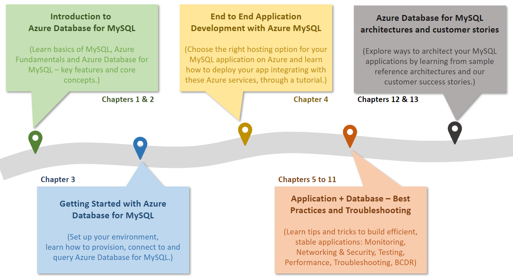

# Azure MySQL Developer Guide

Welcome to THE comprehensive guide to developing MySQL based applications on Microsoft Azure! Whether you are creating your first production application or improving an existing enterprise system, this guide will take you through the basics of MySQL fundamentals all the way to advanced architecture and design. From beginning to end, it is a content journey designed to help ensure your future or existing MySQL systems are performing at their best and as usage grows.

The topics and flow contained in this guide cover the advantages of migrating to or leveraging various simple to use, valuable Azure cloud services in your architectures. Learn how easy and quick it is to create applications backed by Azure Database for MySQL. In addition to building your own services, you can also leverage the vast amount of value-add services available in the Azure Marketplace. Throughout your developer journey, strive to leverage the vast number of resources presented rather than going at it on your own!

Becuase every company and project is unique, this guide provides insightful service descriptions and tool comparisons to allow the reader to make choices that fit their environment, system, and budget needs. Proven industry architecture examples provide best practice jumpstarts allowing for solid architecture foundations and addressing potential compliance needs.

Development teams will understand the best architecture and security practices – avoiding the problems and costs of poor design. They will gain the knowledge to automate builds, package, test, and deliver applications to desired environments. By leveraging continous deployment and integration, costs related to manual deployment tasks can be reduced or completely removed.

Building and deploying an application are not the final steps in the application lifecycle. This guide will cover how easy it is to monitor system uptime and performance in your various Azure services. Administrators will appreciate the realistic and straightforward troubleshooting tips that help keep downtime to a minimum and users happy.

<<<<<<< Updated upstream
The ultimate goal for you is to successfully deploy a stable, performant MySQL application running securely in Microsoft Azure using cloud best practices. Let's start the journey!
=======
The ultimate goal of this guide it to provide the guidance to successfully develop and deploy a stable, performant, secure, best practices based MySQL application running in Microsoft Azure.

Let's begin the journey!
>>>>>>> Stashed changes
