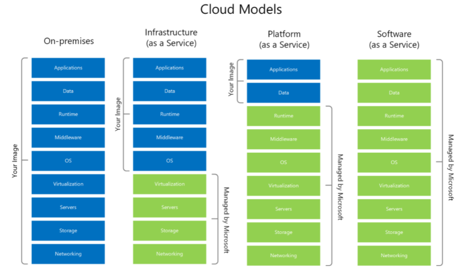

# Introduction to Azure and hosting options

Now that you understand the benefits of MySQL and a few common deployment models, this section explains approaches to hosting MySQL on Azure and the advantages of the Azure platform.

## Advantages of choosing Azure

The Azure platform is trusted by millions of customers around the world, and there are over 90,000 Cloud Solution Providers partnered with Microsoft to add extra benefits and services to the Azure platform. By leveraging Azure, organizations can easily modernize their applications, expedite application development, and adapt application requirements to meet the demands of their users.

By offering solutions on Azure, ISVs can access one of the largest B2B markets in the world. Through the [Azure Partner Builder's Program](https://partner.microsoft.com/marketing/azure-isv-technology-partners), Microsoft assists ISVs with the tools and platform to offer their solutions for customers to evaluate, purchase, and deploy with just a few clicks of the mouse.

Microsofts's development suite includes such tools as the various [Visual Studio](https://visualstudio.microsoft.com/) products, [Azure DevOps](https://dev.azure.com/), [GitHub](https://github.com/), and low-code [Power Apps](https://powerapps.microsoft.com/en-us/). All of these have contributed to Azure's success and growth through their tight integrations with the Azure platform. Companies that adopt capable, modern tools are 65% more innovative, according to a [2020 McKinsey & Company report.](https://azure.microsoft.com/mediahandler/files/resourcefiles/developer-velocity-how-software-excellence-fuels-business-performance/Developer-Velocity-How-software-excellence-fuels-business-performance-v4.pdf)

TODO: Find image without black background.

To facilitate developers' adoption of Azure, Microsoft offers a [free subscription](https://azure.microsoft.com/free/search/) with $200 credit, applicable for thirty days; year long access to free quotas for popular services, including Azure Database for MySQL; and access to always free Azure service tiers. Create an Azure free account and get 750 hours of Azure Database for MySQL Flexible Server free.

## MySQL on Azure Hosting Options

The concepts IaaS (Infrastructure as a Service) and PaaS (Platform as a Service) describe the responsibilities of the public cloud provider and the enterprise customer to manage their data. Both approaches are common to host MySQL on Azure.

### IaaS

In the IaaS model, organizations deploy MySQL on Azure Virtual Machines. This provides the customer with the flexibility to choose when to patch the VM OS, the MySQL engine, and install other software such as antivirus utilities when required. Microsoft is responsible for the underlying VM hardware that constitutes the Azure infrastructure. Customers are responsible for all other maintenance.

Because IaaS MySQL hosting gives greater control over the MySQL database engine and the OS, many organizations choose it to lift and shift on-premises solutions while minimizing capital expenditure.

### PaaS (DBaaS)

In the PaaS model, organizations deploy a fully managed MySQL environment on Azure. Unlike IaaS, they cede control over patching the MySQL engine and OS to the Azure platform, and Azure automates many administrative tasks, like providing high availability, backups, and protecting data.

Like IaaS, customers are still responsible for managing query performance, database access, and database objects, such as indexes. PaaS is suitable for applications where the MySQL configuration exposed by Azure is sufficient and access to the OS and filesystem is unnecessary.

The Azure DBaaS MySQL offering is [Azure Database for MySQL](https://azure.microsoft.com/services/mysql/#features), which is based on MySQL community edition and supports common administration tools and programming languages.

### Video Reference

For a video comparison of cloud hosting models, please refer to [Microsoft Learn.](https://docs.microsoft.com/learn/modules/cmu-cloud-computing-overview/4-building-blocks)
