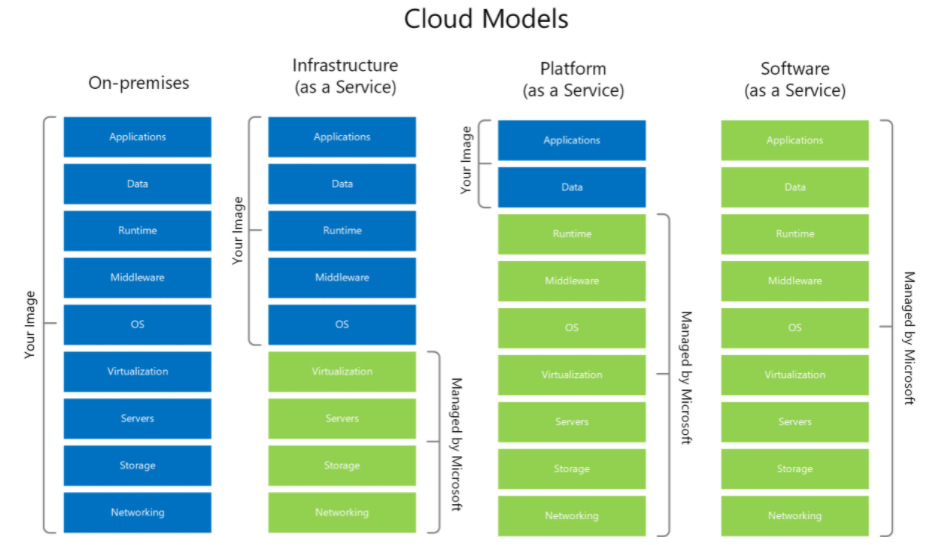

# Introduction to hosting MySQL on Azure

Now that you understand the benefits of MySQL and a few common deployment models, this section explains approaches to host MySQL on Azure and the advantages of the Azure platform.

## Advantages

The Azure platform is trusted by millions of customers, and there are over 90,000 Cloud Solution Providers partnered with Microsoft. Azure allows firms to easily modernize their applications, expedite application development, and tailor their applications for their industries. 

By offering solutions on Azure, ISVs can access the largest B2B market. In addition, through the [Azure Partner Builder's Program](https://partner.microsoft.com/marketing/azure-isv-technology-partners), Azure assists ISVs with offering their solutions for customers to evaluate, purchase, and deploy.

Azure's development tools, such as Visual Studio and low-code Power Apps, are part of the platform's meteoric success. Companies that adopt capable, modern tools are 65% more innovative, according to a [2020 McKinsey & Company report.](https://azure.microsoft.com/mediahandler/files/resourcefiles/developer-velocity-how-software-excellence-fuels-business-performance/Developer-Velocity-How-software-excellence-fuels-business-performance-v4.pdf)

TODO: Find image without black background.

## Free Subscription Offering

To facilitate developers' adoption of Azure, Microsoft offers a [free subscription](https://azure.microsoft.com/free/search/) with $200 credit, applicable for thirty days; yearlong access to free quotas for popular services, including Azure Database for MySQL; and access to always free Azure service tiers.  

## MySQL on Azure Hosting Options

The concepts IaaS (Infrastructure as a Service) and PaaS (Platform as a Service) describe the responsibilities of the public cloud provider and the enterprise customer to manage their data. Both approaches are common to host MySQL on Azure.

### IaaS

In the IaaS model, developers deploy MySQL on Azure Virtual Machines. This provides the customer with the flexibility to choose when to patch the VM OS and MySQL engine, and the option to install other software on the database server, such as antivirus utilities. Microsoft is responsible for the underlying VM hardware that constitutes the Azure infrastructure.

Because IaaS MySQL hosting gives greater control over the MySQL database engine and the OS, many organizations choose it to migrate on-premises solutions while minimizing capital expenditure.

### PaaS (DBaaS)

In the PaaS model, developers deploy a managed MySQL environment on Azure. Unlike IaaS, they cede control over patching the MySQL engine and OS to the Azure platform, and Azure automates many administrative tasks, like providing high availability, backups, and protecting data.

Like IaaS, customers are still responsible for managing query performance, database access, and database objects, such as indexes. It is suitable for applications where the MySQL configuration exposed by Azure is sufficient and access to the OS is unnecessary.

The Azure DBaaS MySQL offering is [Azure Database for MySQL](https://azure.microsoft.com/services/mysql/#features), which is based on MySQL community edition and supports common administration tools and programming languages. As addressed in further depth, Microsoft provides multiple deployment modes to alleviate the weaknesses of PaaS databases.

### Video Reference

For a video comparison of cloud hosting models, please refer to [Microsoft Learn.](https://docs.microsoft.com/learn/modules/cmu-cloud-computing-overview/4-building-blocks)
