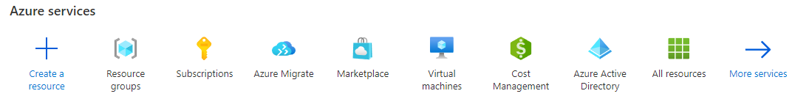
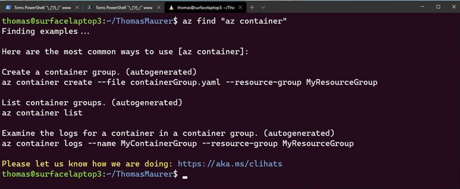
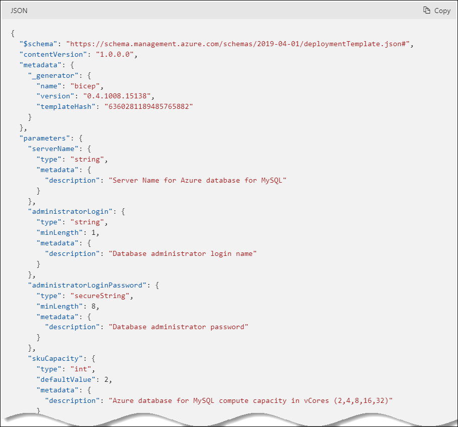

# Introduction to Azure

With a firm understanding of why millions of organizations choose Azure, and the database deployment models (IaaS vs. PaaS), the next step is to provide more detail about **how** developers interact with Azure.

The [Azure Fundamentals Microsoft Learn Module](https://docs.microsoft.com/learn/modules/intro-to-azure-fundamentals/) demonstrates how IaaS and PaaS can classify Azure services. Moreover, Azure empowers flexible *hybrid cloud* deployments and supports a variety of common tools, such as Visual Studio, PowerShell and the Azure CLI, to manage Azure environments.

  

The following tables outlines some of the Azure services used in application developer scenarios that will be discussed in further detail in later sections of this guide.

- **Virtual Machines (IaaS)**: You will begin by running a PHP sample application on an Azure Windows Server Virtual Machine.
- **Azure App Service (PaaS)**: You will deploy the PHP application to Azure App Service, a flexible, simple-to-use application hosting service.
- **Azure Container Instances (PaaS)**: You will *containerize* your app on the VM to operate in an environment isolated from other development tools installed on the system. Azure Container Instances provides a managed environment to operate containers.
- **Azure Kubernetes Service (PaaS)**: AKS also hosts containerized apps, but it is optimized for more advanced orchestration scenarios, such as high availability.

For a more comprehensive view, consult the [Azure Fundamentals Microsoft Learn](https://docs.microsoft.com/learn/modules/intro-to-azure-fundamentals/tour-of-azure-services) module.

## The Azure Resource Management Hierarchy

Azure provides a flexible resource hierarchy to simplify cost management and security. This hierarchy consists of four levels:

- **Management groups**: Management groups consolidate multiple Azure subscriptions for compliance and security purposes.
- **Subscriptions**: Subscriptions govern cost control and access management. Azure users cannot provision Azure resources without a subscription.
- **Resource groups**: Resource groups consolidate the individual Azure resources for a given deployment. All provisioned Azure resources belong to one resource group. In this whitepaper, you will provision a *resource group* in your *subscription* to hold the required resources.
  - Resource groups have a geographic location that determines where metadata about that resource group is stored
- **Resources**: An Azure resource is an instance of a service. An Azure resource belongs to one resource group located in one subscription.
  - Most Azure resources are provisioned in a particular region

  

## Automating and managing with Azure services

When it comes to managing Azure resources, you have many potential options. [Azure Resource Manager](https://docs.microsoft.com/en-us/azure/azure-resource-manager/management/overview) is the deployment and management service for Azure. It provides a management layer that enables you to create, update, and delete resources in your Azure subscriptions. You use management features, like access control, locks, and tags, to secure and organize your resources after deployment.

All Azure management tools, including the CLI, PowerShell module, REST API, and browser-based Portal, interact with the Azure Resource Manager layer and as such the Identity and access management (IAM) security controls.

  

Access control to all Azure services is offered via the Azure role-based access control (Azure RBAC) natively built into the management platform.

RBAC consists of four parts:

- A *role definition* describes a set of actions that can be performed. It can be broad or granular.
- A *security principal* represents a user, a group of users, or a service.
- The *scope* dictates at what level a role assignment to a security principal applies.
- A *role assignment* which is a combination of a definition, principal and scope.

An example is assigning the *Contributor* role over a resource group to a developer in your organization. In this case, the *Contributor* role allows the developer to manage all resources contained within the resource group but not manage other users' access to those resources. The scope is the resource group, and the security principal is the developer's account in Azure Active Directory.

  

### Azure Management Tools

The flexibility and variety of Azure's management tools make it intuitive for any user, irrespective of their skill level with certain technologies. As your skill level and administration needs mature, Azure has the right tool to match your needs.

**Azure portal**

When you are just starting, the **Azure portal** gives developers a quick view of the state of their Azure resources. It supports extensive user configuration and simplifies custom reporting. The **Azure mobile app** provides similar features for mobile users.

  

Azure runs on a common framework of backend resource services and every action you take on the Azure portal translates into a backend set of APIs developed by the respective engineering team to read, create, modify, or delete resources.

Moving your workload to Azure lifts some of the administrative burden but not all, even though you don't have to worry about the data center, you are still responsible for how you have configured those servcies and the access your teams have to those resources.

By using the existing command-line tools and REST based APIs, you can build your own tools to automate and report on your configurations based on any organizationl requirements that are required.

**Azure PowerShell and CLI**

**Azure PowerShell** and the **Azure CLI** (for Bash shell users) are useful for automating tasks that cannot be performed in the Azure portal. Both of these tools follow an *imperative* approach, meaning that users must explicitly script the creation of resources in the correct order.

  

Although very similar, you may find that there are some subtle differneces between how each of these tools operate and the actions that can be accomplished. Use [Azure command-line tool guide](https://docs.microsoft.com/en-us/azure/developer/azure-cli/choose-the-right-azure-command-line-tool) to determine which is the right tool for you.

It is possible to run the Azure CLI and Azure Powershell from the [Azure Cloud Shell](shell.azure.com) but it does have some limitations. You can also run these tools locally.  

To use the Azure CLI [download the CLI tools from Microsoft.](https://docs.microsoft.com/cli/azure/install-azure-cli).

To use the Azure PowerShell cmdlets, install the `Az` module from the PowerShell Gallery, as described in the [installation document.](https://docs.microsoft.com/powershell/azure/install-az-ps?view=azps-6.6.0)

**ARM templates**

Lastly, [ARM templates](https://docs.microsoft.com/en-us/azure/azure-resource-manager/templates/) are optimal for deploying resources in a *declarative* manner. Azure Resource Manager can potentially create the resources in an ARM template in parallel. ARM templates are useful to create multiple identical environments, such as development, staging, and production environments.

  

TODO: BICEPT

TODO: Terraform

### Other Tips

To develop an effective organization hierarchy of resources, Azure administrators should consult with cloud architects and financial and security personnel. Here are a few common best practices to follow for Azure deployments.

- **Utilize Management Groups** Create at least three levels of management groups.
- **Adopt a naming convention:** Names in Azure should include business details, such as the organization department, and operational details for IT personnel, like the workload.
- **Adopt other Azure governance tools:** Azure provides mechanisms such as [resource tags](https://docs.microsoft.com/azure/azure-resource-manager/management/tag-resources?tabs=json) and [resource locks](https://docs.microsoft.com/azure/azure-resource-manager/management/lock-resources?tabs=json) to facilitate compliance, cost management, and security.

## Resources to guide an Azure Deployment

### Support

Azure provides [multiple support plans for businesses](https://azure.microsoft.com/support/plans/), depending on their business continuity requirements. There is also a large user community:

- [StackOverflow Azure Tag](https://stackoverflow.com/questions/tagged/azure)
- [@Azure on Twitter](https://twitter.com/azure)

### Training

- [Azure Certifications & Exams](https://docs.microsoft.com/learn/certifications/browse/?products=azure)
- [Microsoft Learn](https://docs.microsoft.com/learn/)
  - [Azure Fundamentals (AZ-900) Learning Path](https://docs.microsoft.com/learn/paths/az-900-describe-cloud-concepts/)
