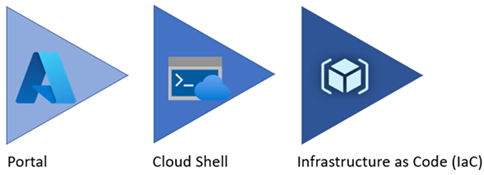
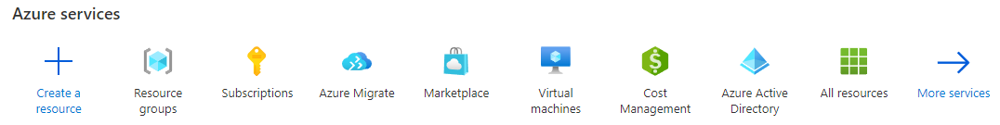
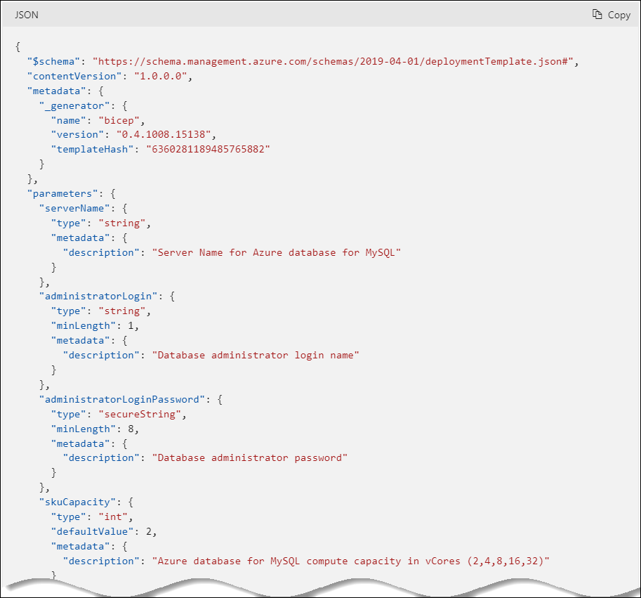

# Introduction to Azure resource management

With a firm understanding of why millions of organizations choose Azure, and the database deployment models (IaaS vs. PaaS), the next step is to provide more detail about **how** developers interact with Azure.

The [Azure Fundamentals Microsoft Learn Module](https://docs.microsoft.com/learn/modules/intro-to-azure-fundamentals/) demonstrates how IaaS and PaaS can classify Azure services. Moreover, Azure empowers flexible *hybrid cloud* deployments and supports a variety of common tools, such as Visual Studio, PowerShell, and the Azure CLI, to manage Azure environments.

  

The following table outlines some of the Azure services used in application developer scenarios that will be discussed in further detail in later sections of this guide.

- **[Virtual Machines (IaaS)](https://docs.microsoft.com/azure/virtual-machines/windows/overview)**: You will begin by running a PHP sample application on an Azure Windows Server Virtual Machine.
- **[Azure App Service (PaaS)](https://docs.microsoft.com/azure/app-service/overview)**: You will deploy the PHP application to Azure App Service, a flexible, simple-to-use application hosting service.
- **[Azure Container Instances (PaaS)](https://docs.microsoft.com/azure/container-instances/container-instances-overview)**: You will *containerize* your app on the VM to operate in an environment isolated from other development tools installed on the system. Azure Container Instances provides a managed environment to operate containers.
- **[Azure Kubernetes Service (PaaS)](https://docs.microsoft.com/azure/aks/intro-kubernetes)**: AKS also hosts containerized apps, but it is optimized for more advanced orchestration scenarios, such as high availability.

For a more comprehensive view, consult the [Azure Fundamentals Microsoft Learn](https://docs.microsoft.com/learn/modules/intro-to-azure-fundamentals/tour-of-azure-services) module.

## The Azure resource management hierarchy

Azure provides a flexible resource hierarchy to simplify cost management and security. This hierarchy consists of four levels:

- **[Management groups](https://docs.microsoft.com/azure/governance/management-groups/overview)**: Management groups consolidate multiple Azure subscriptions for compliance and security purposes.
- **Subscriptions**: Subscriptions govern cost control and access management. Azure users cannot provision Azure resources without a subscription.
- **[Resource groups](https://docs.microsoft.com/azure/azure-resource-manager/management/manage-resource-groups-portal)**: Resource groups consolidate the individual Azure resources for a given deployment. All provisioned Azure resources belong to one resource group. In this whitepaper, you will provision a *resource group* in your *subscription* to hold the required resources.
  - Resource groups have a geographic location that determines where metadata about that resource group is stored
- **Resources**: An Azure resource is an instance of a service. An Azure resource belongs to one resource group located in one subscription.
  - Most Azure resources are provisioned in a particular region

  

## Create your landing zone

An [Azure landing zone](https://docs.microsoft.com/azure/cloud-adoption-framework/ready/landing-zone/) is the target environment defined as the final resting place of a cloud migration project. In most projects, the landing zone should be scripted via ARM templates for its initial setup. Finally, it should be customized with PowerShell or the Azure Portal to fit the workload's needs.

To help organizations quickly move to Azure, Microsoft provides the Azure landing zone accelerator, which generates a landing zone ARM template according to an organization's core needs, governance requirements, and automation setup. The landing zone accelerator is available in the Azure portal.


## Automating and managing Azure services

When it comes to managing Azure resources, you have many potential options. [Azure Resource Manager](https://docs.microsoft.com/azure/azure-resource-manager/management/overview) is the deployment and management service for Azure. It provides a management layer that enables you to create, update, and delete resources in your Azure subscriptions. You use management features, like access control, locks, and tags, to secure and organize your resources after deployment.

All Azure management tools, including the [Azure CLI](https://docs.microsoft.com/cli/azure/what-is-azure-cli), [Azure PowerShell](https://docs.microsoft.com/powershell/azure/what-is-azure-powershell?view=azps-7.1.0) module, [Azure REST API](https://docs.microsoft.com/rest/api/azure/), and browser-based Portal, interact with the Azure Resource Manager layer and as such the [Identity and access management (IAM)](https://docs.microsoft.com/azure/role-based-access-control/overview) security controls.

  

Access control to all Azure services is offered via the [Azure role-based access control (Azure RBAC)](https://docs.microsoft.com/azure/role-based-access-control/overview) natively built into the management platform. Azure RBAC is a system that provides fine-grained access management of Azure resources. Using Azure RBAC, you can segregate duties within your team and grant only the amount of access to users that they need to perform their jobs.

## Azure management tools

The flexibility and variety of Azure's management tools make it intuitive for any user, irrespective of their skill level with certain technologies. As your skill level and administration needs mature, Azure has the right tool to match your needs.



### Azure portal

When you are just starting, the **Azure Portal** gives developers a quick view of the state of their Azure resources. It supports extensive user configuration and simplifies custom reporting. The **[Azure mobile app](https://azure.microsoft.com/get-started/azure-portal/mobile-app/)** provides similar features for mobile users.

  

Azure runs on a common framework of backend resource services and every action you take on the Azure portal translates into a backend set of APIs developed by the respective engineering team to read, create, modify, or delete resources.

Moving your workload to Azure lifts some of the administrative burdens, but not all, even though you don't have to worry about the data center, you are still responsible for how you have configured those services and the access your teams have to those resources.

By using the existing command-line tools and REST APIs, you can build your own tools to automate and report on your configurations based on any organizational requirements that are required.

### Azure PowerShell and CLI

**Azure PowerShell** and the **Azure CLI** (for Bash shell users) are useful for automating tasks that cannot be performed in the Azure portal. Both of these tools follow an *imperative* approach, meaning that users must explicitly script the creation of resources in the correct order.

  

Although very similar, you may find that there are some subtle differences between how each of these tools operates and the actions that can be accomplished. Use the [Azure command-line tool guide](https://docs.microsoft.com/azure/developer/azure-cli/choose-the-right-azure-command-line-tool) to determine which is the right tool for you.

### Azure CLI

It is possible to run the Azure CLI and Azure PowerShell from the [Azure Cloud Shell](shell.azure.com) but it does have some limitations. You can also run these tools locally.  

To use the Azure CLI, [download the CLI tools from Microsoft.](https://docs.microsoft.com/cli/azure/install-azure-cli)

To use the Azure PowerShell cmdlets, install the `Az` module from the PowerShell Gallery, as described in the [installation document.](https://docs.microsoft.com/powershell/azure/install-az-ps?view=azps-6.6.0)

### PowerShell Module

The Azure portal and Windows PowerShell can be used for managing the Azure Database for MySQL. To get started with PowerShell, install the Azure PowerShell cmdlets for MySQL with the following PowerShell command:

```PowerShell
Install-Module -Name Az.MySql
```

After the modules are installed, reference tutorials like the following to learn ways you can take advantage of scripting your management activities:

- [Tutorial: Design an Azure Database for MySQL using PowerShell](https://docs.microsoft.com/azure/mysql/tutorial-design-database-using-powershell)
- [How to back up and restore an Azure Database for MySQL server using PowerShell](https://docs.microsoft.com/azure/mysql/howto-restore-server-powershell)
- [Configure server parameters in Azure Database for MySQL using PowerShell](https://docs.microsoft.com/azure/mysql/howto-configure-server-parameters-using-powershell)
- [Auto grow storage in Azure Database for MySQL server using PowerShell](https://docs.microsoft.com/azure/mysql/howto-auto-grow-storage-powershell)
- [How to create and manage read replicas in Azure Database for MySQL using PowerShell](https://docs.microsoft.com/azure/mysql/howto-read-replicas-powershell)
- [Restart Azure Database for MySQL server using PowerShell](https://docs.microsoft.com/azure/mysql/howto-restart-server-powershell)

### Infrastructure as Code

[Infrastructure as Code (IaC)](https://docs.microsoft.com/devops/deliver/what-is-infrastructure-as-code) provides a way to describe or declare what infrastructure looks like using descriptive code. The infrastructure code is the desired state. Once the code runs, the environment will be built. One of the main benefits of IaC it is human readable. Once the environment code has been tested, it can be versioned and saved into source code control.

#### ARM templates

[ARM templates](https://docs.microsoft.com/azure/azure-resource-manager/templates/) can deploy Azure resources in a *declarative* manner. Azure Resource Manager can potentially create the resources in an ARM template in parallel. ARM templates are useful to create multiple identical environments, such as development, staging, and production environments.

  

#### Bicep

Reading, updating, and managing the ARM template JSON code can be difficult for a reasonably sized environment. What if there was a tool that translates simple declarative statements into ARM templates? Better yet, what if there was a tool that took existing ARM templates and translated them into a simple configuration? [Bicep](https://docs.microsoft.com/azure/azure-resource-manager/bicep/overview) is a domain-specific language (DSL) that uses declarative syntax to deploy Azure resources. In a Bicep file, you define the infrastructure you want to deploy to Azure, and then use that file throughout the development lifecycle to repeatedly deploy your infrastructure. Your resources are deployed in a consistent manner.

Some of the benefits include:

- **Support for all resource types and API versions**: Bicep immediately supports all preview and GA versions for Azure services. As soon as a resource provider introduces new resources types and API versions, you can use them in your Bicep file. You don't have to wait for tools to be updated before using the new services.
- **Simple syntax**: When compared to the equivalent JSON template, Bicep files are more concise and easier to read. Bicep requires no previous knowledge of programming languages. Bicep syntax is declarative and specifies which resources and resource properties you want to deploy.
- **Authoring experience**: When you use VS Code to create your Bicep files, you get a first-class authoring experience. The editor provides rich type-safety, IntelliSense, and syntax validation.
- **Modularity**: You can break your Bicep code into manageable parts by using modules. The module deploys a set of related resources. Modules enable you to reuse code and simplify development. Add the module to a Bicep file anytime you need to deploy those resources.
- **No state or state files to manage**: All state is stored in Azure. Users can collaborate and have confidence their updates are handled as expected. Use the what-if operation to preview changes before deploying your template.
- **No cost and open source**: Bicep is completely free. You don't have to pay for premium capabilities. It's also supported by Microsoft support.

#### Terraform

[Hashicorp Terraform](https://www.terraform.io/) is an open-source tool for provisioning and managing cloud infrastructure. [Terraform](https://docs.microsoft.com/azure/developer/terraform/overview) is adept at deploying an infrastructure across multiple cloud providers. It enables developers to use consistent tooling to manage each infrastructure definition.

### Other tips

To develop an effective organizational hierarchy of resources, Azure administrators should consult with cloud architects and financial and security personnel. Here are a few common best practices to follow for Azure deployments.

- **Utilize Management Groups** Create at least three levels of management groups.
- **Adopt a naming convention:** Names in Azure should include business details, such as the organization department, and operational details for IT personnel, like the workload.
- **Adopt other Azure governance tools:** Azure provides mechanisms such as [resource tags](https://docs.microsoft.com/azure/azure-resource-manager/management/tag-resources?tabs=json) and [resource locks](https://docs.microsoft.com/azure/azure-resource-manager/management/lock-resources?tabs=json) to facilitate compliance, cost management, and security.

## Azure deployment resources

### Support

Azure provides [multiple support plans for businesses](https://azure.microsoft.com/support/plans/), depending on their business continuity requirements. There is also a large user community:

- [StackOverflow Azure Tag](https://stackoverflow.com/questions/tagged/azure)
- [@Azure on Twitter](https://twitter.com/azure)
- Move to Azure efficiently with customized guidance from Azure engineers. [FastTrack for Azure](https://azure.microsoft.com/programs/azure-fasttrack/)

### Training

- [Azure Certifications & Exams](https://docs.microsoft.com/learn/certifications/browse/?products=azure)
- [Microsoft Learn](https://docs.microsoft.com/learn/)
  - [Azure Fundamentals (AZ-900) Learning Path](https://docs.microsoft.com/learn/paths/az-900-describe-cloud-concepts/)
