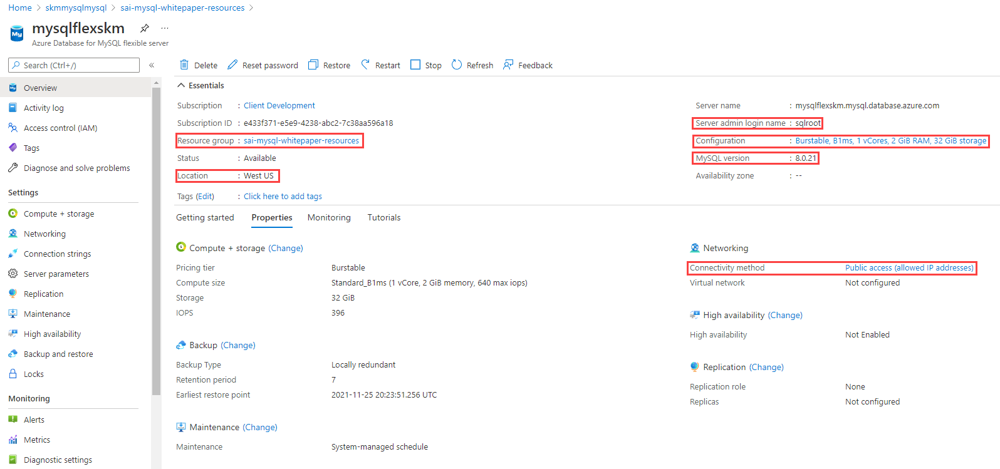

## Create a Flexible Server database

The focus of this guide is on demonstrating practical uses of MySQL Flexible Server, such as querying Flexible Server with common languages and administrative tools. This section illustrates how to deploy MySQL Flexible Server using various Azure management tools in preparation to follow the guide language samples.

### Azure portal

Azure provides a [Quickstart document](https://docs.microsoft.com/azure/mysql/flexible-server/quickstart-create-server-portal) for users who want to use the Azure portal to provision Flexible Server. While this is a great opportunity to explore the configuration parameters of Flexible Server, IaC approaches, like the imperative Azure CLI or the declarative ARM template, are preferable to create deployments that can easily be replicated in other environments.

### Azure CLI

The Azure CLI `az mysql flexible-server` set of commands is very robust. [Azure's quickstart guide](https://docs.microsoft.com/azure/mysql/flexible-server/quickstart-create-server-cli) demonstrates how the `az mysql flexible-server create` and `az mysql flexible-server db create` commands can automatically populate server parameters. Note that it is possible to exercise greater control over these commands by reviewing the documentation for the [`flexible-server create`](https://docs.microsoft.com/cli/azure/mysql/flexible-server?view=azure-cli-latest#az_mysql_flexible_server_create) and [`flexible-server db create`](https://docs.microsoft.com/cli/azure/mysql/flexible-server/db?view=azure-cli-latest#az_mysql_flexible_server_db_create) commands.

> Running the CLI commands from [Azure Cloud Shell](shell.azure.com) is preferable, as the context is already authenticated with Azure.

The image below, from a successful CLI provisioning attempt for Flexible Server, maps CLI flags to various Flexible Server parameters.

### ARM template

Azure provides a [quickstart document](https://docs.microsoft.com/azure/mysql/flexible-server/quickstart-create-arm-template#review-the-template) with a comprehensive ARM template for a Flexible Server deployment. We have also provided a simpler [Flexible Server deployment sample ARM template]. The Azure sample template requires additional parameters to run. It can be deployed with the `New-AzResourceGroupDeployment` PowerShell command in the Quickstart or the `az deployment group create` CLI command.
