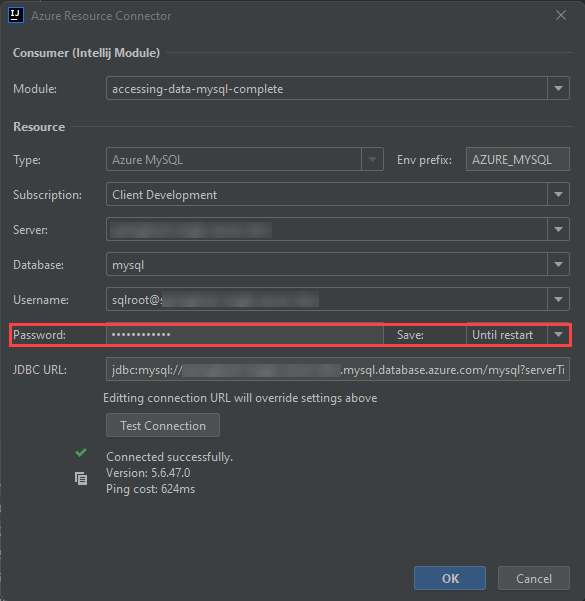

## Connect and query Azure Database for MySQL using Java (Spring Boot)

This section will demonstrate how to operate a Spring Framework application that queries Azure Database for MySQL through the Spring Data JPA. We will also present Azure extensions for popular Java development tools.

### Setup

#### Prerequisites

Please complete the instructions in the [Connect and query Azure Database for MySQL using MySQL Workbench] document. When completing  the guide samples, utilize version 8.0.26 to ensure compatibility with Single Server.

Optionally, download Postman or utilize `curl`, two popular HTTP testing tools.

#### IntelliJ setup

Download the [IntelliJ IDEA](https://www.jetbrains.com/idea/download) IDE. The Community edition will suffice and comes with a custom JDK, so it is not necessary to install the JDK separately.

After installing IntelliJ, install the [Azure Toolkit for IntelliJ](https://plugins.jetbrains.com/plugin/8053-azure-toolkit-for-intellij/) plugin. Then, authenticate with Azure, as described in [this](https://docs.microsoft.com/azure/developer/java/toolkit-for-intellij/sign-in-instructions) document.

Once installed, an **Azure Explorer** tab will be visible on the left side of the screen. One of the available resource management options will be to manage Azure Database for MySQL Single Server instances; Flexible Server support is currently unavailable.


#### App setup

Clone the [gs-accessing-data-mysql](https://github.com/spring-guides/gs-accessing-data-mysql) String documentation example app repository to the local machine:

```cmd
git clone https://github.com/spring-guides/gs-accessing-data-mysql.git
```

Using IntelliJ, browse to the `complete` directory in the repository root. If prompted to choose between using the `Maven` configuration or the `Gradle` configuration, choose `Maven`.


#### Database setup

The IntelliJ Azure explorer supports Azure Database for MySQL Single Server and will allow you to provision a Single Server instance directly within the Azure Explorer.

1. Navigate to the **Azure Explorer** tab, right-click on **Azure Database for MySQL**, and select **+ Create**.

2. The **Create Azure Database for MySQL** dialog box will open. Select **+ More settings** (1) and populate the following parameters:

    - **Project details**
      - **Subscription** (2)
      - **Resource group** (3): choose an existing resource group from the dropdown or create a new one by pressing **+**
    - **Server details**
      - **Server name** (4): provide a unique value, like `springboot-single-server-SUFFIX`
      - **Location** (5): choose the closest Azure location
      - **Version** (6): choose `8.0`
    - **Administrator account**
      - **Admin username** (7): enter `sqlroot`
      - **Password/confirm password** (8): choose a secure password
    - **Connection security**
      - Select **Allow access from current local PC** (9)

    

3. Select **OK**. Allow the task to continue in the background.

4. Once provisioning completes (it should only take a few minutes), observe the new MySQL Single Server instance appear in the Azure explorer. Right-click the instance and select **Show properties**. A panel will open with basic information about the instance, including Spring connection information for the `application.properties` file.

    

5. Create a new connection to the Azure Database for MySQL Single Server instance from MySQL Workbench. Use the following SQL statement to create a new database called `newdatabase`. This application will not function with the provided `mysql` system database.

    ```sql
    CREATE DATABASE newdatabase;
    ```

### Run the app

1. Open `application.properties` from the project hierarchy: `src` > `main` > `resources`. Delete all the `spring.datasource.*` entries.

    

2. Navigate to the **Azure Explorer**, right-click the previouly provisioned Single Server instance, then select **Connect to Project (Preview)**.

3. In the **Azure Resource Connector** window, keep all parameters the same. Simply populate the **Password**. Then, select **OK**.

    

4. Replace the contents there were removed from the `application.properties` file with the following. Notice how the connection information is encapsulated in environment variables.

    ```text
    spring.datasource.url=${AZURE_MYSQL_URL}
    spring.datasource.username=${AZURE_MYSQL_USERNAME}
    spring.datasource.password=${AZURE_MYSQL_PASSWORD}
    ```

5. Start the application from the upper right-hand corner of the screen.

    

### Test the app

1. Open Postman, or the REST client tool of choice. Make a `POST` request to `http://localhost:8080/demo/add` with the URL parameters `name` and `email`.

    

2. Make a `GET` request to `http://localhost:8080/demo/all`. The entries that were added through the POST request will be displayed.

    

3. As expected, the data is persisted to the MySQL Single Server instance.

    

### Stop the app

1. Stop the app in IntelliJ.

2. In the **Azure Explorer**, right-click the MySQL Single Server instance previously created and select **Stop**.

Congratulations. IntelliJ was successfully installed, the Azure Explorer extension installed, a MySQL Single Server instance created, and an app using the Single Server securely was tested.

### Resources

- [Deploy a Spring Boot application on AKS cluster with MySQL Flexible Server in a VNet](https://docs.microsoft.com/en-us/azure/mysql/flexible-server/tutorial-deploy-springboot-on-aks-vnet)
