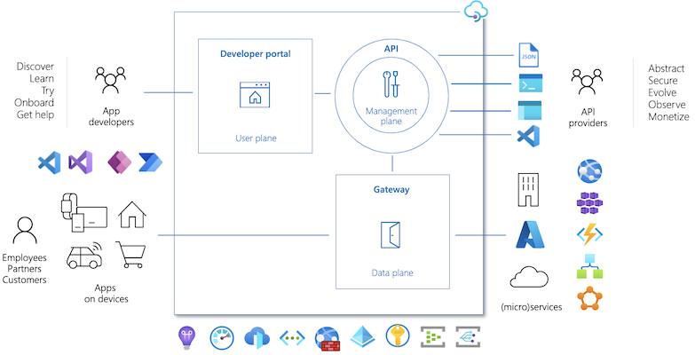

# Type of MySQL applications

This section explains common cloud application architectures and Azure services. While these services are not directly related to MySQL, they are often used in modern applications.

## Web Apps

Developers can deploy MySQL-backed apps to Azure on a Windows or Linux environment through [Azure App Service,](https://docs.microsoft.com/azure/app-service/overview) a PaaS platform that supports popular frameworks, including PHP, Java, Python, Docker containers, and more. App Service is compatible with manual deployment mechanisms, including ZIP files, FTP, and local Git repositories. It also supports automated mechanisms, like GitHub Actions, to deploy faster and minimize issues. Coupled with powerful management tools, like the Kudu console, App Service is suitable for many enterprise apps.

### Resources

- [App Service overview](https://docs.microsoft.com/azure/app-service/overview)
- PHP & MySQL Flexible Server sample app:
  - Manual deployment: [Introduction to the guide sample application]
  - Scripted deployment: [Cloud Deployment to Azure App Service]

## Azure Functions, Azure Logic Apps

### Serverless Compute

[Azure Functions](https://docs.microsoft.com/azure/azure-functions/functions-overview) and [Azure Logic Apps](https://docs.microsoft.com/azure/logic-apps/logic-apps-overview) are serverless platforms, meaning that customers are billed only for the execution time of their code. Azure automatically scales compute resources up and down in response to demand.

### Azure Functions

An Azure Functions instance consists of individual functions that execute in response to a *trigger*, like a cron job or an HTTP request. These functions interface with other Azure resources, like Cosmos DB, through bindings, though resources without default bindings, like Azure PaaS MySQL, can be accessed through language-specific connectors.

Like Azure App Service, Function Apps support multiple programming languages. Developers can extend support to unsupported languages through [custom handlers.](https://docs.microsoft.com/azure/azure-functions/functions-custom-handlers)

For long-running, stateful serverless architectures, such as when human intervention is necessary, Azure provides the Durable Functions extension. Consult the [documentation](https://docs.microsoft.com/azure/azure-functions/durable/durable-functions-overview?tabs=csharp) for more information about architectures with Durable Functions.

#### Resources

- [Introduction to Azure Functions](https://docs.microsoft.com/azure/azure-functions/functions-overview)
- [Azure Functions hosting options](https://docs.microsoft.com/azure/azure-functions/functions-scale)
- Azure Functions with MySQL Flexible Server samples:
  - .NET: [Azure Function with MySQL (.NET)]
  - Python: [Azure Function with MySQL (Python)]

### Azure Logic Apps

Azure Logic Apps provide integration services for enterprises, connecting applications that reside on-premises and in the cloud. Azure Logic Apps *workflows* execute *actions* after a *trigger* is fired.

Azure Logic Apps interface with external systems through *managed connectors*. Microsoft provides a managed connector for MySQL databases, but this connector cannot easily be used for Azure PaaS MySQL, as the MySQL managed connector accesses local MySQL databases through a data gateway.

#### Resources

- [What is Azure Logic Apps?](https://docs.microsoft.com/azure/logic-apps/logic-apps-overview)
- [Compare Azure Functions and Azure Logic Apps](https://docs.microsoft.com/azure/azure-functions/functions-compare-logic-apps-ms-flow-webjobs#compare-azure-functions-and-azure-logic-apps)
- [Logic Apps with MySQL]

## Microservices

Organizations deploy microservices architectures to offer resilient, scalable, developer-friendly applications. Unlike traditional monolithic apps, each service operates independently and can be updated without redeploying the app. Each service also manages its own persistence layer, meaning that service teams can perform database schema updates without affecting other services.

While microservices apps offer major benefits, they require advanced tools and knowledge of distributed systems. Organizations utilize domain analysis to define optimal boundaries between services. 

On Azure, organizations often deploy microservices to Azure Kubernetes Service through CI/CD platforms, such as GitHub Actions.

### Resources

- [Build microservices on Azure](https://docs.microsoft.com/azure/architecture/microservices/)
- [Using domain analysis to model microservices](https://docs.microsoft.com/azure/architecture/microservices/model/domain-analysis)
- [Deploying a Laravel app backed by a Java REST API to AKS]

## API Management

Azure API Management allows organizations to manage and securely expose their APIs hosted on diverse environments from a central service. API Management simplifies legacy API modernization, API exposure to multiple platforms, and data interchange between businesses. Applications call APIs through an *API gateway* that validates credentials, enforces quotas, serializes requests in different protocols, and more. Developers operate their API Management instances through the management plane, and they expose API documentation for internal and external users through the Developer portal.

Like other Azure resources, API Management offers comprehensive RBAC support, accommodating internal administrative and development staff and external users. Moreover, as API Management integrates with APIs hosted in environments outside Azure, organizations can self-host the API gateway while retaining the Azure management plane APIs.

### Resources

- [About API Management](https://docs.microsoft.com/azure/api-management/api-management-key-concepts)
- [Self-hosted gateway overview](https://docs.microsoft.com/azure/api-management/self-hosted-gateway-overview)

## Event driven - Azure Service Bus vs. Azure Queue vs. Event Hub (TODO)

Event-driven apps create, ingest, and process events (state changes) in real-time. Event producers and event consumers are loosely-coupled, and every consumer sees every event. Event-driven architectures can perform complex event handling, such as aggregations over time, and operate with large volumes of data produced rapidly.

Event-driven apps either implement a *pub/sub* approach or an *event streaming* approach.

### Azure Event Grid

Azure Event Grid is a pub-sub system that integrates well with Azure and non-Azure services. Event Grid notifies subscribers of state changes: for example, if a file is updated, the event sent to subscribers will not include the file itself, but rather file metadata.

### Azure Service Bus

### Azure Event Hub

### Azure Queue

## Batch processing – chron jobs, web jobs

## Azure Logic Apps – simple orchestration

## Advanced orchestration - Azure Data Factory

