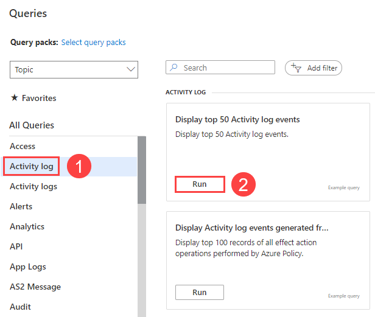
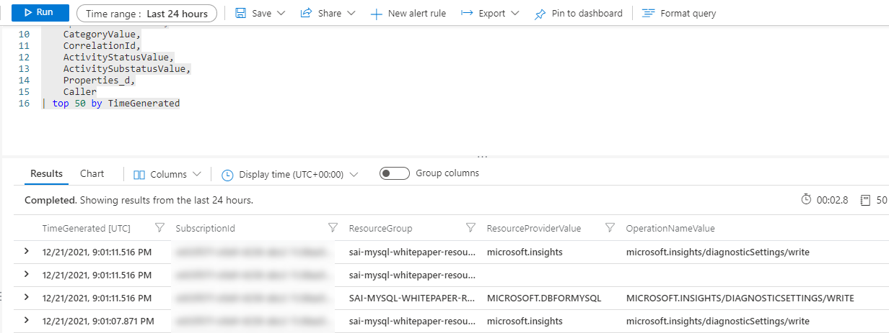

# Audit Logging

Previously, this whitepaper explained that Flexible Server integrates with Azure Monitor to analyze and generate alerts and responses from metrics. However, Azure Monitor also interacts with logs, which may have multiple formats, through Kusto Query Language (KQL) queries. While metrics are better suited for real-time decision-making, logs are also useful for deriving insights from an Azure environment.

One source of logs generated by Flexible Server is MySQL *audit logs*, which indicate connections, DDL and DML operations, and more. Many businesses utilize audit logs to meet compliance requirements, but they can impact performance.

## Enabling Audit Logs

Audit logging is controlled by the `audit_log_enabled` server parameter in Flexible Server. Azure provides granularity over the events logged (`audit_log_events`), the database users subject to logging (`audit_log_include_users`), and an explicit list of the database users exempt from logging (`audit_log_exclude_users`).

> For more details about the logging server parameters, including the type of events that can be logged, consult [the documentation.](https://docs.microsoft.com/azure/mysql/flexible-server/concepts-audit-logs)

Besides being sent to Azure Monitor, MySQL audit logs can be sent to Azure Storage accounts and Azure Event Hubs for integration with other applications.

## Resources

### Flexible Server

- [Configure audit logs (Azure portal)](https://docs.microsoft.com/azure/mysql/flexible-server/tutorial-configure-audit)

### Single Server

- [Configure and access audit logs in the Azure portal](https://docs.microsoft.com/azure/mysql/howto-configure-audit-logs-portal)
- [Configure and access audit logs in the Azure CLI](https://docs.microsoft.com/azure/mysql/howto-configure-audit-logs-cli)

### KQL & Azure Monitor Logs

- [Write your first query with Kusto Query Language (Microsoft Learn)](https://docs.microsoft.com/learn/modules/write-first-query-kusto-query-language/)
- [Azure Monitor Logs Overview](https://docs.microsoft.com/azure/azure-monitor/logs/data-platform-logs)

### Notes about the Flexible Server Portal Example

If you try to run the KQL query in the Flexible Server Azure portal example, but you encounter errors, try to generate some activity and/or expand the scope of the `audit_log_events` parameter. Here are some actions which generated activity for my KQL queries:

- Connecting to the Flexible Server instance from MySQL Workbench
- Creating and dropping a dummy table (DDL activity)

As you work through the sample, note that Log Analytics is not just limited to the events generated by the MySQL audit logging functionality: logs generated by the Azure platform, such as starting or stopping a Flexible Server instance, are also recorded.

You can query the activity log from the samples provided on the **Logs** page.

As you can see, KQL imposes a schema on logs to facilitate analysis. Consult [the documentation](https://docs.microsoft.com/azure/mysql/flexible-server/concepts-audit-logs) for more information.
