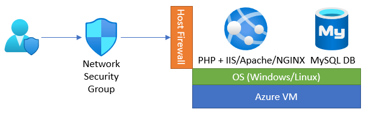
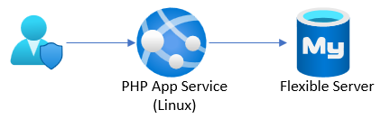
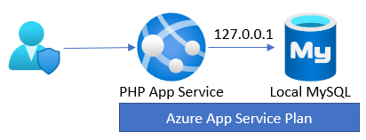
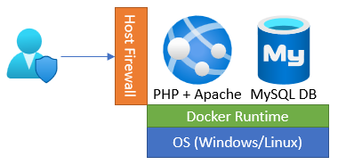
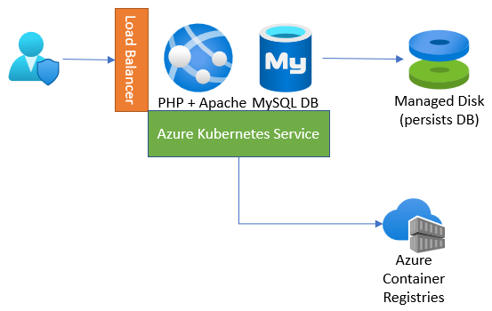
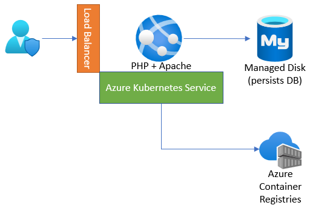

## Deployment evolution options

Let us discuss a journey overview.  The journey will start with a classic deployment to a typical web and database server on a `physical` or `virtualized` host operating system. Next, explore the evolution of the potential deployment options from a simple web app deployed to App Service through a complex progression ending with the application running as containers in Azure Kubernetes Service (AKS) with Azure Database for MySQL hosting the database.

The following scenarios will be discussed and demonstrated as part of this Azure MySQL developer's guide.  All of the following deployments will utilize the same application and database backend and what is needed to modify the application to support the targets. Topics will be discussed in the following simple to complex architecture order.

### Deployment option TOC

1. [Classic deployment]
2. [Azure VM Deployment]
3. [Simple App Service deployment with Azure Database for MySQL Flexible Server]
4. [App Service with In-App MySQL]
5. [Continuous Integration (CI) and Continuous Delivery (CD)]
6. [Containerizing layers with Docker]
7. [Azure Container Instances (ACI)]
8. [App Service Containers]
9. [Azure Kubernetes Service (AKS)]
10. [AKS with MySQL Flexible Server]

## Classic deployment

In a classic deployment, development and operations staff will typically set up a web server (such as Internet Information Services (IIS), Apache, or NGINX) on physical or virtualized **on-premises** hardware.  Most applications using MySQL as the backend are using PHP as the frontend (which is the case for the sample application in this guide); as such, the web server must be configured to support PHP.  This includes configuring and enabling any PHP extensions and installing the required software to support those extensions.

Some web servers are relatively easier to set up than others.  The complexity depends on what the target operating system is and what features the application and database are using, for example, SSL/TLS.

In addition to the web server, it is also necessary to install and configure the physical MySQL database server.  This includes creating the schema and the application users that will be used to access the target database(s).

As part of our sample application and supporting Azure Landing zone created by the ARM templates, most of this gets set up automatically.  Once the software is installed and configured, it is up to the developer to deploy the application and database on the system.  Classical deployments tend to be manual such that the files are copied to the target production web server and then deploy the database schema and supported data via MySQL tools or the MySQL Workbench.

The biggest advantage of a classic on-premises deployment is the infrastructure team will have full control of the environment.  The biggest weakness is they must also maintain every aspect of the environment as well.

To perform a simulated classical deployment in Azure, go to the [Classic Deployment to PHP-enabled IIS server](https://github.com/Azure/azure-mysql/tree/master/DeveloperGuide/step-2-developer-journey-steps/01-ClassicDeploy) article.

## Azure VM deployment

An Azure VM Deployment is very similar to a classical deployment but rather than deploying to physical hardware, deployment is to virtualized hardware in the Azure cloud.  The operating system and software will be the same as in a classic deployment, but to open the system to external apps and users, the virtual networking must be modified to allow database access to the web server. This is known as the IaaS (infrastructure as a service) approach.

The advantages of using Azure to host virtual machines include the ability to enable backup and restore services, disk encryption, and scaling options that require no upfront costs and provide flexibility in configuration options with just a few clicks of the mouse.  This is in contrast to the relatively complex and extra work needed to enable these types of services on-premises.

To perform an Azure VM deployment, reference the [Cloud Deployment to Azure VM](https://github.com/Azure/azure-mysql/tree/master/DeveloperGuide/step-2-developer-journey-steps/02-01-CloudDeploy-Vm) article.

## Simple App Service deployment with Azure Database for MySQL Flexible Server

If supporting the operating system and the various other software is not a preferred approach, the next evolutionary path is to remove the operating system and web server from the list of setup and configuration steps. This can be accomplished by utilizing the Platform as a Service (PaaS) offerings of Azure App Service and Azure Database for MySQL.

However, modernizing an application and migrating them to these aforementioned services may introduce some relatively small application changes.

To implement this deployment, reference the [Cloud Deployment to Azure App Service](https://github.com/Azure/azure-mysql/tree/master/DeveloperGuide/step-2-developer-journey-steps/02-02-CloudDeploy-AppSvc) article.

## App Service with In-App MySQL

If the target database is relatively small, it can be integrated with the application-hosting environment.  Azure App Service provides for this integrated hosting and allows for the deployment of the database to the same App Service and connectivity is provided through the `localhost` server name.

Administration and integration are accomplished through a built-in **myphpadmin** interface in the Azure Portal.  From this admin portal, it is possible to run any supported SQL commands to import or export the database.

The limits of the MySQL instance are primarily driven by the size of the corresponding [App Service Plan](https://azure.microsoft.com/pricing/details/app-service/windows/).  The biggest factor about limits is normally the disk space allocated to any App Services in the Plan.  App Service Plan storage sizes range from 1GB to 1TB; therefore, if a database will grow past 1TB, it cannot be hosted as InApp and it will need to be hosted in Flexible Server.  For a list of other limitations, reference [Announcing Azure App Service MySQL in-app](https://azure.microsoft.com/blog/mysql-in-app-preview-app-service/).

To implement this deployment, reference the [Cloud Deployment to Azure App Service with MySQL InApp](https://github.com/Azure/azure-mysql/tree/master/DeveloperGuide/step-2-developer-journey-steps/02-03-CloudDeploy-InApp) article.

## Continuous Integration (CI) and Continuous Delivery (CD)

Doing manual deployments every time a change is made can be a very time-consuming endeavor.  Utilizing an automated deployment approach can save a lot of time and effort.  Azure DevOps and Github Actions can be used to automatically deploy code and databases each time a new commit occurs in the codebase.

Whether using Azure DevOps or Github, there will be some setup work to support the deployments.  This typically includes creating credentials that can connect to the target environment and deploy the release artifacts.

TODO: Need to replace all relative path links.

To perform deployments using Azure DevOps and GitHub Actions, reference the [Deployment via CI/CD](https://github.com/Azure/azure-mysql/tree/master/DeveloperGuide/step-2-developer-journey-steps/02-04-CloudDeploy-CICD) article.

## Containerizing layers with Docker

By building the application and database with a specific target environment in mind, it will need to be assumed that the operations team will have deployed and configured that same environment to support the application and data workload.  If they missed any items, the application will either not load or may error during runtime.

Containers solve the potential issue of misconfiguration of the target environment.  By containerizing the application and data, the application will run exactly as intended. Containers can also more easily be scaled using tools such as Kubernetes.

Containerizing an application and data layer can be relatively complex, but once the build environment is set up and working, it is possible to push container updates very quickly to multi-region load-balanced environments.

To perform deployments using Docker, reference the [Migrate to Docker Containers](https://github.com/Azure/azure-mysql/tree/master/DeveloperGuide/step-2-developer-journey-steps/03-00-Docker) article. This article containerizes the Laravel sample application and its MySQL database as separate containers that communicate through the Docker runtime on the VM instance.

## Azure Container Instances (ACI)

After application and data layers are migrated to containers, a hosting target must be selected to run the containers.  A simple way to deploy a container is to use Azure Container Instances (ACI).

Azure Container Instances can deploy one container at a time or multiple containers to keep the application, API, and data contained in the same resource.

To implement this deployment, reference the [Migrate to Azure Container Instances (ACI)](https://github.com/Azure/azure-mysql/tree/master/DeveloperGuide/step-2-developer-journey-steps/03-01-CloudDeploy-ACI) article. This article serves the Laravel app and MySQL database containers on ACI. It also utilizes an Azure File Share to persist data.

## App Service Containers

Developers can extend the benefits of App Service, like scalability, elasticity, and simple CI/CD integration, to their containerized apps using App Service for Containers. This offering supports individual containers and multi-container apps through Docker Compose files. Containers give teams added flexibility beyond the platforms supported directly by App Service.

To perform deployments using Azure App Service containers, reference the [Migrate to Azure App Service Containers](https://github.com/Azure/azure-mysql/tree/master/DeveloperGuide/step-2-developer-journey-steps/03-02-CloudDeploy-AppService-Container) article. This example deploys both the database and web app containers to App Service for Containers.

## Azure Kubernetes Service (AKS)

ACI and App Service Container hosting are effective ways to run containers, but they do not provide many enterprise features: deployment across nodes that live in multiple regions, load balancing, automatic restarts, redeployment, and more.

Moving to Azure Kubernetes Service (AKS) will enable the application to inherit all the enterprise features provided by AKS. Moreover, Kubernetes apps that persist data in MySQL Flexible Server unlock numerous benefits:

- In supported regions, co-locating Flexible Server and AKS nodes in the same availability zone minimizes latency
- Applications can host database proxies, like ProxySQL for MySQL, [on the same infrastructure as their apps](https://techcommunity.microsoft.com/t5/azure-database-for-mysql-blog/deploy-proxysql-as-a-service-on-kubernetes-using-azure-database/ba-p/1105959)
- Teams can manage Flexible Server instances directly from AKS through the [Azure Service Operator](https://azure.github.io/azure-service-operator/)

To perform deployments using AKS, reference the [Migrate to Azure Kubernetes Services (AKS)](https://github.com/Azure/azure-mysql/tree/master/DeveloperGuide/step-2-developer-journey-steps/04-AKS) article to host the database and web app containers on an enterprise-ready AKS instance.

## AKS with MySQL Flexible Server

Running the database layer in a container is better than running it in a VM, but not as great as removing all the operating system and software management components.

To implement this deployment, reference the [Utilize AKS and Azure Database for MySQL Flexible Server](https://github.com/Azure/azure-mysql/tree/master/DeveloperGuide/step-2-developer-journey-steps/05-CloudDeploy-MySQLFlex) article. This article extends the benefits of a PaaS database to the Contoso NoshNow application.

