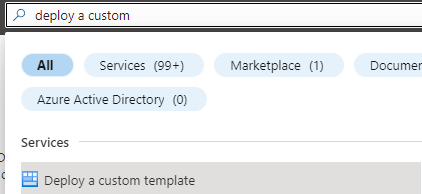
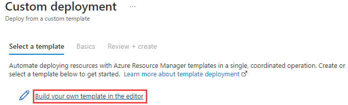
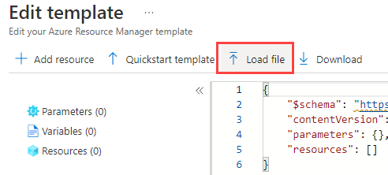
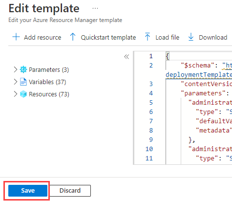

## Start the hands-on-tutorial developer journey

### Development environment setup

The first step to exploring the evolution of MySQL Application development is to get the environment set up and configure the infrastructure.

We provided two ARM templates that can be deployed that will set up the environment.  The template is a JavaScript Object Notation (JSON) file that defines the infrastructure and configuration for your project. In the template, you specify the resources to deploy and the properties for those resources.

One is a **basic deployment** of services that are exposed to the internet and the other is a more secure environment that utilizes private endpoints and VNet integrations.  It also includes items like Azure Firewall and other security-related configurations.

The basic template is the cheaper way to go and should work without any configuration.  The **secure template** will have much higher costs and will require special configuration and changes to get the samples to work properly.

#### How to deploy a local ARM template

Below are two methods of deploying an ARM template:

**Azure Portal**

- Login into the Azure Portal and choose a valid Subscription.
- Search for 'Deploy a custom template'.

- Select 'Build your own template in the editor'.

- Load the ARM template file from your local drive.

- Navigate to the **template.json** file.
- Save the template.

- Enter the template parameters.
- Select the **Review + create** button.
- Check for validation errors. For example, you may have exceeded your quota for that subscription and region.

Another option for deploying infrastructure using a template is to use Azure CLI or PowerShell.  Here is a tutorial guide:

[Tutorial: Deploy a local ARM template](https://docs.microsoft.com/azure/azure-resource-manager/templates/deployment-tutorial-local-template?tabs=azure-cli)

#### Step 1 - Build the development environment - deploy one of the templates below

This is an optional step if you have your development environment already set up. You will need to install the basic Azure development packages. 

- [Basic Template](https://github.com/Azure/azure-mysql/tree/master/DeveloperGuide/step-0-create-development-vm/basic-template/template.json)
- [Secure Template](https://github.com/Azure/azure-mysql/tree/master/DeveloperGuide/step-0-create-development-vm/secure-template/template-secure.json)

#### Step 2 - Explore the development environment

Once the template has been deployed, several resources will be deployed to support the developer journey.  Not all of these will be used but are provided in case other paths would like to be explored.

As part of the deployment, a **mysqldevSUFFIX-paw1** virtual machine has been deployed that will be used to perform all the activities.  Login to this virtual machine by doing the following:

- Open Azure Portal
- Browse to your resource group
- Select the **mysqldevSUFFIX-paw1** virtual machine
- Select **Connect->RDP**
- Select **Download RDP file**
- Open the downloaded file, select **Connect**
- For the username, type **wsuser**
- For the password, type **Solliance123**

Once in the virtual machine, notice that all the necessary development tools have already been installed.  Additionally, the supporting GitHub repository has been downloaded that includes all the artifacts needed to start the developer journey. These files can be found on the **mysqldevSUFFIX-paw1** machine in the `C:\labfiles\microsoft-mysql-developer-guide` folder.  

#### Step 3 - Start your journey

To reiterate, it is recommended to follow the developer journey from start to finish in the following order:

##### Deployment option tutorial lab links

Click the links to complete each journey before going to the next.

1. [Classic deployment](https://github.com/Azure/azure-mysql/tree/master/DeveloperGuide/step-2-developer-journey-steps/01-ClassicDeploy)
2. [Azure VM Deployment](https://github.com/Azure/azure-mysql/tree/master/DeveloperGuide/step-2-developer-journey-steps/02-01-CloudDeploy-Vm)
3. [Simple App Service Deployment with Azure Database for MySQL Flexible Server](https://github.com/Azure/azure-mysql/tree/master/DeveloperGuide/step-2-developer-journey-steps/02-02-CloudDeploy-AppSvc)
4. [App Service with InApp MySQL](https://github.com/Azure/azure-mysql/tree/master/DeveloperGuide/step-2-developer-journey-steps/02-03-CloudDeploy-InApp)
5. [Continuous Integration / Continuous Delivery](https://github.com/Azure/azure-mysql/tree/master/DeveloperGuide/step-2-developer-journey-steps/02-04-CloudDeploy-CICD)
6. [Containerizing layers with Docker](https://github.com/Azure/azure-mysql/tree/master/DeveloperGuide/step-2-developer-journey-steps/03-00-Docker)
7. [Azure Container Instances (ACI)](https://github.com/Azure/azure-mysql/tree/master/DeveloperGuide/step-2-developer-journey-steps/03-01-CloudDeploy-ACI)
8. [App Service Containers](https://github.com/Azure/azure-mysql/tree/master/DeveloperGuide/step-2-developer-journey-steps/03-02-CloudDeploy-AppService-Container)
9. [Azure Kubernetes Service (AKS)](https://github.com/Azure/azure-mysql/tree/master/DeveloperGuide/step-2-developer-journey-steps/04-AKS)
10. [AKS with MySQL Flexible Server](https://github.com/Azure/azure-mysql/tree/master/DeveloperGuide/step-2-developer-journey-steps/05-CloudDeploy-MySQLFlex)

##### Compute and orchestration tutorial lab links

Additionally, some applications are more than just a web application with a database backend.  Microsoft Azure provides several  compute engines with varying degrees of features and administrative abilities. 

It is recommended that each of the above scenarios is executed in the order shown so that a full picture of the steps involved in the development evolution is understood.  This will also ensure the necessary pre-requisite Azure services and resources are available for the reader to progress to the more complex deployment examples.

- [Azure Functions](https://docs.microsoft.com/azure/azure-functions/functions-overview)
  - [Dotnet](https://github.com/Azure/azure-mysql/tree/master/DeveloperGuide/step-2-developer-journey-steps/06-01-FunctionApp-DotNet)
  - [Python](https://github.com/Azure/azure-mysql/tree/master/DeveloperGuide/step-2-developer-journey-steps/06-02-FunctionApp-Python)
  - [AKS](https://github.com/Azure/azure-mysql/tree/master/DeveloperGuide/step-2-developer-journey-steps/06-03-FunctionApp-AKS)
  - [Secured with MSI](https://github.com/Azure/azure-mysql/tree/master/DeveloperGuide/step-2-developer-journey-steps/06-04-FunctionApp-MSI)
- [Logic Apps](https://github.com/Azure/azure-mysql/tree/master/DeveloperGuide/step-2-developer-journey-steps/06-05-LogicApp)
- [Azure Data Factory](https://github.com/Azure/azure-mysql/tree/master/DeveloperGuide/step-2-developer-journey-steps/07-01-AzureDataFactory)
- [Azure Synapse Analytics](https://github.com/Azure/azure-mysql/tree/master/DeveloperGuide/step-2-developer-journey-steps/07-02-AzureSynapseAnalytics)
- [Azure Batch](https://github.com/Azure/azure-mysql/tree/master/DeveloperGuide/step-2-developer-journey-steps/07-03-AzureBatch)

### Sample Application evolution

The Sample Application is written as a two-tier application.  This architecture is great for a proof of concept or an application that has limited performance needs. Scaling this type of application is difficult and costly. Developers should consider separating their application's business logic and data concerns into a [microservice](https://azure.microsoft.com/solutions/microservice-applications/#solution-architectures) layer. For more information on design patterns, review: [Design patterns for microservices](https://docs.microsoft.com/azure/architecture/microservices/design/patterns).

After reviewing the need for microservice architecture and the typical design patterns, you can see how the Sample Application architecture changed when it utilizes a Java REST microservice architecture. See: [Deploying a Laravel app backed by a Java REST API to AKS](https://github.com/Azure/azure-mysql/tree/master/DeveloperGuide/step-1-sample-apps/sample-php-app-rest).
