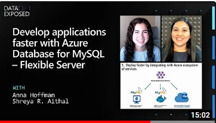

# 04 / End to End application development

Now that you have some Azure hands-on experience, it is important to understand high-level concepts. Once you have review the building block concepts, we will learn about how to set up your Azure development environment, get some hands-on architecture experience by working through the tutorial journey.

With a configured development environment available, it is time to explore the various architecture and deployment options available when deploying an application and its corresponding MySQL database.

Watch: [Develop applications faster with Azure Database for MySQL – Flexible Server | Data Exposed](https://www.youtube.com/watch?v=RZXbwscC9FU&t=266s)

This chapter focuses on these subjects:

