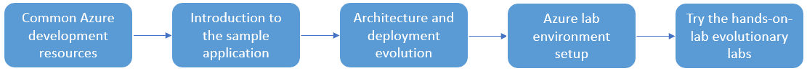

# 04 / End to End application development

The previous chapters provided some basic Azure hands-on experience. It is important to understand high-level concepts before moving to more advanced examples and concepts. Once you have reviewed the building block concepts, you will learn about how to set up your Azure development environment, and get some hands-on architecture experience by working through the tutorial journey. The guide provides experience with Windows and Linux infrastructures.

With a configured development environment available, it is time to explore the various architecture and deployment options available when deploying an application and its corresponding MySQL database.

> **Watch:** [Develop applications faster with Azure Database for MySQL – Flexible Server | Data Exposed](https://www.youtube.com/watch?v=RZXbwscC9FU&t=266s)

This chapter focuses on these subjects:

