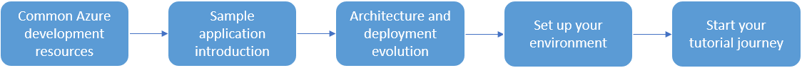

# 04 / End to End application development

Now that you have some Azure hands-on experience, let's learn about how to set up your Azure development environment, get some hands-on architecture experience, and understand the building blocks of Azure development.

With a configured development environment available, it is time to explore the various architecture and deployment options available when deploying an application and its corresponding MySQL database.

This chapter focuses on these subjects:

