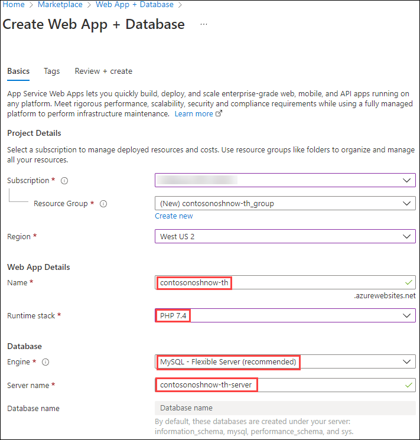
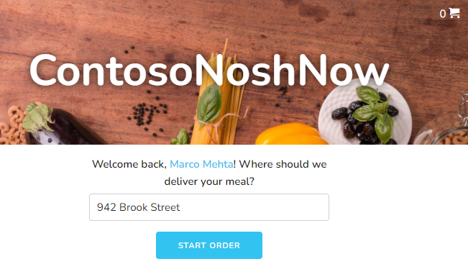

# Introduction to the guide sample application

Instead of learning multiple sample applications, the guide focused on evolving deployment strategies. Readers could learn the sample application structure once and focus on how the application would need to be modified in order fit the deployment model.

## Sample application overview and story

ContosoNoshNow is a delivery service and logistics company focused on making delicious food accessible to their customers no matter where they are located. The company started with a simple web application they could easily maintain and add features to as the business grew. A few years later, their CIO realized the application performance and their current on-premises environment were not meeting their business's growing demand. The application deployment process took hours, yielded unreliable results, and the admin team could not easily find production issues quickly. During the busy hours, customers complained the web application was slow.

The development team knew moving to Azure could help with these issues.

## Solution architecture

TODO: Diagram

## Site map and example default page

TODO

## Prerequisites

TODO

- Azure subscription
- Git

## Quick start: manual Azure set up instructions

As you continue with this guide, you will be able to take advantage of the environment automation scripts that will build and configure much of your environment. It is important to understand the basic Azure **concepts** before running automated scripts. Walking through each steps will help provide additional context and learning opportunities. You will be able to create an environment in a few minutes.

>**Note:** The sample application has been tested with PHP version 7.4. **We recommend deploying to 7.4 environment**. Deploying to a 8.X requires a slightly different configuration as the underlying web server has changed.

| PHP Version | Web Server |
|-------------|----------------|
| 7.3         | Apache         |
| 7.4         | Apache         |
| 8.0         | Nginx          |

The Azure App Service uses this [Docker image](https://github.com/Azure-App-Service/nginx-fpm) for its 8.0 container builds.

>**Warning**: Outdated runtimes are periodically removed from the Web Apps Create and Configuration blades in the Portal. These runtimes are hidden from the Portal when they are deprecated by the maintaining organization or found to have significant vulnerabilities. These options are hidden to guide customers to the latest runtimes where they will be the most successful. Older Azure App Service Docker images can be found [here](https://github.com/Azure-App-Service/php).


## Sample application deployment steps

1. Log into the Azure Portal. Search for and create Azure Web App + Database resources in the Marketplace.

   - Select the Marketplace button.
  
      

   - Enter `Web App + Database` in the search box.
   - Select the Microsoft Web App + Database search result.

      

2. Create a web application and database.

    

   - Choose your subscription.

   - Create a new resource group

   - Choose a region close to you.

   - Create a unique web app name.

   - Select your runtime stack.  The web app has been tested with PHP 7.4.

   - Create the resources.

3. After the resources have been deployed, locate your App Service.
  
    

   - Select the **Deployment Center** and capture the configuration settings.

   - In the Settings tab, choose Local Git.

    

   - Select **Save** at the top.

    >**Note:** Alternative Azure CLI command:

    ```cmd
    az webapp deployment source config-local-git --name <app-name> --resource-group <group-name>
    ```

   - Capture the **Git Clone Uri**. You will be pushing the application files to the Azure App Service local storage from your local machine.
  
      

   - Capture the Application Scope user and password.

     

4. Clone the sample application to your local machine from the Git repository. You are going to set up a remote to the Azure App Service repo.

   - Open the command prompt or terminal on your local machine.

   - Type

   ```cmd
   git remote add azure <your Azure App Service Git Clone URL>
   git remote -v
   git push azure master
   ```
  
   - Enter your Application Scope credentials.
  
      

   - You should see similar output.

      

5. Return to the Azure Portal. Navigate to the App Service. Find the **Deployment Tools** section. Log into App Service SSH terminal. Run the Composer update command in the wwwroot directory, which will import your packages and create the vendor folder, along with the autoload script (../vendor/autoload.php).

    ```bash
    cd /home/site/wwwroot
    composer.phar update
    ```
  
6. Generate Laravel application key.
  
    ```bash
    php artisan key:generate
    ```

7. Update the .env file with the Azure URL.

   ```bash
    nano /home/site/wwwroot/.env
   ```

    

8. Open a browser and view the application.

    

## Connecting to the database


## What happens to my app during an Azure deployment?

All the officially supported deployment methods make changes to the files in the /home/site/wwwroot folder of your app. These files are used to run your app.  The web framework of your choice may use a subdirectory as the site root. For example, Laravel, uses the public/ subdirectory as the site root.

TODO: add more specific information related to getting PHP/Laravel running in Azure.

## Troubleshooting tips

- Select your App Service in the Azure Portal. In the **Monitoring** section, select **Log Stream**.
- Running `php -i` at the Azure App Service SSH console will provide valuable configuration information.
- Azure App Service 8.0 php.ini location - `cat /usr/local/etc/php/php.ini-production`
- [Configure a PHP app for Azure App Service - Access diagnostic logs](https://docs.microsoft.com/en-us/azure/app-service/configure-language-php?pivots=platform-linux#access-diagnostic-logs)

- [Deploying a Laravel application to Nginx server.](https://laravel.com/docs/8.x/deployment#nginx)
- [Local Git deployment to Azure App Service](https://docs.microsoft.com/en-us/azure/app-service/deploy-local-git?tabs=cli)

## Resources

- [How PHP apps are detected and built.](https://github.com/microsoft/Oryx/blob/main/doc/runtimes/php.md)
