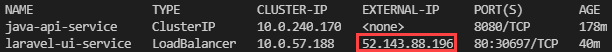
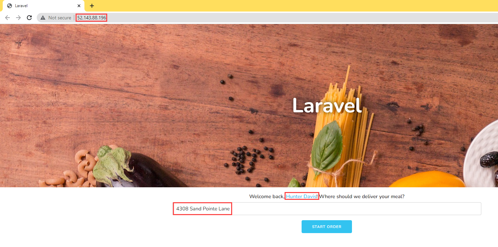

# Deploying a Laravel app backed by a Java REST API to AKS

## App introduction

In the previous stages of this developer guide, you explored how an MVC app could be deployed on an Azure VM, containerized, and then hosted on various PaaS services (e.g. Azure Container Instances). The second sample app provided with this developer guide delegates database access operations (Flexible Server queries) to a Java REST API. The Laravel app calls the REST API.

One of the advantages of this microservices architecture is that the Java API and the Laravel app can be scaled independently. Both deployments have high availability. Moreover, though this exercise does not demonstrate how to configure CI/CD for this app, you can apply the same techniques you learned previously.

We recommend creating a new resource group for this exercise.

```
az group create -n [RESOURCE GROUP NAME] -l [AZURE REGION]
```

## Provision the database

Navigate to the `Database` directory within the `java-api` directory in the project root from a PowerShell terminal instance. Then, execute the `create-database.ps1` script, passing the parameters in the order shown below. The command will provision a new Flexible Server instance with the app database schema.

- Provide a unique `Suffix` to ensure that the Flexible Server instance's name is unique
- Provide a strong `Password` for the database admin user (`AppAdmin`)
- Provide the name of your lab `Resource Group`
- Provide the desired `Location` for your Azure resources

```powershell
.\create-database.ps1 'Suffix' 'Password' 'Resource Group' 'Location'
```

The Flexible Server instance will have 1 vCore, 2 GiB memory, 32 GiB storage, and it will allow all Azure resources to access it.

> Consult the [Microsoft documentation](https://docs.microsoft.com/azure/mysql/flexible-server/tutorial-deploy-springboot-on-aks-vnet) for information on how to configure private access for MySQL Flexible Server from Azure Kubernetes Service. This example uses public access for simplicity.

## Create Docker images

### API

Navigate to the `java-api` directory and enter the following command to create an optimized Docker image. Note that Maven does not need a Dockerfile to create this image, called `noshnowapi:0.0.1-SNAPSHOT`.

```
mvn spring-boot:build-image
```

### Laravel

Navigate to the `sample-php-app-rest` directory. Create a file called `.env`. Set `APP_KEY=` as the first line in the file. Then, run `php artisan key:generate` to create an application key in the `.env` file.

Now, in the same directory, enter the following command to create a Docker image to serve the PHP frontend app through Apache.

```
docker image build -t noshnowui:0.0.1 .
```

## Provision Azure Kubernetes Service

Navigate to the `Kubernetes` directory within the `java-api` directory in the project root from a PowerShell terminal instance. Then, execute the `create-azure-resources.ps1` script, passing the parameters in the order shown below. The command will provision Azure Container Registry and push the two Docker images; provision a new Azure Kubernetes Service cluster and provide it access to ACR; create the `contosonoshnow` namespace within the Kubernetes cluster.

- Provide a unique `Suffix` that is the **same as the suffix used for the create-database.ps1 script**
- Provide the name of your lab `Resource Group` (same as the Resource Group used for the prior script)
- Provide the desired `Location` for your Azure resources (same as the Location used for the prior script)

```powershell
.\create-azure-resources.ps1 'Suffix' 'Resource Group' 'Location'
```

Note that if the resources are deployed to an Azure region that supports Availability Zones, the script will co-locate the Flexible Server instance and the Kubernetes cluster.

## Deploy the API to Azure Kubernetes Service

### Create the API Secret

Open the `api.secrets.yml` file in the `Kubernetes` directory. This file contains the base64-encoded password for the application user. Besides the administrative user, the database schema setup script created a less-privileged app user.

Run the command below from the `Kubernetes` directory to create the password secret:

```
kubectl apply -f api.secrets.yml
```

### Create the API Service

`api.service.yml` defines a Service that directs all traffic received from within the cluster on port 8080 to the pods that serve the Java API. Note that the API service is only accessible from within the cluster.

```
kubectl apply -f api.service.yml
```

### Create the API Deployment

`api.deployment.yml` defines a deployment with two pods, created from the Java API image pushed to ACR.

Open the file. Replace the two `[SUFFIX]` placeholders with the values you used when provisioning the Azure resources. Then, execute the command below:

```
kubectl apply -f api.deployment.yml
```

Congratulations. You have deployed the API to Azure Kubernetes Service and exposed it internally through a Service.

## Deploy the Laravel app to Azure Kubernetes Service

### Create the Laravel app Service

Navigate to the `Kubernetes` directory in the `sample-php-app-rest` directory. Create a service to expose the Laravel app through a public IP address (in this case, through a Load Balancer provisioned in Azure).

```
kubectl apply -f web.service.yml
```

### Create the Laravel app Deployment

The deployment specified in the `web.deployment.yml` file (in the same directory as the previous step) creates two pods from the Laravel app image pushed to ACR.

Again, replace the `[SUFFIX]` placeholder in the file. Then, create the deployment.

```
kubectl apply -f web.deployment.yml
```

## Browse to the app

Run `kubectl get svc` to get the public IP address of `laravel-ui-service`. Copy the `EXTERNAL-IP` value to a browser window.



If all functions correctly, you should see the user details for a random user load.


