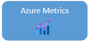
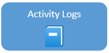
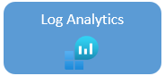

## Azure Monitor options

Azure Monitor Metrics is a feature of Azure Monitor that collects numeric data from monitored resources into a time-series database. Metrics in Azure Monitor are lightweight and capable of supporting near real-time scenarios, so they are helpful for alerting and detecting issues. You can analyze them interactively by using Metrics Explorer, be proactively notified with an alert when a value crosses a threshold, or visualize them in a workbook or dashboard.

[Azure Monitor Metrics overview](https://docs.microsoft.com/azure/azure-monitor/essentials/data-platform-metrics)

The Activity log is a [platform log](https://docs.microsoft.com/en-us/azure/azure-monitor/essentials/platform-logs-overview) in Azure that provides insight into subscription-level events. The Activity log includes  information like when a resource is modified or when a virtual machine was started.

Event examples:

- Start or stop a VM.
- Start or stop an App Service.

[Azure Activity log](https://docs.microsoft.com/en-us/azure/azure-monitor/essentials/activity-log)

Log Analytics is a tool in the Azure portal used to edit and run log queries with data in Azure Monitor Logs. You can use Log Analytics queries to retrieve records that match particular criteria.  Use the query results to identify trends, analyze patterns, and provide insights. Users can create charts to visualize important data in the portal.

Query examples:

- HTTP URL requests in the last hour.
- HTTP status codes in the two days.
- Call duration and result code.

[Overview of Log Analytics in Azure Monitor](https://docs.microsoft.com/en-us/azure/azure-monitor/logs/log-analytics-overview)

[Log Analytics tutorial](https://docs.microsoft.com/en-us/azure/azure-monitor/logs/log-analytics-tutorial)

Workbooks provide a flexible canvas for data analysis and the creation of rich visual reports within the Azure portal. They allow you to tap into multiple Azure data sources and combine them into unified interactive experiences. Visualize data in one interactive report.

[Azure Monitor Workbooks](https://docs.microsoft.com/en-us/azure/azure-monitor/visualize/workbooks-overview)

Azure Resource Health helps you diagnose and get support for service problems that affect your Azure resources. It reports on the current and past health of your resources. Resource Health can help you diagnose the root event causes.

Multiple Azure infrastructure components can trigger Platform events. The events include both scheduled actions (planned maintenance) and unexpected incidents (unplanned host reboot or degraded hosted hardware that is predicted to fail after a specified time window).

Resource Health provides additional details about the event and the recovery process. **It also enables you to contact Microsoft Support, even if you don't have an active support agreement.**

Resource issue examples:

- Unplanned events, for example an unexpected host reboot
- Planned events, like scheduled host OS updates
- Events triggered by user actions, for example a user rebooting a virtual machine

[Resource Health overview](https://docs.microsoft.com/en-us/azure/service-health/resource-health-overview)
