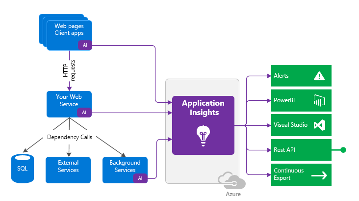
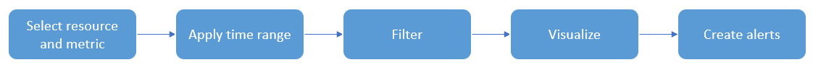
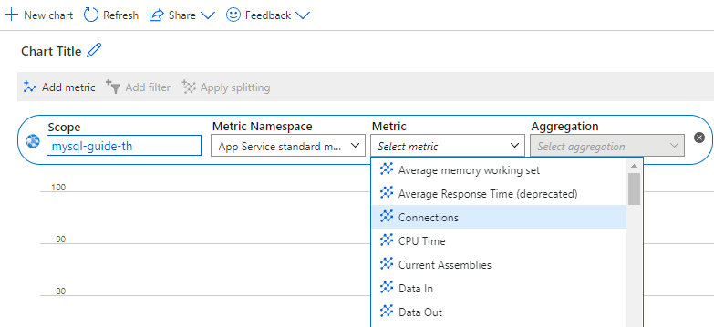

## Application monitoring

It is important to monitor the uptime, performance, and understand usage patterns once an application has been deployed.  [Application Insights](https://docs.microsoft.com/azure/azure-monitor/app/app-insights-overview) is a feature that provides extensible application performance management (APM) and monitoring for web-based applications.

Application insights monitoring is very flexible in that it supports a wide variety of platforms, including .NET, Node.js, Java, and Python as well as apps hosted on-premises or on any public cloud. Just about any application can take advantage of this powerful monitoring tool.

Using Application Insights:

- Install a small instrumentation package (SDK) in your app
- Or enable Application Insights by using the Application Insights agent in Azure.

The instrumentation code directs telemetry data to an Application Insights resource by using a unique instrumentation key and URL.

Example steps to configure WordPress monitoring:

- Install Application Insights plugin from WordPress Plugins.

- Create Application Insights.

- Copy the Instrumentation Key from created Application Insights.

- Then go to **Settings** and Application Insights inside WordPress, and add the key there.

- Access the website and look for details.

>  **Tip**: [Connection Strings](https://docs.microsoft.com/azure/azure-monitor/app/sdk-connection-string?tabs=net) are recommended over instrumentation keys.

### Azure Metrics Explorer

[Azure Metrics Explorer](https://docs.microsoft.com/azure/azure-monitor/essentials/metrics-getting-started) makes it easy to capture performance counters for resources quickly without adding instrumentation to your application code. As the following diagram shows, you simply select the resource and metric and then apply your filters:

For example, to capture performance counters for a PHP App Service resource, simply follow these steps.

- Determine your scope. Navigate to the App Service in the Azure Portal.
- In the **Monitoring** section, select the **Metrics** item.
- Select your time range.

  

- Select your **Metric** from the dropdown.

  

- Select your chart choice for the chosen metric.

  

- Create a rule by selecting **New alert rule**.
  
  

### Application Insights cost management

Application Insights comes with a free allowance that tends to be relatively large enough to cover the development and publishing of an app for a small number of users. As a best practice, setting a limit can prevent more data than necessary from being processed and keep costs low.

Larger volumes of telemetry are charged by the gigabyte and should be monitored closely to ensure your finance department does not get a larger than expected Azure invoice. [Manage usage and costs for Application Insights](https://docs.microsoft.com/azure/azure-monitor/app/pricing)
