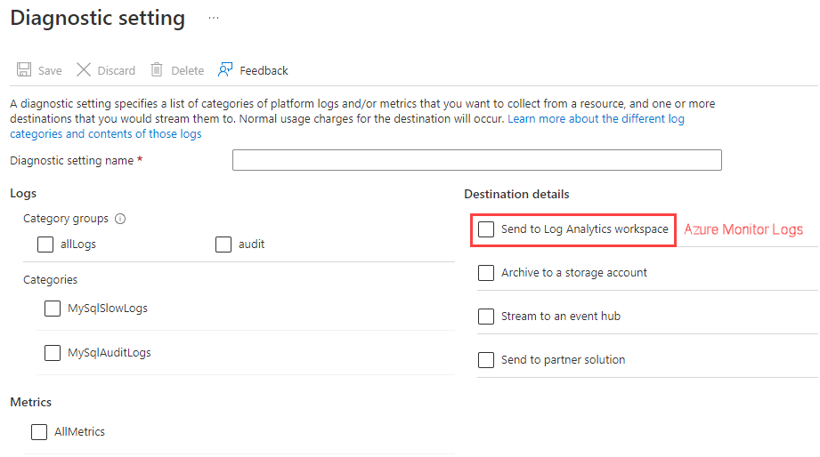

## Monitoring database operations

Azure can be configured to monitor the database as well.  As you can see from the following screenshot, there are many metrics available out of the box that can be monitored:

Monitoring your Azure Database for MySQL Flexible Server instances allows you to understand database resource constraints, connectivity patterns, causes of application failures, and more.

Once you specify the data that your Azure resource(s) should monitor (varies based on the service), you need to direct that data to a place that Azure Monitor can monitor. For example, with MySQL Flexible Server instances, you can use the **Diagnostic setting** tab of the Azure portal to route MySQL slow query logs and audit logs to Log Analytics workspaces (Azure Monitor Logs).

In addition to the views in Azure Monitor, log data collected can be sent to Log Analytics workspaces and then analyzed with [Kusto Query Language (KQL)](https://docs.microsoft.com/azure/data-explorer/kusto/query/) queries to quickly retrieve, consolidate, and analyze collected data.

Administrators unfamiliar with KQL can find a SQL to KQL cheat sheet [here](https://docs.microsoft.com/azure/data-explorer/kusto/query/sqlcheatsheet) or the [Get started with log queries in Azure Monitor](https://docs.microsoft.com/azure/azure-monitor/log-query/get-started-queries) page.

## Query Performance Insights

In addition to the basic server monitoring aspects, Azure provides tools to monitor application query performance.  Correcting or improving queries can lead to significant increases in the query throughput. Use the [Query Performance Insight tool](https://docs.microsoft.com/azure/mysql/flexible-server/tutorial-query-performance-insights) to analyze the longest-running queries and determine if it is possible to cache those items if they are deterministic within a set period, or modify the queries to increase their performance.

In addition to the query performance insight tool, `Wait statistics` provides a view of the wait events that occur during the execution of a specific query.

> **Warning**: Wait statistics are meant for troubleshooting query performance issues. It is recommended to be turned on only for troubleshooting purposes.

Finally, the `slow_query_log` can be set to show slow queries in the MySQL log files (default is OFF). The `long_query_time` server parameter can be used to log long-running queries (default long query time is 10 sec).

## Server Logs

Server logs from Azure Databse for MySQL can also be extracted through the Azure platform *resource logs*, which track data plane events. Azure can route these logs to Log Analytics workspaces for manipulation and visualization through KQL.

In addition to Log Analytics, the data can also be routed to Event Hubs for third-party integrations and Azure storage for long term backup.

## MySQL audit logs

MySQL has a robust built-in audit log feature. By default, this [audit log feature is disabled](https://docs.microsoft.com/azure/mysql/flexible-server/concepts-audit-logs) in Azure Database for MySQL.  Server level logging can be enabled by changing the `audit_log_enabled` server parameter. Once enabled, logs can be accessed through [Azure Monitor](https://docs.microsoft.com/azure/azure-monitor/overview) and [Log Analytics](https://docs.microsoft.com/azure/azure-monitor/platform/design-logs-deployment) by turning on [diagnostic logging](https://docs.microsoft.com/azure/mysql/flexible-server/tutorial-configure-audit#set-up-diagnostics).

In addition to metrics, it is also possible to enable MySQL logs to be ingested into Azure Monitor. While metrics are better suited for real-time decision-making, logs are also useful for deriving insights. One source of logs generated by Flexible Server is MySQL *audit logs*, which indicate connections, DDL and DML operations, and more. Many businesses utilize audit logs to meet compliance requirements, but they can impact performance.

Once enabled, KQL can be used to query the logs. For example, to query for user connection related events, run the following KQL query:

> **Warning**: Excessive audit logging can degrade server performance, so be mindful of the events and users configured for logging.

### Enabling audit logs

Audit logging is controlled by the `audit_log_enabled` server parameter in Flexible Server. Azure provides granularity over the events logged (`audit_log_events`), the database users subject to logging (`audit_log_include_users`), and an explicit list of the database users exempt from logging (`audit_log_exclude_users`).

> For more details about the logging server parameters, including the type of events that can be logged, consult [the documentation.](https://docs.microsoft.com/azure/mysql/flexible-server/concepts-audit-logs)

Reference [Configure and access audit logs for Azure Database for MySQL in the Azure Portal](https://docs.microsoft.com/azure/mysql/howto-configure-audit-logs-portal) for more information.