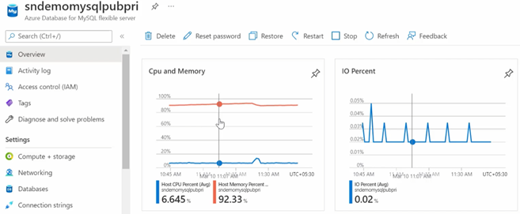
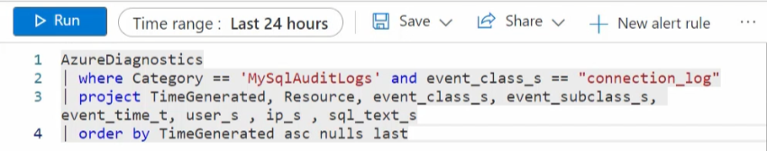
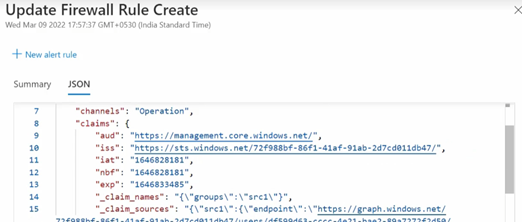

## Monitoring database operations

Azure can be configured to monitor the Flexible server database as well.

### Azure Database for MySQL overview

The Azure Portal resource overview excellent overview of the MySQL metrics. This high-level dashboard provides insight into the typical database monitoring counters, like CPU, IO, Query Count, etc.

### Metrics

For more specific metrics, navigate to the **Monitoring** section. Select **Metrics**. More custom granular metrics can be configured and displayed.

See: [Monitor Azure Database for MySQL Flexible Servers with built-in metrics](https://docs.microsoft.com/azure/mysql/flexible-server/concepts-monitoring)

### Diagnostic settings

Diagnostic settings allow you to route platform logs and metrics continuously to other storage and ingestion endpoints.

See: [Set up diagnostics](https://docs.microsoft.com/azure/mysql/flexible-server/tutorial-configure-audit#set-up-diagnostics)

### Log Analytics

Once you configure your Diagnostic Settings, you can navigate to the Log Analytics workspace. You can perform specific filtered queries on interesting categories. Are you looking for slow queries?

Now, you can review the results from your query. There is a wealth of information about the category.

MySQL audit log information is also available.

See: [View query insights by using Log Analytics](https://docs.microsoft.com/azure/mysql/flexible-server/tutorial-query-performance-insights#view-query-insights-by-using-log-analytics)

### Workbooks

As mentioned previously, Workbooks is a simple canvas to visualize data from different sources, like Log Analytics workspace. It is possible to view performance and storage metrics all in a single pane.

CPU, IOPS, and other common monitoring metrics are available. You can also access Query Performance Insight.

In addition to the fundamental server monitoring aspects, Azure provides tools to monitor application query performance.  Correcting or improving queries can lead to significant increases in the query throughput. Use the [Query Performance Insight tool](https://docs.microsoft.com/azure/mysql/flexible-server/tutorial-query-performance-insights) to:

- Analyze the longest-running queries and determine if it is possible to cache those items.
- If they are deterministic within a set period, modify the queries to increase their performance.

In addition to the query performance insight tool, `Wait statistics` provides a view of the wait events that occur during the execution of a specific query.

> **Warning**: Wait statistics are meant for troubleshooting query performance issues. It is recommended to be turned on only for troubleshooting purposes.

Finally, the `slow_query_log` can be set to show slow queries in the MySQL log files (default is OFF). The `long_query_time` server parameter can be used to log long-running queries (default long query time is 10 sec).

See: [Monitor Azure Database for MySQL Flexible Server by using Azure Monitor workbooks](https://docs.microsoft.com/azure/mysql/flexible-server/concepts-workbooks)

### Resource health

It is essential to know if the MySQL service has experienced a downtime and the related details. Resource health can assist with this information. If you need additional assistance, a helpful contact support link available.

### Activity logs

This area captures the administrative events captured over a period of time.

The event details can be viewed as well. These details can be extremely helpful when troubleshooting.

### Creating alerts

You can create alerts in a couple of ways.  Navigate to the **Alerts** menu item in the portal and create it manually.

You can also create alerts from the Metrics section.

Once the alert has been configured, you can create an action group to send a notification to the operations team.

See: [Set up alerts on metrics for Azure Database for MySQL - Flexible Server](https://docs.microsoft.com/azure/mysql/flexible-server/how-to-alert-on-metric)

### Server Logs

Server logs from Azure Database for MySQL can also be extracted through the Azure platform *resource logs*, which track data plane events. Azure can route these logs to Log Analytics workspaces for manipulation and visualization through KQL.

In addition to Log Analytics, the data can also be routed to Event Hubs for third-party integrations and Azure storage for long-term backup.

### MySQL audit logs

MySQL has a robust built-in audit log feature. This [audit log feature is disabled](https://docs.microsoft.com/azure/mysql/flexible-server/concepts-audit-logs) in Azure Database for MySQL by default.  Server level logging can be enabled by changing the `audit_log_enabled` server parameter. Once enabled, logs can be accessed through [Azure Monitor](https://docs.microsoft.com/azure/azure-monitor/overview) and [Log Analytics](https://docs.microsoft.com/azure/azure-monitor/platform/design-logs-deployment) by turning on [diagnostic logging](https://docs.microsoft.com/azure/mysql/flexible-server/tutorial-configure-audit#set-up-diagnostics).

In addition to metrics, it is also possible to enable MySQL logs to be ingested into Azure Monitor. While metrics are better suited for real-time decision-making, logs are also useful for deriving insights. One source of logs generated by Flexible Server is MySQL *audit logs*, which indicate connections, DDL and DML operations, and more. Many businesses utilize audit logs to meet compliance requirements, but they can impact performance.

> **Warning**: Excessive audit logging can degrade server performance, so be mindful of the events and users configured for logging.

### Enabling audit logs

Audit logging is controlled by the `audit_log_enabled` server parameter in Flexible Server. Azure provides granularity over the events logged (`audit_log_events`). User fields include the database users subject to logging (`audit_log_include_users`), and an explicit list of the database users exempt from logging (`audit_log_exclude_users`).

> For more details about the logging server parameters, including the type of events that can be logged, consult [the documentation.](https://docs.microsoft.com/azure/mysql/flexible-server/concepts-audit-logs)
