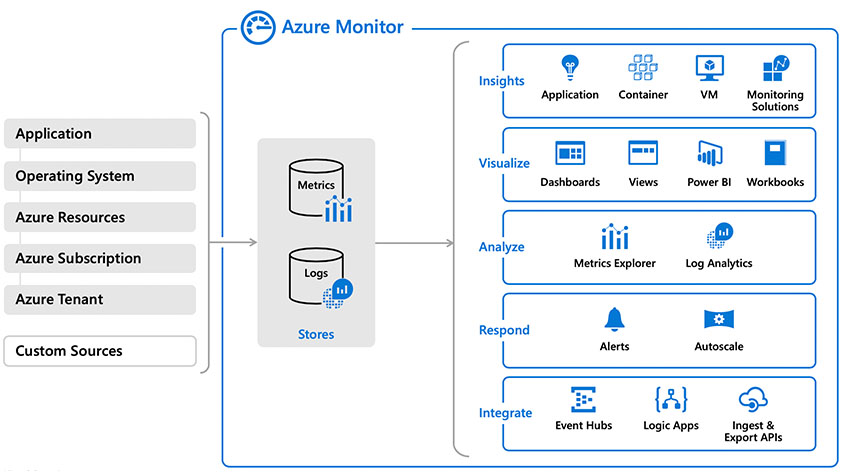
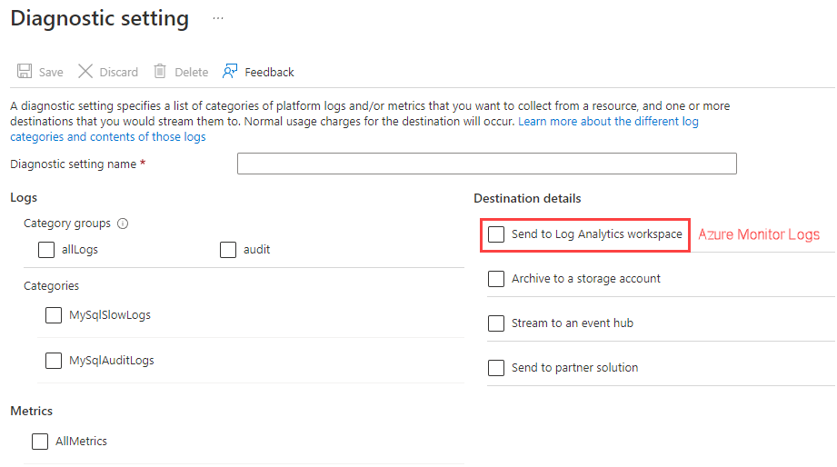
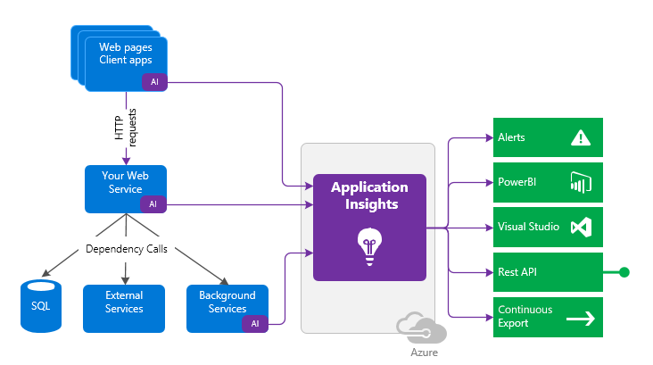
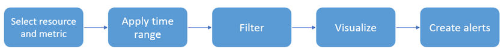
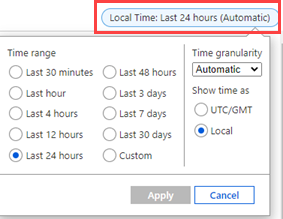
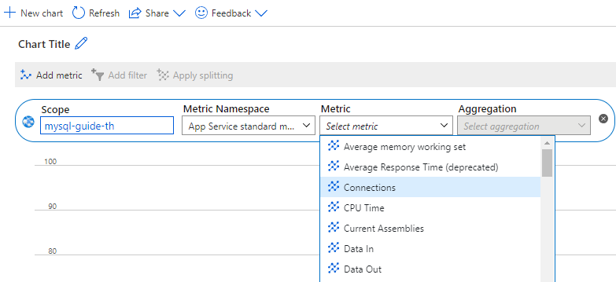
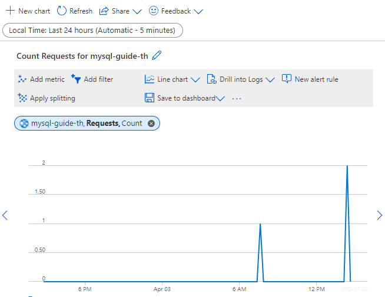
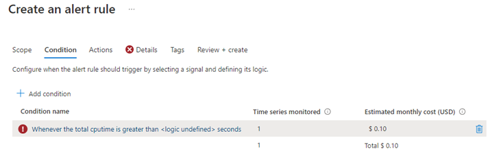
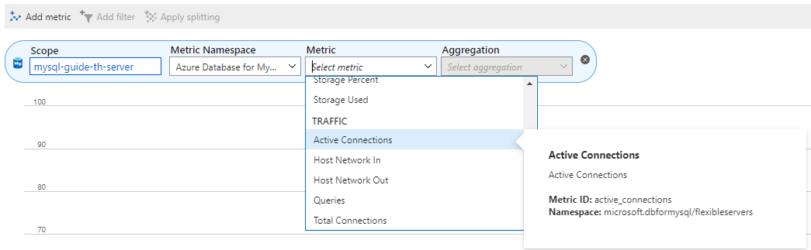

# 05 / Monitoring

Once the application and database are deployed, the next phase is to manage the new cloud-based data workload resources. Management operations include both control plane and data plane activities. Control plane activities are related to Azure resources, versus the data plane, which is **inside** the Azure resource (in this case MySQL).

Azure Database for MySQL provides for the ability to monitor both of these types of operational activities using Azure-based tools such as [Azure Monitor](https://docs.microsoft.com/azure/azure-monitor/overview), [Log Analytics](https://docs.microsoft.com/azure/azure-monitor/platform/design-logs-deployment), and [Azure Sentinel](https://docs.microsoft.com/azure/sentinel/overview). In addition to the Azure-based tools, security information and event management (SIEM) systems can be configured to consume these logs as well.

Alerts will need to be created to warn administrators of outages, operational performance problems, or any suspicious activity. If a particular alert event has a well-defined remediation path, alerts can fire automated [Azure runbooks](https://docs.microsoft.com/azure/automation/automation-quickstart-create-runbook) to address the event.

The monitoring content will be focused on these concepts:

- Azure Monitor overview and strategy

- Application monitoring

- Database monitoring

## Azure Monitor overview

Azure Monitor is the Azure native platform service that provides a single source for monitoring Azure resources. It monitors all layers of the stack, starting with tenant services, such as Azure Active Directory Domain Services, and subscription-level events and Azure Service Health.

It also monitors infrastructure resources, such as VMs, storage, and network resources. At the top layer, it monitors your application. Administrators and developers employ Azure Monitor to consolidate metrics about the performance and reliability of their stack layers, including Flexible Server instances. Management tools, such as those in Azure Security Center and Azure Automation, also push log data to Azure Monitor. The service aggregates and stores this telemetry in a log data store that’s optimized for cost and performance.



For more information on what can be monitored, read: [What is monitored by Azure Monitor?](https://docs.microsoft.com/en-us/azure/azure-monitor/monitor-reference)

Monitoring your MySQL Flexible Server instances allows you to understand database resource constraints, connectivity patterns, causes of application failures, and more. Administrator monitoring complements Azure internal monitoring, improving the availability of your applications.

Once you specify the data that your Azure resources should monitor (varies based on the service), you need to direct that data to Azure Monitor. For example, with MySQL Flexible Server instances, you can use the **Diagnostic setting** tab of the Azure portal to route MySQL slow query logs and audit logs to Log Analytics workspaces (Azure Monitor Logs).



## Define your strategy ##

Administrators should [plan their monitoring strategy](https://docs.microsoft.com/azure/azure-monitor/best-practices-plan) and configuration for the best results. Some data collection and features are free while others have associated costs. Focus on maximizing your applications' performance and reliability. Identify the signs of failure. See [Azure Monitor Pricing](https://azure.microsoft.com/pricing/details/monitor/).

## Application monitoring

Once an application has been deployed, it is important to start to monitor the uptime, manage performance, and understand usage patterns.  [Application Insights](https://docs.microsoft.com/azure/azure-monitor/app/app-insights-overview) is a feature of Azure Monitor that provides extensible application performance management (APM) and monitoring for live web apps.

It supports a wide variety of platforms, including .NET, Node.js, Java, and Python. Application monitoring is very flexible. Apps hosted on-premises, hybrid, or on any public cloud can take advantage of this powerful monitoring tool.

Using Application Insights:
- Install a small instrumentation package (SDK) in your app
- Or enable Application Insights by using the Application Insights agent.




Instrumentation monitors your app and directs the telemetry data to an Application Insights resource by using a unique instrumentation key.

Example steps to configure WordPress monitoring:

- Install Application Insights plugin from WordPress Plugins

- Create Application Insights

- Copy the Instrumentation Key from created Application Insights

- Then go to **Settings** and Application Insights inside WordPress, and add the key there.

- Access the website and look for details

>  **Tip:** [Connection Strings](https://docs.microsoft.com/azure/azure-monitor/app/sdk-connection-string?tabs=net) are recommended over instrumentation keys.

### Azure Metrics Explorer

[Azure Metrics Explorer](https://docs.microsoft.com/en-us/azure/azure-monitor/essentials/metrics-getting-started) makes is makes it easy to capture performance counters for resources quickly without having to instrument your code.



For example, if we wanted to capture performance counters for a PHP App Service resource, there are some simple steps to follow.

- Determine your scope. Navigate to the App Service in the Azure Portal.
- In the **Monitoring** section, select the **Metrics** item.
- Select your time range.

  

- Select your **Metric** from the dropdown.

  

- Select your chart choice for the chosen metric.

  

- Create a rule by selecting **New alert rule**.
  
  

### Cost

The free allowance is large enough to cover development, and publishing an app for a small number of users. Setting a limit can prevent more data than necessary from being processed and keep costs low. Larger volumes of telemetry are charged by the Gb. [Manage usage and costs for Application Insights](https://docs.microsoft.com/azure/azure-monitor/app/pricing)

## Monitoring database operations

Azure Metrics can be configured to monitor the database as well.



Log data collected by Azure Monitor can be analyzed with queries to quickly retrieve, consolidate, and analyze collected data. Create and test queries using Log Analytics in the Azure portal. Once metric data is flowing, use the [Kusto Query Language (KQL)](https://docs.microsoft.com/azure/data-explorer/kusto/query/) query language to query the various log information. Administrators unfamiliar with KQL can find a SQL to KQL cheat sheet [here](https://docs.microsoft.com/azure/data-explorer/kusto/query/sqlcheatsheet) or the [Get started with log queries in Azure Monitor](https://docs.microsoft.com/azure/azure-monitor/log-query/get-started-queries) page.

For example, to get the memory usage of the Azure Database for MySQL:

```kql
AzureMetrics
| where TimeGenerated > ago(15m)
| limit 10
| where ResourceProvider == "MICROSOFT.DBFORMYSQL"
| where MetricName == "memory_percent"
| project TimeGenerated, Total, Maximum, Minimum, TimeGrain, UnitName
| top 1 by TimeGenerated
```

To get the CPU usage:

```kql
AzureMetrics
| where TimeGenerated > ago(15m)
| limit 10
| where ResourceProvider == "MICROSOFT.DBFORMYSQL"
| where MetricName == "cpu_percent"
| project TimeGenerated, Total, Maximum, Minimum, TimeGrain, UnitName
| top 1 by TimeGenerated
```


The table below, pulled from the [Microsoft documentation](https://docs.microsoft.com/azure/mysql/flexible-server/concepts-monitoring), indicates the metrics exposed by Flexible Server instances:

|Metric display name|Metric|Unit|Description|
|---|---|---|---|
|Host CPU percent|cpu_percent|Percent|The percentage of CPU utilization on the server, including CPU utilization from both customer workload and Azure MySQL processes|
|Host Network In |network_bytes_ingress|Bytes|Incoming network traffic on the server, including traffic from both customer database and Azure MySQL features like replication, monitoring, logs, etc.|
|Host Network out|network_bytes_egress|Bytes|Outgoing network traffic on the server, including traffic from both customer database and Azure MySQL features like replication, monitoring, logs, etc.|
|Replication Lag|replication_lag|Seconds|The time since the last replayed transaction. This metric is available for replica servers only.|
|Active Connections|active_connection|Count|The number of active connections to the server.|
|Backup Storage Used|backup_storage_used|Bytes|The amount of backup storage used.|
|IO percent|io_consumption_percent|Percent|The percentage of IO in use.|
|Host Memory Percent|memory_percent|Percent|The percentage of memory in use on the server, including memory utilization from both customer workload and Azure MySQL processes|
|Storage Limit|storage_limit|Bytes|The maximum storage for this server.|
|Storage Percent|storage_percent|Percent|The percentage of storage used out of the server's maximum.|
|Storage Used|storage_used|Bytes|The amount of storage in use. The storage used by the service may include the database files, transaction logs, and server logs.|
|Total connections|total_connections|Count|The number of total connections to the server|
|Aborted Connections|aborted_connections|Count|The number of failed attempts to connect to MySQL, for example, failed connection due to bad credentials.|
|Queries|queries|Count|The number of queries per second|

> For a similar list for Single Server, consult [this document.](https://docs.microsoft.com/azure/mysql/concepts-monitoring)

## Query Performance Insights

In addition to the basic server monitoring aspects, Azure provides tools to monitor application query performance.  Correcting or improving queries can lead to significant increases in the query throughput. Use the [Query Performance Insight tool](https://docs.microsoft.com/azure/mysql/concepts-query-performance-insight) to analyze the longest-running queries and determine if it is possible to cache those items if they are deterministic within a set period, or modify the queries to increase their performance.

Wait statistics provides a view of the wait events that occur during the execution of a specific query.

>  **Warning:** Wait statistics are meant for troubleshooting query performance issues. It is recommended to be turned on only for troubleshooting purposes.

The `slow_query_log` can be set to show slow queries in the MySQL log files (default is OFF). The `long_query_time` server parameter can log long-running queries (default is 10 sec).

## Server Logs

Teams can access server logs from Flexible Server through Azure platform *resource logs*, which track data plane events. Azure can route these logs to Log Analytics workspaces, for manipulation and visualization through KQL; Event Hub, for third-party integrations; and Azure storage, for backup.

## MySQL audit logs

MySQL has a robust built-in audit log feature. By default, this [audit log feature is disabled](https://docs.microsoft.com/azure/mysql/concepts-audit-logs) in Azure Database for MySQL.  Server level logging can be enabled by changing the `audit_log_enabled` server parameter. Once enabled, logs can be accessed through [Azure Monitor](https://docs.microsoft.com/azure/azure-monitor/overview) and [Log Analytics](https://docs.microsoft.com/azure/azure-monitor/platform/design-logs-deployment) by turning on [diagnostic logging](https://docs.microsoft.com/azure/mysql/howto-configure-audit-logs-portal#set-up-diagnostic-logs).

In addition to metrics, it is also possible to enable MySQL logs to be ingested into Azure Monitor. While metrics are better suited for real-time decision-making, logs are also useful for deriving insights. One source of logs generated by Flexible Server is MySQL *audit logs*, which indicate connections, DDL and DML operations, and more. Many businesses utilize audit logs to meet compliance requirements, but they can impact performance.

Once enabled, KQL can be used to query the logs. For example, to query for user connection related events, run the following KQL query:

```kql
AzureDiagnostics
| where ResourceProvider =="MICROSOFT.DBFORMYSQL"
| where Category == 'MySqlAuditLogs' and event_class_s == "connection_log"
| project TimeGenerated, LogicalServerName_s, event_class_s, event_subclass_s, event_time_t, user_s , ip_s , sql_text_s
| order by TimeGenerated asc
```

>  **Warning:** Excessive audit logging can degrade server performance, so be mindful of the events and users configured for logging.

- [Single Server Audit Logs](https://docs.microsoft.com/azure/mysql/concepts-audit-logs)
- [Flexible Server Audit Logs](https://docs.microsoft.com/azure/mysql/flexible-server/concepts-audit-logs)

### Enabling audit logs

Audit logging is controlled by the `audit_log_enabled` server parameter in Flexible Server. Azure provides granularity over the events logged (`audit_log_events`), the database users subject to logging (`audit_log_include_users`), and an explicit list of the database users exempt from logging (`audit_log_exclude_users`).

> For more details about the logging server parameters, including the type of events that can be logged, consult [the documentation.](https://docs.microsoft.com/azure/mysql/flexible-server/concepts-audit-logs)

Besides being sent to Azure Monitor, MySQL audit logs can be sent to Azure Storage accounts and Azure Event Hubs for integration with other systems.

Reference [Configure and access audit logs for Azure Database for MySQL in the Azure Portal](https://docs.microsoft.com/azure/mysql/howto-configure-audit-logs-portal) for more information.

### Notes about the Flexible Server portal example

If errors are encountered when running the KQL query in the Flexible Server Azure Portal example, try to generate some activity and/or expand the scope of the `audit_log_events` parameter. Here are some actions which generated activity for my KQL queries:

- Connecting to the Flexible Server instance from MySQL Workbench
- Creating and dropping a dummy table (DDL activity)

When working through the sample, note that Log Analytics is not just limited to the events generated by the MySQL audit logging functionality: logs generated by the Azure platform, such as starting or stopping a Flexible Server instance, are also recorded.

From the **Logs** page it is possible to query the activity log from the samples provided.

As shown above, MySQL data logs will generate a table with a specific schema of which KQL can be used to facilitate analysis. Consult [the documentation](https://docs.microsoft.com/azure/mysql/flexible-server/concepts-audit-logs) for more information.

## Azure Service Health

[Azure Service Health](https://azure.microsoft.com/features/service-health/) notifies administrators about Azure service incidents and planned maintenance so actions can be taken to mitigate downtime. Configure customizable cloud alerts and use personalized dashboards to analyze health issues, monitor the impact to cloud resources, get guidance and support, and share details and updates.

## Recommended content

- Flexible Server: [Configure audit logs (Azure Portal)](https://docs.microsoft.com/azure/mysql/flexible-server/tutorial-configure-audit)

- Single Server: [Configure and access audit logs in the Azure Portal](https://docs.microsoft.com/azure/mysql/howto-configure-audit-logs-portal)

- [Azure Monitor best practices](https://docs.microsoft.com/azure/azure-monitor/best-practices)

- [Cloud monitoring guide: Collect the right data](https://docs.microsoft.com/azure/cloud-adoption-framework/manage/monitor/data-collection)

- [Configure and access audit logs in the Azure CLI](https://docs.microsoft.com/azure/mysql/howto-configure-audit-logs-cli)

- [Write your first query with Kusto Query Language (Microsoft Learn)](https://docs.microsoft.com/learn/modules/write-first-query-kusto-query-language/)

- [Azure Monitor Logs Overview](https://docs.microsoft.com/azure/azure-monitor/logs/data-platform-logs)

- [Application Monitoring for Azure App Service Overview](https://docs.microsoft.com/azure/azure-monitor/app/azure-web-apps)
