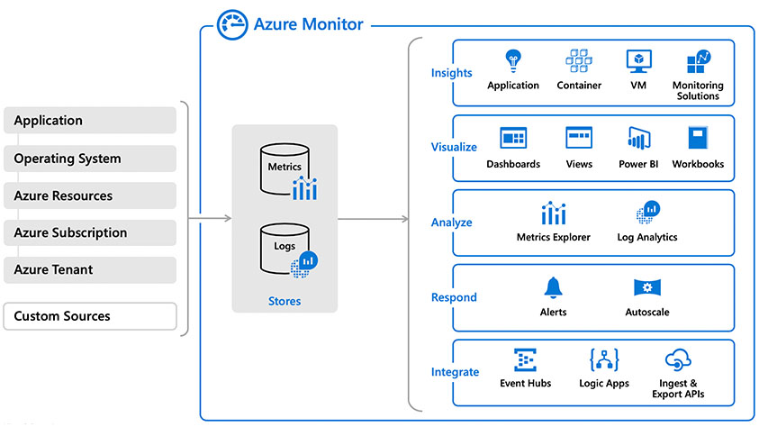

# 05 / Monitoring

Once the application and database are deployed, the next phase is to manage the new cloud-based data workload and supporting resources. Microsoft proactively performs the necessary monitoring and actions to ensure the databases are highly available and performed at the expecting level.

## Overview

Proper monitoring management helps with the following:

- Understanding the resource utilization
- Workload connection metric analysis
- Failure analysis and remediation
- Environment performance analysis and scaling adjustments
- Historical performance review

Azure has the ability to monitor all of these types of operational activities using tools such as [Azure Monitor](https://docs.microsoft.com/azure/azure-monitor/overview), [Log Analytics](https://docs.microsoft.com/azure/azure-monitor/platform/design-logs-deployment), and [Azure Sentinel](https://docs.microsoft.com/azure/sentinel/overview). In addition to the Azure-based tools, external security information and event management (SIEM) systems can be configured to consume these logs as well.

Alerts should be created to warn administrators of outages, operational performance problems, or any suspicious activity. If a particular alert event has a well-defined remediation path, alerts can fire automated [Azure runbooks](https://docs.microsoft.com/azure/automation/automation-quickstart-create-runbook) to address and resolve the event automatically.

This chapter will be focused on these monitoring concepts:

- Azure Monitor overview and strategy

- Application monitoring

- Database monitoring
  
- Alerts and strategies

### Azure Monitor overview

Azure Monitor is the Azure native platform service that provides a centralized area for monitoring your Azure resources. It monitors all layers of the Azure stack, starting with tenant services, such as Azure Active Directory, subscription-level events and Azure Service Health.

At the lower levels, it monitors infrastructure resources, such as VMs, storage, and network resources. Administrators and developers employ Azure Monitor to consolidate metrics about the performance and reliability of their various cloud layers, including Azure Database for MySQL Flexible Server instances. Management tools, such as those in Microsoft Defender for Cloud and Azure Automation, also push log data to Azure Monitor. The service aggregates and stores this telemetry in a log data store that’s optimized for cost and performance.

For more information on what can be monitored, read: [What is monitored by Azure Monitor?](https://docs.microsoft.com/en-us/azure/azure-monitor/monitor-reference)

## Define your monitoring strategy

Administrators should [plan their monitoring strategy](https://docs.microsoft.com/azure/azure-monitor/best-practices-plan) and resource configuration for the best results. Some data collection and features are free while others have associated costs. Focus on maximizing your applications' performance and reliability. Identify the data and logs that indicate the highest potential signs of failure to optimize costs. See [Azure Monitor Pricing](https://azure.microsoft.com/pricing/details/monitor/) for more information on planning monitoring costs.
