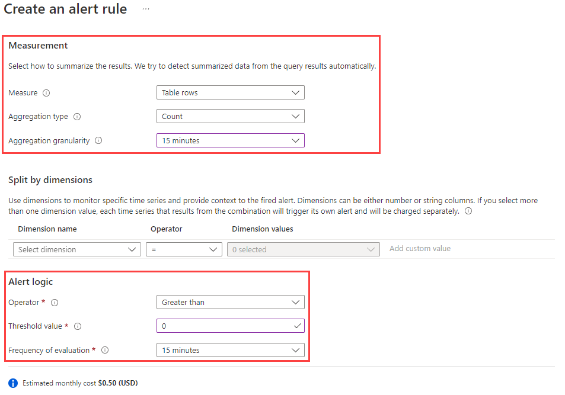
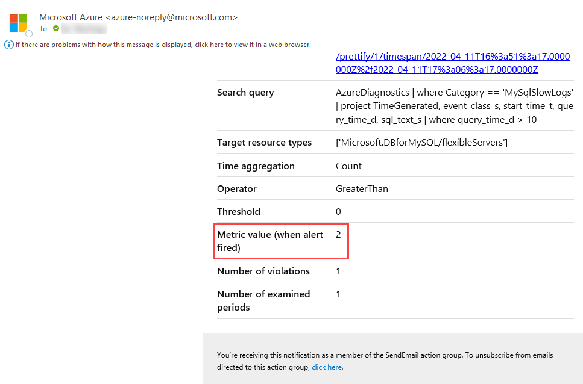

## Alerting

Once the monitoring rules have been created, alerts should be created. The operations team will want to know as quickly as possible when a pending outage or system issue is developing. Understanding the symptoms is critical. *"You can't fix what you don't know is broken."*

Alert creation will take fine tuning. Focus less on integrating monitoring with IT Service Management (ITSM) systems for Incident Management, and seize new opportunities that let cloud automation replace more expensive service management processes, thereby eliminating incidents.

**Consider the following principles for determining whether a symptom is an appropriate candidate for alerting:**

- Does it matter? Is the issue symptomatic of a real problem or issue influencing the overall health of the application? For example, does it matter whether the CPU utilization is high on the resource? Or that a particular SQL query running on a SQL database instance on that resource is consuming high CPU utilization over a sustained period? If the CPU utilization condition is a real issue, alerts should be fired when it occurs.  Although an alert will fire, the team will still need to determine what is causing the alert condition in the first place. Alerting and notifying on the SQL query process utilization issue is both relevant and actionable.

- Is it urgent? Is the issue real, and does it need urgent attention? If so, the responsible team should be immediately notified.

- Are your customers affected? Are users of the service or application affected as a result of the issue?

- Are other dependent systems affected? Are there alerts from dependencies that are interrelated, and that can possibly be correlated to avoid notifying different teams all working on the same problem?

Test and validate the assumptions in a nonproduction environment, and then deploy into production. Monitoring configurations are derived from known failure modes, test results of simulated failures, and experience from different members of the team.

Consider automating the remediation steps in Azure.

For more information: [Successful alerting strategy](https://docs.microsoft.com/en-us/azure/cloud-adoption-framework/manage/monitor/response#successful-alerting-strategy)

### Azure alerting concepts

#### Metric alerts

Metric alerts assess metric time-series according to defined conditions and take action. They consist of the following parts:

- **Alert rules** define the alert conditions. They require the following information:
  - The metric to monitor (e.g. `aborted_connections`)
  - An aggregation for the selected metric (e.g. `total`)
  - A threshold for the aggregated value (e.g. `10 connections`)
  - A time window for the aggregation (e.g. `30 minutes`)
  - A polling frequency to determine if the previous conditions are met (e.g. `5 minutes`)

- **Action groups** define notification actions, such as emailing or texting an administrator, and other actions to take, like calling a webhook or [Azure Automation Runbooks](https://docs.microsoft.com/azure/automation/automation-runbook-types)

- **Alert processing rules** is a *preview* feature that filters alerts as they are generated to modify the actions taken in response to that alert (i.e. by disabling action groups)

The image below demonstrates an Alert Rule and an Action Group configured to send an email message when 10 or more connections are aborted within a 30 minute period.


After initiating multiple failed connections to the Flexible Server instance, I receive the following warning on my configured notification email address.


#### Log alerts

Once KQL queries have been created to identify problems, the next step is to create [log alerts](https://docs.microsoft.com/azure/azure-monitor/platform/alerts-unified-log) from these queries. Log alerts periodically evaluate KQL queries and either use the number of records returned by the query or the results of a calculation based on the values of a column in the result set to fire an alert.

The alert I created uses the following KQL query, scoped to my Flexible Server instance, to poll the slow query log for queries longer than 10 seconds.

```kql
AzureDiagnostics
| where Category == 'MySqlSlowLogs'
| project
    TimeGenerated,
    event_class_s,
    start_time_t,
    query_time_d,
    sql_text_s 
| where query_time_d > 10
```

My alert rule aggregates the total number of rows returned by this query over a 15 minute period (**Aggregation granularity**). If one or more rows are returned, then the alert is fired. Azure Monitor evaluates this alert every 15 minutes (**Frequency of evaluation**).



Like metric alerts, log alerts support action groups. After executing a slow query against my MySQL instance, I receive an email on my configured action group email account. Two slow queries occurred over the 15 minute aggregation interval.



Note that it is possible to convert logs to metrics using KQL queries, and then create alerts against those metrics. Read more about this approach on the [Microsoft TechCommunity.](https://techcommunity.microsoft.com/t5/core-infrastructure-and-security/alert-based-on-log-to-metrics-feature-on-azure-monitor/ba-p/2749971)

### Best Practices with Alerting Metrics

Here are some scenarios of how aggregating metrics over time generates insights. Read the [Microsoft blog](https://azure.microsoft.com/blog/best-practices-for-alerting-on-metrics-with-azure-database-for-mysql-monitoring/) for more examples.

- If there were **10** or more failed connections (total of `aborted_connections` in Flexible Server) in the last **30** minutes, then send an email alert
  - This may indicate incorrect credentials or an SSL issue in the application

- If IOPS is **90%** or more of capacity (average of `io_consumption_percent` in Flexible Server) for at least **1** hour, then call a webhook
  - Excessive IO usage affects the performance of transactional workloads, so [scale storage to increase IOPS capacity or provision additional IOPS](https://docs.microsoft.com/azure/mysql/flexible-server/concepts-compute-storage)
  - See the linked CLI examples for automatic scaling based on metrics

### Webhooks

Webhook action groups send POST requests to configured webhook endpoints. Action groups can use the [common alert schema](https://docs.microsoft.com/azure/azure-monitor/alerts/alerts-common-schema) for webhook calls, or custom JSON payloads. This feature allows Azure Monitor to [integrate with incident management systems like PagerDuty](https://www.pagerduty.com/docs/guides/azure-integration-guide/), [call Logic Apps](https://docs.microsoft.com/azure/connectors/connectors-native-webhook), and [execute Azure Automation runbooks](https://docs.microsoft.com/azure/automation/automation-webhooks).

### Metrics resources

#### Azure CLI

Azure CLI provides the `az monitor` series of commands to manipulate action groups (`az monitor action-group`), alert rules and metrics (`az monitor metrics`), and more.

- [Azure CLI reference commands for Azure Monitor](https://docs.microsoft.com/cli/azure/azure-cli-reference-for-monitor)
- [Monitor and scale an Azure Database for MySQL Flexible Server using Azure CLI](https://docs.microsoft.com/azure/mysql/flexible-server/scripts/sample-cli-monitor-and-scale)

#### Azure Portal

While the Azure Portal does not provide automation capabilities like the CLI or the REST API, it does support configurable dashboards and provides a strong introduction to monitoring metrics in MySQL.


- [Set up alerts on metrics for Azure Database for MySQL - Flexible Server](https://docs.microsoft.com/azure/mysql/flexible-server/how-to-alert-on-metric)
- [Tutorial: Analyze metrics for an Azure resource](https://docs.microsoft.com/azure/azure-monitor/essentials/tutorial-metrics)

#### Azure Monitor REST API

The REST API allows applications to access metric values for integration with other applications or data storage systems, like Azure SQL Database. It also allows applications to manipulate alert rules.

To interact with the REST API, applications first need to obtain an authentication token from Azure Active Directory.

- [REST API Walkthrough](https://docs.microsoft.com/azure/azure-monitor/essentials/rest-api-walkthrough)
- [Azure Monitor REST API Reference](https://docs.microsoft.com/rest/api/monitor/)
