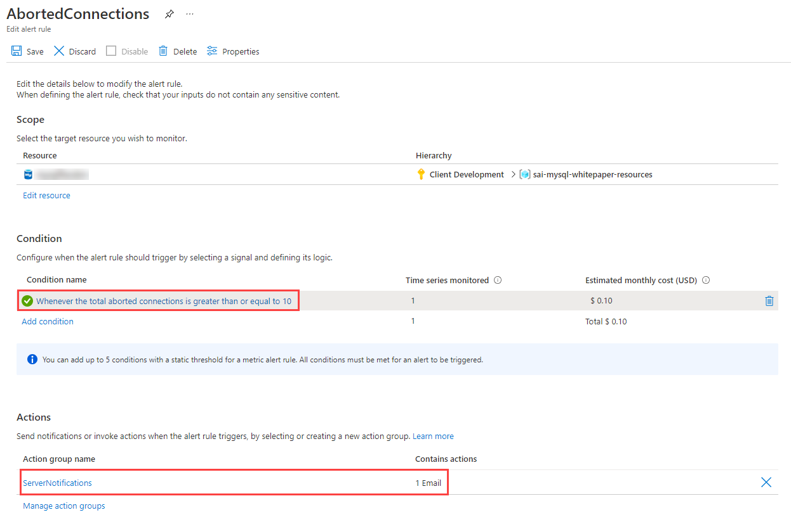

# Alerting

## Concepts

Once the KQL quires have been created, the next step is to create [log alerts](https://docs.microsoft.com/azure/azure-monitor/platform/alerts-unified-log) from these queries.

- **Alert rules** specify the metric to monitor (e.g. `aborted_connections`), an aggregation for that metric (e.g. the `total`), a threshold for the aggregated value (e.g. `10 connections`), a time window for the aggregation (e.g. `30 minutes`), and a polling frequency (e.g. check if the previous conditions are met every `5 minutes`)

- **Action groups** define notification actions, such as emailing or texting an administrator, and other actions to take, like calling a webhook or [Azure Automation Runbooks](https://docs.microsoft.com/azure/automation/automation-runbook-types)

- **Alert processing rules** is a *preview* feature that filters alerts as they are generated to modify the actions taken in response to that alert (i.e. by disabling action groups)

### Best Practices with Alerting Metrics

Here are some scenarios of how aggregating metrics over time generates insights. Read the [Microsoft blog](https://azure.microsoft.com/blog/best-practices-for-alerting-on-metrics-with-azure-database-for-mysql-monitoring/) for more examples.

- If there were **10** or more failed connections (total of `aborted_connections` in Flexible Server) in the last **30** minutes, then send an email alert
  - This may indicate incorrect credentials or an SSL issue in the application

- If IOPS is **90%** or more of capacity (average of `io_consumption_percent` in Flexible Server) for at least **1** hour, then call a webhook
  - Excessive IO usage affects the performance of transactional workloads, so [scale storage to increase IOPS capacity or provision additional IOPS](https://docs.microsoft.com/azure/mysql/flexible-server/concepts-compute-storage)
  - See the linked CLI examples for automatic scaling based on metrics

## Webhooks

Webhook action groups send POST requests to configured webhook endpoints. Action groups can use the [common alert schema](https://docs.microsoft.com/azure/azure-monitor/alerts/alerts-common-schema) for webhook calls, or custom JSON payloads. This feature allows Azure Monitor to [integrate with incident management systems like PagerDuty](https://www.pagerduty.com/docs/guides/azure-integration-guide/), [call Logic Apps](https://docs.microsoft.com/azure/connectors/connectors-native-webhook), and [execute Azure Automation runbooks](https://docs.microsoft.com/azure/automation/automation-webhooks).

## Metrics resources

### Azure CLI

Azure CLI provides the `az monitor` series of commands to manipulate action groups (`az monitor action-group`), alert rules and metrics (`az monitor metrics`), and more.

- [Azure CLI reference commands for Azure Monitor](https://docs.microsoft.com/cli/azure/azure-cli-reference-for-monitor)
- [Monitor and scale an Azure Database for MySQL Flexible Server using Azure CLI](https://docs.microsoft.com/azure/mysql/flexible-server/scripts/sample-cli-monitor-and-scale)

### Azure Portal

While the Azure Portal does not provide automation capabilities like the CLI or the REST API, it does support configurable dashboards and provides a strong introduction to monitoring metrics in MySQL.

- [Set up alerts on metrics for Azure Database for MySQL - Flexible Server](https://docs.microsoft.com/azure/mysql/flexible-server/how-to-alert-on-metric)
- [Tutorial: Analyze metrics for an Azure resource](https://docs.microsoft.com/azure/azure-monitor/essentials/tutorial-metrics)

### Azure Monitor REST API

The REST API allows applications to access metric values for integration with other applications or data storage systems, like Azure SQL Database. It also allows applications to manipulate alert rules.

To interact with the REST API, applications first need to obtain an authentication token from Azure Active Directory.

- [REST API Walkthrough](https://docs.microsoft.com/azure/azure-monitor/essentials/rest-api-walkthrough)
- [Azure Monitor REST API Reference](https://docs.microsoft.com/rest/api/monitor/)

## Sample - Azure Portal

In this example, I configured an alert rule called **AbortedConnections** on the Flexible Server instance I provisioned previously. It fires an alert if there were 10 or more aborted connections in the last 30 minutes, polled at a frequency of five minutes. The alert files an action group called **ServerNotifications** that sends me an email.

After initiating multiple failed connections to the Flexible Server instance, I receive the following warning on my configured notification email address.

