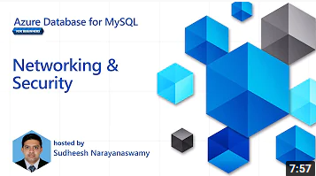
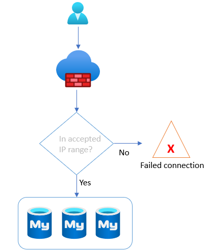

# 06 / Networking and Security

The Azure Database for MySQL network configuration can adversely affect security, application performance (latency), and compliance. This section explains the fundamentals of Azure Database for MySQL networking concepts.

Azure Database for MySQL provides several mechanisms to secure the networking layers by limiting access to only authorized users, applications, and devices.

Watch: [Networking and Security [6 of 16] | Azure Database for MySQL - Beginners Series](https://www.youtube.com/watch?v=LSNV5BW-g-U&list=PLlrxD0HtieHghqeFLMwaGxfxPbndt52Ap&index=6)

## Public vs. Private Access

As with any cloud-based resources, it can be exposed to the Internet or be locked down to only be accessible by Azure connections resources. However, it does not have to be just Azure-based resources.  VPNs and Express route circuits can be used to provide access to Azure resources from on-premises environments. The following section describes how to configure Azure Database for MySQL instances for network connectivity.

### Public Access

By default, Azure Database for MySQL allows access to internet-based clients, including other Azure services. If this is an undesirable state, firewall access control lists (ACLs) can limit access to hosts that fall within the allowed trusted IP address ranges.

The first line of defense for protecting a MySQL instance access is to implement [firewall rules](https://docs.microsoft.com/azure/mysql/concepts-firewall-rules). IP addresses can be limited to only valid locations when accessing the instance via internal or external IPs. If a MySQL instance's purpose is to serve internal applications, then [restrict public access](https://docs.microsoft.com/azure/mysql/howto-deny-public-network-access).

Firewall rules are set at the server level, meaning that they govern network access to all databases on the server instance. While it is best practice to create rules that allow specific IP addresses or ranges to access the instance, developers can also enable network access from all Azure resources. This feature is useful for Azure services without fixed public IP addresses, such as [Azure Functions](https://docs.microsoft.com/azure/azure-functions/functions-overview) that use public networks to access the server and databases.

>**Note:** Restricting access to Azure public IP addresses still provides network access to the instance to public IPs owned by other Azure customers.

- Flexible Server
  - [Manage firewall rules for Azure Database for MySQL - Flexible Server using the Azure portal](https://docs.microsoft.com/azure/mysql/flexible-server/how-to-manage-firewall-portal)
  - [Manage firewall rules for Azure Database for MySQL - Flexible Server using Azure CLI](https://docs.microsoft.com/azure/mysql/flexible-server/how-to-manage-firewall-cli)
  - [ARM Reference for Firewall Rules](https://docs.microsoft.com/azure/templates/microsoft.dbformysql/flexibleservers/firewallrules?tabs=json)
- Single Server
  - [Create and manage Azure Database for MySQL firewall rules by using the Azure portal](https://docs.microsoft.com/azure/mysql/howto-manage-firewall-using-portal)
  - [Create and manage Azure Database for MySQL firewall rules by using the Azure CLI](https://docs.microsoft.com/azure/mysql/howto-manage-firewall-using-cli)
  - [ARM Reference for Firewall Rules](https://docs.microsoft.com/azure/templates/microsoft.dbformysql/servers/firewallrules?tabs=json)

### Private Access

As mentioned, Azure Database for MySQL supports public connectivity by default. However, most organizations will utilize private connectivity to limit access to Azure virtual networks and resources.

> **Note:** There are many other [basic Azure Networking considerations](https://docs.microsoft.com/azure/mysql/concepts-data-access-and-security-vnet) that must be taken into account that are not the focus of this guide.

## Virtual Network Hierarchy

An Azure virtual network is similar to a on-premises network. It provides network isolation for workloads. Each virtual network has a private IP allocation block. Choosing an allocation block is an important consideration, especially if the environment requires multiple virtual networks to be joined.

> **Warning:**  The allocation blocks of the virtual networks cannot overlap. It is best practice to choose allocation blocks from [RFC 1918.](https://datatracker.ietf.org/doc/html/rfc1918)

> **Note**: When deploying a resource such as a VM into a virtual network, the virtual network must be located in the same region and Azure subscription as the Azure resource. Review the [Introduction to Azure](../02_IntroToMySQL/02_02_Introduction_to_Azure.md) document for more information about regions and subscriptions.

Each virtual network is further segmented into subnets. Subnets improve virtual network organization and security, just as they do on-premises.

When moving an application to Azure along with the MySQL workload, there will likely multiple virtual networks set up in a hub and spoke pattern that will require [Virtual Network Peering](https://docs.microsoft.com/azure/virtual-network/virtual-network-peering-overview) to be configured. Virtual networks are joined through *peering*. The peered virtual networks can reside in the same or different Azure regions.

Lastly, it is possible to access resources in a virtual network from on-premises. Some organizations opt to use VPN connections through [Azure VPN Gateway](https://docs.microsoft.com/azure/vpn-gateway/vpn-gateway-about-vpngateways), which sends encrypted traffic over the Internet. Others opt for [Azure ExpressRoute](https://docs.microsoft.com/azure/expressroute/expressroute-introduction), which establishes a private connection to Azure through a service provider.

For more information on Virtual Networks, reference the following:

- [Introduction to Azure Virtual Networks](https://docs.microsoft.com/learn/modules/introduction-to-azure-virtual-networks/)
- Creating virtual networks
  - [Portal](https://docs.microsoft.com/azure/virtual-network/quick-create-portal)
  - [PowerShell](https://docs.microsoft.com/azure/virtual-network/quick-create-powershell)
  - [CLI](https://docs.microsoft.com/azure/virtual-network/quick-create-cli)
  - [ARM Template](https://docs.microsoft.com/azure/virtual-network/quick-create-template)

### Flexible Server

Flexible Server supports deployment into a virtual network for secure access. When enabling virtual network integration, the target virtual network subnet must be *delegated*, meaning that it can only contain Flexible Server instances. Because Flexible Server is deployed in a subnet, it will receive a private IP address. To resolve the DNS names of Azure Database for MySQL instances, the virtual networks are integrated with a private DNS zone to support domain name resolution for the Flexible Server instances.

>**Note**: If the Flexible Server client, such as a VM, is located in a peered virtual network, then the private DNS zone created for the Flexible Server must also be integrated with the peered virtual network.

>**Note**: Private DNS zone names must end with mysql.database.azure.com. If you are connecting to the Azure Database for MySQL - Flexible sever with SSL and are using an option to perform full verification (sslmode=VERTIFY_IDENTITY) with certificate subject name, use <servername>.mysql.database.azure.com in your connection string.

See: [Private DNS zone overview](https://docs.microsoft.com/azure/dns/private-dns-overview)

For more information on configuring Private Access for Flexible Server, reference the following:

- [Azure Portal](https://docs.microsoft.com/azure/mysql/flexible-server/how-to-manage-virtual-network-portal)
- [Azure CLI](https://docs.microsoft.com/azure/mysql/flexible-server/how-to-manage-virtual-network-cli)

## Networking best practices for Flexible Server

- If deploying an application in an Azure region that supports *Availability Zones*, deploy the application and the Flexible Server instance in the same zone to minimize latency.

> For a review of availability zones, consult the [Introduction to Azure Database for MySQL](../02_IntroToMySQL/02_03_Azure_MySQL.md) document.

- Organize the components of the application into multiple virtual networks, such as in a [hub and spoke configuration.](https://docs.microsoft.com/azure/architecture/reference-architectures/hybrid-networking/hub-spoke?tabs=cli) Employ virtual network peering or VPN Gateways to join the application's virtual networks.

- Configure data protection at rest and in motion (see the [Security and Compliance document](03_MySQL_Security_Compliance.md)).

- [General Azure Networking Best Practices](https://docs.microsoft.com/azure/cloud-adoption-framework/migrate/azure-best-practices/migrate-best-practices-networking)
  - Determine IP addressing and subnetting.
  - Determine DNS setup and whether forwarders are needed.
  - Employ tools like network security groups to secure traffic within and between subnets.
