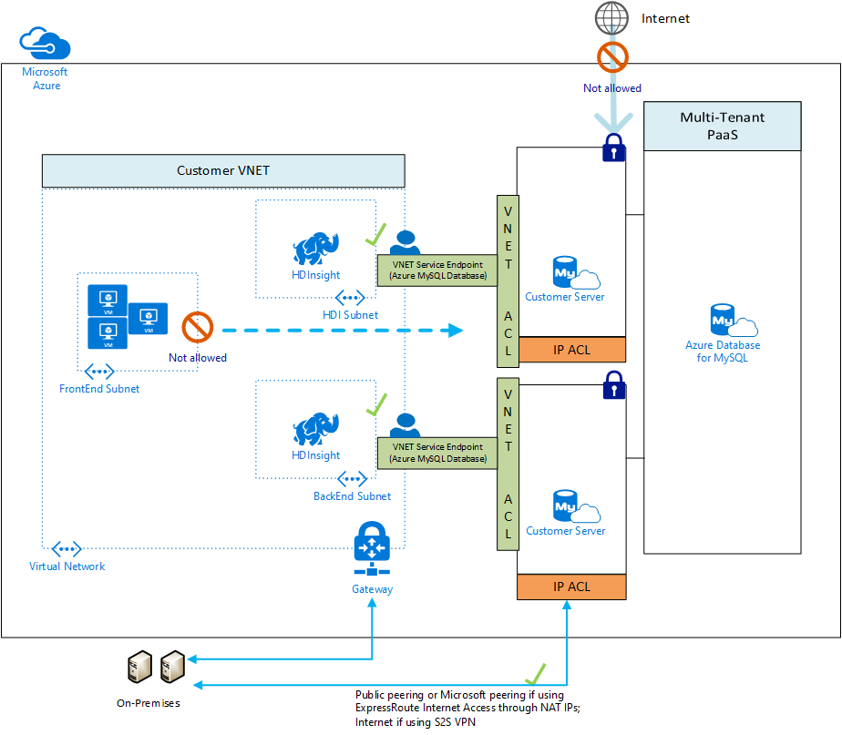
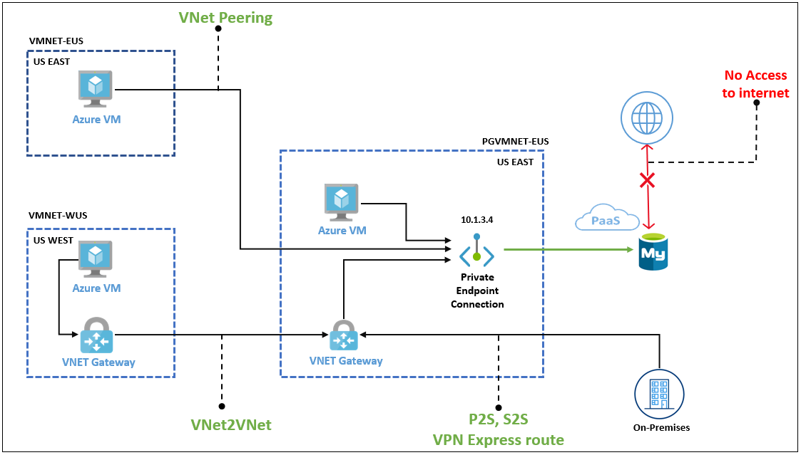

# Networking and connectivity options

As mentioned previously, network configuration affects security, application performance (latency), and compliance. This section explains the fundamentals of PaaS MySQL networking.

## Public vs. Private Access

### Public Access

Public access allows hosts, including Azure services, to access the PaaS MySQL instance via the public internet. Firewall ACLs limit access to hosts that fall within the allowed IP address ranges. They are set at the server level, meaning that they govern network access to all databases on the instance. While it is best practice to create rules that allow specific IP addresses or ranges to access the instance, developers can enable network access from all Azure public IP addresses. This is useful for Azure services without fixed public IP addresses, such as [Azure Functions](https://docs.microsoft.com/azure/azure-functions/functions-overview) that use public access.

> Restricting access to Azure public IP addresses still provides network access to the instance to public IPs owned by other Azure customers.

## Private Link

Both MySQL PaaS offerings support public connectivity, which permits certain hosts to access the instance over the public internet.  However most organization will want to utilize private connectivity which limits access to an Azure virtual network deployment. The difference between public and private access is addressed in the [network security document.](./06_01_Networking.md)

To limit access to the Azure Database for MySQL to internal Azure resources, enable [Private Link](https://docs.microsoft.com/azure/mysql/concepts-data-access-security-private-link).  Private Link will ensure that the MySQL instance will be assigned a private IP rather than a public IP address.

> **Note:** There are many other [basic Azure Networking considerations](https://docs.microsoft.com/azure/mysql/concepts-data-access-and-security-vnet) that must be taken into account that are not the focus of this guide.

Review a set of potential [security baseline](https://docs.microsoft.com/azure/mysql/security-baseline) tasks that can be implemented across all Azure resources. Not all of the items described on the reference link will apply to the specific data workloads or Azure resources.

### Configuring Public Access Guides

- Single Server
  - [Azure Portal](https://docs.microsoft.com/azure/mysql/howto-manage-firewall-using-portal)
  - [Azure CLI](https://docs.microsoft.com/azure/mysql/howto-manage-firewall-using-cli)
  - [ARM Reference for Firewall Rules](https://docs.microsoft.com/azure/templates/microsoft.dbformysql/servers/firewallrules?tabs=json)
- Flexible Server
  - [Azure Portal](https://docs.microsoft.com/azure/mysql/flexible-server/how-to-manage-firewall-portal)
  - [Azure CLI](https://docs.microsoft.com/azure/mysql/flexible-server/how-to-manage-firewall-cli)
  - [ARM Reference for Firewall Rules](https://docs.microsoft.com/azure/templates/microsoft.dbformysql/flexibleservers/firewallrules?tabs=json)

### Private Access

#### Virtual Network Hierarchy

An Azure virtual network is similar to a network deployed on-premises: it provides network isolation for workloads. Each virtual network has a private IP allocation block. Choosing an allocation block is an important consideration, especially if the environment requires multiple virtual networks to be joined: the allocation blocks of the virtual networks cannot overlap. It is best practice to choose allocation blocks from [RFC 1918.](https://datatracker.ietf.org/doc/html/rfc1918)

> **Note**: When deploying a resource such as a VM into a virtual network, the virtual network must be located in the same region and Azure subscription as the Azure resource. Review the [Introduction to Azure](../02_IntroToMySQL/02_02_Introduction_to_Azure.md) document for more information about regions and subscriptions.

Each virtual network is further segmented into subnets. Subnets improve virtual network organization and security, just as they do on-premises.

Virtual networks are joined through *peering*. The peered virtual networks can reside in the same or different Azure regions.

Lastly, note that it is possible to access resources in a virtual network from on-premises. Some organizations opt to use VPN connections through [Azure VPN Gateway](https://docs.microsoft.com/azure/vpn-gateway/vpn-gateway-about-vpngateways), which sends encrypted traffic over the Internet. Others opt for [Azure ExpressRoute](https://docs.microsoft.com/azure/expressroute/expressroute-introduction), which establishes a private connection to Azure through a service provider.

##### More Information on Virtual Networks

- [Introduction to Azure Virtual Networks](https://docs.microsoft.com/learn/modules/introduction-to-azure-virtual-networks/)
- Creating virtual networks
  - [Portal](https://docs.microsoft.com/azure/virtual-network/quick-create-portal)
  - [PowerShell](https://docs.microsoft.com/azure/virtual-network/quick-create-powershell)
  - [CLI](https://docs.microsoft.com/azure/virtual-network/quick-create-cli)
  - [ARM Template](https://docs.microsoft.com/azure/virtual-network/quick-create-template)

#### Flexible Server

Flexible Server supports deployment into a virtual network for secure access. Specifically, the target subnet must be *delegated*, meaning that it can only contain Flexible Server instances. Because Flexible Server is deployed in the virtual network, it has a private IP address. Virtual networks can be integrated with a private DNS zone to support name resolution for the Flexible Server instance.

> **Note**: If the Flexible Server client, such as a VM, is located in a peered virtual network, then the private DNS zone created for the Flexible Server must also be integrated with the peered virtual network.

##### Configuring Private Access for Flexible Server

- [Azure Portal](https://docs.microsoft.com/azure/mysql/flexible-server/how-to-manage-virtual-network-portal)
- [Azure CLI](https://docs.microsoft.com/azure/mysql/flexible-server/how-to-manage-virtual-network-cli)

#### Single Server

Private Access from Single Server can be accomplished through (1) *Service Endpoints* or (2) *Private Link*; Single Server does not natively support virtual networks like Flexible Server. Both of these methods require the General Purpose or Memory Optimized tier.

Service Endpoints only allow traffic from a given virtual network to access MySQL Single Server. Service endpoints are intended for Azure resources without public IPs, like VMs deployed in a virtual network, to access PaaS services securely. However, traffic leaves the virtual network, as shown in the image below, and access still occurs through the service public endpoint. In this image, `HDISubnet` and `BackEndSubnet` have been configured for access by ACLs in the Single Server instances, but `FrontEndSubnet` has not.

Private Link uses *Private Endpoints* to replace public resource endpoints with private network interfaces accessible through private IP addresses. Unlike Service Endpoints, all network traffic is contained within the virtual network.

In the image below, since public access is disabled, access can only occur through the private endpoint in the `PGVMNET-EUS` virtual network. Other Azure virtual networks, including those in other regions, like `VMNET-WUS`, can be peered to the virtual network with the private endpoint. On-premises networks can also be joined to Azure virtual networks, as explained previously.

##### Configuring Private Access for Single Server

- Service Endpoints
  - [Portal](https://docs.microsoft.com/azure/mysql/howto-manage-vnet-using-portal)
  - [CLI](https://docs.microsoft.com/azure/mysql/howto-manage-vnet-using-cli)
- Private Link
  - [Portal](https://docs.microsoft.com/azure/mysql/howto-configure-privatelink-portal)
  - [CLI](https://docs.microsoft.com/azure/mysql/howto-configure-privatelink-cli)

## Networking Best Practices for Flexible Server

- If deploying an application in an Azure region that supports *Availability Zones*, deploy the application and the Flexible Server instance in the same zone to minimize latency

> For a review of availability zones, consult the [Introduction to Azure Database for MySQL](../02_IntroToMySQL/02_03_Azure_MySQL.md) document.

- Organize the components of the application into multiple virtual networks, such as in a [hub and spoke configuration.](https://docs.microsoft.com/azure/architecture/reference-architectures/hybrid-networking/hub-spoke?tabs=cli) Employ virtual network peering or VPN Gateways to join the application's virtual networks.

- Configure data protection at rest and in motion (see the [Security and Compliance document](03_MySQL_Security_Compliance.md)).

- [General Azure Networking Best Practices](https://docs.microsoft.com/azure/cloud-adoption-framework/migrate/azure-best-practices/migrate-best-practices-networking)
  - Determine IP addressing & subnetting
  - Determine DNS setup and whether forwarders are needed
  - Employ tools like network security groups to secure traffic within and between subnets
