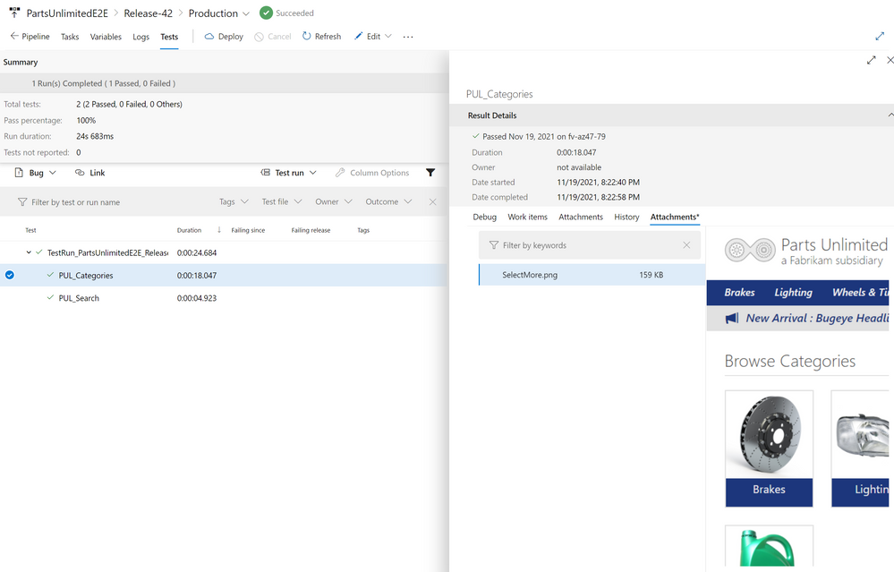
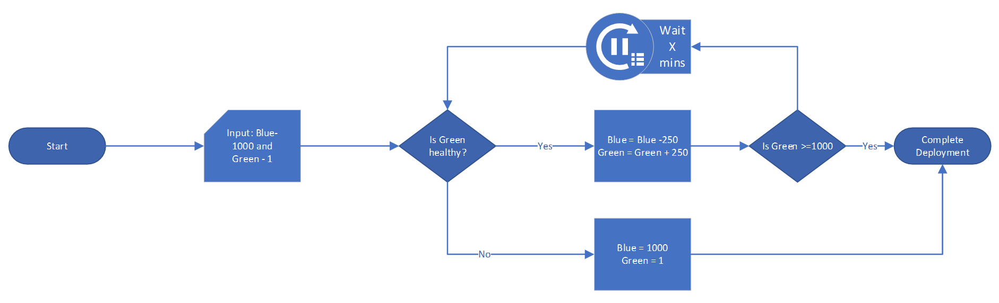
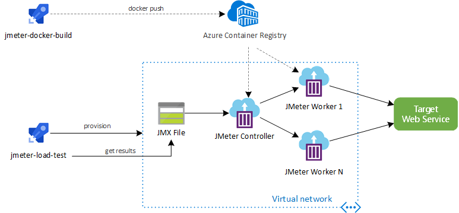

# 07 / Testing

Developers need to assess their applications for *availability* (minimal downtime) and *resiliency* (recovery from failure). Microsoft recommends performing tests regularly and automating them to minimize errors (perhaps by placing tests in build processes).

## Approaches

### Functional testing

Functional testing ensures that an app functions as documented in the requirements. Testers do not know how software systems function; they simply ensure that systems do what they are expected to do. Functional tests validate data limits (like field lengths) and that certain actions are taken in response to triggers.

#### Function testing tools

[Selenium](https://www.selenium.dev/) automates functional tests for web apps. Developers author test scripts in supported languages, like Ruby, Java, Python, and C#. Then, the Selenium WebDriver executes these scripts using browser-specific APIs. Teams can operate parallel Selenium tests on different devices using [Selenium Grid](https://www.selenium.dev/documentation/grid/).

To get started with Selenium, developers can install the [Selenium IDE](https://www.selenium.dev/selenium-ide/) to generate testing scripts from browser interactions. The Selenium IDE is not intended for production tests, however.

Teams can place [Selenium tests in Azure DevOps.](https://techcommunity.microsoft.com/t5/testingspot-blog/continuous-testing-with-selenium-and-azure-devops/ba-p/3143366) The image below demonstrates screenshots from a Selenium test running in a DevOps Pipeline.

### Resiliency and version testing

Testers can only execute so many test cases.  Users tend to execute application functionality not imagined by the development/test team. How do you allow real users to test the application while limiting deployment downtime and version risk? One strategy to test for resiliency is the blue-green method, where the latest version of an application operates in a second production environment. Developers test the most recent version in the second production environment by adding some production users to the new version. If the new version functions adequately, the second environment begins handling more production user requests. If an unexpected error occurs, developers can roll back the application by serving requests from the older environment.

>  **Tip:** As newer versions of an application often require database updates, it is recommended to update the database to support the new and previous versions of the software before deploying application updates to the second environment.

Azure has the capability to support this type of testing via Deployment Center, Azure Traffic Manager, and other tools.

Blue-green deployment options

- [Deployment Center example](https://docs.microsoft.com/azure/app-service/deploy-github-actions?tabs=applevel)
- [Azure Traffic Manager example](https://azure.microsoft.com/en-us/blog/blue-green-deployments-using-azure-traffic-manager/)
- [Application Gateway example](https://techcommunity.microsoft.com/t5/apps-on-azure-blog/upgrading-aks-version-with-blue-green-deployment-i/ba-p/2527145)

### Performance testing
#### Load testing

Load testing determines an application's performance as load increases. Load testing tools typically simulate users or requests, and they help companies meet their SLAs. Proper load testing requires knowledge of the load a production system normally experiences and potential Azure service limits (e.g. [Event Hub throughput by tier](https://docs.microsoft.com/azure/event-hubs/event-hubs-quotas#basic-vs-standard-vs-premium-vs-dedicated-tiers)).

#### Stress testing

Stress testing determines the maximum load a system can handle before failure. Perform stress testing at different Azure service tiers and determine appropriate thresholds when scaling is necessary to minimize costs and provide a positive user experience.

#### Performance testing tools

### Apache JMeter

[Apache JMeter](https://jmeter.apache.org/) is an open source tool to test that systems function and perform well under load. It can test web applications, REST APIs, databases, and more. JMeter provides a GUI and a CLI, and it can export test results in a variety of formats, including HTML and JSON.

The image below demonstrates one approach to operate JMeter at scale using Azure Container Instances. The `jmeter-load-test` pipeline manages the test infrastructure and provides the test definition to the **JMeter Controller**.

It is also possible to run JMeter load tests using [Azure Load Testing Preview.](https://docs.microsoft.com/azure/load-testing/quickstart-create-and-run-load-test)

### K6

[Grafana K6](https://k6.io/) is a load testing tool hosted locally or in the cloud. Developers script tests using ES6 JavaScript. Supporting over 20 integrations, including [Azure DevOps Pipelines](https://techcommunity.microsoft.com/t5/azure-devops/load-testing-with-azure-devops-and-k6/m-p/2489134), K6 is a popular choice for many teams.

## Testing data capture tools

### Azure Monitor

Azure Monitor allows developers to collect, analyze, and act on telemetry. *Application Insights*, a subset of Azure Monitor, tracks application performance, usage patterns and issues. It integrates with common development tools, like Visual Studio. Similarly, *Container insights* measures the performance of container workloads running on Kubernetes clusters. These powerful tools are backed by Azure Log Analytics workspaces and the Azure Monitor metrics store.

The image below demonstrates container logs from a containerized deployment of the ContosoNoshNow sample app running in AKS. These logs are analyzed in the cluster's Log Analytics workspace.

The image below demonstrates the cluster's maximum CPU usage over a half-hour period. It utilizes metrics provided by AKS, though more granular metrics from Container insights can also be used.

#### Resources

- [Supported languages for Azure App Insights](https://docs.microsoft.com/azure/azure-monitor/app/platforms)
- Comparison of *metrics* and *logs* in Azure Monitor
  - [Azure Monitor Metrics overview](https://docs.microsoft.com/azure/azure-monitor/essentials/data-platform-metrics)
  - [Azure Monitor Logs overview](https://docs.microsoft.com/azure/azure-monitor/logs/data-platform-logs)
- [Monitoring Azure Kubernetes Service (AKS) with Azure Monitor](https://docs.microsoft.com/azure/aks/monitor-aks#scope-of-the-scenario)

### Grafana & Prometheus

Prometheus is a powerful tool for developers to capture metrics, store them in a time-series database on disk, and analyze them through a custom query language. However, due to the storage of metrics on disk, Prometheus is not ideal for long-term retention.

Grafana is a visualization tool to create customizable dashboards from time-series databases. These visualizations supplement the raw metrics exposed by services such as Prometheus.

The image below demonstrates two charts in Grafana demonstrating the CPU usage of a Laravel pod in the Contoso Nosh Now AKS deployment. The `requests` and `limits` values were supplied in the Kubernetes deployment file.

### Recommended Content

- [Using Azure Kubernetes Service with Grafana and Prometheus](https://techcommunity.microsoft.com/t5/apps-on-azure-blog/using-azure-kubernetes-service-with-grafana-and-prometheus/ba-p/3020459)
- [Prometheus Overview](https://prometheus.io/docs/introduction/overview)
- [What is Grafana OSS](https://grafana.com/docs/grafana/latest/introduction/oss-details/)
- [Store Prometheus Metrics with Thanos, Azure Storage and Azure Kubernetes Service (AKS)](https://techcommunity.microsoft.com/t5/apps-on-azure-blog/store-prometheus-metrics-with-thanos-azure-storage-and-azure/ba-p/3067849)

- [What are Azure Pipelines?](https://docs.microsoft.com/en-us/azure/devops/pipelines/get-started/what-is-azure-pipelines?view=azure-devops#:~:text=Azure%20Pipelines%20automatically%20builds%20and,ship%20it%20to%20any%20target)

- [What is Azure Load Testing?](https://docs.microsoft.com/en-us/azure/load-testing/overview-what-is-azure-load-testing?wt.mc_id=loadtesting_acompara4_webpage_cnl)
