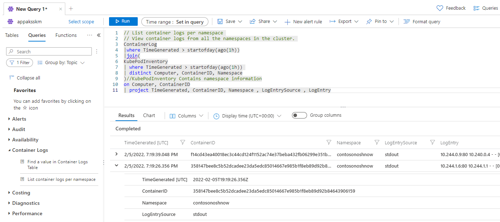
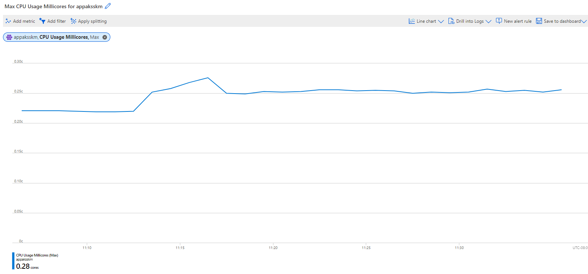
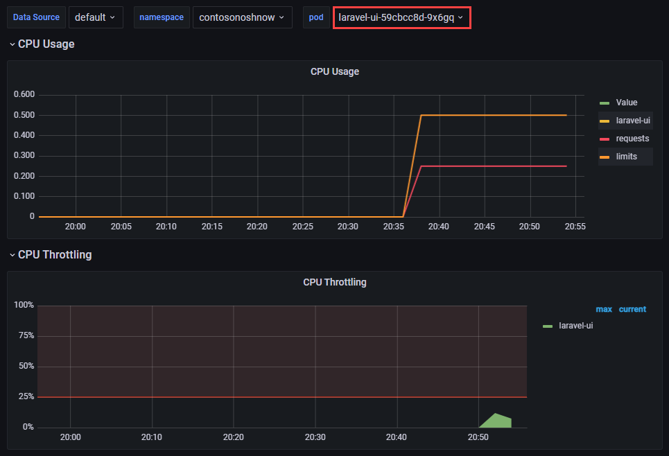

# 07 / Testing

Developers need to assess their applications for *availability* (minimal downtime) and *resiliency* (recovery from failure). Microsoft recommends performing tests regularly and automating them to minimize errors (perhaps by placing tests in build processes).

## Approaches

### Resiliency testing

One strategy to test for resiliency is the blue-green method, where the latest version of an application operates in a second production environment. Developers test the most recent version in the second production environment, and if it functions adequately, the second environment begins handling user requests. If an unexpected error occurs, developers can roll back the application by serving requests from the older environment. As newer versions of an application often require database updates, it is recommended to update the database to support the new and previous versions of the software before deploying application updates to the second environment.

### Performance testing

#### Load testing

Load testing determines an application's performance as load increases. Load testing tools typically simulate users or requests, and they help companies meet their SLAs. Proper load testing requires knowledge of the load a production system normally experiences and potential Azure service limits (e.g. [Event Hub throughput by tier](https://docs.microsoft.com/azure/event-hubs/event-hubs-quotas#basic-vs-standard-vs-premium-vs-dedicated-tiers)).

#### Stress testing

Stress testing determines the maximum load a system can handle before failure. Perform stress testing at different Azure service tiers and determine appropriate thresholds when scaling is necessary to minimize costs and provide a positive user experience.

## Tools

### Azure Monitor

Azure Monitor allows developers to collect, analyze, and act on telemetry. *Application Insights*, a subset of Azure Monitor, tracks application performance, usage patterns and issues. It integrates with common development tools, like Visual Studio. Similarly, *Container insights* measures the performance of container workloads running on Kubernetes clusters. These powerful tools are backed by Azure Log Analytics workspaces and the Azure Monitor metrics store.

The image below demonstrates container logs from a containerized deployment of the Contoso Nosh Now sample app running in AKS. These logs are analyzed in the cluster's Log Analytics workspace.

The image below demonstrates the cluster's maximum CPU usage over a half-hour period. It utilizes metrics provided by AKS, though more granular metrics from Container insights can also be used.

#### Resources

- [Supported languages for Azure App Insights](https://docs.microsoft.com/azure/azure-monitor/app/platforms)
- Comparison of *metrics* and *logs* in Azure Monitor
  - [Azure Monitor Metrics overview](https://docs.microsoft.com/azure/azure-monitor/essentials/data-platform-metrics)
  - [Azure Monitor Logs overview](https://docs.microsoft.com/azure/azure-monitor/logs/data-platform-logs)
- [Monitoring Azure Kubernetes Service (AKS) with Azure Monitor](https://docs.microsoft.com/azure/aks/monitor-aks#scope-of-the-scenario)

### Apache JMeter

TODO

### K6 

TODO

### Selenium

TODO

### Grafana & Prometheus

Prometheus is a powerful tool for developers to capture metrics, store them in a time-series database on disk, and analyze them through a custom query language. However, due to the storage of metrics on disk, Prometheus is not ideal for long-term retention.

Grafana is a visualization tool to create customizable dashboards from time-series databases. These visualizations supplement the raw metrics exposed by services such as Prometheus.

The image below demonstrates two charts in Grafana demonstrating the CPU usage of a Laravel pod in the Contoso Nosh Now AKS deployment. The `requests` and `limits` values were supplied in the Kubernetes deployment file.

#### Resources

- [Using Azure Kubernetes Service with Grafana and Prometheus](https://techcommunity.microsoft.com/t5/apps-on-azure-blog/using-azure-kubernetes-service-with-grafana-and-prometheus/ba-p/3020459)
- [Prometheus Overview](https://prometheus.io/docs/introduction/overview)
- [What is Grafana OSS](https://grafana.com/docs/grafana/latest/introduction/oss-details/)
- [Store Prometheus Metrics with Thanos, Azure Storage and Azure Kubernetes Service (AKS)](https://techcommunity.microsoft.com/t5/apps-on-azure-blog/store-prometheus-metrics-with-thanos-azure-storage-and-azure/ba-p/3067849)

### Web

### Database