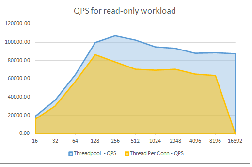

# Server Parameters

MySQL server parameters allow database architects and developers to optimize the MySQL engine for their specific application workloads. Azure Database for MySQL exposes a small subset of the overall parameters. Some parameters that cannot be configured at the server level can be configured at the connection level. Moreover, *dynamic* parameters can be changed without restarting the server, while modifying *static* parameters warrants a restart.

One of the advantages of Flexible Server is its versatility over single server instances. Some important exposed parameters are listed below, and the instance's storage and compute tiers affect the possible parameter values. Consult the [Microsoft documentation](https://docs.microsoft.com/azure/mysql/flexible-server/concepts-server-parameters) for more information.

- [log_bin_trust_function_creators](https://dev.mysql.com/doc/refman/8.0/en/replication-options-binary-log.html#sysvar_log_bin_trust_function_creators) is enabled by default and indicates whether users can create triggers

- [innodb_buffer_pool_size](https://dev.mysql.com/doc/refman/8.0/en/innodb-parameters.html#sysvar_innodb_buffer_pool_size) indicates the size of the buffer pool, a cache for tables and indexes

    > For this parameter, consult the [Microsoft documentation](https://docs.microsoft.com/en-us/azure/mysql/flexible-server/concepts-server-parameters), as database compute tier affects the parameter value range

- [innodb_file_per_table](https://dev.mysql.com/doc/refman/8.0/en/innodb-parameters.html#sysvar_innodb_file_per_table) affects where table and index data are stored

Azure Database for MySQL Single Server includes support for the three server parameters listed above. For a comprehensive list of Single Server's supported parameters, consult the [Microsoft documentation.](https://docs.microsoft.com/azure/mysql/concepts-server-parameters)

## Tools to Set Server Parameters

Standard Azure management tools, like the Azure portal, Azure CLI, and Azure PowerShell, allow for configuring Azure Database for MySQL server parameters.

### Flexible Server Articles

- [Azure portal](https://docs.microsoft.com/azure/mysql/flexible-server/how-to-configure-server-parameters-portal)
- [Azure CLI](https://docs.microsoft.com/azure/mysql/flexible-server/how-to-configure-server-parameters-cli)

### Single Server Articles

- [Azure portal](https://docs.microsoft.com/azure/mysql/howto-server-parameters)
- [Azure CLI](https://docs.microsoft.com/azure/mysql/howto-configure-server-parameters-using-cli)
- [Azure PowerShell](https://docs.microsoft.com/azure/mysql/howto-configure-server-parameters-using-powershell)

## Server Parameters Best Practices

The server parameters below may provide performance improvements for your application. However, before modifying these values in production, verify that they yield performance improvements without compromising application stability.

- Enable thread pooling by setting `thread_handling` to `pool-of-threads`: Thread pooling improves concurrency by serving connections through a pool of worker threads, instead of creating a new thread to serve each connection. Enabling thread pooling improves performance for transactional workloads, as connections are short-lived
  - The degree of concurrency is set through the `thread_pool_size` parameter
  - Only supported in MySQL 8.0

  

  The graph above, taken from the aforementioned TechCommunity post, demonstrates the performance improvements for a 16 vCore, 64 GiB memory Flexible Server instance. The x-axis represents the number of connections, and the y-axis represents the number of queries served per second (QPS). Read the associated [Microsoft TechCommunity post](https://techcommunity.microsoft.com/t5/azure-database-for-mysql-blog/achieve-up-to-a-50-performance-boost-in-azure-database-for-mysql/ba-p/2909691) for more details

- Enable InnoDB buffer pool warmup by setting `innodb_buffer_pool_dump_at_shutdown` to `ON`: InnoDB buffer pool warmup loads data files from disk after a restart and before receiving queries on that data. This improves the latency of the first queries executed against the database after a restart, but it does increase the server's start-up time
  - Microsoft only recommends this change for database instances with more than 335 GB of provisioned storage
  - Learn more from the [Microsoft documentation](https://docs.microsoft.com/azure/mysql/concept-performance-best-practices)