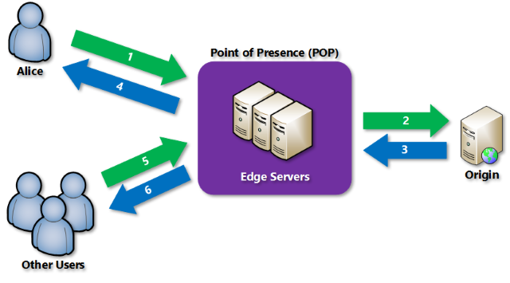

# Azure Content Delivery Network

An Azure Content Delivery Network (CDN) utilizes distributed point-of-presence (POP) servers to serve cached static web content and optimize the delivery of dynamic content to users. As shown in the diagram below, users request static content from their nearest POP, which will serve content from its cache. If the local POP servers do not have the desired asset, they will request the site (origin) web server and cache it for the time-to-live (TTL) period.

Azure CDN also supports dynamic site acceleration, which optimizes the network path from clients to the server through POP sites, prefetches images and scripts, and more.

## Using Azure CDN in Web Apps

Azure App Service natively supports integrating with Azure CDN. Refer to the digital marketing sample in the [MySQL architectures] section for a practical example involving Azure CDN and a content management system. For non-App Service workloads, Azure CDN is compatible with any public web server.
