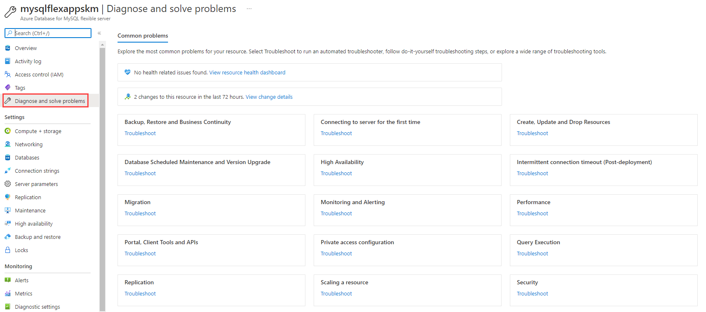
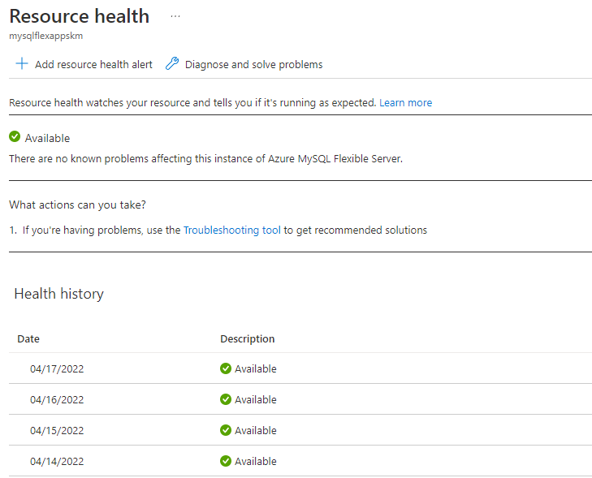

# 09 / Troubleshooting

As applications are running and executing in cloud environments it is always a possibility that something unexpected can occur. This section details a few common issues and the troubleshooting steps for each.

## Common MySQL issues

Debugging operational support issues can be time consuming. As previous discussed, configuring the right monitoring and alerting can help provide useful error messages and clues to the potential problem area(s).

### Unsupported MySQL features

Operating in a cloud environment means that certain features that function on-premises are incompatible with Azure Database for MySQL instances. While Flexible Server has better feature parity with on-premises MySQL than Single Server, it is important to be aware of any limitations.

- Azure Database for MySQL does not support the MySQL `SUPER` privilege and the `DBA` role. This may affect how some applications operate.
  - [Error 1419](https://dev.mysql.com/doc/mysql-errors/8.0/en/server-error-reference.html#error_er_binlog_create_routine_need_super): By default, MySQL instances with binary logging enabled for replication require function creators to have the `SUPER` privilege to avoid privilege escalation attacks.
    - **Resolution**: Azure suggest setting the `log_bin_trust_function_creators` parameter to `1`, as Azure insulates against threats that exploit the binary log.
  - [Error 1227](https://dev.mysql.com/doc/mysql-errors/8.0/en/server-error-reference.html#error_er_specific_access_denied_error): This error occurs when creating stored procedures or views with `DEFINER` statements.
    - **Resolution**: If you encounter this error while migrating schema objects from an on-premises MySQL instance, remove the `DEFINER` statements manually from the database dump.

- Direct file system access is not available to clients. This means that `SELECT ... INTO OUTFILE` commands are unsupported.

- Only the `InnoDB` and `MEMORY` storage engines are supported. This may affect older data warehousing and web applications based on the non-transactional `MyISAM` engine. Consult the [MySQL documentation](https://dev.mysql.com/doc/refman/8.0/en/converting-tables-to-innodb.html) to learn how to convert your MyISAM tables to InnoDB and make them run optimally.

### Connectivity issues

Both server misconfiguration issues and network access issues can prevent clients from connecting to a Azure Database for MySQL instance.

#### Misconfiguration

- [Error 1184](https://dev.mysql.com/doc/mysql-errors/8.0/en/server-error-reference.html#error_er_new_aborting_connection): This error occurs after a user authenticates with the database instance, but before they execute SQL statements. The `init_connect` server parameter includes statements that execute before sessions are initiated. Consequently, erroneous SQL statements in `init_connect` prevent clients from connecting.
  - **Resolution**: Reset the value of `init_connect` using the Azure portal or SQL.

- Administrators use the database admin user specified during server creation to create new databases and add new users. If the admin user credentials were not recorded, administrators can easily reset the admin password using the Azure portal.
  - Logging in with the administrator account can help debug other access issues, like confirming if a given user exists.

#### Network access issues

- By default, Flexible Server only supports encrypted connections through the TLS 1.2 protocol; clients using TLS 1.0 or 1.1 will be unable to connect unless explicitly enabled. If it is not possible to change the TLS protocol used by an application, then [change the Flexible Server instance's supported TLS versions.](https://docs.microsoft.com/azure/mysql/flexible-server/how-to-connect-tls-ssl)

- If connecting to Flexible Server via public access, ensure that firewall ACLs permit access from the client.

- Ensure that corporate firewalls do not block outbound connections to port 3306.

- Use a fully qualified domain name instead of an IP address in connection strings. This is especially important with Azure Database for MySQL Single Server instances, which use gateways to route incoming requests to database servers. It is possible to use the gateway public IP address in your applications.
  
  > **Warning:** However, as Microsoft plans to [retire older gateways](https://docs.microsoft.com/azure/mysql/concepts-connectivity-architecture#azure-database-for-mysql-gateway-ip-addresses), you are responsible for updating the gateway IP address in your applications. It is less error-prone to work with the FQDN.

- Use [Azure Network Watcher](https://docs.microsoft.com/azure/network-watcher/network-watcher-monitoring-overview) to debug traffic flows in virtual networks. Note that it does not support PaaS services, but it is still a useful tool for IaaS configurations
  - Network Watcher works well with other networking utilities, like the Unix `traceroute` tool

### Resource issues

If the application experiences transient connectivity issues, perhaps the resources of the Azure Database for MySQL instance are constrained. Monitor resource usage and determine whether the instance needs to be scaled up.

### Platform issues

- On occasion, Azure experiences outages. Use [Azure Service Health](https://azure.microsoft.com/features/service-health/) to determine if an Azure outage impacts MySQL workloads in your region or datacenter.

- Azure's periodic updates can impact the availability of applications. Flexible Server allows administrators [to set custom maintenance schedules.](https://docs.microsoft.com/azure/mysql/flexible-server/concepts-maintenance)

- Implement retry logic in your applications to mitigate transient connectivity issues:
  
  - To provide resiliency against more severe failures, like Azure service outages, implement the [circuit breaker pattern](https://docs.microsoft.com/azure/architecture/patterns/circuit-breaker) to avoid wasting application resources on operations that are likely to fail

## Troubleshoot app issues in Azure App Service

- **Enable web logging.** Azure provides built-in diagnostics to assist with [debugging an App Service app](https://docs.microsoft.com/en-us/azure/app-service/troubleshoot-diagnostic-logs).
- Network requests taking a long time? [Troubleshoot slow app performance issues in Azure App Service](https://docs.microsoft.com/en-us/azure/app-service/troubleshoot-performance-degradation)
- In Azure App Service, certain settings are available to the deployment or runtime environment as environment variables. Some of these settings can be customized when configuring the app settings.
[Environment variables and app settings in Azure App Service](https://docs.microsoft.com/azure/app-service/reference-app-settings?tabs=kudu%2Cdotnet)

- [Azure App Service on Linux FAQ](https://docs.microsoft.com/azure/app-service/faq-app-service-linux)

## App debugging

Following software development best practices makes your code simpler to develop, test, debug, and deploy. Here are some strategies to resolve application issues.

- Use logging utilities wisely to help troubleshoot failures without impairing app performance. Structured logging utilities, like PHP's native logging functions or third-party tools, such as [KLogger](https://github.com/katzgrau/KLogger), can write logs to the console, to files, or to central repositories. Monitoring tools can parse these logs and alert anomalies.

- In development environments, remote debugging tools like [XDebug](https://xdebug.org/docs/) may be useful. You can set breakpoints and step through code execution. [Apps running on Azure App Service PHP and Container instances can take advantage of XDebug.](https://azureossd.github.io/2020/05/05/debugging-php-application-on-azure-app-service-linux/)
  
  - Users of Visual Studio Code can install XDebug's [PHP Debug extension](https://marketplace.visualstudio.com/items?itemName=xdebug.php-debug).

- To debug slow PHP applications, consider using Application Performance Monitoring solutions like [Azure Application Insights](https://docs.microsoft.com/azure/azure-monitor/app/app-insights-overview), which integrates with Azure Monitor. Here are a few common culprits for low-performing PHP apps.
  - Executing database queries against tables that are indexed inefficiently
  - Configuring web servers poorly, such as by choosing a suboptimal number of worker processes to serve user requests
  - Disabling [opcode caching](https://www.php.net/manual/en/intro.opcache.php), requiring PHP to compile code files to opcodes every request

- Write tests to ensure that applications function as intended when code is modified. Review the [07 / Testing] document for more information about different testing strategies. Tests should be included in automated release processes.

- Generally, all cloud applications should include connection [retry logic](https://docs.microsoft.com/azure/architecture/patterns/retry), which typically responds to transient issues by initiating subsequent connections after a delay.

## Additional support

- In the Azure portal, navigate to the **Diagnose and solve problems** tab of your Azure Database for MySQL instance for suggestions regarding common connectivity, performance, and availability issues.

  

  This experience integrates with Azure Resource Health to demonstrate how Azure outages affect your provisioned resources.

  

- If none of the above resolve the issue with the MySQL instance, [send a support request from the Azure portal.](https://portal.azure.com/#blade/Microsoft_Azure_Support/HelpAndSupportBlade/overview)

## Opening a support ticket

If you need immediate assistance with an issue, [open a support ticket](https://portal.azure.com/#blade/Microsoft_Azure_Support/HelpAndSupportBlade/overview) with Microsoft.

## Recommended content

[Troubleshoot errors commonly encountered during or post migration to Azure Database for MySQL](https://docs.microsoft.com/en-us/azure/mysql/howto-troubleshoot-common-errors)

[Azure Community Support](https://azure.microsoft.com/support/community/) Ask questions, get answers, and connect with Microsoft engineers and Azure community experts

[Troubleshoot data encryption in Azure Database for MySQL](https://docs.microsoft.com/en-us/azure/mysql/howto-data-encryption-troubleshoot)
