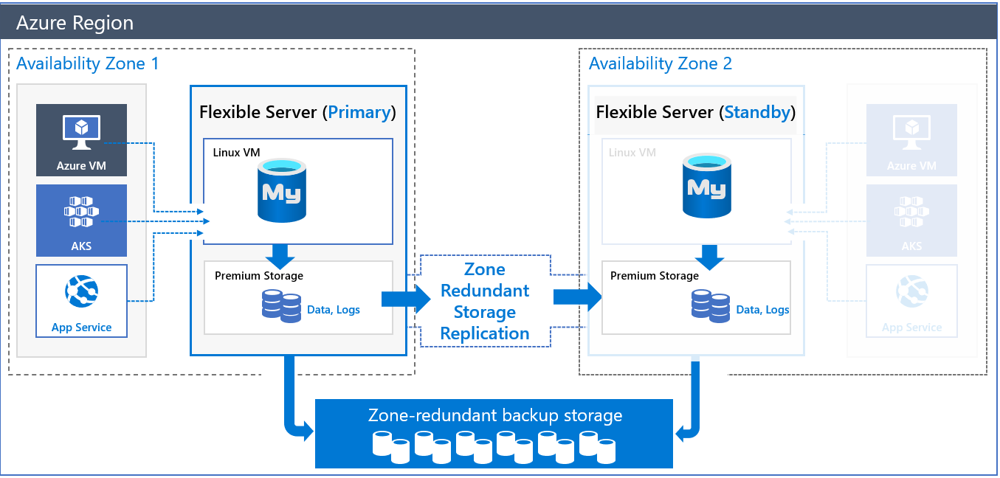
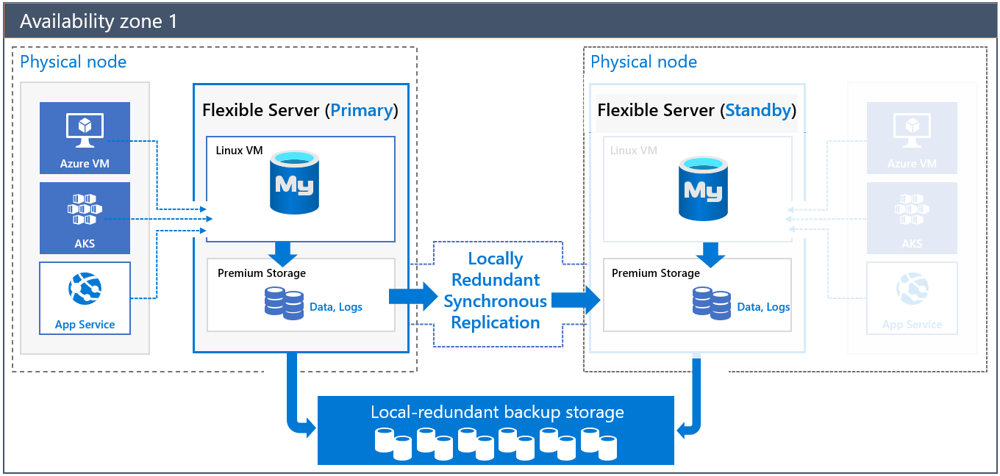

# 10 / Business Continuity and Disaster Recovery

Businesses implement *business continuity* (BC) and *disaster recovery* (DR) strategies to minimize disruptions. While *business continuity* emphasizes preserving business operations through policies, *disaster recovery* explains how IT teams will restore access to data and services.

## High availability

Flexible Server implements high availability by provisioning another VM to serve as a standby. It is possible to provision this secondary Flexible Server VM in another availability zone, as shown below. This HA option is only supported for Azure regions with availability zones. While this option does provide redundancy against zonal failure, there is more latency between the zones that affects replication.

To compensate for the latency challenges, Azure provides HA within a single zone. In this configuration, both the primary node and the standby node are in the same zone. All Azure regions support this mode. Of course, it does not insulate against zonal failure.

Both of these HA solutions have transparent failover: in a failover event, the standby server becomes the primary server, and DNS records point to the new primary. If the old primary comes back online, it becomes the secondary.

Critically, note that replication is not synchronous to avoid the performance penalty of synchronous replication. A transaction committed to the primary node is not necessarily committed to the secondary node; the secondary node is brought up to the latest committed transaction during failover.

To learn more about HA with MySQL Flexible Server, consult the [documentation.](https://docs.microsoft.com/azure/mysql/flexible-server/concepts-high-availability)

### Implementing cross-region high availability

Flexible Server does not currently support cross-region high availability. However, it is possible to achieve this using MySQL native replication, instead of replicating log files at the Azure storage level. The image below demonstrates two Flexible Server instances deployed in two virtual networks in two Azure regions. The virtual networks are peered to provide network connectivity for MySQL native replication. As the image indicates, developers can employ MySQL native replication for scenarios like replicating from an on-premises primary to an Azure secondary.

One disadvantage of this setup is that it is customer-managed.

## Replication

Replication in Flexible Server allows applications to scale by providing **read-only** replicas to serve queries while dedicating write operations to the main Flexible Server instance. Replication from the main instance to the read replicas is asynchronous: consequently, there is a lag between the source instance and the replicas. Microsoft estimates that this lag typically ranges between a few seconds to a few minutes.

> Replication is not a high availability strategy: consult the BCDR document for more details. Replication is designed to improve application performance, so it does not support automatic failover or bringing replicas up to the latest committed transaction during failover.

Replication is only supported in the General Purpose and Memory Optimized tiers of Flexible Server. Also, it is possible to promote a read replica to being a read-write instance; however, that severs the replication link between the main instance and the former replica, as the former replica cannot return to being a replica.

## Read replicas

[Read replicas](https://docs.microsoft.com/azure/mysql/concepts-read-replicas) can be used to increase the MySQL read throughput, improve performance for regional users, and implement disaster recovery. When creating one or more read replicas, be aware that additional charges will apply for the same compute and storage as the primary server.

## Deleted servers

If an administrator or bad actor deletes the server in the Azure Portal or via automated methods, all backups and read replicas will also be deleted. [Resource locks](https://docs.microsoft.com/azure/azure-resource-manager/management/lock-resources) must be created on the Azure Database for MySQL resource group to add an extra layer of deletion prevention to the instances.

## Regional failure

Although rare, if a regional failure occurs, geo-redundant backups or a read replica can be used to get the data workloads running again. It is best to have both geo-replication and a read replica available for the best protection against unexpected regional failures.

> **Note:** Changing the database server region also means the endpoint will change and application configurations will need to be updated accordingly.

### Use fully qualified domain names in connection strings

- Use a fully qualified domain name instead of an IP address in connection strings. If network changes are made causing IP addresses change, your application should be operationally. Administrators do not have locate and change dependent application configuration.

## Load Balancers

If the application is made up of many different instances around the world, it may not be feasible to update all of the clients. Utilize an [Azure Load Balancer](https://docs.microsoft.com/azure/load-balancer/load-balancer-overview) or [Application Gateway](https://docs.microsoft.com/azure/application-gateway/overview) to implement a seamless failover functionality. Although helpful and time-saving, these tools are not required for regional failover capability.

## Use cases

Often, developers use load balancers, like ProxySQL, to direct read operations to read replicas automatically. ProxySQL can [run on an Azure VM](https://techcommunity.microsoft.com/t5/azure-database-for-mysql-blog/load-balance-read-replicas-using-proxysql-in-azure-database-for/ba-p/880042) or [Azure Kubernetes Service.](https://techcommunity.microsoft.com/t5/azure-database-for-mysql-blog/deploy-proxysql-as-a-service-on-kubernetes-using-azure-database/ba-p/1105959)

Moreover, analytical systems often benefit from read replicas. BI tools can connect to read replicas, while data is written to the main instance and replicated to the read replicas asynchronously.

Using read replicas also helps implement microservices architectures. The image below demonstrates how APIs that solely access data can connect to read replicas, while APIs that modify data reference the main instance.

## Flexible Server resources

- [Azure Portal](https://docs.microsoft.com/azure/mysql/flexible-server/how-to-read-replicas-portal)
- [Azure CLI](https://docs.microsoft.com/azure/mysql/flexible-server/how-to-read-replicas-cli)

## Backup and restore

As with any mission-critical system, having a backup and restore as well as a disaster recovery (BCDR) strategy is an important part of the overall system design. If an unforeseen event occurs, administrators should have the ability to restore data to a point in time called the Recovery Point Objective (RPO) and in a reasonable amount of time called the Recovery Time Objective (RTO).

### Backup

Azure Database for MySQL takes automatic backups of data and transaction log files. These backups can be stored in locally-redundant storage (replicated multiple times in a datacenter); zone-redundant storage (multiple copies are stored in two separate availability zones in a region); and geo-redundant storage (multiple copies are stored in two separate Azure regions).

Azure Database for MySQL supports automatic backups for 7 days by default. It may be appropriate to modify this to the current maximum of 35 days. It is important to be aware that if the value is changed to 35 days, there will be charges for any extra backup storage over 1x of the storage allocated. Data file backups are taken once daily, while transaction log backups are taken every five minutes.

Find additional storage pricing details for Flexible Server [here.](https://azure.microsoft.com/pricing/details/mysql/flexible-server/)

There are several current limitations to the database backup feature as described in the [Backup and restore in Azure Database for MySQL](https://docs.microsoft.com/azure/mysql/concepts-backup) docs article. It is important to understand them when deciding what additional strategies should be implemented.

Some items to be aware of include:

- No direct access to the backups
- Tiers that allow up to 4TB have a full backup once per week, differential twice a day, and logs every five minutes
- Tiers that allow up to 16TB have snapshot-based backups

> **Note:** [Some regions](https://docs.microsoft.com/azure/mysql/concepts-pricing-tiers#storage) do not yet support storage up to 16TB.

### Restore

Redundancy (local or geo) must be configured during server creation. However, a geo-restore can be performed and allows the modification of these options during the restore process. Performing a restore operation will temporarily stop connectivity and any applications will be down during the restore process.

During a database restore, any supporting items outside of the database will also need to be restored.  Review the migration process. See [Perform post-restore tasks](https://docs.microsoft.com/azure/mysql/concepts-backup#perform-post-restore-tasks) for more information.

Lastly, note that performing a restore from a backup provisions a new Flexible Server instance. Most of the new server's configuration is inherited from the old server, though it depends on the type of restore performed.

Learn more about backup and restore in Flexible Server from the [Microsoft documentation.](https://docs.microsoft.com/azure/mysql/flexible-server/concepts-backup-restore)

### Flexible Server resources

- [Point-in-time restore with Azure Portal](https://docs.microsoft.com/azure/mysql/flexible-server/how-to-restore-server-portal)
- [Point-in-time restore with CLI](https://docs.microsoft.com/azure/mysql/flexible-server/how-to-restore-server-cli)
- [Azure CLI samples for Azure Database for MySQL - Flexible Server](https://docs.microsoft.com/en-us/azure/mysql/flexible-server/sample-scripts-azure-cli)
