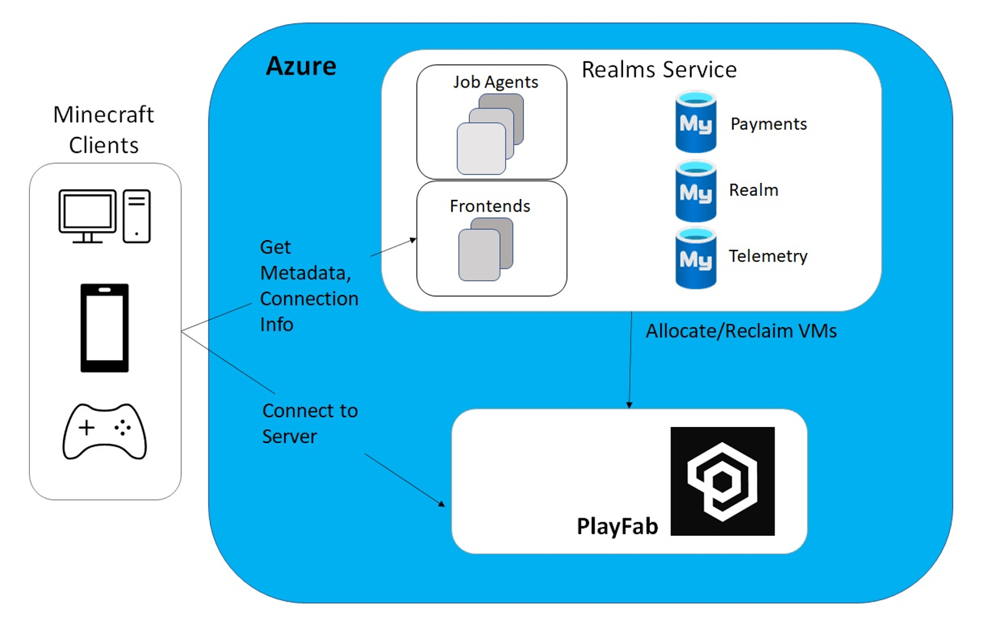

# Customer stories

Azure Database for MySQL is used by customers all over the world, and many have shared their stories on the [Microsoft Customer Stories portal](https://customers.microsoft.com/search?sq=%22Azure%20Database%20for%20MySQL%22&ff=&p=2&so=story_publish_date%20desc).

## Case studies

The following are a set of case studies from the Microsoft Customer Stories page focused on the usage of Azure Database for MySQL.

### Minecraft

Minecraft migrated from AWS Aurora to Azure Database for MySQL for its Realms service to improve performance and reduce costs. Minecraft moved over 1 TB of data, distributed across 13 databases, serving over 6k requests per second, during the migration. Minecraft utilized the Azure Database Migration Service six-month free offer to save costs.

Minecraft also migrated its frontend servers to Azure to take advantage of Azure's global footprint. This migration also improved developer productivity through smaller code footprints and simpler deployments.

### CVS

### TODO

TODO
