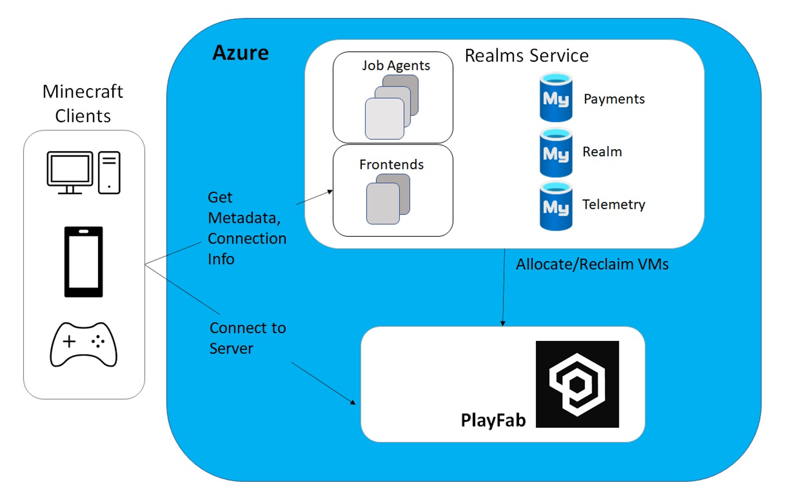

# 13 / Customer stories

Azure Database for MySQL is used by customers all over the world, and many have shared their stories on the [Microsoft Customer Stories portal](https://customers.microsoft.com/search?sq=%22Azure%20Database%20for%20MySQL%22&ff=&p=2&so=story_publish_date%20desc).

## Case studies

The following are a set of case studies from the Microsoft Customer Stories page focused on the usage of Azure Database for MySQL.

### Minecraft

Minecraft migrated from AWS Aurora to Azure Database for MySQL for its Realms service to improve performance and reduce costs. Minecraft moved over 1 TB of data, distributed across 13 databases, serving over 6k requests per second, during the migration. Minecraft utilized the Azure Database Migration Service six-month free offer to save costs.

Minecraft also migrated its frontend servers to Azure to take advantage of Azure's global footprint. This migration also improved developer productivity through smaller code footprints and simpler deployments.

### Automobile Retail

The retailer was using Red Hat Enterprise Linux running a MySQL database with a Java Spring Boot application on the backend and a Vue.js on the frontend. The environment did not have the capability to scale up and down as needed to cope with this fluctuation in the market, and 30% of its resources were underutilized. As a result, the retailer was overpaying and unnecessarily bleeding valuable capital.

The MySQL database was modernized with Azure Database for MySQL with a read replica to support the reporting needs of the business.

### Linked Brain

In November 2019, a Microsoft gaming industry representative visited [Linked Brain](https://customers.microsoft.com/story/1418505453083122843-linked-brain-en-japan) to explain Microsoft Azure services and FastTrack for Azure. Features fitted perfectly with Linked Brain’s goal of building game systems with PaaS, and the company decided to officially adopt Microsoft Azure.

We learned Flexible Server could scale up and down without stoppages, offer backup capabilities, and deliver I/O capacity proportionate to storage size, making it easy to boost performance as data accumulates. Azure also offers regional disaster recovery as a standard benefit—an option which requires another instance fee on Amazon RDS.”

### T-Systems

In the Internet of Things (IoT) age, organizations must share proprietary data quickly while maintaining control, security, and compliance. [T-Systems](https://customers.microsoft.com/story/724200-deutsche-telekom-telecommunications-azure), a Deutsche Telekom division, worked with expert partner Ultra Tendency to meet that need, using Microsoft Azure and Azure Database for PostgreSQL to help create the Telekom Data Intelligence Hub, a data marketplace for data sharing that includes built-in analytics tools.

“We were looking for managed database solutions,” says Robert Neumann, Chief Executive Officer at Ultra Tendency. “With Azure database services, we wouldn’t have to manage uptime, backup, and recovery scenarios, and we could make the platform faster and more reliable.”

The execution layer of Data Intelligence Hub runs entirely on Azure database services, using the Azure Database for PostgreSQL and Azure Database for MySQL services to support data availability without having to maintain a database operations infrastructure.

### Children's Mercy Hospital

[Children’s Mercy Kansas City](https://customers.microsoft.com/story/860516-childrens-mercy-health-provider-azure), an award-winning hospital and research institute, manages one of the leading genome sequencing centers in the United States. To better support researchers, Children’s Mercy is working with Microsoft and Pacific Biosciences to create a scalable, sharable, cloud-based data hub for vital research into pediatric diseases, built on Microsoft Genomics and Azure. It’s already garnering praise from the genomics research community and has potential to accelerate vital clinical care for children.

The hospital and research institute had an existing relationship with Microsoft, so when researchers saw sequencing data begin to push toward the CMRI datacenter’s storage limits, the organization chose to support its genomic data platform with Microsoft Genomics, Azure Database for MySQL, and Azure infrastructure as a service (IaaS) resources.

### GeekWire

Based in Seattle, Washington, [GeekWire](https://customers.microsoft.com/story/geekwire) is a rapidly growing technology news site with a global readership. In addition to covering the latest innovation, GeekWire serves the Pacific Northwest tech community with events, a job board, startup resources, a weekly radio show, and more. As its popularity and site traffic increased, so did performance concerns. To gain better scalability and performance, GeekWire decided to migrate its WordPress site to the Microsoft Azure platform. By taking advantage of fully managed services like Azure Database for MySQL, the company can scale on-demand while cutting costs 45 percent.
