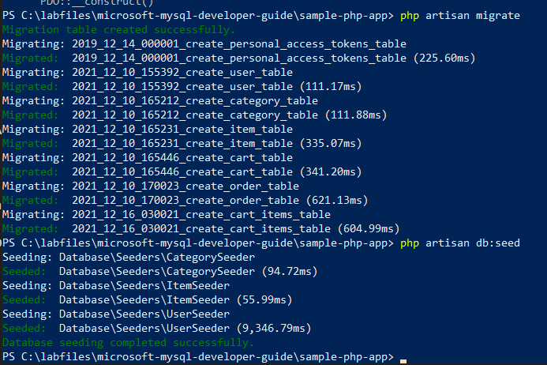

# Classic Deployment to PHP enabled IIS server

This is a simple app that runs PHP code to connect to a MYSQL database. These tasks will be performed on the **paw-1** virtual machine that was deployed via the ARM template.

## Database Deployment

1. On the **paw-1** virtual machine, open a Windows PowerShell window
2. Run the following commands to create the database (type `yes` when prompted):

    ```PowerShell
    cd C:\labfiles\microsoft-mysql-developer-guide\artifacts\sample-php-app

    composer update 

    copy .env.example.root .env

    php artisan config:clear
    
    php artisan migrate

    php artisan db:seed

    php artisan key:generate
    ```

3. Several tables should get created and will be populated with sample data:

    

## Test the PHP Setup

1. In the **paw-1** virtual machine, open a chrome browser window
2. Navigate to `http://localhost:8080/default.php`, **Hello World** should be displayed.
3. Navigate to `http://localhost:8080/database.php`, **12 results** should be displayed.

## Test the Store Application

1. Open a chrome browser window
2. Navigate to `http://localhost:8080`, the store front will load with a random user.

    

## Manual Deployment

The above resources were deployed as part of the ARM template and supporting scripts.  In order to setup a developer machine, do the following in order to get the machine setup:

1. Install Composer
2. Install OpenSSL
3. Install Docker Desktop
4. Install Visual Studio Code
5. Install 7Zip
6. Install IIS
7. Install the WebPI extensions
8. Install PHP Extensions
9. Install PHP 8.0
10. Configure PHP 8.0
11. Copy the web application files to the `c:\inetpub\wwwroot` folder
12. Create an IIS web application that points to the web app directory
13. Install MySQL and create the `contosostore` database
