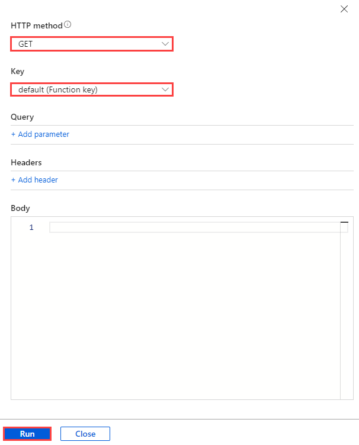

- [01 / Azure MySQL Developer Guide](#01--azure-mysql-developer-guide)
- [02 / What is MySQL?](#02--what-is-mysql)
  - [Comparison with other RDBMS offerings](#comparison-with-other-rdbms-offerings)
  - [MySQL hosting options](#mysql-hosting-options)
    - [On-premises](#on-premises)
    - [Cloud IaaS (in a VM)](#cloud-iaas-in-a-vm)
    - [Containers](#containers)
    - [Cloud PaaS](#cloud-paas)
  - [Hosting MySQL on Azure - benefits and options](#hosting-mysql-on-azure---benefits-and-options)
    - [Advantages of choosing Azure](#advantages-of-choosing-azure)
    - [MySQL on Azure hosting options](#mysql-on-azure-hosting-options)
      - [IaaS (VMs)](#iaas-vms)
      - [IaaS (Containers)](#iaas-containers)
      - [PaaS (DBaaS)](#paas-dbaas)
      - [PaaS (Containers)](#paas-containers)
      - [Video reference](#video-reference)
  - [Introduction to Azure resource management](#introduction-to-azure-resource-management)
    - [The Azure resource management hierarchy](#the-azure-resource-management-hierarchy)
    - [Create landing zone](#create-landing-zone)
    - [Automating and managing Azure services](#automating-and-managing-azure-services)
    - [Azure management tools](#azure-management-tools)
      - [Azure portal](#azure-portal)
        - [Azure Marketplace](#azure-marketplace)
        - [Evolving](#evolving)
      - [Azure PowerShell and CLI](#azure-powershell-and-cli)
      - [Azure CLI](#azure-cli)
        - [Azure Cloud Shell](#azure-cloud-shell)
      - [PowerShell Module](#powershell-module)
      - [Infrastructure as Code](#infrastructure-as-code)
        - [ARM templates](#arm-templates)
        - [Bicep](#bicep)
        - [Terraform](#terraform)
      - [Other tips](#other-tips)
    - [Azure deployment resources](#azure-deployment-resources)
      - [Support](#support)
      - [Training](#training)
  - [Introduction to Azure Database for MySQL](#introduction-to-azure-database-for-mysql)
    - [Azure Database for MySQL deployment options](#azure-database-for-mysql-deployment-options)
      - [Flexible Server](#flexible-server)
        - [Flexible Server video introduction](#flexible-server-video-introduction)
        - [Flexible Server pricing & TCO](#flexible-server-pricing--tco)
        - [Flexible Server Unsupported Features](#flexible-server-unsupported-features)
      - [Single Server](#single-server)
  - [Migrate to Flexible Server](#migrate-to-flexible-server)
    - [From Single Server to Flexible Server](#from-single-server-to-flexible-server)
    - [From on-premises to Flexible Server](#from-on-premises-to-flexible-server)
  - [02 / Summary](#02--summary)
- [03 / Getting Started - Setup and Tools](#03--getting-started---setup-and-tools)
  - [Azure free account](#azure-free-account)
  - [Azure subscriptions and limits](#azure-subscriptions-and-limits)
  - [Azure authentication](#azure-authentication)
  - [Development editor tools](#development-editor-tools)
  - [Development languages](#development-languages)
  - [Resources](#resources)
    - [Azure portal](#azure-portal-1)
    - [Azure CLI](#azure-cli-1)
    - [ARM template](#arm-template)
    - [PHP language support](#php-language-support)
    - [Example code](#example-code)
    - [Application connectors](#application-connectors)
    - [Resources](#resources-1)
    - [Java language support](#java-language-support)
    - [Example code](#example-code-1)
    - [Application connectors](#application-connectors-1)
    - [Resources](#resources-2)
    - [Tooling](#tooling)
      - [Eclipse](#eclipse)
      - [Maven](#maven)
    - [Python language support](#python-language-support)
    - [Example code](#example-code-2)
    - [Application connectors](#application-connectors-2)
    - [Resources](#resources-3)
  - [Other notable languages for MySQL apps](#other-notable-languages-for-mysql-apps)
    - [.NET](#net)
    - [Ruby](#ruby)
  - [Connect and query Azure Database for MySQL using MySQL Workbench](#connect-and-query-azure-database-for-mysql-using-mysql-workbench)
    - [Setup](#setup)
    - [Instructions](#instructions)
  - [Connect and query Azure Database for MySQL using the Azure CLI](#connect-and-query-azure-database-for-mysql-using-the-azure-cli)
      - [Setup](#setup-1)
      - [Instructions](#instructions-1)
  - [Connect and query Azure Database for MySQL using PHP](#connect-and-query-azure-database-for-mysql-using-php)
    - [Setup](#setup-2)
    - [Instructions](#instructions-2)
  - [Connect and query Azure Database for MySQL using Python](#connect-and-query-azure-database-for-mysql-using-python)
    - [Setup](#setup-3)
    - [Instructions](#instructions-3)
  - [Connect and query Azure Database for MySQL using Java (Spring Boot)](#connect-and-query-azure-database-for-mysql-using-java-spring-boot)
    - [Setup](#setup-4)
      - [Prerequisites](#prerequisites)
      - [IntelliJ setup](#intellij-setup)
      - [App setup](#app-setup)
      - [Database setup](#database-setup)
    - [Run the app](#run-the-app)
    - [Test the app](#test-the-app)
    - [Stop the app](#stop-the-app)
    - [Resources](#resources-4)
  - [Type of MySQL applications](#type-of-mysql-applications)
    - [Web Apps](#web-apps)
      - [Resources](#resources-5)
    - [Azure Functions, Azure Logic Apps](#azure-functions-azure-logic-apps)
      - [Serverless Compute](#serverless-compute)
      - [Azure Functions](#azure-functions)
        - [Resources](#resources-6)
      - [Azure Logic Apps](#azure-logic-apps)
        - [Resources](#resources-7)
    - [Microservices](#microservices)
      - [Resources](#resources-8)
    - [API Management](#api-management)
      - [Resources](#resources-9)
    - [Event-driven - Azure Event Grid vs. Service Bus vs. Event Hubs](#event-driven---azure-event-grid-vsservice-bus-vsevent-hubs)
      - [Azure Event Grid](#azure-event-grid)
      - [Azure Service Bus](#azure-service-bus)
      - [Azure Event Hubs](#azure-event-hubs)
      - [Example Solution](#example-solution)
    - [Cron jobs](#cron-jobs)
    - [WebJobs](#webjobs)
    - [Advanced orchestration - Azure Data Factory](#advanced-orchestration---azure-data-factory)
  - [03 / Summary](#03--summary)
- [04 / End to End application development](#04--end-to-end-application-development)
  - [Development evolution](#development-evolution)
  - [Classic deployment](#classic-deployment)
  - [Azure VM deployment](#azure-vm-deployment)
  - [Simple App Service deployment with Azure Database for MySQL Flexible Server](#simple-app-service-deployment-with-azure-database-for-mysql-flexible-server)
  - [App Service with In-App MySQL](#app-service-with-in-app-mysql)
  - [Continuous Integration (CI) and Continuous Delivery (CD)](#continuous-integration-ci-and-continuous-delivery-cd)
  - [Containerizing layers with Docker](#containerizing-layers-with-docker)
  - [Azure Container Instances (ACI)](#azure-container-instances-aci)
  - [App Service Containers](#app-service-containers)
  - [Azure Kubernetes Service (AKS)](#azure-kubernetes-service-aks)
  - [AKS with MySQL Flexible Server](#aks-with-mysql-flexible-server)
  - [Start the Developer Journey](#start-the-developer-journey)
    - [Step 1 - Deploy the template](#step-1---deploy-the-template)
    - [Step 2 - Starting from the beginning](#step-2---starting-from-the-beginning)
  - [Introduction to the sample application](#introduction-to-the-sample-application)
    - [Sample application overview and story](#sample-application-overview-and-story)
    - [Solution architecture](#solution-architecture)
    - [Site map](#site-map)
    - [Sample Application Prerequisites](#sample-application-prerequisites)
    - [Quick start: manual Azure set up instructions](#quick-start-manual-azure-set-up-instructions)
    - [Sample application deployment steps](#sample-application-deployment-steps)
  - [Connecting to the database](#connecting-to-the-database)
    - [What happens to my app during an Azure deployment?](#what-happens-to-my-app-during-an-azure-deployment)
    - [Troubleshooting tips](#troubleshooting-tips)
  - [Resources](#resources-10)
  - [Deploying a Laravel app backed by a Java REST API to AKS](#deploying-a-laravel-app-backed-by-a-java-rest-api-to-aks)
    - [Evolve the sample application](#evolve-the-sample-application)
    - [Download the tools](#download-the-tools)
    - [Provision the database](#provision-the-database)
    - [Create Docker images](#create-docker-images)
      - [API](#api)
      - [Laravel](#laravel)
    - [Provision Azure Kubernetes Service](#provision-azure-kubernetes-service)
    - [Deploy the API to Azure Kubernetes Service](#deploy-the-api-to-azure-kubernetes-service)
      - [Create the API Secret](#create-the-api-secret)
      - [Create the API Service](#create-the-api-service)
      - [Create the API Deployment](#create-the-api-deployment)
    - [Deploy the Laravel app to Azure Kubernetes Service](#deploy-the-laravel-app-to-azure-kubernetes-service)
      - [Create the Laravel app Service](#create-the-laravel-app-service)
      - [Create the Laravel app Deployment](#create-the-laravel-app-deployment)
    - [Browse to the app](#browse-to-the-app)
  - [Application continuous integration and deployment](#application-continuous-integration-and-deployment)
    - [Local Git](#local-git)
    - [App Service Deployment Center and Slots](#app-service-deployment-center-and-slots)
      - [Deployment Slots](#deployment-slots)
      - [Deployment Center](#deployment-center)
    - [GitHub Actions](#github-actions)
    - [Azure DevOps](#azure-devops)
    - [Infrastructure as Code (IaC)](#infrastructure-as-code-iac)
  - [04 / Summary](#04--summary)
- [05 / Monitoring](#05--monitoring)
  - [Azure Monitor](#azure-monitor)
  - [Monitoring database operations](#monitoring-database-operations)
  - [Query Performance Insights](#query-performance-insights)
  - [Server Logs](#server-logs)
  - [MySQL audit logs](#mysql-audit-logs)
    - [Enabling audit logs](#enabling-audit-logs)
    - [Notes about the Flexible Server portal example](#notes-about-the-flexible-server-portal-example)
    - [Recommended content](#recommended-content)
  - [Error Logs](#error-logs)
  - [Azure Service Health](#azure-service-health)
  - [Alerting](#alerting)
    - [Concepts](#concepts)
      - [Best Practices with Alerting Metrics](#best-practices-with-alerting-metrics)
  - [Webhooks](#webhooks)
    - [Metrics resources](#metrics-resources)
      - [Azure CLI](#azure-cli-2)
      - [Azure Portal](#azure-portal-2)
      - [Azure Monitor REST API](#azure-monitor-rest-api)
    - [Sample - Azure Portal](#sample---azure-portal)
  - [05 / Summary](#05--summary)
- [06 / Security](#06--security)
  - [Authentication](#authentication)
  - [Threat protection](#threat-protection)
  - [Encryption](#encryption)
  - [Firewall](#firewall)
  - [Microsoft Defender for Cloud](#microsoft-defender-for-cloud)
  - [Microsoft Sentinel](#microsoft-sentinel)
  - [Security checklist](#security-checklist)
  - [Networking and connectivity options](#networking-and-connectivity-options)
    - [Public vs. Private Access](#public-vsprivate-access)
      - [Public Access](#public-access)
    - [Private Link](#private-link)
      - [Configuring Public Access Guides](#configuring-public-access-guides)
      - [Private Access](#private-access)
        - [Virtual Network Hierarchy](#virtual-network-hierarchy)
          - [More Information on Virtual Networks](#more-information-on-virtual-networks)
        - [Flexible Server](#flexible-server-1)
          - [Configuring Private Access for Flexible Server](#configuring-private-access-for-flexible-server)
        - [Single Server](#single-server-1)
          - [Configuring Private Access for Single Server](#configuring-private-access-for-single-server)
    - [Networking Best Practices for Flexible Server](#networking-best-practices-for-flexible-server)
  - [06 / Summary](#06--summary)
- [07 / Testing](#07--testing)
  - [Approaches](#approaches)
    - [Resiliency testing](#resiliency-testing)
    - [Performance testing](#performance-testing)
      - [Load testing](#load-testing)
      - [Stress testing](#stress-testing)
  - [Tools](#tools)
    - [Azure Monitor](#azure-monitor-1)
      - [Resources](#resources-11)
    - [Apache JMeter](#apache-jmeter)
    - [K6](#k6)
    - [Selenium](#selenium)
    - [Grafana & Prometheus](#grafana--prometheus)
      - [Resources](#resources-12)
    - [Web](#web)
    - [Database](#database)
  - [07 / Summary](#07--summary)
- [08 / Performance + Optimization](#08--performance--optimization)
  - [Monitoring hardware and query performance](#monitoring-hardware-and-query-performance)
  - [Upgrading the tier](#upgrading-the-tier)
  - [Scaling the server](#scaling-the-server)
  - [Moving regions](#moving-regions)
  - [Optimization checklist](#optimization-checklist)
  - [Server parameters](#server-parameters)
  - [Upgrade Azure Database for MySQL versions](#upgrade-azure-database-for-mysql-versions)
  - [Server Parameters](#server-parameters-1)
    - [Tools to Set Server Parameters](#tools-to-set-server-parameters)
      - [Flexible Server Articles](#flexible-server-articles)
      - [Single Server Articles](#single-server-articles)
    - [Server Parameters Best Practices](#server-parameters-best-practices)
    - [Disk cache](#disk-cache)
    - [Memory cache](#memory-cache)
      - [Local memory](#local-memory)
      - [Redis Cache](#redis-cache)
  - [Azure Content Delivery Network](#azure-content-delivery-network)
    - [Using Azure CDN in Web Apps](#using-azure-cdn-in-web-apps)
  - [08 / Summary](#08--summary)
- [09 / Troubleshooting](#09--troubleshooting)
  - [Common MySQL issues](#common-mysql-issues)
    - [Network connectivity issues](#network-connectivity-issues)
    - [Resource issues](#resource-issues)
    - [Platform issues](#platform-issues)
  - [Troubleshoot app issues in Azure App Service](#troubleshoot-app-issues-in-azure-app-service)
  - [General issue mitigation](#general-issue-mitigation)
    - [Other resources](#other-resources)
  - [09 / Summary](#09--summary)
- [10 / Business Continuity and Disaster Recovery (BCDR)](#10--business-continuity-and-disaster-recovery-bcdr)
  - [Backup and restore](#backup-and-restore)
    - [Backup](#backup)
    - [Restore](#restore)
  - [Read replicas](#read-replicas)
  - [Deleted servers](#deleted-servers)
  - [Regional failure](#regional-failure)
    - [Load Balancers](#load-balancers)
  - [WWI Case Study](#wwi-case-study)
    - [Creating a read replica](#creating-a-read-replica)
    - [Failover to read replica](#failover-to-read-replica)
  - [BCDR Checklist](#bcdr-checklist)
  - [Business Continuity and Disaster Recovery](#business-continuity-and-disaster-recovery)
    - [High availability](#high-availability)
      - [Implementing cross-region high availability](#implementing-cross-region-high-availability)
    - [Backup and restore](#backup-and-restore-1)
      - [Flexible Server samples](#flexible-server-samples)
      - [Single Server samples](#single-server-samples)
  - [Replication](#replication)
    - [Use cases](#use-cases)
    - [Configuring read replicas](#configuring-read-replicas)
      - [Flexible Server](#flexible-server-2)
      - [Single Server](#single-server-2)
  - [Service maintenance](#service-maintenance)
    - [Notifications](#notifications)
    - [Differences for Single Server](#differences-for-single-server)
    - [Configure maintenance scheduling & alerting](#configure-maintenance-scheduling--alerting)
  - [Azure Database for MySQL upgrade process](#azure-database-for-mysql-upgrade-process)
  - [10 / Summary](#10--summary)
- [11 / MySQL architectures](#11--mysql-architectures)
  - [Sample architectures](#sample-architectures)
    - [Digital marketing using Azure Database for MySQL](#digital-marketing-using-azure-database-for-mysql)
    - [Finance management apps using Azure Database for MySQL](#finance-management-apps-using-azure-database-for-mysql)
    - [Intelligent apps using Azure Database for MySQL](#intelligent-apps-using-azure-database-for-mysql)
    - [Gaming using Azure Database for MySQL](#gaming-using-azure-database-for-mysql)
    - [Retail and e-commerce using Azure MySQL](#retail-and-e-commerce-using-azure-mysql)
    - [Scalable web and mobile applications using Azure Database for MySQL](#scalable-web-and-mobile-applications-using-azure-database-for-mysql)
  - [11 / Summary](#11--summary)
- [12 / Customer stories](#12--customer-stories)
  - [Case studies](#case-studies)
    - [Minecraft](#minecraft)
    - [CVS](#cvs)
  - [Resources](#resources-13)
  - [Common MySQL Apps](#common-mysql-apps)
    - [3rd party Azure solutions / Azure Marketplace](#3rd-party-azure-solutions--azure-marketplace)
      - [CMS like WordPress](#cms-like-wordpress)
      - [LMS like Moodle](#lms-like-moodle)
      - [e-commerce like Magento](#e-commerce-like-magento)
  - [12 / Summary](#12--summary)
- [13 / Zero to Hero](#13--zero-to-hero)
  - [Determining the evolutionary waypoint](#determining-the-evolutionary-waypoint)
  - [Summary of tasks](#summary-of-tasks)
- [14 / Summary](#14--summary)
- [Resources](#resources-14)
  - [Questions and feedback](#questions-and-feedback)
  - [Find a partner to assist in migrating](#find-a-partner-to-assist-in-migrating)
- [Getting Started](#getting-started)
  - [Create a Lab Resource Group](#create-a-lab-resource-group)
  - [Deploy the ARM Template](#deploy-the-arm-template)
- [Classic Deployment to PHP enabled IIS server](#classic-deployment-to-php-enabled-iis-server)
  - [Database Deployment](#database-deployment)
  - [Test the PHP Setup](#test-the-php-setup)
  - [Test the Store Application](#test-the-store-application)
  - [Manual Deployment](#manual-deployment)
- [Cloud Deployment to Azure VM](#cloud-deployment-to-azure-vm)
  - [Test the Application #1](#test-the-application-1)
  - [Open Port 8080](#open-port-8080)
  - [Test the Application #2](#test-the-application-2)
  - [Edit .env file](#edit-env-file)
  - [Enable Port 443](#enable-port-443)
  - [Open Port 443](#open-port-443)
  - [Test the Application #3](#test-the-application-3)
- [Cloud Deployment to Azure App Service](#cloud-deployment-to-azure-app-service)
  - [Basic Deployment](#basic-deployment)
    - [Deploy the Application](#deploy-the-application)
    - [Update Application Settings](#update-application-settings)
    - [Test the Application](#test-the-application)
    - [Add Firewall IP Rule and Azure Access](#add-firewall-ip-rule-and-azure-access)
    - [Migrate the Database](#migrate-the-database)
  - [Update the connection string](#update-the-connection-string)
  - [Test new settings #1](#test-new-settings-1)
  - [Fix SSL error](#fix-ssl-error)
  - [Test new settings #2](#test-new-settings-2)
  - [Update to use Environment Variables](#update-to-use-environment-variables)
  - [Test new settings #3](#test-new-settings-3)
  - [Create Azure Key Vault values](#create-azure-key-vault-values)
  - [Create Managed Service Identity](#create-managed-service-identity)
  - [Configure Environment Variables](#configure-environment-variables)
  - [Test new settings #4](#test-new-settings-4)
- [Cloud Deployment to Azure App Service with MySQL InApp](#cloud-deployment-to-azure-app-service-with-mysql-inapp)
  - [Basic Deployment](#basic-deployment-1)
    - [Deploy the Application](#deploy-the-application-1)
    - [Test the Application](#test-the-application-1)
    - [Export the Database](#export-the-database)
    - [Enable MySQL In App](#enable-mysql-in-app)
  - [Import the database](#import-the-database)
  - [Update the environment variables](#update-the-environment-variables)
  - [Test the Application](#test-the-application-2)
- [Deployment via CI/CD](#deployment-via-cicd)
  - [Azure DevOps Option](#azure-devops-option)
    - [Create DevOps Project](#create-devops-project)
    - [Setup Git Origin and push code](#setup-git-origin-and-push-code)
    - [Create Service Connection](#create-service-connection)
    - [Create Pipeline](#create-pipeline)
    - [Create Release](#create-release)
    - [Commit changes](#commit-changes)
    - [Perform the deployment](#perform-the-deployment)
    - [Test the DevOps deployment](#test-the-devops-deployment)
  - [GitHub Option](#github-option)
    - [Create Github repo](#create-github-repo)
    - [Upload the application](#upload-the-application)
    - [Generate Credentials](#generate-credentials)
    - [Deploy the code](#deploy-the-code)
    - [Test the GitHub deployment](#test-the-github-deployment)
  - [Terraform](#terraform-1)
  - [Azure Bicep](#azure-bicep)
- [Migrate to Docker Containers](#migrate-to-docker-containers)
  - [Migrate Application to Docker](#migrate-application-to-docker)
    - [Migrate to ENV variables](#migrate-to-env-variables)
    - [Download Docker container](#download-docker-container)
  - [Migrate Database to Docker](#migrate-database-to-docker)
  - [Run the Docker images](#run-the-docker-images)
  - [Test the Docker images](#test-the-docker-images)
  - [Fix Storage persistence](#fix-storage-persistence)
  - [Re-test the Docker images](#re-test-the-docker-images)
  - [Save the images to Azure Container Registry (ACR)](#save-the-images-to-azure-container-registry-acr)
- [Migrate to Azure Container Instances (ACI)](#migrate-to-azure-container-instances-aci)
  - [Push images to Azure Container Registry](#push-images-to-azure-container-registry)
  - [Run images in ACI](#run-images-in-aci)
  - [Test the images](#test-the-images)
  - [Multi-container single app service deployment](#multi-container-single-app-service-deployment)
- [Migrate to Azure App Service Containers](#migrate-to-azure-app-service-containers)
  - [Push images to Azure Container Registry](#push-images-to-azure-container-registry-1)
  - [Run images in Azure App Service](#run-images-in-azure-app-service)
  - [Test the containers](#test-the-containers)
- [Migrate to Azure Kubernetes Services (AKS)](#migrate-to-azure-kubernetes-services-aks)
  - [Push images to Azure Container Registry](#push-images-to-azure-container-registry-2)
  - [Run images in Azure Kubernetes Service (AKS)](#run-images-in-azure-kubernetes-service-aks)
  - [Add services](#add-services)
  - [Test the images](#test-the-images-1)
  - [Create a deployment](#create-a-deployment)
- [Utilize AKS and Azure Database for MySQL Flexible Server](#utilize-aks-and-azure-database-for-mysql-flexible-server)
  - [Push images to Azure Container Registry](#push-images-to-azure-container-registry-3)
  - [Run images in AKS](#run-images-in-aks)
  - [Deploy to Azure Database for MySQL](#deploy-to-azure-database-for-mysql)
- [Azure Function with MySQL (.NET)](#azure-function-with-mysql-net)
  - [Setup](#setup-5)
    - [Install pre-requisites](#install-pre-requisites)
      - [Install the Azure development workload for Visual Studio](#install-the-azure-development-workload-for-visual-studio)
  - [Create the Function Application](#create-the-function-application)
  - [Deploy the Function Application](#deploy-the-function-application)
  - [Test the Function App in the Azure portal](#test-the-function-app-in-the-azure-portal)
  - [Troubleshooting](#troubleshooting)
- [Azure Function with MySQL (Python)](#azure-function-with-mysql-python)
  - [Setup](#setup-6)
    - [Visual Studio Code](#visual-studio-code)
  - [Create the Function Application](#create-the-function-application-1)
  - [Deploy the Function Application](#deploy-the-function-application-1)
  - [Test the Function App in the Azure portal](#test-the-function-app-in-the-azure-portal-1)
  - [Troubleshooting](#troubleshooting-1)
- [Deploy Azure Function App to Azure Kubernetes Service (AKS)](#deploy-azure-function-app-to-azure-kubernetes-service-aks)
  - [Setup AKS (KEDA)](#setup-aks-keda)
  - [Configure Function App as Container](#configure-function-app-as-container)
- [Securing Azure Function Apps](#securing-azure-function-apps)
  - [Enable MySQL Azure AD Authentication](#enable-mysql-azure-ad-authentication)
  - [Create Managed Identity](#create-managed-identity)
  - [Add Users to Database](#add-users-to-database)
  - [Modify the code](#modify-the-code)
- [Logic Apps with MySQL](#logic-apps-with-mysql)
  - [Create a Private Endpoint Flexible Server](#create-a-private-endpoint-flexible-server)
  - [Configure the new Flexible Server instance](#configure-the-new-flexible-server-instance)
  - [Install the MySQL .NET Connector](#install-the-mysql-net-connector)
  - [Install the Logic Apps Gateway](#install-the-logic-apps-gateway)
  - [Configure the Logic Apps Gateway](#configure-the-logic-apps-gateway)
  - [Configure the Logic App](#configure-the-logic-app)
  - [Configure supporting items](#configure-supporting-items)
    - [Add private endpoint to App Service](#add-private-endpoint-to-app-service)
    - [Add virtual network peering](#add-virtual-network-peering)
    - [Add VNet Integrate](#add-vnet-integrate)
    - [Add the lastOrder.txt file](#add-the-lastordertxt-file)
  - [Test Trigger](#test-trigger)
- [Azure Data Factory with MySQL](#azure-data-factory-with-mysql)
  - [Setup](#setup-7)
  - [Create Linked Services](#create-linked-services)
  - [Create Dataset (MySQL)](#create-dataset-mysql)
  - [Create Dataset (Storage)](#create-dataset-storage)
  - [Create a Pipeline](#create-a-pipeline)
  - [Add a trigger](#add-a-trigger)
  - [Publish](#publish)
  - [Test the pipeline](#test-the-pipeline)
  - [Setup](#setup-8)
  - [Setup](#setup-9)
  - [Configure Batch Service](#configure-batch-service)
  - [Create a Batch Job](#create-a-batch-job)
  - [Create an application](#create-an-application)
  - [Create a Batch Task](#create-a-batch-task)
  - [Run the Batch Job and Task](#run-the-batch-job-and-task)
  - [Setup Managed Identity (certificate)](#setup-managed-identity-certificate)
    - [Create Key Vault values](#create-key-vault-values)
    - [Create a new task with secure settings](#create-a-new-task-with-secure-settings)
- [Push images to Azure Container Registry](#push-images-to-azure-container-registry-4)
- [Migrate the on-premises database](#migrate-the-on-premises-database)
  - [Export the data](#export-the-data)
  - [Import the data](#import-the-data)
    - [MySQL Workbench](#mysql-workbench)
    - [Using PhpMyAdmin (InApp)](#using-phpmyadmin-inapp)

# 01 / Azure MySQL Developer Guide

Welcome to THE comprehensive guide to developing [MySQL]-based
applications on [Microsoft Azure]! Whether creating a production
application or improving an existing enterprise system, this guide will
take developers and architects through the fundamentals of MySQL
application development to more advanced architecture and design. From
beginning to end, it is a content journey designed to help ensure
current or future MySQL systems are performing at their best even as
their usage grows and expands.

![The diagram shows the progression of development evolution in the
guide.]

The topics and flow contained in this guide cover the advantages of
migrating to or leveraging various simple to use, valuable Azure cloud
services in MySQL architectures. Be prepared to learn how easy and quick
it is to create applications backed by [Azure Database for MySQL]. In
addition to building customized services, developers will also be able
to leverage the vast amount of value-add services available in the
[Azure Marketplace]. Throughout this developer journey, strive to
leverage the vast number of resources presented rather than going at it
alone!

Because every company and project is unique, this guide provides
insightful service descriptions and tool comparisons to allow the reader
to make choices that fit their environment, system, and budget needs.
Proven industry architecture examples provide best practice jumpstarts
allowing for solid architecture foundations and addressing potential
compliance needs.

Development teams will understand best practice and efficient
architecture and security practices -- avoiding the problems and costs
of poor design. Teams will gain the knowledge to automate builds,
package, test, and deliver applications based on MySQL to various
hosting environments. By leveraging continuous integration and
deployment (CI/CD), costs related to manual deployment tasks can be
reduced or completely removed.

There are many steps in the application lifecycle that go beyound simply
building and deploying an application. This guide will cover how easy it
is to monitor system uptime and performance in the various Azure
services. Administrators will appreciate the realistic and
straightforward troubleshooting tips that help keep downtime to a
minimum and users happy.

The ultimate goal here is to successfully deploy a stable, performant
MySQL application running securely in Microsoft Azure using cloud best
practices. Let's start the journey!

# 02 / What is MySQL?

MySQL is a relational database management system based on [Structured
Query Language (SQL)]. MySQL supports a rich set of SQL query
capabilities and offers excellent performance through storage engines
optimized for transactional and non-transactional workloads, in-memory
processing, and robust server configuration through modules. Its low
total cost of ownership (TCO) makes it extremely popular with many
organizations. Customers can use existing frameworks and languages to
connect easily with MySQL databases. Reference the latest [MySQL
Documentation] for a more in-depth review of MySQL's features.

One of the most common use cases for MySQL databases is web applications
that need data persistence. Due to MySQL's scalability, popular content
management systems (CMS), such as [WordPress] and [Drupal] utilize it
for their data persistence needs. More broadly, [LAMP] apps, which
integrate Linux, Apache, MySQL, and PHP, leverage scalable web servers,
languages, and database engines to serve a large set of global web
services.

## Comparison with other RDBMS offerings

Though MySQL has a distinct set of advantages, it does compete with
other common relational database offerings. Though the emphasis of this
guide is operating MySQL on Azure to architect scalable applications, it
is important to be aware of other potential offerings such as [MariaDB].
MariaDB is a fork from the original MySQL code base that occured when
[Oracle purchased Sun Microsystems].

While MariaDB is compatible with the MySQL protocol, the project is not
managed by Oracle, and its maintainers claim that this allows them to
better compete with other proprietary databases. Although there are
several other options to choose from, MySQL has over twenty years of
development experience backing it, and businesses appreciate the
platform's maturity.

Another popular open-source MySQL competitor is [PostgreSQL]. MySQL
supports many of the advanced features of PostgreSQL, such as JSON
storage, replication and failover, and partitioning, in an easy-to-use
manner. Microsoft offers cloud-hosted [Azure Database for PostgreSQL],
which can be compared with cloud-hosted MySQL [in Microsoft Learn.]

## MySQL hosting options

Just like other DBMS systems, MySQL has multiple deployment options for
development and production environments alike.

### On-premises

**Pros**

-   Highly configurable environment

**Cons**

-   Upfront capital expenditures
-   OS and hardware maintenance
-   Increased operation center and labor costs
-   Time to deploy and scale new solutions

MySQL is a cross-platform offering, and corporations can utilize their
on-premises hardware to deploy highly-available MySQL configurations.
MySQL on-premises deployments are highly configurable, but they require
significant upfront hardware capital expenditure and has the
disadvantages of hardware/OS maintenance.

One benefit to choosing a cloud-hosted environment over on-premises
configurations is there are no large upfront costs. Organziations can
choose the option to pay monthly subscription fees as pay-as-you-go or
to commit to a certain usage level for discounts. Maintenance,
up-to-date software, security, and support all fall into the
responsibility of the cloud provider so IT staff are not required to
utilize precious time troubleshooting hardware or software issues.

### Cloud IaaS (in a VM)

**Pros**

-   Highly configurable environment
-   Fast deployment of additional servers
-   Reduction in operation center costs

**Cons**

-   OS and middle-ware administration costs

Migrating an organization's infrastructure to an IaaS solution helps
reduce maintenance of on-premises data centers, save money on hardware
costs, and gain real-time business insights. IaaS solutions give the
flexibility to scale IT resources up and down with demand. They also
help to quickly provision new applications and increase the reliability
of the existing underlying infrastructure.

IaaS lets organizations bypass the cost and complexity of buying and
managing physical servers and datacenter infrastructure. Each resource
is offered as a separate service component, and only requires for paying
for resources for as long as they are needed. A cloud computing service
provider like Microsft Azure manages the infrastructure, while
organziations purchase, install, configure, and manage their own
software---including operating systems, middleware, and applications.

### Containers

**Pros**

-   Application scalability
-   Portability between environments
-   Automated light-weight fast deployments
-   Reduced operating costs

**Cons**

-   Networking and configuration complexity
-   Container monitoring

While much more lightweight, containers are similar to VMs, and can be
started and stopped in a few seconds. Containers also offer tremendous
portability, which makes them ideal for developing an application
locally on a development machine and then hosting it in the cloud, in
test, and later in production. Containers can even run on-premises or in
other clouds. This is possible because the environment that is used on
the development machine travels with the container, so the application
always runs in the same way. Containerized applications are flexible,
cost-effective, and deploy quickly.

MySQL offers a [Docker image] to operate MySQL in customized and
containerized applications. A container-based MySQL instance can persist
data to the hosting environment via the container runtime which will
allow for high-availability across container instances and environments.

### Cloud PaaS

MySQL databases can be deployed on public cloud platforms by utilizing
VMs, container runtimes and Kubernetes. However, these platforms require
a middle ground of customer management. If a fully managed environment
is required, cloud providers offer their own managed MySQL products,
such as Amazon RDS for MySQL and Google Cloud SQL for MySQL. Microsoft
Azure offers Azure Database for MySQL.

## Hosting MySQL on Azure - benefits and options

Now that the benefits of MySQL and a few common deployment models have
been presented, this section explains approaches to hosting MySQL
specifcally on Microsoft Azure and the many advantages of the Microsoft
Azure platform.

### Advantages of choosing Azure

The Azure platform is trusted by millions of customers around the world,
and there are over 90,000 Cloud Solution Providers (CSPs) partnered with
Microsoft to add extra benefits and services to the Azure platform. By
leveraging Azure, organizations can easily modernize their applications,
expedite application development, and adapt application requirements to
meet the demands of their users.

By offering solutions on Azure, ISVs can access one of the largest B2B
markets in the world. Through the [Azure Partner Builder's Program],
Microsoft assists ISVs with the tools and platform to offer their
solutions for customers to evaluate, purchase, and deploy with just a
few clicks of the mouse.

Microsoft's development suite includes such tools as the various [Visual
Studio] products, [Azure DevOps], [GitHub], and low-code [Power Apps].
All of these contribute to Azure's success and growth through their
tight integrations with the Azure platform. Organizations that adopt
modern tools are 65% more innovative, according to a [2020 McKinsey &
Company report.]

TODO: Find image without black background.

![This image demonstrates common development tools on the Microsoft
cloud platform to expedite application development.]

To facilitate developers' adoption of Azure, Microsoft offers a [free
subscription] with \$200 credit, applicable for thirty days; year-long
access to free quotas for popular services, including Azure Database for
MySQL; and access to always free Azure service tiers. Create an Azure
free account and get 750 hours of Azure Database for MySQL Flexible
Server free.

### MySQL on Azure hosting options

The concepts Infrastructure as a Service (IaaS) and Platform as a
Service (PaaS) typically define the responsibilities of the public cloud
provider and the enterprise customer when it comes to managing their
cloud resources. Both approaches are common ways to host MySQL on Azure.

![This diagram shows the cloud adoption strategy.]

#### IaaS (VMs)

In the IaaS model, organizations deploy MySQL on Azure Virtual Machines.
This provides the customer with the flexibility to choose when to patch
the VM OS, the MySQL engine, and install other software such as
antivirus utilities when required. Microsoft is responsible for the
underlying VM hardware that constitutes the Azure infrastructure.
Customers are responsible for all other maintenance.

Because IaaS MySQL hosting gives greater control over the MySQL database
engine and the OS, many organizations choose it to lift and shift
on-premises solutions while minimizing capital expenditure.

#### IaaS (Containers)

Although VMs are typically considered the primary IaaS approach,
containerizing MySQL instances and applications can also be included in
this approach. Modernizing applications allows for more opportunities
for deployment and management with Kubernetes and container hosting
environments coming into the picture. Azure provides Azure Kubernetes
Service (AKS) and as explored about below, several other PaaS based
approaches to hosting MySQL and application containers.

#### PaaS (DBaaS)

In the PaaS model, organizations deploy a fully managed MySQL
environment on Azure. Unlike IaaS, they cede control over patching the
MySQL engine and OS to the Azure platform, and Azure automates many
administrative tasks, like providing high availability, backups, and
protecting data.

Like IaaS, customers are still responsible for managing query
performance, database access, and database objects, such as indexes.
PaaS is suitable for applications where the MySQL configuration exposed
by Azure is sufficient and access to the OS and filesystem is
unnecessary.

The Azure DBaaS MySQL offering is [Azure Database for MySQL][17], which
is based on MySQL community edition and supports common administration
tools and programming languages.

#### PaaS (Containers)

In addition to the IaaS and Paas options mentioned above, it is possible
to choose to host container based instances inside PaaS based services
such as Azure Container Instances and Azure App Services.

#### Video reference

For a video comparison of cloud hosting models, please refer to
[Microsoft Learn.]

## Introduction to Azure resource management

With a firm understanding of why millions of organizations choose Azure,
and the database deployment models (IaaS vs. PaaS), the next step is to
provide more detail about **how** developers interact with Azure.

The [Azure Fundamentals Microsoft Learn Module] demonstrates how IaaS
and PaaS can classify Azure services. Moreover, Azure empowers flexible
*hybrid cloud* deployments and supports a variety of common tools, such
as Visual Studio, PowerShell, and the Azure CLI, to manage Azure
environments.

![IaaS and PaaS Azure service classification and categories]

The following table outlines some of the Azure services used in
application developer scenarios that will be discussed in further detail
in later sections of this guide.

-   **[Virtual Machines (IaaS)]**: Begin by running a PHP sample
    application on an Azure Windows Server Virtual Machine.
-   **[Azure App Service (PaaS)]**: Deploy the PHP application to Azure
    App Service, a flexible, simple-to-use application hosting service.
-   **[Azure Container Instances (PaaS)]**: *Containerize* apps on the
    VM to operate in an environment isolated from other development
    tools installed on the system. Azure Container Instances provides a
    managed environment to operate containers.
-   **[Azure Kubernetes Service (PaaS)]**: AKS also hosts containerized
    apps, but it is optimized for more advanced orchestration scenarios,
    such as high availability.

For a more comprehensive view, consult the [Azure Fundamentals Microsoft
Learn] module.

### The Azure resource management hierarchy

Azure provides a flexible resource hierarchy to simplify cost management
and security. This hierarchy consists of four levels:

-   **[Management groups]**: Management groups consolidate multiple
    Azure subscriptions for compliance and security purposes.
-   **Subscriptions**: Subscriptions govern cost control and access
    management. Azure users cannot provision Azure resources without a
    subscription.
-   **[Resource groups]**: Resource groups consolidate the individual
    Azure resources for a given deployment. All provisioned Azure
    resources belong to one resource group. In this guide, it will be
    required to provision a *resource group* in an *subscription* to
    hold the required resources.
    -   Resource groups are placed in a geographic location that
        determines where metadata about that resource group is stored
-   **Resources**: An Azure resource is an instance of a service. An
    Azure resource belongs to one resource group located in one
    subscription.
    -   Most Azure resources are provisioned in a particular region

    ![This image shows Azure resource scopes.]

### Create landing zone

An [Azure landing zone] is the target environment defined as the final
resting place of a cloud migration project. In most projects, the
landing zone should be scripted via ARM templates for its initial setup.
Finally, it should be customized with PowerShell or the Azure Portal to
fit the workload's needs. First-time Azure users need not worry about
creating and deploying to DEV and TEST environments.

To help organizations quickly move to Azure, Microsoft provides the
Azure landing zone accelerator, which generates a landing zone ARM
template according to an organization's core needs, governance
requirements, and automation setup. The landing zone accelerator is
available in the Azure portal.

![This image demonstrates the Azure landing zone accelerator in the
Azure portal, and how organizations can optimize Azure for their needs
and innovate.]

### Automating and managing Azure services

When it comes to managing Azure resources, there are many potential
options. [Azure Resource Manager] is the deployment and management
service for Azure. It provides a management layer that enables users to
create, update, and delete resources in Azure subscriptions. Use
management features, like access control, locks, and tags, to secure and
organize resources after deployment.

All Azure management tools, including the [Azure CLI], [Azure
PowerShell] module, [Azure REST API], and browser-based Portal, interact
with the Azure Resource Manager layer and as such the [Identity and
access management (IAM)] security controls.

![This image demonstrates how the Azure Resource Manager provides a
robust, secure interface to Azure resources.]

Access control to all Azure services is offered via the [Azure
role-based access control (Azure
RBAC)][Identity and access management (IAM)] natively built into the
management platform. Azure RBAC is a system that provides fine-grained
access management of Azure resources. Using Azure RBAC, it is possible
to segregate duties within teams and grant only the amount of access to
users that they need to perform their jobs.

### Azure management tools

The flexibility and variety of Azure's management tools make it
intuitive for any user, irrespective of their skill level with certain
technologies. As an individual's skill level and administration needs
mature, Azure has the right tools to match those needs.

![Azure service management tool maturity progression.]

#### Azure portal

As a new Azure user, the first resource a person will be exposed to is
the Azure Portal. The **Azure Portal** gives developers and architects a
view of the state of their Azure resources. It supports extensive user
configuration and simplifies reporting. The **[Azure mobile app]**
provides similar features for users that are away from their main
desktop or laptop.

![The picture shows the initial Azure service list.]

Azure runs on a common framework of backend resource services and every
action that is taken in the Azure portal translates into a call to a set
of backend APIs developed by the respective engineering team to read,
create, modify, or delete resources.

##### Azure Marketplace

[Azure Marketplace][18] is an online store that contains thousands of IT
software applications and services built by industry-leading technology
companies. In Azure Marketplace it is possible to find, try, buy, and
deploy the software and services needed to build new solutions and
manage the cloud infrastructure. The catalog includes solutions for
different industries and technical areas, free trials, and also
consulting services from Microsoft partners.

![The picture shows an example of Azure Marketplace search results.]

##### Evolving

Moving workloads to Azure alleviates some of the administrative burdens,
but not all. Even though there is no need to worry about the data
center, there is still responsiblity for how services are being
configured and the access teams, users and applications are authorized
with to those resources.

By using the existing command-line tools and REST APIs, it is possible
to build custom tools to automate and report on resource configurations
that do not meet any organizational requirements that are required.

#### Azure PowerShell and CLI

**Azure PowerShell** and the **Azure CLI** (for Bash shell users) are
useful for automating tasks that cannot be performed in the Azure
portal. Both tools follow an *imperative* approach, meaning that users
must explicitly script the creation of resources in the correct order.

![Shows an example of the Azure CLI.]

Although very similar, there are some subtle differences between how
each of these tools operates and the actions that can be accomplished.
Use the [Azure command-line tool guide] to determine which is the right
for accomplishing the target goal.

#### Azure CLI

It is possible to run the Azure CLI and Azure PowerShell from the [Azure
Cloud Shell] but it does have some limitations. It is also possible to
run these tools locally.

To use the Azure CLI, [download the CLI tools from Microsoft.]

To use the Azure PowerShell cmdlets, install the `Az` module from the
PowerShell Gallery, as described in the [installation document.]

##### Azure Cloud Shell

The Azure Cloud Shell provides Bash and PowerShell environments for
managing Azure resources imperatively. It also includes common
development tools, like Visual Studio Code, and files are persisted in
an Azure Files share.

Launch the Cloud Shell in a browser at
[shell.azure.com][Azure Cloud Shell].

#### PowerShell Module

The Azure portal and Windows PowerShell can be used for managing the
Azure Database for MySQL. To get started with Azure PowerShell, install
the [Azure PowerShell cmdlets] for MySQL with the following PowerShell
command:

``` powershell
Install-Module -Name Az.MySql
```

After the modules are installed, reference tutorials such as the
following to learn ways to take advantage of scripting management
activities:

-   [Tutorial: Design an Azure Database for MySQL using PowerShell]
-   [How to back up and restore an Azure Database for MySQL server using
    PowerShell]
-   [Configure server parameters in Azure Database for MySQL using
    PowerShell]
-   [Auto grow storage in Azure Database for MySQL server using
    PowerShell]
-   [How to create and manage read replicas in Azure Database for MySQL
    using PowerShell]
-   [Restart Azure Database for MySQL server using PowerShell]

#### Infrastructure as Code

[Infrastructure as Code (IaC)] provides a way to describe or declare
what infrastructure looks like using descriptive code. The
infrastructure code is the desired state. Once the code runs, the
environment will be built. One of the main benefits of IaC it is human
readable. Once the environment code is proven and tested, it can be
versioned and saved into source code control.

##### ARM templates

[ARM templates] can deploy Azure resources in a *declarative* manner.
Azure Resource Manager can potentially create the resources in an ARM
template in parallel. ARM templates are useful to create multiple
identical environments, such as development, staging, and production
environments.

![The picture shows an example of an ARM template JSON export.]

##### Bicep

Reading, updating, and managing the ARM template JSON code can be
difficult for a reasonably sized environment. What if there was a tool
that translates simple declarative statements into ARM templates? Better
yet, what if there was a tool that took existing ARM templates and
translated them into a simple configuration? [Bicep] is a
domain-specific language (DSL) that uses declarative syntax to deploy
Azure resources. Bicep files define the infrastructure to deploy to
Azure, and then use that file throughout the development lifecycle to
repeatedly deploy infrastructure changes. This ensures that resources
are deployed consistently.

[Explore the Bicep template benefits]

##### Terraform

[Hashicorp Terraform] is an open-source tool for provisioning and
managing cloud infrastructure. [Terraform] is adept at deploying
infrastructure across multiple cloud providers. It enables developers to
use consistent tooling to manage each infrastructure definition.

#### Other tips

To develop an effective organizational hierarchy of resources, Azure
administrators should consult with cloud architects and financial and
security personnel. Here are a few common best practices to follow for
Azure deployments.

-   **Utilize Management Groups** Create at least three levels of
    management groups.
-   **Adopt a naming convention:** Names in Azure should include
    business details, such as the organization department, and
    operational details for IT personnel, like the workload.
-   **Adopt other Azure governance tools:** Azure provides mechanisms
    such as [resource tags] and [resource locks] to facilitate
    compliance, cost management, and security.

### Azure deployment resources

#### Support

Azure provides [multiple support plans for businesses], depending on
their business continuity requirements. There is also a large user
community:

-   [StackOverflow Azure Tag]
-   [@Azure on Twitter](https://twitter.com/azure)
-   Move to Azure efficiently with customized guidance from Azure
    engineers. [FastTrack for Azure]

#### Training

-   [Azure Certifications & Exams]
-   [Microsoft Learn]
    -   [Azure Fundamentals (AZ-900) Learning Path]

## Introduction to Azure Database for MySQL

As mentioned previously, developers can deploy MySQL on Azure through
Virtual Machines (IaaS) or Azure Database for MySQL (PaaS). Though PaaS
offerings do not support direct management of the OS and the database
engine, they have built-in support for high availability, automating
backups, and meeting compliance requirements. Moreover, Azure Database
for MySQL supports MySQL Community Editions 5.6, 5.7, and 8.0, making it
flexible for most migrations. Reference the [Migrating to Azure Database
for MySQL] guide for in-depth information and examples on how to
successfully migrate to Microsoft Azure.

For most use cases, Azure Database for MySQL is the preferred offering
that allows developers to focus on application development and
deployment, instead of OS and RDBMS management, patching, and security.

As the image below demonstrates, Azure Resource Manager handles resource
configuration, meaning that standard Azure management tools, such as the
CLI, PowerShell, and ARM templates, are still applicable. This is
commonly referred to as the *control plane*.

For managing database objects and access controls at the server and
database levels, standard MySQL management tools, such as [MySQL
Workbench], still apply. This is known as the *data plane*.

![This image demonstrates the control plane for Azure Database for
MySQL.]

### Azure Database for MySQL deployment options

Azure Database for MySQL provides two options for deployment: Single
Server and Flexible Server. Below is a summary of these offerings. For a
more comprehensive comparison table, please consult the article [Choose
the right MySQL Server option in Azure].

#### Flexible Server

Flexible Server is also a PaaS service fully managed by the Azure
platform, but it exposes more control to the user than Single Server.

Cost management is one of the major advantages of Flexible Server: it
supports a *burstable* tier, which is based on the B-series Azure VM
tier and is optimized for workloads that do not continually use the CPU.
[Flexible Server instances can also be paused]. The image below shows
how Flexible Server works for a non-high availability arrangement.

> *Locally-redundant storage* replicates data within a single
> *availability zone*. *Availability zones* are present within a single
> Azure region (such as East US) and are geographically isolated. All
> Azure regions that support availability zones have at least three.

![This image demonstrates how MySQL Flexible Server works, with compute,
storage, and backup storage.]

Here are a few other notable advantages of Flexible Server.

-   [User-scheduled service maintenance:] Flexible Server allows
    database administrators to set a day of the week and a time for
    Azure to perform service maintenance and upgrades. Providing
    notifications five days before a planned maintenance event, Flexible
    Server caters to the needs of IT operations personnel.

-   [Network security:] Applications access Flexible Server through the
    public Internet (though access is governed by firewall ACLs), or
    through private IP addresses in an Azure Virtual Network. Moreover,
    TLS support keeps traffic encrypted, irrespective of the chosen
    network access model.

-   [Automatic backups:] Azure automates database backups, encrypts
    them, and stores them for a configurable period.

-   [Read replicas:] Read replicas help teams scale their applications
    by providing read-only copies of the data updated on the master
    node. Often, applications that run on elastic, autoscaling services,
    like Azure App Service, couple well with read replicas.

Some of these features are not exclusive to Flexible Server. However, as
further sections of the guide demonstrate, Flexible Server exposes far
more versatility and is the preferred PaaS MySQL choice in Azure for new
and existing apps.

##### Flexible Server video introduction

Watch [this video by Data Exposed] to learn more about Flexible Server's
advantages.

> ![][19] Tip: [Data Exposed] touches on a wide range of Azure data
> content. It is a good resource for developers.

##### Flexible Server pricing & TCO

The MySQL Flexible Server tiers offer a storage range between 20 GiB and
16 TiB and the same backup retention period range of 1-35 days. However,
they differ in core count and memory per vCore. Choosing a compute tier
affects the database IOPS and pricing.

-   **Burstable**: This tier corresponds to a B-series Azure VM.
    Instances provisioned in this tier have 1-2 vCores. It is ideal for
    applications that do not utilize the CPU consistently.
-   **General Purpose**: This tier corresponds to a Ddsv4-series Azure
    VM. Instances provisioned in this tier have 2-64 vCores and 4 GiB
    memory per vCore. It is ideal for most enterprise applications
    requiring a strong balance between memory and vCore count.
-   **Memory Optimized**: This tier corresponds to an Edsv4-series Azure
    VM. Instances provisioned in this tier have 2-64 vCores and 8 GiB
    memory per vCore. It is ideal for high-performance or real-time
    workloads that depend on in-memory processing.

To estimate the TCO for Azure Database for MySQL, use the [Azure Pricing
Calculator]. Note that the [Azure TCO Calculator] can be used to
estimate the cost savings of deploying PaaS Azure MySQL over the same
deployment in an on-premises data center. Simply indicate the
configuration of on-premises hardware and the Azure landing zone, adjust
calculation parameters, like the cost of electricity, and observe the
potential savings.

##### Flexible Server Unsupported Features

Azure provides a [detailed list of the limitations of Flexible Server].
Here are a few notable ones.

-   Support for only the InnoDB and MEMORY storage engines; MyISAM is
    unsupported
-   The DBA role and the `SUPER` privilege are unsupported
-   `SELECT ... INTO OUTFILE` statements to write query results to files
    are unsupported, as the filesystem is not directly exposed by the
    service

#### Single Server

Single Server is suitable when apps do not need extensive database
customization. Single Server will manage patching, high availability,
and backups on a predetermined schedule (though developers can set the
backup retention times between a week and 35 days). To reduce compute
costs, developers can [pause the Single Server offering]. Single Server
offers an [SLA of 99.99%]. For a refresher on how the SLAs of individual
Azure services affect the SLA of the total deployment, review the
associated [Microsoft Learn Module.]

> **Note:** Single servers are best suited for existing applications
> already leveraging Single Server. For all new developments or
> migrations, Flexible Server is the recommended deployment option.

## Migrate to Flexible Server

### From Single Server to Flexible Server

Data-in replication, which replays log events from the source system to
the target system, is the preferred approach for migrating from Single
Server to Flexible Server. Typically, teams take generate a dump of the
source Single Server through a utility like `mydumper`. Then, they
restore the dump to the target Flexible Server using `myloader`. Lastly,
they configure data-in replication on the target Flexible Server, modify
their applications to target Flexible Server, and end replication.

Consult the [Azure documentation] for more information.

### From on-premises to Flexible Server

Like the migration from Single Server, migrations from sources running
on-premises utilize data-in replication. The source databases should be
MySQL 5.7 or higher and adequate network connectivity should be
available.

Verify that the source system meets the migration requirements listed in
the [Azure documentation.]

## 02 / Summary

This module explained common use cases for MySQL and illustrated the
typical IaaS and PaaS approaches plus addition hybrid approaches to
hosting MySQL applications and databases on Microsoft Azure. Moreover,
this module introduced the core approaches to managing Microsoft Azure
resources including imperative tools (like the Azure CLI and Azure
PowerShell) and declarative tools (like ARM templates and Terraform).

The emphasis of this guide will continue to be on the advantages of
Azure Database for MySQL Flexible Server versus the single server
offering. Flexible Server is the preferred Azure Database for MySQL
offering, therefore this guide will continue to reiterate the unique
benefits of Flexible Server throughout the remainder of this guide but
also provide references to Single Server where necessary and
appropriate.

# 03 / Getting Started - Setup and Tools

With a firm understanding of MySQL and other offerings available in
Azure, it is time to review how to start using these various services in
applications. In this section, we explore how to get Azure subscriptions
configured and ready to host MySQL applications as well as how to get
started developing typical MySQL application types and the various tools
to simplify their deployment.

## Azure free account

Azure offers a [\$200 free credit for developers to trial Azure] or jump
right into a Pay-as-you-go subscription. The free account includes
credits for 750 compute hours of Azure Database for MySQL - Flexible
Server. [Innovate faster with fully managed MySQL and an Azure free
account.]

## Azure subscriptions and limits

As explained in the [Introduction to Azure resource management],
subscriptions are a critical component of the Azure hierarchy: resources
cannot be provisioned without an Azure subscription, and although the
cloud is highly scalable, it is not possible to provision an unlimited
number of resources. A set of initial limits applies to all Azure
subscriptions. However, the limits for some Azure services can be
raised, assuming that the Azure subscription is not a free trial.
Organizations can raise these limits by submitting support tickets
through the Azure Portal. Limit increase requests help tell Microsoft
capacity planning teams to understand if they need to provide more
capacity when needed.

Since most Azure services are provisioned in regions, some limits apply
at the regional level. Developers must consider both global and regional
subscription limits when developing and deploying applications.

Consult [Azure's comprehensive list of service and subscription limits]
for more details.

## Azure authentication

As mentioned previously, Azure Database for MySQL consists of a data
plane (data storage and data manipulation) and a control plane
(management of the Azure resource). Authentication is also separated
between the control plane and the data plane.

In the control plane, Azure Active Directory authenticates users and
determines whether users are authorized to operate against an Azure
resource. Review Azure RBAC in the [Introduction to Azure resource
management] section for more information.

In the data plane, the built-in MySQL account management system governs
access for administrator and non-administrator users. Moreover, Single
Server supports security principals in Azure Active Directory, like
users and groups, for data-plane access management. Using AAD data-plane
access management allows organizations to enforce credential policies,
specify authentication modes, and more. Refer to the [Microsoft docs]
for more information.

## Development editor tools

Developers have a wide variety of code editor tools to choose from to
complete their IT projects. Commercial organizations and OSS communities
have produced tools and plug-ins making Azure application development
efficient and rapid. A very popular tool is Visual Studio Code (VS
Code). VS Code is an open-source, cross-platform text editor. It offers
useful utilities for various languages through extensions. Download VS
Code from the [Microsoft download page.]

TODO: Image of VS Code.

There is a [MySQL][20] extension that allows developers to organize
their database connections, administer databases, and query databases.
Consider adding it to Visual Studio Code envrionment to make working
with MySQL instances more efficient.

## Development languages

Once an editor is selected, the next step is to pick a development
language or platform. Below are some quick links:

[PHP language support]

[Java language support]

[Python language support]

[Other notable languages for MySQL apps]

## Resources

-   [App Service overview][Azure App Service (PaaS)]

-   [Azure App Service plan overview]

-   [Plan and manage costs for Azure App Service] ## Provision Flexible
    Server and a database

The focus of this guide is demonstrating practical uses of MySQL
Flexible Server, such as querying Flexible Server with common languages
and administrative tools. This section illustrates how to deploy MySQL
Flexible Server using various Azure management tools in preperation to
follow the guide samples.

### Azure portal

Azure provides a [quickstart document] for users who want to use the
Azure portal to provision Flexible Server. While this is a great
opportunity to explore the configuration parameters of Flexible Server,
IaC approaches, like the imperative Azure CLI or the declarative ARM
template, are preferable to create deployments that can easily be
replicated in other environments.

### Azure CLI

The Azure CLI `az mysql flexible-server` set of commands is very robust.
[Azure's quickstart guide] demonstrates how the
`az mysql flexible-server create` and
`az mysql flexible-server db create` commands can automatically populate
server parameters. Note that it is possible to exercise greater control
over these commands by reviewing the documentation for the
[`flexible-server create`] and [`flexible-server db create`] commands.

> Running the CLI commands from [Azure Cloud Shell] is preferable, as
> the context is already authenticated with Azure.

The image below, from a successful CLI provisioning attempt for Flexible
Server, maps CLI flags to various Flexible Server parameters.

![This image demonstrates the MySQL Flexible Server provisioned through
Bash CLI commands.]

### ARM template

Azure provides a [quickstart document][21] with a comprehensive ARM
template for a Flexible Server deployment. We have also provided a
simpler [Flexible Server deployment sample ARM template]. The Azure
sample template requires additional parameters to run. It can be
deployed with the `New-AzResourceGroupDeployment` PowerShell command in
the quickstart or the `az deployment group create` CLI command.

### PHP language support

This section describes tools to interact with Azure Database for MySQL
(Single Server and Flexible Server) through PHP.

### Example code

Refer to the [Connect and query Azure Database for MySQL using PHP]
application for examples of how to use PHP to connect to MySQL.

### Application connectors

There are two major APIs to interact with MySQL in PHP:

-   *MySQLi*, *MySQLi* is an improvement over the earlier *MySQL* API,
    which does not meet the security needs of modern applications.
-   *PDO*, or *PHP Data Objects*, allows applications to access
    databases in PHP through abstractions, standardizing data access for
    different databases. PDO works with a database-specific driver, like
    *PDO_MYSQL*.

> **Note** *MySQLi* and *PDO* are wrappers over the *mysqlnd* or
> *libmysqlclient* C libraries: it is highly recommended to use
> *mysqlnd* as the default backend library due to its more advanced
> features. *mysqlnd* is the default backend provided with PHP.

Flexible Server and Single Server are compatible with all PHP client
utilities for MySQL Community Edition.

### Resources

1.  [Create a PHP web app in Azure App Service]
2.  [Backend libraries for mysqli and PDO_MySQL]
3.  [Introduction to PDO]
4.  [PDO_MYSQL Reference]
5.  [Configure a PHP app for Azure App Service]
6.  The [php.ini directives] allow for the customization of the PHP
    environment.

### Java language support

This section describes tools to interact with Azure Database for MySQL
(Single Server and Flexible Server) through Java.

### Example code

Refer to the [Connect and query Azure Database for MySQL using Java
(Spring Boot)] document, which uses IntelliJ, Spring Boot, and Spring
Data JPA.

### Application connectors

*MySQL Connector/J* is a JDBC-compatible API that natively implements
the MySQL protocol in Java, rather than utilizing client libraries. The
Connect and Query sample does not directly utilize *MySQL Connector/J*,
but Microsoft provides a sample that uses this technology.

To allow developers to focus on implementing business logic,
applications commonly use persistence frameworks like Spring Data JPA.
Spring Data JPA extends the JPA specification, which governs
*object-relational mapping* (ORM) technologies in Java. It functions on
top of JPA implementations, like the Hibernate ORM. The Connect and
Query sample leverages Spring Data JPA and *MySQL Connector/J* to access
the Azure MySQL instance and expose data through a web API.

Flexible Server is compatible with all Java client utilities for MySQL
Community Edition. However, Microsoft has only validated *MySQL
Connector/J* for use with Single Server due to its network connectivity
setup. Refer to the [MySQL drivers and management tools compatible with
Azure Database for MySQL] article for more information about drivers
compatible with Single Server.

### Resources

1.  [MySQL Connector/J Introduction]
2.  MySQL Connector/J Microsoft Samples
    -   [Single Server]
    -   [Flexible Server]
3.  [Introduction to Spring Data JPA]
4.  [Hibernate ORM]

### Tooling

The Connect and Query sample leverages IntelliJ, which is one of the
most widely used Java IDEs. This section provides resources for other
common tools.

#### Eclipse

Eclipse is another popular IDE for Java development. It supports
extensions for enterprise Java development, including powerful utilities
for Spring applications. Moreover, through the Azure Toolkit for
Eclipse, developers can quickly deploy their applications to Azure
directly from Eclipse.

**Tool-Specific Resources**

1.  [Installing the Azure Toolkit for Eclipse]
2.  [Create a Hello World web app for Azure App Service using Eclipse]

#### Maven

Maven improves the productivity of Java developers by managing builds,
dependencies, releases, documentation, and more. Maven projects are
created from archetypes. Microsoft provides the Maven Plugins for Azure
to help Java developers work with Azure Functions, Azure App Service,
and Azure Spring Cloud from their Maven workflows.

> **Note**: Application patterns with Azure Functions, Azure App
> Service, and Azure Spring Cloud are addressed in the \[End to End
> application development\] story.

**Tool-Specific Resources**

1.  [Maven Introduction]
2.  [Develop Java web app on Azure using Maven (App Service)]
3.  [Deploy Spring microservices to Azure (Spring Cloud)]
4.  [Develop Java serverless Functions on Azure using Maven]

### Python language support

This section describes tools to interact with Azure Database for MySQL
(Single Server and Flexible Server) through Python.

### Example code

Refer to the [Connect and query Azure Database for MySQL using Python]
sample.

### Application connectors

*MySQL Connector/Python* offers a Python Database API
specification-compatible driver for MySQL database access (PEP 249). It
does not depend on a MySQL client library. The Python Connect and Query
sample utilizes *MySQL Connector/Python*.

An alternative connector is *PyMySQL*. It is also PEP 249-compliant.

Django is a popular web application framework for Python. The Django ORM
officially supports MySQL through (1) the *mysqlclient* Python wrapper
for the native MySQL driver or (2) the *MySQL Connector/Python* API.
*mysqlclient* is recommended for use with the Django ORM.

Flexible Server is compatible with all Python client utilities for MySQL
Community Edition. However, Microsoft has only validated *MySQL
Connector/Python* and *PyMySQL* for use with Single Server due to its
network connectivity setup. Refer to
[this][MySQL drivers and management tools compatible with Azure Database for MySQL]
document for more information about drivers compatible with Single
Server.

### Resources

1.  [Introduction to MySQL Connector/Python]
2.  [PyMySQL Samples]
3.  [MySQLdb (mysqlclient) User's Guide]
4.  [Django ORM Support for MySQL]

## Other notable languages for MySQL apps

Like the other language support guides, Flexible Server is compatible
with all MySQL clients that support MySQL Community Edition. Microsoft
provides a [curated list of compatible clients for MySQL Single
Server][MySQL drivers and management tools compatible with Azure Database for MySQL].

### .NET

.NET applications typically use ORMs to access databases and improve
portability: two of the most popular ORMs are Entity Framework (Core)
and Dapper.

Using MySQL with Entity Framework (Core) requires [MySQL Connector/NET],
which is compatible with Single Server. Learn more [from the MySQL
documentation] about support for Entity Framework (Core).

Microsoft has also validated that MySQL Single Server is compatible with
the [Async MySQL Connector for .NET]. This connector works with both
Dapper and Entity Framework (Core).

### Ruby

The [*Mysql2*] library, compatible with Single Server, provides MySQL
connectivity in Ruby by referencing C implementations of the MySQL
connector.

## Connect and query Azure Database for MySQL using MySQL Workbench

This section explains how to perform queries against Azure Database for
MySQL Flexible Server using MySQL Workbench, a UI-based management tool.

### Setup

Follow one of the methods in the \[Provision Flexible Server and a
database\] document to create a Flexible Server instance with a
database.

Download MySQL Workbench from the [MySQL Downloads.]

### Instructions

Explore the [Use MySQL Workbench with Azure Database for MySQL Flexible
Server] article to perform the following activities:

-   Create a new database in the Flexible Server instance
-   Create, query, and update data in a table (inventory)
-   Delete records from the table

Note that MySQL Workbench can automatically initiate an SSL-secured
connection to Azure Database for MySQL. However, it is recommended to
use the [SSL public certificate] in the connections. To bind the SSL
public certificate to MySQL Workbench, choose the downloaded certificate
file as the **SSL CA File** on the **SSL** tab.

![Add the SSL CA file on the SSL tab of the Setup New Connection dialog
box.]

## Connect and query Azure Database for MySQL using the Azure CLI

This section explains how to perform queries against Azure Database for
MySQL Flexible Server using the Azure CLI and the
`az mysql flexible-server` utilities and references the steps in the
[Quickstart: Connect and query with Azure CLI with Azure Database for
MySQL - Flexible Server] article.

#### Setup

While the Azure article demonstrates how to provision a Flexible Server
instance using the CLI, any of the presented provisioning methods in the
\[Provision Flexible Server and a database\] section are possible.

#### Instructions

The Azure CLI supports running queries interactively, via the
`az mysql flexible-server connect` command, which is similar to running
queries interactively against a MySQL instance through the MySQL CLI. It
is also possible to run an individual SQL query or a SQL file using the
`az mysql flexible-server execute` command.

Note that these commands require the `rdbms-connect` CLI extension,
which is automatically installed if it is not present. If permissions
errors are encountered from the Azure Cloud Shell, execute the commands
from a local installation of the Azure CLI.

In addition to the queries in the document, it is also possible to run
basic admin queries. The statements below create a new user `analyst`
that can read data from all tables in `newdatabase`.

``` sql
USE newdatabase;
CREATE USER 'analyst'@'%' IDENTIFIED BY '[SECURE PASSWORD]';
GRANT SELECT ON newdatabase.* TO 'analyst'@'%';
FLUSH PRIVILEGES;
```

The new `analyst` user can also connect to `newdatabase` in the Flexible
Server instance. The new user can only query tables in `newdatabase`.

![This image demonstrates running queries against the Flexible Server
instance using the Azure CLI.]

> For more details on creating databases and users in Single Server and
> Flexible Server, consult [this document.] Note that it uses the
> `mysql` CLI.

## Connect and query Azure Database for MySQL using PHP

This section demonstrates how to manipulate data in an Azure Database
for MySQL Flexible Server instance and query it using PHP and the
*MySQLi* library, which is provided with PHP.

### Setup

Follow one of the methods in the \[Provision Flexible Server and a
database\] document to create a Flexible Server instance with a
database.

Moreover, install PHP from the [downloads page.] These instructions were
tested with PHP 8.0.13 (any PHP 8.0 version should work).

> The `php.ini` file needs to uncomment the `extension=mysqli` and
> `extension=openssl` lines for these steps to work.

A text editor such as Visual Studio Code may also be useful.

Lastly, download the [connection certificate][SSL public certificate]
that is used for SSL connections with the MySQL Flexible Server
instance. In these snippets, the certificate is saved to `C:\Tools` on
Windows. Adjust this if necessary.

### Instructions

Microsoft's [quickstart guide] performs standard CRUD operations against
the MySQL instance from a console app. This document modifies the code
segments from the guide to provide an encrypted connection to the
Flexible Server instance.

The first code snippet creates a table called `Products` with four
columns, including a primary key. Adjust the `host`, `username` (most
likely `sqlroot`), `password`, and `db_name` (most likely `newdatabase`)
parameters to the values used during provisioning. Moreover, adjust the
certificate path in the `mysqli_ssl_set()` method.

``` php
<?php
$host = '[SERVER NAME].mysql.database.azure.com';
$username = 'sqlroot';
$password = '[PASSWORD]';
$db_name = 'newdatabase';

//Establishes the connection
$conn = mysqli_init();
mysqli_ssl_set($conn, NULL, NULL, "C:\Tools\DigiCertGlobalRootCA.crt.pem", NULL, NULL);
mysqli_real_connect($conn, $host, $username, $password, $db_name, 3306, MYSQLI_CLIENT_SSL);
if (mysqli_connect_errno()) {
die('Failed to connect to MySQL: '.mysqli_connect_error());
}

// Run the create table query
if (mysqli_query($conn, '
CREATE TABLE Products (
`Id` INT NOT NULL AUTO_INCREMENT ,
`ProductName` VARCHAR(200) NOT NULL ,
`Color` VARCHAR(50) NOT NULL ,
`Price` DOUBLE NOT NULL ,
PRIMARY KEY (`Id`)
);
')) {
printf("Table created\n");
}

//Close the connection
mysqli_close($conn);
?>
```

A console output with the message `Table created` should be displayed.

The second code snippet uses the same logic to start an SSL-secured
connection and to close the connection. This time, it leverages a
prepared insert statement with bound parameters.

``` php
<?php
$host = '[SERVER NAME].mysql.database.azure.com';
$username = 'sqlroot';
$password = '[PASSWORD]';
$db_name = 'newdatabase';

//Establishes the connection
$conn = mysqli_init();
mysqli_ssl_set($conn, NULL, NULL, "C:\Tools\DigiCertGlobalRootCA.crt.pem", NULL, NULL);
mysqli_real_connect($conn, $host, $username, $password, $db_name, 3306, MYSQLI_CLIENT_SSL);
if (mysqli_connect_errno()) {
die('Failed to connect to MySQL: '.mysqli_connect_error());
}

//Create an Insert prepared statement and run it
$product_name = 'BrandNewProduct';
$product_color = 'Blue';
$product_price = 15.5;
if ($stmt = mysqli_prepare($conn, "INSERT INTO Products (ProductName, Color, Price) VALUES (?, ?, ?)")) {
mysqli_stmt_bind_param($stmt, 'ssd', $product_name, $product_color, $product_price);
mysqli_stmt_execute($stmt);
printf("Insert: Affected %d rows\n", mysqli_stmt_affected_rows($stmt));
mysqli_stmt_close($stmt);
}

//Close the connection
mysqli_close($conn);
?>
```

The console output message `Insert: Affected 1 rows` should be
displayed.

The third code snippet utilizes the `mysqli_query()` method, just like
the first code snippet. However, it also utilizes the
`mysqli_fetch_assoc()` method to parse the result set.

``` php
<?php
$host = '[SERVER NAME].mysql.database.azure.com';
$username = 'sqlroot';
$password = '[PASSWORD]';
$db_name = 'newdatabase';

//Establishes the connection
$conn = mysqli_init();
mysqli_ssl_set($conn, NULL, NULL, "C:\Tools\DigiCertGlobalRootCA.crt.pem", NULL, NULL);
mysqli_real_connect($conn, $host, $username, $password, $db_name, 3306, MYSQLI_CLIENT_SSL);
if (mysqli_connect_errno()) {
die('Failed to connect to MySQL: '.mysqli_connect_error());
}

//Run the Select query
printf("Reading data from table: \n");
$res = mysqli_query($conn, 'SELECT * FROM Products');
while ($row = mysqli_fetch_assoc($res)) {
var_dump($row);
}

//Close the connection
mysqli_close($conn);
?>
```

PHP returns an array with the column values for the row inserted in the
previous snippet.

The next snippet uses a prepared update statement with bound parameters.
It modifies the `Price` column of the record.

``` php
<?php
$host = '[SERVER NAME].mysql.database.azure.com';
$username = 'sqlroot';
$password = '[PASSWORD]';
$db_name = 'newdatabase';

//Establishes the connection
$conn = mysqli_init();
mysqli_ssl_set($conn, NULL, NULL, "C:\Tools\DigiCertGlobalRootCA.crt.pem", NULL, NULL);
mysqli_real_connect($conn, $host, $username, $password, $db_name, 3306, MYSQLI_CLIENT_SSL);
if (mysqli_connect_errno()) {
die('Failed to connect to MySQL: '.mysqli_connect_error());
}

//Run the Update statement
$product_name = 'BrandNewProduct';
$new_product_price = 15.1;
if ($stmt = mysqli_prepare($conn, "UPDATE Products SET Price = ? WHERE ProductName = ?")) {
mysqli_stmt_bind_param($stmt, 'ds', $new_product_price, $product_name);
mysqli_stmt_execute($stmt);
printf("Update: Affected %d rows\n", mysqli_stmt_affected_rows($stmt));

//Close the connection
mysqli_stmt_close($stmt);
}

//Close the connection
mysqli_close($conn);
?>
```

After executing these commands, the message `Update: Affected 1 rows`
should be displayed.

The final code snippet deletes a row from the table using the
`ProductName` column value. It again uses a prepared statement with
bound parameters.

``` php
<?php
$host = '[SERVER NAME].mysql.database.azure.com';
$username = 'sqlroot';
$password = '[PASSWORD]';
$db_name = 'newdatabase';

//Establishes the connection
$conn = mysqli_init();
mysqli_ssl_set($conn, NULL, NULL, "C:\Tools\DigiCertGlobalRootCA.crt.pem", NULL, NULL);
mysqli_real_connect($conn, $host, $username, $password, $db_name, 3306, MYSQLI_CLIENT_SSL);
if (mysqli_connect_errno()) {
die('Failed to connect to MySQL: '.mysqli_connect_error());
}

//Run the Delete statement
$product_name = 'BrandNewProduct';
if ($stmt = mysqli_prepare($conn, "DELETE FROM Products WHERE ProductName = ?")) {
mysqli_stmt_bind_param($stmt, 's', $product_name);
mysqli_stmt_execute($stmt);
printf("Delete: Affected %d rows\n", mysqli_stmt_affected_rows($stmt));
mysqli_stmt_close($stmt);
}

//Close the connection
mysqli_close($conn);
?>
```

Congratulations. An SSL-secured connection with Flexible Server was
demostrated, a table created (DDL), and some CRUD operations performed
against that table (DML).

## Connect and query Azure Database for MySQL using Python

This section will demonstrate how to query Azure Database for MySQL
Flexible Server using the `mysql-connector-python` library on Python 3.

### Setup

Follow one of the methods in the \[Provision Flexible Server and a
database\] document to create a Flexible Server instance with a
database.

Moreover, install Python 3.7 or above from the [Downloads page]. This
sample was tested using Python 3.8.

A text editor like Visual Studio Code will greatly help.

Though a Python Virtual Environment is not necessary for the sample to
run, using one will avoid conflicts with packages installed globally on
the development system. The commands below will create a Virtual
Environment called `venv` and activate it on Windows. Instructions will
differ for other OS.

``` cmd
python -m venv venv
.\venv\Scripts\activate
```

### Instructions

This section is based on [Microsoft's sample].

The first code snippet creates a table, `inventory`, with three columns.
It uses raw queries to create the `inventory` table and insert three
rows. If the snippet succeeds, an output like the one below will be
displayed.

    Connection established
    Finished dropping table (if existed).
    Finished creating table.
    Inserted 1 row(s) of data.
    Inserted 1 row(s) of data.
    Inserted 1 row(s) of data.
    Done.

Note that the sample establishes an SSL connection with the MySQL
instance. Use the statement below (placed before `cursor` and `conn` are
closed) to validate the use of SSL.

``` python
cursor.execute("SHOW STATUS LIKE 'Ssl_cipher'")
print(cursor.fetchone())
```

It is recommened to bind the [SSL public certificate] with connections
to Flexible Server. Download the public certificate to a location on the
development machine (such as `C:\Tools`). Then, edit the `config`
dictionary to add the `ssl_ca` key and the file path of the certificate
as the value.

``` python
config = {
  'host':'[SERVER].mysql.database.azure.com',
  'user':'sqlroot',
  'password':'[PASSWORD]',
  'database':'newdatabase',
  'ssl_ca': 'C:\Tools\DigiCertGlobalRootCA.crt.pem'
}
```

The second code snippet connects to the MySQL instance and executes a
raw query to SELECT all rows from the `inventory` table. This time, it
uses the `fetchall()` method to parse the result set into a Python
iterable. An output like the one below should display:

    Connection established
    Read 3 row(s) of data.
    Data row = (1, banana, 150)
    Data row = (2, orange, 154)
    Data row = (3, apple, 100)
    Done.

The third code snippet executes an UPDATE statement to change the
`quantity` value of the record identified by `name`. An output like the
one below should display:

    Connection established
    Updated 1 row(s) of data.
    Done.

The final snippet executes a raw DELETE statement against the
`inventory` table targeting records identified by `name`. An output like
the one below should display:

    Connection established
    Deleted 1 row(s) of data.
    Done.

At this point, a successfully opened connection to Flexible Server was
established, a table created (DDL), and CRUD operations performed (DML)
against data in the table.

If a Python Virtual Environment was created, simply enter `deactivate`
into the console to remove it.

## Connect and query Azure Database for MySQL using Java (Spring Boot)

This section will demonstrate how to operate a Spring Framework
application that queries Azure Database for MySQL through the Spring
Data JPA. We will also present Azure extensions for popular Java
development tools.

### Setup

#### Prerequisites

Please complete the instructions in the [Connect and query Azure
Database for MySQL using MySQL Workbench] document. When completeing the
guide samples, utilize version 8.0.26 to ensure compatibility with
Single Server.

Optionally, download Postman or utillize `curl`, two popular HTTP
testing tools.

#### IntelliJ setup

Download the [IntelliJ IDEA] IDE. The Community edition will suffice and
comes with a custom JDK, so it is not necessary to install the JDK
separately.

After installing IntelliJ, install the [Azure Toolkit for IntelliJ]
plugin. Then, authenticate with Azure, as described in [this] document.

Once installed, an **Azure Explorer** tab will be visible on the left
side of the screen. One of the available resource management options
will be to manage Azure Database for MySQL Single Server instances;
Flexible Server support is currently unavailable.

![This image demonstrates the Azure Toolkit for IntelliJ plugin, with
the Azure Database for MySQL node expanded.]

#### App setup

Clone the [gs-accessing-data-mysql] String documentation example app
repository to the local machine:

``` cmd
git clone https://github.com/spring-guides/gs-accessing-data-mysql.git
```

Using IntelliJ, browse to the `complete` directory in the repository
root. If prompted to choose between using the `Maven` configuration or
the `Gradle` configuration, choose `Maven`.

![This image shows the complete project opened in IntelliJ in the
Project tab.]

#### Database setup

The IntelliJ Azure explorer supports Azure Database for MySQL Single
Server and will allow you to provision a Single Server instance directly
within the Azure Explorer.

1.  Navigate to the **Azure Explorer** tab, right-click on **Azure
    Database for MySQL**, and select **+ Create**.

2.  The **Create Azure Database for MySQL** dialog box will open. Select
    **+ More settings** (1) and populate the following parameters:

    -   **Project details**
        -   **Subscription** (2)
        -   **Resource group** (3): choose an existing resource group
            from the dropdown or create a new one by pressing **+**
    -   **Server details**
        -   **Server name** (4): provide a unique value, like
            `springboot-single-server-SUFFIX`
        -   **Location** (5): choose the closest Azure location
        -   **Version** (6): choose `8.0`
    -   **Administrator account**
        -   **Admin username** (7): enter `sqlroot`
        -   **Password/confirm password** (8): choose a secure password
    -   **Connection security**
        -   Select **Allow access from current local PC** (9)

    ![This image demonstrates how to create a new MySQL Single Server
    instance from IntelliJ and populate it with the parameters above.]

3.  Select **OK**. Allow the task to continue in the background.

4.  Once provisioning completes (it should only take a few minutes),
    observe the new MySQL Single Server instance appear in the Azure
    explorer. Right-click the instance and select **Show properties**. A
    panel will open with basic information about the instance, including
    Spring connection information for the `application.properties` file.

    ![This image demonstrates Single Server MySQL connection information
    from the IntelliJ Azure explorer.]

5.  Create a new connection to the Azure Database for MySQL Single
    Server instance from MySQL Workbench. Use the following SQL
    statement to create a new database called `newdatabase`. This
    application will not function with the provided `mysql` system
    database.

    ``` sql
    CREATE DATABASE newdatabase;
    ```

### Run the app

1.  Open `application.properties` from the project hierarchy: `src` >
    `main` > `resources`. Delete all the `spring.datasource.*` entries.

    ![This image demonstrates how to edit the application.properties
    file.]

2.  Navigate to the **Azure Explorer**, right-click the previouly
    provisioned Single Server instance, then select **Connect to Project
    (Preview)**.

3.  In the **Azure Resource Connector** window, keep all parameters the
    same. Simply populate the **Password**. Then, select **OK**.

    ![This image demonstrates the Azure Resource Connector dialog box.]

4.  Replace the contents there were removed from the
    `application.properties` file with the following. Notice how the
    connection information is encapsulated in environment variables.

    ``` text
    spring.datasource.url=${AZURE_MYSQL_URL}
    spring.datasource.username=${AZURE_MYSQL_USERNAME}
    spring.datasource.password=${AZURE_MYSQL_PASSWORD}
    ```

5.  Start the application from the upper right-hand corner of the
    screen.

    ![This image shows how to start the Spring Boot app from IntelliJ.]

### Test the app

1.  Open Postman, or the REST client tool of choice. Make a `POST`
    request to `http://localhost:8080/demo/add` with the URL parameters
    `name` and `email`.

    ![This image shows how to make a POST request to the Java app
    endpoint.]

2.  Make a `GET` request to `http://localhost:8080/demo/all`. The
    entries that were added through the POST request will be displayed.

    ![This image shows how to make a GET request to the Java app
    endpoint.]

3.  As expected, the data is persisted to the MySQL Single Server
    instance.

    ![This image shows the user data persisted to the MySQL Single
    Server instance with a query in MySQL Workbench.]

### Stop the app

1.  Stop the app in IntelliJ.

2.  In the **Azure Explorer**, right-click the MySQL Single Server
    instance previously created and select **Stop**.

Congratulations. IntelliJ was successfully installed, the Azure Explorer
extension installed, a MySQL Single Server instance created, and an app
using the Single Server securely was tested.

### Resources

-   [Deploy a Spring Boot application on AKS cluster with MySQL Flexible
    Server in a VNet]

## Type of MySQL applications

This section explains common cloud application architectures and Azure
services. While these services are not directly related to MySQL, they
are often used in modern applications.

### Web Apps

Developers can deploy MySQL-backed apps to Azure on a Windows or Linux
environment through [Azure App Service,][Azure App Service (PaaS)] a
PaaS platform that supports popular frameworks, including PHP, Java,
Python, Docker containers, and more. App Service is compatible with
manual deployment mechanisms, including ZIP files, FTP, and local Git
repositories. It also supports automated mechanisms, like GitHub
Actions, to deploy faster and minimize issues. Coupled with powerful
management tools, like the Kudu console, App Service is suitable for
many enterprise apps.

#### Resources

-   [App Service overview][Azure App Service (PaaS)]
-   PHP & MySQL Flexible Server sample app:
    -   Manual deployment: \[Introduction to the guide sample
        application\]
    -   Scripted deployment: [Cloud Deployment to Azure App Service]

### Azure Functions, Azure Logic Apps

#### Serverless Compute

[Azure Functions] and [Azure Logic Apps] are serverless platforms,
meaning that customers are billed only for the execution time of their
code. Azure automatically scales compute resources up and down in
response to demand.

#### Azure Functions

An Azure Functions instance consists of individual functions that
execute in response to a *trigger*, like a cron job or an HTTP request.
These functions interface with other Azure resources, like Cosmos DB,
through bindings, though resources without default bindings, like Azure
PaaS MySQL, can be accessed through language-specific connectors.

Like Azure App Service, Function Apps support multiple programming
languages. Developers can extend support to unsupported languages
through [custom handlers.]

For long-running, stateful serverless architectures, such as when human
intervention is necessary, Azure provides the Durable Functions
extension. Consult the [documentation] for more information about
architectures with Durable Functions.

##### Resources

-   [Introduction to Azure Functions][Azure Functions]
-   [Azure Functions hosting options]
-   Azure Functions with MySQL Flexible Server samples:
    -   .NET: [Azure Function with MySQL (.NET)]
    -   Python: [Azure Function with MySQL (Python)]

#### Azure Logic Apps

Azure Logic Apps provide integration services for enterprises,
connecting applications that reside on-premises and in the cloud. Azure
Logic Apps *workflows* execute *actions* after a *trigger* is fired.

Azure Logic Apps interface with external systems through *managed
connectors*. Microsoft provides a managed connector for MySQL databases,
but this connector cannot easily be used for Azure PaaS MySQL, as the
MySQL managed connector accesses local MySQL databases through a data
gateway.

##### Resources

-   [What is Azure Logic Apps?][Azure Logic Apps]
-   [Compare Azure Functions and Azure Logic Apps]
-   [Logic Apps with MySQL]

### Microservices

Organizations deploy microservices architectures to offer resilient,
scalable, developer-friendly applications. Unlike traditional monolithic
apps, each service operates independently and can be updated without
redeploying the app. Each service also manages its own persistence
layer, meaning that service teams can perform database schema updates
without affecting other services.

While microservices apps offer major benefits, they require advanced
tools and knowledge of distributed systems. Organizations utilize domain
analysis to define optimal boundaries between services.

On Azure, organizations often deploy microservices to Azure Kubernetes
Service through CI/CD platforms, such as GitHub Actions.

#### Resources

-   [Build microservices on Azure]
-   [Using domain analysis to model microservices]
-   [Deploying a Laravel app backed by a Java REST API to AKS]

### API Management

Azure API Management allows organizations to manage and securely expose
their APIs hosted on diverse environments from a central service. API
Management simplifies legacy API modernization, API exposure to multiple
platforms, and data interchange between businesses. Applications call
APIs through an *API gateway* that validates credentials, enforces
quotas, serializes requests in different protocols, and more. Developers
operate their API Management instances through the management plane, and
they expose API documentation for internal and external users through
the Developer portal.

![This image demonstrates the control plane, management plane, and
developer portal elements of API Management.]

Like other Azure resources, API Management offers comprehensive RBAC
support, accommodating internal administrative and development staff and
external users. Moreover, as API Management integrates with APIs hosted
in environments outside Azure, organizations can self-host the API
gateway while retaining the Azure management plane APIs.

#### Resources

-   [About API Management]
-   [Self-hosted gateway overview]

### Event-driven - Azure Event Grid vs. Service Bus vs. Event Hubs

Event-driven apps create, ingest, and process events (state changes) in
real-time. Event producers and event consumers are loosely-coupled, and
every consumer sees every event. Event-driven architectures can perform
complex event handling, such as aggregations over time, and operate with
large volumes of data produced rapidly.

Azure provides different services for relaying *messages* and *events*.
When one system sends a message to another, it expects the receiving
system to handle the message in a particular way and respond. However,
with events, the publisher has no expectation about how the event is
handled.

#### Azure Event Grid

Azure Event Grid is a serverless publish-subscribe system that
integrates well with Azure and non-Azure services. As an event-based
system, it simply relays state changes to subscribers; it does not
contain the actual data that was changed.

#### Azure Service Bus

Azure Service Bus provides a *queue* capability to pass each message to
one consumer (first-in-first-out queue). Moreover, Service Bus includes
pub-sub functionality, allowing more than one consumer to receive a
message.

#### Azure Event Hubs

Azure Event Hubs facilitates the ingestion and replay of event data. It
is optimized for processing millions of events per second. Event Hubs
supports multiple consumers through *consumer groups*, which point to
certain locations in the stream.

#### Example Solution

An e-commerce site can use Service Bus to process an order, Event Hubs
to capture site telemetry, and Event Grid to respond to events like an
item was shipped.

### Cron jobs

Developers use cron jobs to run operations on a schedule. They are often
useful for administrative tasks, like taking site backups. Azure
Functions and Logic Apps support cron jobs:

-   [Azure Functions:] The timer trigger executes a function on a
    schedule. Azure Functions supports more complex scheduling tasks,
    like specifying the cron job time precision.
-   [Logic Apps:] Logic Apps supports Recurrence triggers and Sliding
    Window triggers. Recurrence triggers run Logic Apps on a schedule,
    while Sliding Window triggers extend Recurrence triggers by
    executing occurrences that were missed (e.g. the Logic App was
    disabled).

### WebJobs

Azure WebJobs, like Azure Functions, processes events in Azure services.
WebJobs executes code in an App Service instance, and it works best with
the WebJobs SDK. However, WebJobs with the WebJobs SDK only supports C#.

Azure Functions is built on the WebJobs SDK. It offers more developer
flexibility than WebJobs and serverless execution. However, WebJobs
provides more control over how events are received than what Azure
Functions exposes.

### Advanced orchestration - Azure Data Factory

Azure Data Factory supports serverless data integration at scale. Users
author data integration *pipelines* that consist of multiple
*activities*. Activities operate on *datasets* (data sources and sinks).
Data Factory compute environments are known as *integration runtimes*.
Integration runtimes can be hosted in Azure or on-premises.

Azure Data Factory supports both Azure PaaS and generic (on-premises)
MySQL instances.

Developers can execute Data Factory pipelines manually, on a schedule,
or in response to Azure events through the Event Grid integration.

```{=html}
<summary of when to use a service picture>
```
## 03 / Summary

This module augmented an understanding of Flexible Server through
practical examples of how modern applications access Flexible Server.
Flexible Server, unlike Single Server, supports all standard MySQL
clients. Previously presented information Microsoft Azure deployment
tools and concepts were utilized to provision a Flexible Server instance
to run the included code examples.

In the next section, a sample application will be provided as a starting
point and an entire developer journey will be explored using all
concepts discussed thusfar to show the progression of a modernization of
how MySQL applications can be accomplished.

# 04 / End to End application development

With a configured development environment available, it is time to
explore the various options available when deploying an application and
its corresponding MySQL database.

The journey will start with a classic deployment to a typical web and
database server on a `physical` or `virtualized` host operating system.
Next, explore the evolution of the potential deployment options from a
simple web app deployed to App Service through a complex progression
ending with the application running as containers in Azure Kubernetes
Service (AKS) with Azure Database for MySQL hosting the database.

## Development evolution

The following scenarios will be discussed and demonstrated as part of
this Azure MySQL developer's guide. All of the following deployments
will utilize the same application and database backend and what is
needed to modify the application to support the targets. Topics will be
discussed in the following simple to complex ordering.

-   [Classic deployment][22]
-   [Azure VM Deployment][23]
-   [Simple App Service Deployment with Azure Database for MySQL
    Flexible Server][24]
-   [App Service with InApp MySQL]
-   [Continuous Integration / Continuous Delivery]
-   [Containerizing layers with Docker][25]
-   [Azure Container Instances (ACI)][22]
-   [App Service Containers][26]
-   [Azure Kubernetes Service (AKS)][27]
-   [AKS with MySQL Flexible Server][28]

Additionally, some applications are more than just a web application
with database backend. Microsoft Azure provides serveral compute engines
with varying degrees of features and administrative abilities.

-   [Azure Functions][29]
    -   [Dotnet]
    -   [Python]
    -   [AKS]
    -   [Secured with MSI]
-   [Logic Apps]
-   [Azure Data Factory]
-   [Azure Synapse Analytics]
-   [Azure Batch]

It is recommended that each of the above scenarios are executed in the
order shown so that a full picture of the steps involved in the
development evolution are understood. This will also ensure that the
necessary pre-requisite items are avilable to move on to the more
complex deployments.

## Classic deployment

In a classic deployment, development and operations staff will typically
set up a web server (such as Internet Information Services (IIS),
Apache, or NGINX) on physical or virtualized on-premises hardware. Most
applications using MySQL as the backend are using PHP as the frontend
(which is the case for the sample application in this guide); as such,
the web server must be configured to support PHP. This includes
configuring and enabling any PHP extensions and installing the required
software to support those extensions.

Some web servers are relatively easier to set up than others. The
complexity depends on what the target operating system is and what
features the application and database are using, for example, SSL/TLS.

In addition to the web server, it is also necessary to install and
configure the physical MySQL database server. This includes creating the
schema and the application users that will be used to access the target
database(s).

As part of our sample application and supporting Azure Landing zone
created by the ARM templates, most of this gets set up automatically.
Once software is installed and configured, it is up to the developer to
deploy the application and database on the system. Classical deployments
tend to be manual such that the files are copied to the target
production web server and then deploy the database schema and supported
data via MySQL tools or the MySQL Workbench.

The biggest advantage of a classic on-premises deployment is that you
have full control of the environment. The biggest weakness is you must
maintain every aspect of the environment.

To perform a simulated classical deployment in Azure, go to the [Classic
Deployment to PHP-enabled IIS server][22] article.

## Azure VM deployment

An Azure VM Deployment is very similar to a classical deployment but
rather than deploying to physical hardware, deployment is to virtualized
hardware in the Azure cloud. The operating system and software will be
the same as in a classic deployment, but to open the system to external
apps and users, the virtual networking must be modified to allow
database access to the web server. This is known as the IaaS
(infrastructure as a service) approach.

The advantages of using Azure to host virtual machines include the
ability to enable backup and restore services, disk encryption, and
scaling options that require no upfront costs and provide flexibility in
configuration options with just a few clicks of the mouse. This is in
contrast to the relatively complex and extra work needed to enable these
types of services on-premises.

To perform an Azure VM deployment, reference the [Cloud Deployment to
Azure VM][23] article.

## Simple App Service deployment with Azure Database for MySQL Flexible Server

If supporting the operating system and the various other software is not
a preferred approach, the next evolutionary path is to remove the
operating system and web server from the list of setup and configuration
steps. This can be accomplished by utilizing the Platform as a Service
(PaaS) offerings of Azure App Service and Azure Database for MySQL.

However, modernizing an application and migrating them to these
aformentioned services may introduce some relatively small application
changes.

To implement this deployment, reference the [Cloud Deployment to Azure
App Service][24] article.

## App Service with In-App MySQL

If the target database is relatively small, it is possible that it can
be integrated with the application hosting environment. Azure App
Service provides for this integrated hosting and allows for the
deployment of the database to the same App Service and connectivity is
provided through the `localhost` server name.

Administration and integration is accomplished through a built-in
**myphpadmin** interface in the Azure Portal. From this admin portal, it
is possible to run any supported SQL commands to import or export the
database.

The limits of the MySQL instance are primarily driven by the size of the
corresponding [App Service Plan]. The biggest factor about limits is
normally the disk space allocated to any App Services in the Plan. App
Service Plan storage sizes range from 1GB to 1TB; therefore, if a
database will grow past 1TB, it cannot be hosted as InApp and it will
need to be hosted it in Flexible Server. For a list of other
limitations, reference [Announcing Azure App Service MySQL in-app].

To implement this deployment, reference the [Cloud Deployment to Azure
App Service with MySQL InApp][App Service with InApp MySQL] article.

## Continuous Integration (CI) and Continuous Delivery (CD)

Doing manual deployments every time a change is made can be a very
time-consuming endeavor. Utilizing an automated deployment approach can
save a lot of time and effort. Azure DevOps and Github Actions can be
used to automatically deploy code and databases each time a new commit
occurs in the codebase.

Whether using Azure DevOps or Github, there will be some setup work to
support the deployments. This typically includes creating credentials
that can connect to the target environment and deploy the release
artifacts.

TODO: Need to replace all relative path links.

To perform deployments using Azure DevOps and GitHub Actions, reference
the [Deployment via CI/CD][Continuous Integration / Continuous Delivery]
article.

## Containerizing layers with Docker

By building the application and database with a specific target
environment in mind, it will need to be assumed that the operations team
will have deployed and configured that same environment to support the
application and data workload. If they missed any items, the application
will either not load or may error during runtime.

Containers solve the potential issue of misconfiguration of the target
environment. By containerizing the application and data, it will ensured
that the application will run exactly as intended. Containers can also
more easily be scaled using tools such as Kubernetes.

Containerizing an application and data layer can be relatively complex,
but once the build environment is set up and working, it is possible to
push container updates very quickly to multi-region load-balanced
environments.

To perform deployments using Docker, reference the [Migrate to Docker
Containers][25] article. This article containerizes the Laravel sample
application and its MySQL database as separate containers that
communicate through the Docker runtime on the VM instance.

## Azure Container Instances (ACI)

After application and data layers are migrated to containers, a hosting
target must be selected to run the containers. A simple way to deploy a
container is to use Azure Container Instances (ACI).

Azure Container Instances can deploy one container at a time or multiple
containers to keep the application, API, and data contained in the same
resource.

To implement this deployment, reference the [Migrate to Azure Container
Instances (ACI)][30] article. This article serves the Laravel app and
MySQL database containers on ACI. It also utilizes an Azure File Share
to persist data.

## App Service Containers

Developers can extend the benefits of App Service, like scalability,
elasticity, and simple CI/CD integration, to their containerized apps
using App Service for Containers. This offering supports individual
containers and multi-container apps through Docker Compose files.
Containers give teams added flexibility beyond the platforms supported
directly by App Service.

To perform deployments using Azure App Service containers, reference the
[Migrate to Azure App Service Containers][26] article. This example
deploys both the database and web app containers to App Service for
Containers.

## Azure Kubernetes Service (AKS)

ACI and App Service Container hosting are effective ways to run
containers, but they do not provide many enterprise features: deployment
across nodes that live in multiple regions, load balancing, automatic
restarts, redeployment, and more.

Moving to Azure Kubernetes Service (AKS) will enable the application to
inherit all the enterprise features provided by AKS. Moreover,
Kubernetes apps that persist data in MySQL Flexible Server unlock
numerous benefits:

-   In supported regions, co-locating Flexible Server and AKS nodes in
    the same availability zone minimizes latency
-   Applications can host database proxies, like ProxySQL for MySQL, [on
    the same infrastructure as their apps]
-   Teams can manage Flexible Server instances directly from AKS through
    the [Azure Service Operator]

To perform deployments using AKS, reference the [Migrate to Azure
Kubernetes Services (AKS)][27] article to host the database and web app
containers on an enterprise-ready AKS instance.

## AKS with MySQL Flexible Server

Running the database layer in a container is better than running it in a
VM, but not as great as removing all the operating system and software
management components.

To implement this deployment, reference the [Utilize AKS and Azure
Database for MySQL Flexible Server][28] article. This article extends
the benefits of a PaaS database to the Contoso NoshNow application.

## Start the Developer Journey

The first step to exploring the evolution of MySQL Application
development is to get the enivornment setup.

We provide two ARM template that can be deployed that will setup the
environment. One is a basic deployment of services that are exposed to
the internet and the other is a more secure environment that utilizes
private endpoints and vnet integrations. It also includes items like
Azure Firewall and other security related configurations.

The basic template is the cheaper way to go and should work without any
configuration. The secure template will have much higher costs and will
require special configuration and changes to get the samples to work
properly.

### Step 1 - Deploy the template

-   [Basic Template]
-   [Secure Template]

### Step 2 - Starting from the beginning

Once the template has deployed, you will see several resources that
support the develop journey. Not all of these will be used but are
provided in case you decided to explore further on your own.

As part of the deployment, you will see a **mysqldevSUFFIX-paw1**
virtual machine that has been deployed. You can login to this virtual
machine by doing the following:

-   Open Azure Portal
-   Browse to your resource group
-   Select the **mysqldevSUFFIX-paw1** virtual machine
-   Select **Connect-\>RDP**
-   Select **Download RDP file**
-   Open the downloaded file, select **Connect**
-   For the username, type **s2admin**
-   For the password, type **S0lliance123**

Once in the virtual machine, you should see that all the tools have
already been installed from you as well as the github has been
downloaded that includes all the artifacts needed to start the developer
journey. You can find these files on the **Paw-1** machine in the
`C:\labfiles\microsoft-mysql-developer-guide` folder.

To reiterate, it is best if you follow the journey from the start to
finish in the following order:

-   [Classic deployment][22]
-   [Azure VM Deployment][23]
-   [Simple App Service Deployment with Azure Database for MySQL
    Flexible Server][24]
-   [App Service with InApp MySQL]
-   [Continuous Integration / Continuous Delivery]
-   [Containerizing layers with Docker][25]
-   [Azure Container Instances (ACI)][22]
-   [App Service Containers][26]
-   [Azure Kubernetes Service (AKS)][27]
-   [AKS with MySQL Flexible Server][28]

## Introduction to the sample application

Instead of learning multiple sample applications, the guide focused on
evolving deployment strategies. Readers could learn the sample
application structure once and focus on how the application will need to
be modified to fit the deployment model.

### Sample application overview and story

ContosoNoshNow is a delivery service and logistics company focused on
making delicious food accessible to its customers no matter where they
are located. The company started with a simple web application they
could easily maintain and add features to as the business grew. A few
years later, their CIO realized the application performance and their
current on-premises environment were not meeting their business's
growing demand. The application deployment process took hours, yielded
unreliable results, and the admin team could not easily find production
issues quickly. During the busy hours, customers complained the web
application was slow.

The development team knew migrating to Azure could help with these
issues.

### Solution architecture

This is the base architecture that will be evolved in the future sample
scripts.

![][31]

### Site map

![][32]

### Sample Application Prerequisites

-   Azure subscription
-   Git
-   MySQL Workbench

### Quick start: manual Azure set up instructions

As part of this guide, there are environment automation setup scripts
provided that will build and configure much of the environment needed
for the sample application. It is important to understand the basic
Azure **concepts** before running the automated scripts. Walking through
each step will help provide additional context and learning
opportunities. The scripts will create an environment in a few minutes
rather an requiring to to walk through lengthy setup exercises.

> **Note:** The sample application was tested with PHP version 7.4. **We
> recommend deploying to a 7.4 environment**. Deploying to an 8.x
> environment requires a slightly different configuration as the
> underlying web server has changed.

  PHP Version   Web Server
  ------------- ------------
  7.3           Apache
  7.4           Apache
  8.0           Nginx

The Azure App Service uses this [Docker image][33] for its 8.0 container
builds.

> **Warning**: Outdated runtimes are periodically removed from the Web
> Apps Create and Configuration blades in the Portal. These runtimes are
> hidden from the Portal when they are deprecated by the maintaining
> organization or found to have significant vulnerabilities. These
> options are hidden to guide customers to the latest runtimes where
> they will be the most successful. Older Azure App Service Docker
> images can be found [here].

### Sample application deployment steps

The deployment strategy applied in this sample application focuses on
updating project environment variables instead of global environment
variable configuration.

1.  Log into the Azure Portal. Search for and create Azure Web App +
    Database resources in the Marketplace.

    -   Select the Marketplace button.

        ![Displays the Marketplace button.]

    -   Enter `Web App + Database` in the search box.

    -   Select the Microsoft Web App + Database search result.

        ![Web app + database search result.]

2.  Create a web application and database.

    ![Create web app database.]

    -   Choose the subscription.

    -   Create a new resource group

    -   Choose a region.

    -   Create a unique web app name.

    -   Select the runtime stack. The web app is only tested with PHP
        7.4.

    -   Create the resources.

3.  After the resources have been deployed, locate the App Service.

    ![App Service]

    -   Select the **Deployment Center** and capture the configuration
        settings.

    -   In the Settings tab, choose Local Git.

    ![App Service repository options.]

    -   Select **Save** at the top.

    > **Note:** Alternative Azure CLI command:

    ``` cmd
    az webapp deployment source config-local-git --name <app-name> --resource-group <group-name>
    ```

    -   Capture the **Git Clone Uri**. Later exercises will be pushing
        the application files to the Azure App Service local storage
        from the development machine.

        ![Local Git URL example]

    -   Capture the Application Scope user and password.

        ![Application Scope user and password]

4.  Clone the sample application to the development machine from the Git
    repository:

    -   Open the command prompt or terminal on the development machine.

    -   Type the following commands individually to configure the remote
        repo connection. Review the output:

    ``` cmd
    git remote add azure <Azure App Service Git Clone URL>
    git remote -v
    git push azure master
    ```

    -   When you push your content to the Azure App Service, you will be
        prompted for the Local Git credentials. Enter the Application
        Scope credentials.

        ![Git Credential Manager]

    -   The following output should display in the command window:

        ![Azure local git push example.]

5.  Return to the Azure Portal. Navigate to the App Service. Find the
    **Deployment Tools** section. Log into App Service SSH terminal. Run
    the Composer update command in the wwwroot directory, which will
    import the packages and create the vendor folder, along with the
    autoload script (../vendor/autoload.php).

    ``` bash
    cd /home/site/wwwroot
    composer.phar update
    ```

6.  Generate Laravel application key.

    ``` bash
    php artisan key:generate
    ```

7.  Update the .env file with the Azure URL and save the changes.

    ``` bash
     nano /home/site/wwwroot/.env
    ```

    ![Update APP_URL value]

8.  Open a browser and view the application.

    ![ContosoNoshNow home page]

## Connecting to the database

The application should now be available and show some sample data,
however the web application is not reading or writing to the database.
Let's go through the steps to configure the database configuration
information.

1.  Capture the database connection information. Open the Azure CLI
    Cloud Shell and run this command.

    ``` cmd
    az webapp deployment list-publishing-profiles --resource-group <resource group name> --name <app service name>
    ```

2.  Capture the following connection values:

    -   Host/Server
    -   User ID
    -   Password

    > **Note:** For production environments, values will be retrieved
    > from Azure Key Vault.

3.  Navigate to the Flexible Server in the resource group and create the
    `contosonoshnow` database.

    ![][34]

    > **Note:** It is possible to alternative commands in the App
    > Service SSL terminal to create the database. See the alternative
    > commands below.

    ``` bash
    mysql --host=<hostname>-server.mysql.database.azure.com --user=<user name> --password=<password> --ssl=true
    ```

    ``` sql
    CREATE DATABASE contosonoshnow
    ```

    ``` bash
    exit
    ```

4.  With the database connection information in hand, open the App
    Service SSH console and configure the **.env** project file.

    ``` bash
    nano /home/site/wwwroot/.env
    ```

    ![Configure the database environment variables.]

    Update the following environment variables:

    -   DB_HOST
    -   DB_DATABASE
    -   DB_USERNAME
    -   DB_PASSWORD

5.  Run the `php artisan migrate` command to create the tables in the
    contosonoshnow database.

    ``` bash
    php artisan migrate
    ```

    ![][35]

6.  Run the `php artisan db:seed` command to seed the database with
    sample data values.

    ``` bash
    php artisan db:seed
    ```

    ![Seeded database.]

    -   Using MySQL Workbench, verify the tables have the seed data.

7.  Navigate back to the web app and enter a sample order.

    ![][36]

8.  Using MySQL Workbench, verify the order was saved to the Flexible
    Server database.

    ![][37]

### What happens to my app during an Azure deployment?

All the officially supported deployment methods make changes to the
files in the /home/site/wwwroot folder of the app. These files are used
to run the application. The web framework of choice may use a
subdirectory as the site root. For example, Laravel, uses the public/
subdirectory as the site root.

The environment variable could be set globally or at the project level.
Setting the environment variables at the project level, when possible,
allows for deployment independence and reduces the likelihood of
dependency collision.

### Troubleshooting tips

-   Select the App Service in the Azure Portal. In the **Monitoring**
    section, select **Log Stream**.
-   [Troubleshoot connection issues to Azure Database for MySQL]
-   Running `php -i` at the Azure App Service SSH console will provide
    valuable configuration information.
-   Azure App Service 8.0 php.ini location -
    `cat /usr/local/etc/php/php.ini-production`
-   [Configure a PHP app for Azure App Service - Access diagnostic logs]
-   [Deploying a Laravel application to Nginx server.]
-   [Local Git deployment to Azure App Service]

## Resources

-   [How PHP apps are detected and built.]

## Deploying a Laravel app backed by a Java REST API to AKS

### Evolve the sample application

In the previous stages of this developer guide, an MVC app was deployed
on an Azure VM, containerized, and then hosted on various PaaS services
(e.g. Azure Container Instances, App Service, AKS). The second sample
app provided with this developer guide delegates database access
operations (Flexible Server queries) to a Java REST API. The Laravel app
calls the REST API.

One of the advantages of this microservices architecture is that the
Java API and the Laravel app can be scaled independently. Both
deployments have high availability. Moreover, though this exercise does
not demonstrate how to configure CI/CD for this app, but can apply the
same techniques learned previously.

We recommend creating a new resource group for this exercise.

``` bash
az group create -n [RESOURCE GROUP NAME] -l [AZURE REGION]
```

### Download the tools

To complete this document, install the following tools on the
development machine:

-   Azure CLI
-   [Apache Maven:] This tool manages the build processes for the Java
    API. Add the Maven executable to the system's PATH variable for
    simpler usage.
-   [Docker Desktop:] Docker Desktop provides an intuitive management
    interface for the Docker service. This guide uses the Docker CLI to
    create Docker images.
-   [kubectl:] kubectl is a useful management tool for Kubernetes
    clusters. Install it from the Azure CLI through
    `az aks install-cli`.

### Provision the database

Navigate to `.\java-api\Database` from a PowerShell terminal instance.
Then, execute the `create-database.ps1` script, passing the parameters
in the order shown below. The command will provision a new Flexible
Server instance with the app database schema.

-   Provide a unique `Suffix` to ensure that the Flexible Server
    instance's name is unique
-   Provide a strong `Password` for the database admin user (`AppAdmin`)
-   Provide the name of the lab `Resource Group`
-   Provide the desired `Location` for the Azure resources

``` powershell
.\create-database.ps1 'Suffix' 'Password' 'Resource Group' 'Location'
```

The Flexible Server instance will have 1 vCore, 2 GiB memory, 32 GiB
storage, and it will allow all clients to access it. Note that this is
not recommended for production scenarios; access can be limited to
target Azure resources through the Azure portal or other management
tools.

> Consult the [Microsoft documentation] for information on how to
> configure private access for MySQL Flexible Server from Azure
> Kubernetes Service. This example uses public access for simplicity.

### Create Docker images

#### API

Navigate to the `.\java-api` directory and enter the following command
to create an optimized Docker image. Note that Maven does not need a
Dockerfile to create this image, called `noshnowapi:0.0.1-SNAPSHOT`.

``` powershell
mvn spring-boot:build-image
```

#### Laravel

Navigate to the `.\sample-php-app-rest` directory. Create a file called
`.env`. Set `APP_KEY=` as the first line in the file. Then, run
`php artisan key:generate` to create an application key in the `.env`
file.

``` txt
APP_KEY=[ARTISAN APPLICATION KEY]
```

Now, in the same directory, enter the following command to create a
Docker image to serve the PHP frontend app through Apache.

``` powershell
docker image build -t noshnowui:0.0.1 .
```

### Provision Azure Kubernetes Service

Navigate to `.\java-api\Kubernetes` from a PowerShell terminal instance.
Then, execute the `create-azure-resources.ps1` script, using the same
parameters as the prior script. The command will provision Azure
Container Registry and push the two Docker images; provision a new Azure
Kubernetes Service cluster and provide it access to ACR; create the
`contosonoshnow` namespace within the Kubernetes cluster.

``` powershell
.\create-azure-resources.ps1 'Suffix' 'Resource Group' 'Location'
```

Note that if the resources are deployed to an Azure region that supports
Availability Zones, the script will co-locate the Flexible Server
instance and the Kubernetes cluster.

### Deploy the API to Azure Kubernetes Service

#### Create the API Secret

Open the `api.secrets.yml` file in the `Kubernetes` directory. This file
contains the base64-encoded password for the application user. Besides
the administrative user, the database schema setup script created a
less-privileged app user.

Run the command below from the `Kubernetes` directory to create the
password secret:

``` powershell
kubectl apply -f api.secrets.yml
```

#### Create the API Service

`api.service.yml` defines a Service that directs all traffic received
from within the cluster on port 8080 to the pods that serve the Java
API. Note that the API service is only accessible from within the
cluster.

``` powershell
kubectl apply -f api.service.yml
```

#### Create the API Deployment

`api.deployment.yml` defines a deployment with two pods, created from
the Java API image pushed to ACR.

Open the file. Replace the two `[SUFFIX]` placeholders with the values
used when provisioning the Azure resources. Then, execute the command
below:

``` powershell
kubectl apply -f api.deployment.yml
```

Congratulations. The API to Azure Kubernetes Service is now deployted
and exposed internally through a Service.

### Deploy the Laravel app to Azure Kubernetes Service

#### Create the Laravel app Service

Navigate to `.\sample-php-app-rest\Kubernetes`. Create a service to
expose the Laravel app through a public IP address (in this case,
through a Load Balancer provisioned in Azure).

``` powershell
kubectl apply -f web.service.yml
```

#### Create the Laravel app Deployment

The deployment specified in the `web.deployment.yml` file (in the same
directory as the previous step) creates two pods from the Laravel app
image pushed to ACR.

Again, replace the `[SUFFIX]` placeholder in the file. Then, create the
deployment.

``` powershell
kubectl apply -f web.deployment.yml
```

### Browse to the app

Run `kubectl get svc` to get the public IP address of
`laravel-ui-service`. Copy the `EXTERNAL-IP` value to a browser window.

![This image demonstrates the IP address of the LoadBalancer service for
the Laravel app.]

If all functions correctly, the user details for a random user will be
displayed.

![This image demonstrates that the Laravel app functions without a
problem when deployed to AKS.]

## Application continuous integration and deployment

Microsoft recommends automating build and deployment processes to
minimize application errors and quickly release features. This practice
is often termed CI/CD:

-   **Continuous Integration (CI):** CI tools automatically build, test,
    and merge code that developers push to version control systems. CI
    pipelines run code analysis tools to enforce style guidelines, unit
    tests, integration tests, and more. By constantly merging
    developers' contributions to a shared branch, CI tools improve
    developer efficiency.

-   **Continuous Delivery (CD):** Continuous delivery tools package
    applications in a format that operations teams can deploy to
    production. This typically involves pushing a container image to a
    container registry.

-   **Continuous Deployment (CD):** Continuous deployment automates the
    production deployment process; it does not require an operations
    team to intervene. Continuous deployment processes extend continuous
    delivery.

Implementing build and deployment automation means that development
teams can rapidly serve small features and fixes in production, rather
than waiting for one large, error-prone manual deployment.

### Local Git

There are a plethora of CI/CD tools available for local Git
repositories, such as Jenkins, an open-source project that supports over
1,500 extensions and offers advanced features, such as parallel test
execution.

Azure App Service supports automated deployments from local Git
repositories: developers simply need to push their code to an App
Service remote repository. Consult the \[Introduction to the guide
sample application\] for a step-by-step App Service deployment from a
local Git repository.

### App Service Deployment Center and Slots

#### Deployment Slots

App Service instances in the Standard tier or higher support *deployment
slots*, which are separate instances of an app accessible on different
hostnames. Developers can validate app updates in a staging slot before
swapping the updates into the production slot. After swapping an app
from a staging slot to the production slot, the staging slot holds the
old production app, allowing teams to quickly roll back unsuccessful
changes. Swapping a slot has no downtime.

#### Deployment Center

The Deployment Center provides a summary of the deployment methods for
an App Service instance. It also allows developers to quickly create
CI/CD pipelines for code stored in version control systems. App Service
executes pipelines on multiple targets, including GitHub Actions, Azure
Pipelines, and built-in Kudu.

### GitHub Actions

GitHub Actions runs automated pipelines after an event occurs, such as
when a developer pushes to a repository branch or opens a PR. As GitHub
Actions integrates with GitHub repositories, pipelines can respond to
other repository events, such as when a new issue is opened.

A GitHub repository can have multiple *workflows* (pipelines) written in
[YAML.] At their most basic level, workflows consist of *actions* that
perform some basic task, such as initializing a build tool. Teams can
run GitHub Actions on GitHub runners or self-hosted runners for greater
flexibility.

### Azure DevOps

Azure DevOps includes multiple tools to improve team collaboration and
automate building, testing, and deploying apps.

-   [Azure Boards:] Azure Boards helps teams plan and track work items.
    It supports multiple [processes.]
-   [Azure Pipelines:] Azure Pipelines is Microsoft's CI/CD pipeline
    platform. It supports deployment to PaaS services, virtual machines,
    and container registries in Azure, other cloud platforms, and
    on-premises. Azure Pipelines integrates with common version control
    systems, like GitHub, GitLab, and Azure Repos.
-   [Azure Test Plans:] Azure Test Plans allows development teams to
    create manual tests, for feedback from developers and stakeholders,
    and automated tests, which are necessary in any CI/CD pipeline.
-   [Azure Repos:] Azure Repos provides Microsoft-hosted public and
    private Git repositories.
-   [Azure Artifacts:] Azure Artifacts allows organizations to share
    packages, such as NuGet and npm packages, internally and publicly.
    Azure Artifacts integrates with Azure Pipelines.

Organizations can quickly start exploring Azure DevOps by creating a
free organization. Azure DevOps' suite of project management, CI/CD, and
testing tools empowers organizations to deploy more frequently, more
quickly, and with fewer failures.

### Infrastructure as Code (IaC)

Infrastructure as Code is a declarative approach to infrastructure
management. Imperative approaches, like Azure PowerShell, are also
supported, though declarative techniques are preferred for their
flexibility. IaC integrates well with CI/CD pipelines, as it ensures
that all application environments are consistent: IaC artifacts, such as
ARM templates and Bicep files, are stored in version control systems.
When development teams make environment changes, they edit IaC
environment definitions, and pipelines automatically alter the cloud
environment to fit the new requirements, irrespective of the existing
state of the cloud environment (*idempotence*).

Both [Azure Pipelines] and [GitHub Actions] support automated ARM
template deployments. Moreover, through the [Azure Service Operator],
development teams can provision Azure resources from Kubernetes,
integrating infrastructure management into existing Kubernetes release
pipelines. [Here][38] is a Microsoft sample provisioning Flexible Server
from Kubernetes.

## 04 / Summary

This module was designed to bring all the elements of the modernization
and cloud adoption journey together via a progressive set of examples
and learning paths. After completeing all of the samples in this module,
a developer will have an understanding of where an application sits in
the modernization process and how to take it to the next level via
containers and container hosting environments.

Although this guide did not go into detail of how to host applications
across mulitple cloud providers, this would be the next logical step in
the evolution of MySQL applications and databases. Several Microsoft
partners and vendors (such as Hashicorp), provide tools and services
that help facilitate this final step.

As the world of microservices continues to change and evolve itself
through more innovative technologies (such as blockchain), other
patterns and steps may emerge in the future that will change the
evolutionary course of your architecture(s).

# 05 / Monitoring

Once the application and database are deployed, the next phase is to
manage the new cloud-based data workload resources. Management
operations include both control plane and data plane activities. Control
plane activities are related to Azure resources, versus the data plane,
which is **inside** the Azure resource (in this case MySQL).

Azure Database for MySQL provides for the ability to monitor both of
these types of operational activities using Azure-based tools such as
[Azure Monitor][39], [Log Analytics], and [Azure Sentinel]. In addition
to the Azure-based tools, security information and event management
(SIEM) systems can be configured to consume these logs as well.

Whichever tool is used to monitor the new cloud-based workloads, alerts
will need to be created to warn administrators of outages, operational
performance problems, or any suspicious activity. If a particular alert
event has a well-defined remediation path, alerts can fire automated
[Azure runbooks] to address the event.

## Azure Monitor

Azure Monitor is the Azure native platform service that provides a
single source for monitoring Azure resources.Administrators and
developers employ Azure Monitor to consolidate metrics about the
performance and reliability of their stack layers, including Flexible
Server instances.

**Define your strategy**

Administrators should [plan their monitoring strategy] and configuration
for the best results. Some data collection and features are free while
others have associated costs. Focus on maximizing your applications'
performance and reliability. Identify the signs of failure. See [Azure
Monitor Pricing].

Once metric data is flowing, use the [Kusto Query Language (KQL)] query
language to query the various log information. Administrators unfamiliar
with KQL can find a SQL to KQL cheat sheet [here][40] or the [Get
started with log queries in Azure Monitor] page.

For example, to get the memory usage of the Azure Database for MySQL:

``` kql
AzureMetrics
| where TimeGenerated > ago(15m)
| limit 10
| where ResourceProvider == "MICROSOFT.DBFORMYSQL"
| where MetricName == "memory_percent"
| project TimeGenerated, Total, Maximum, Minimum, TimeGrain, UnitName
| top 1 by TimeGenerated
```

To get the CPU usage:

``` kql
AzureMetrics
| where TimeGenerated > ago(15m)
| limit 10
| where ResourceProvider == "MICROSOFT.DBFORMYSQL"
| where MetricName == "cpu_percent"
| project TimeGenerated, Total, Maximum, Minimum, TimeGrain, UnitName
| top 1 by TimeGenerated
```

The table below, pulled from the [Microsoft documentation][41],
indicates the metrics exposed by Flexible Server instances:

  ------------------------------------------------------------------------------
  Metric display    Metric                   Unit              Description
  name                                                         
  ----------------- ------------------------ ----------------- -----------------
  Host CPU percent  cpu_percent              Percent           The percentage of
                                                               CPU utilization
                                                               on the server,
                                                               including CPU
                                                               utilization from
                                                               both customer
                                                               workload and
                                                               Azure MySQL
                                                               processes

  Host Network In   network_bytes_ingress    Bytes             Incoming network
                                                               traffic on the
                                                               server, including
                                                               traffic from both
                                                               customer database
                                                               and Azure MySQL
                                                               features like
                                                               replication,
                                                               monitoring, logs,
                                                               etc.

  Host Network out  network_bytes_egress     Bytes             Outgoing network
                                                               traffic on the
                                                               server, including
                                                               traffic from both
                                                               customer database
                                                               and Azure MySQL
                                                               features like
                                                               replication,
                                                               monitoring, logs,
                                                               etc.

  Replication Lag   replication_lag          Seconds           The time since
                                                               the last replayed
                                                               transaction. This
                                                               metric is
                                                               available for
                                                               replica servers
                                                               only.

  Active            active_connection        Count             The number of
  Connections                                                  active
                                                               connections to
                                                               the server.

  Backup Storage    backup_storage_used      Bytes             The amount of
  Used                                                         backup storage
                                                               used.

  IO percent        io_consumption_percent   Percent           The percentage of
                                                               IO in use.

  Host Memory       memory_percent           Percent           The percentage of
  Percent                                                      memory in use on
                                                               the server,
                                                               including memory
                                                               utilization from
                                                               both customer
                                                               workload and
                                                               Azure MySQL
                                                               processes

  Storage Limit     storage_limit            Bytes             The maximum
                                                               storage for this
                                                               server.

  Storage Percent   storage_percent          Percent           The percentage of
                                                               storage used out
                                                               of the server's
                                                               maximum.

  Storage Used      storage_used             Bytes             The amount of
                                                               storage in use.
                                                               The storage used
                                                               by the service
                                                               may include the
                                                               database files,
                                                               transaction logs,
                                                               and server logs.

  Total connections total_connections        Count             The number of
                                                               total connections
                                                               to the server

  Aborted           aborted_connections      Count             The number of
  Connections                                                  failed attempts
                                                               to connect to
                                                               MySQL, for
                                                               example, failed
                                                               connection due to
                                                               bad credentials.

  Queries           queries                  Count             The number of
                                                               queries per
                                                               second
  ------------------------------------------------------------------------------

> For a similar list for Single Server, consult [this document.][42]

## Monitoring database operations

TODO

## Query Performance Insights

In addition to the basic server monitoring aspects, Azure provides tools
to monitor application query performance. Correcting or improving
queries can lead to significant increases in the query throughput. Use
the [Query Performance Insight tool] to analyze the longest-running
queries and determine if it is possible to cache those items if they are
deterministic within a set period, or modify the queries to increase
their performance.

Wait statistics provides a view of the wait events that occur during the
execution of a specific query. Wait statistics are meant for
troubleshooting query performance issues. It is recommended to be turned
on only for troubleshooting purposes.

The `slow_query_log` can be set to show slow queries in the MySQL log
files (default is OFF). The `long_query_time` server parameter can log
long-running queries (default is 10 sec).

## Server Logs

Teams can access server logs from Flexible Server through Azure platform
*resource logs*, which track data plane events. Azure can route these
logs to Log Analytics workspaces, for manipulation and visualization
through KQL; Event Hub, for third-party integrations; and Azure storage,
for backup.

## MySQL audit logs

MySQL has a robust built-in audit log feature. By default, this [audit
log feature is disabled] in Azure Database for MySQL. Server level
logging can be enabled by changing the `audit_log_enabled` server
parameter. Once enabled, logs can be accessed through [Azure
Monitor][39] and [Log Analytics] by turning on [diagnostic logging].

In addition to metrics, it is also possible to enable MySQL logs to be
ingested into Azure Monitor. While metrics are better suited for
real-time decision-making, logs are also useful for deriving insights.
One source of logs generated by Flexible Server is MySQL *audit logs*,
which indicate connections, DDL and DML operations, and more. Many
businesses utilize audit logs to meet compliance requirements, but they
can impact performance.

Once enabled, KQL can be used to query the logs. For example, to query
for user connection related events, run the following KQL query:

``` kql
AzureDiagnostics
| where ResourceProvider =="MICROSOFT.DBFORMYSQL"
| where Category == 'MySqlAuditLogs' and event_class_s == "connection_log"
| project TimeGenerated, LogicalServerName_s, event_class_s, event_subclass_s, event_time_t, user_s , ip_s , sql_text_s
| order by TimeGenerated asc
```

> ![Warning] **Warning:** Excessive audit logging can degrade server
> performance, so be mindful of the events and users configured for
> logging.

-   [Single Server Audit Logs][audit log feature is disabled]
-   [Flexible Server Audit Logs]

### Enabling audit logs

Audit logging is controlled by the `audit_log_enabled` server parameter
in Flexible Server. Azure provides granularity over the events logged
(`audit_log_events`), the database users subject to logging
(`audit_log_include_users`), and an explicit list of the database users
exempt from logging (`audit_log_exclude_users`).

> For more details about the logging server parameters, including the
> type of events that can be logged, consult [the
> documentation.][Flexible Server Audit Logs]

Besides being sent to Azure Monitor, MySQL audit logs can be sent to
Azure Storage accounts and Azure Event Hubs for integration with other
systems.

Reference [Configure and access audit logs for Azure Database for MySQL
in the Azure Portal] for more information.

### Notes about the Flexible Server portal example

If errors are encountered when running the KQL query in the Flexible
Server Azure Portal example, try to generate some activity and/or expand
the scope of the `audit_log_events` parameter. Here are some actions
which generated activity for my KQL queries:

-   Connecting to the Flexible Server instance from MySQL Workbench
-   Creating and dropping a dummy table (DDL activity)

When working through the sample, note that Log Analytics is not just
limited to the events generated by the MySQL audit logging
functionality: logs generated by the Azure platform, such as starting or
stopping a Flexible Server instance, are also recorded.

From the **Logs** page it is possible to query the activity log from the
samples provided.

![This image demonstrates a sample query of the Activity Log from the
Logs tab of the Azure Portal.]

![This image demonstrates the query results from the opened sample.]

As shown above, MySQL data logs will generate a table with a specific
schema of which KQL can be used to facilitate analysis. Consult [the
documentation][Flexible Server Audit Logs] for more information.

### Recommended content

-   Flexible Server: [Configure audit logs (Azure Portal)]

-   Single Server: [Configure and access audit logs in the Azure
    Portal][Configure and access audit logs for Azure Database for MySQL in the Azure Portal]

-   [Azure Monitor best practices]

-   [Cloud monitoring guide: Collect the right data]

-   [Configure and access audit logs in the Azure CLI]

-   [Write your first query with Kusto Query Language (Microsoft Learn)]

-   [Azure Monitor Logs Overview]

## Error Logs

TODO - Sai

The MySQL error log records server startup, shutdown, and anomalous
operational events (e.g. a table needs repair).

## Azure Service Health

TODO - Sai

Azure Service Health notifies administrators about Azure service
incidents and planned maintenance so actions can be taken to mitigate
downtime. Configure customizable cloud alerts and use personalized
dashboards to analyze health issues, monitor the impact to cloud
resources, get guidance and support, and share details and updates.

## Alerting

### Concepts

Once the KQL quires have been created, the next step is to create [log
alerts] from these queries.

-   **Alert rules** specify the metric to monitor
    (e.g. `aborted_connections`), an aggregation for that metric
    (e.g. the `total`), a threshold for the aggregated value
    (e.g. `10 connections`), a time window for the aggregation
    (e.g. `30 minutes`), and a polling frequency (e.g. check if the
    previous conditions are met every `5 minutes`)

-   **Action groups** define notification actions, such as emailing or
    texting an administrator, and other actions to take, like calling a
    webhook or [Azure Automation Runbooks]

-   **Alert processing rules** is a *preview* feature that filters
    alerts as they are generated to modify the actions taken in response
    to that alert (i.e. by disabling action groups)

#### Best Practices with Alerting Metrics

Here are some scenarios of how aggregating metrics over time generates
insights. Read the [Microsoft blog] for more examples.

-   If there were **10** or more failed connections (total of
    `aborted_connections` in Flexible Server) in the last **30**
    minutes, then send an email alert
    -   This may indicate incorrect credentials or an SSL issue in the
        application
-   If IOPS is **90%** or more of capacity (average of
    `io_consumption_percent` in Flexible Server) for at least **1**
    hour, then call a webhook
    -   Excessive IO usage affects the performance of transactional
        workloads, so [scale storage to increase IOPS capacity or
        provision additional IOPS]
    -   See the linked CLI examples for automatic scaling based on
        metrics

## Webhooks

Webhook action groups send POST requests to configured webhook
endpoints. Action groups can use the [common alert schema] for webhook
calls, or custom JSON payloads. This feature allows Azure Monitor to
[integrate with incident management systems like PagerDuty], [call Logic
Apps], and [execute Azure Automation runbooks].

### Metrics resources

#### Azure CLI

Azure CLI provides the `az monitor` series of commands to manipulate
action groups (`az monitor action-group`), alert rules and metrics
(`az monitor metrics`), and more.

-   [Azure CLI reference commands for Azure Monitor]
-   [Monitor and scale an Azure Database for MySQL Flexible Server using
    Azure CLI]

#### Azure Portal

While the Azure Portal does not provide automation capabilities like the
CLI or the REST API, it does support configurable dashboards and
provides a strong introduction to monitoring metrics in MySQL.

-   [Set up alerts on metrics for Azure Database for MySQL - Flexible
    Server]
-   [Tutorial: Analyze metrics for an Azure resource]

#### Azure Monitor REST API

The REST API allows applications to access metric values for integration
with other applications or data storage systems, like Azure SQL
Database. It also allows applications to manipulate alert rules.

To interact with the REST API, applications first need to obtain an
authentication token from Azure Active Directory.

-   [REST API Walkthrough]
-   [Azure Monitor REST API Reference]

### Sample - Azure Portal

In this example, I configured an alert rule called
**AbortedConnections** on the Flexible Server instance I provisioned
previously. It fires an alert if there were 10 or more aborted
connections in the last 30 minutes, polled at a frequency of five
minutes. The alert files an action group called **ServerNotifications**
that sends me an email.

![This image demonstrates the alert rule configuration and the
configured action groups.]

After initiating multiple failed connections to the Flexible Server
instance, I receive the following warning on my configured notification
email address.

![This image demonstrates the Azure Monitor alert rule sent to my email
after attempting multiple failed connections.]

## 05 / Summary

Monitoring the performance of your environment is a vital final step
after deployment. This section showed you the various tools Microsoft
Azure provides to do exactly that.

Both the control and data plane should be considered in your monitoring
activities with alerting setup to notify platform administrators and
database adminitrators of issues before or when they start to happen.

With cloud-based systems, being proactive is a better strategy then
being reactive.

# 06 / Security

Moving to a cloud-based service doesn't mean the entire internet will
have access to it at all times. Azure provides best-in-class security
that ensures data workloads are continually protected from bad actors
and rogue programs. An additional critical factor for many organizations
is being compliant with local and industry regulations.

Organizations must take proactive security measures to protect their
workloads and Azure simplifies through the following best practices.

## Authentication

Azure Database for MySQL supports the [basic authentication mechanisms]
for MySQL user connectivity but also supports [integration with Azure
Active Directory][Microsoft docs]. This security integration works by
issuing tokens that act like passwords during the MySQL login process.
[Configuring Active Directory integration] is incredibly simple to do
and supports not only users but AAD groups as well.

This tight integration allows administrators and applications to take
advantage of the enhanced security features of [Azure Identity
Protection] to further surface any identity issues.

> **Note:** This security feature is supported by MySQL 5.7 and later.
> Most [application drivers][Configuring Active Directory integration]
> are supported as long as the `clear-text` option is provided.

## Threat protection

If user or application credentials are compromised, logs are not likely
to reflect any failed login attempts. Compromised credentials can allow
bad actors to access and download the data. [Azure Threat Protection]
and [Microsoft Defender for open-source relational databases] can watch
for anomalies in logins (such as unusual locations, rare users, or brute
force attacks) and other suspicious activities. Administrators can be
notified in the event something does not `look` right which can then
assist with patching vulnerabilities. Microsoft Defender for open-source
relational databases can be enabled by following the [Enable Microsoft
Defender for open-source relational databases and respond to alerts]
article.

## Encryption

Both Azure Database for MySQL offerings, Single Server and Flexible
Server, offers various encryption features including encryption for
data, backups, and temporary files created during query execution.

Data in the MySQL instances are encrypted at rest by default. Any
automated backups are also encrypted to prevent potential leakage of
data to unauthorized parties. This encryption is typically performed
with a key that is created when the instance is created. In addition to
this default service encryption key, administrators have the option to
[bring your own key (BYOK)]. This feature is only supported in the
General Purpose and Memory Optimized tiers.

When using a customer-managed key strategy, it is vital to understand
responsibilities around key lifecycle management. Customer keys are
stored in an [Azure Key Vault] and then accessed via policies. It is
vital to follow all recommendations for key management, as the loss of
the encryption key equates to the loss of data access.

In addition to customer-managed keys, use service-level keys to [add
double encryption]. Implementing this feature will provide highly
encrypted data at rest, but it does come with encryption performance
penalties. Testing should be performed.

Data can be encrypted during transit using SSL/TLS and is enabled by
default. As previously discussed, it may be necessary to [modify the
applications] to support this change and also configure the appropriate
TLS validation settings. It is possible to allow insecure connections
for legacy applications or enforce a minimum TLS version for connections
but this should be used sparingly and in highly network-protected
environments. Consult the guides below, as Flexible Server's TLS
enforcement status can be set through the `require_secure_transport`
MySQL server parameter.

-   [Single Server][43]
-   [Flexible Server][44]

## Firewall

Once users are set up and the data is encrypted at rest, the migration
team should review the network data flows. Azure Database for MySQL
provides several mechanisms to secure the networking layers by limiting
access to only authorized users, applications, and devices.

The first line of defense for protecting the MySQL instance is to
implement [firewall rules]. IP addresses can be limited to only valid
locations when accessing the instance via internal or external IPs. If
the MySQL instance is destined to only serve internal applications, then
[restrict public access].

When moving an application to Azure along with the MySQL workload, it is
likely there will be multiple virtual networks set up in a hub and spoke
pattern that will require [Virtual Network Peering] to be configured.

## Microsoft Defender for Cloud

When it comes to the control plane, commonly referred to as the Cloud
security posture management (CSPM), the Azure Activity log has you
covered, however when the data plane, commonly referred to as Cloud
workload protection (CWP), is the focus of the security efforts, you
will need something that will monitor the workload itself rather than
the things outside the workload.

[Microsoft Defender for Cloud][45] provides [workload protections for
Azure Database] workloads such as Azure Database for SQL, Postgres and
MySQL.

For a list of the items that Microsoft Defender reviews for open source
databases, reference the [Alerts reference].

## Microsoft Sentinel

Many of the items discussed thus far operate in their own sphere of
influence and are not designed to work directly with each other. Every
secure features provided by Microsoft Azure and corresponding
applications like Azure Active Directory contain on piece of the
security puzzle. Something is needed to bring all the pieces together to
provide a full picture of the security posture and to allow for you to
remediate issues quickly and potentially in an automated way.

[Microsoft Sentinel][46] is the security tool that provides the needed
connectors to bring all your security log data into one place and then
give you a view into how an attack may have started.

Microsoft Sentinel works in conjunction with Azure Log Analytics to
provide a log storage, query and alerting solution. Through machine
learning, artificial intelligence and user behavior analytics (UEBA),
Microsoft Sentinel can provide you with a higher understanding of
potential issues or incidents you may not have seen with a disconnected
environment.

## Security checklist

-   Use Azure AD authentication where possible.
-   Enable Advanced Threat Protection and Microsoft Defender.
-   Enable all auditing features.
-   Consider a Bring-Your-Own-Key (BYOK) strategy.
-   Implement firewall rules.
-   Utilize private endpoints for workloads that do not travel over the
    Internet.

## Networking and connectivity options

As mentioned previously, network configuration affects security,
application performance (latency), and compliance. This section explains
the fundamentals of PaaS MySQL networking.

### Public vs. Private Access

#### Public Access

Public access allows hosts, including Azure services, to access the PaaS
MySQL instance via the public internet. Firewall ACLs limit access to
hosts that fall within the allowed IP address ranges. They are set at
the server level, meaning that they govern network access to all
databases on the instance. While it is best practice to create rules
that allow specific IP addresses or ranges to access the instance,
developers can enable network access from all Azure public IP addresses.
This is useful for Azure services without fixed public IP addresses,
such as [Azure Functions] that use public access.

> Restricting access to Azure public IP addresses still provides network
> access to the instance to public IPs owned by other Azure customers.

### Private Link

Both MySQL PaaS offerings support public connectivity, which permits
certain hosts to access the instance over the public internet. However
most organization will want to utilize private connectivity which limits
access to an Azure virtual network deployment. The difference between
public and private access is addressed in the [network security
document.]

To limit access to the Azure Database for MySQL to internal Azure
resources, enable [Private Link]. Private Link will ensure that the
MySQL instance will be assigned a private IP rather than a public IP
address.

> **Note:** There are many other [basic Azure Networking considerations]
> that must be taken into account that are not the focus of this guide.

Review a set of potential [security baseline] tasks that can be
implemented across all Azure resources. Not all of the items described
on the reference link will apply to the specific data workloads or Azure
resources.

#### Configuring Public Access Guides

-   Single Server
    -   [Azure Portal]
    -   [Azure CLI][47]
    -   [ARM Reference for Firewall Rules]
-   Flexible Server
    -   [Azure Portal][48]
    -   [Azure CLI][49]
    -   [ARM Reference for Firewall Rules][50]

#### Private Access

##### Virtual Network Hierarchy

An Azure virtual network is similar to a network deployed on-premises:
it provides network isolation for workloads. Each virtual network has a
private IP allocation block. Choosing an allocation block is an
important consideration, especially if the environment requires multiple
virtual networks to be joined: the allocation blocks of the virtual
networks cannot overlap. It is best practice to choose allocation blocks
from [RFC 1918.]

> **Note**: When deploying a resource such as a VM into a virtual
> network, the virtual network must be located in the same region and
> Azure subscription as the Azure resource. Review the [Introduction to
> Azure] document for more information about regions and subscriptions.

Each virtual network is further segmented into subnets. Subnets improve
virtual network organization and security, just as they do on-premises.

Virtual networks are joined through *peering*. The peered virtual
networks can reside in the same or different Azure regions.

Lastly, note that it is possible to access resources in a virtual
network from on-premises. Some organizations opt to use VPN connections
through [Azure VPN Gateway], which sends encrypted traffic over the
Internet. Others opt for [Azure ExpressRoute], which establishes a
private connection to Azure through a service provider.

###### More Information on Virtual Networks

-   [Introduction to Azure Virtual Networks]
-   Creating virtual networks
    -   [Portal]
    -   [PowerShell]
    -   [CLI]
    -   [ARM Template]

##### Flexible Server

Flexible Server supports deployment into a virtual network for secure
access. Specifically, the target subnet must be *delegated*, meaning
that it can only contain Flexible Server instances. Because Flexible
Server is deployed in the virtual network, it has a private IP address.
Virtual networks can be integrated with a private DNS zone to support
name resolution for the Flexible Server instance.

> **Note**: If the Flexible Server client, such as a VM, is located in a
> peered virtual network, then the private DNS zone created for the
> Flexible Server must also be integrated with the peered virtual
> network.

###### Configuring Private Access for Flexible Server

-   [Azure Portal][51]
-   [Azure CLI][52]

##### Single Server

Private Access from Single Server can be accomplished through (1)
*Service Endpoints* or (2) *Private Link*; Single Server does not
natively support virtual networks like Flexible Server. Both of these
methods require the General Purpose or Memory Optimized tier.

Service Endpoints only allow traffic from a given virtual network to
access MySQL Single Server. Service endpoints are intended for Azure
resources without public IPs, like VMs deployed in a virtual network, to
access PaaS services securely. However, traffic leaves the virtual
network, as shown in the image below, and access still occurs through
the service public endpoint. In this image, `HDISubnet` and
`BackEndSubnet` have been configured for access by ACLs in the Single
Server instances, but `FrontEndSubnet` has not.

![This image demonstrates how VNet service endpoints allow access to
Single Server, but data leaves the virtual network.]

Private Link uses *Private Endpoints* to replace public resource
endpoints with private network interfaces accessible through private IP
addresses. Unlike Service Endpoints, all network traffic is contained
within the virtual network.

In the image below, since public access is disabled, access can only
occur through the private endpoint in the `PGVMNET-EUS` virtual network.
Other Azure virtual networks, including those in other regions, like
`VMNET-WUS`, can be peered to the virtual network with the private
endpoint. On-premises networks can also be joined to Azure virtual
networks, as explained previously.

![This image explains how private endpoints work to bring PaaS services
into virtual networks.]

###### Configuring Private Access for Single Server

-   Service Endpoints
    -   [Portal][53]
    -   [CLI][54]
-   Private Link
    -   [Portal][55]
    -   [CLI][56]

### Networking Best Practices for Flexible Server

-   If deploying an application in an Azure region that supports
    *Availability Zones*, deploy the application and the Flexible Server
    instance in the same zone to minimize latency

> For a review of availability zones, consult the [Introduction to Azure
> Database for MySQL][57] document.

-   Organize the components of the application into multiple virtual
    networks, such as in a [hub and spoke configuration.] Employ virtual
    network peering or VPN Gateways to join the application's virtual
    networks.

-   Configure data protection at rest and in motion (see the [Security
    and Compliance document]).

-   [General Azure Networking Best Practices]

    -   Determine IP addressing & subnetting
    -   Determine DNS setup and whether forwarders are needed
    -   Employ tools like network security groups to secure traffic
        within and between subnets

## 06 / Summary

Protecting the data and control plane is just another piece to the
puzzle of having a robust, secure and performant application
environment.

Deciding what risks the organization can accept will typically help
guide you to what security features discussed in this section should be
enabled and paid for.

If the data is vital, important and business critical, you should do
everything you can to ensure its protected and secure.

This section showed you many tools Microsoft Azure provided to give you
peace of mind that your cloud-based workload will be just as secure as
if you were running it on-premses.

# 07 / Testing

Developers need to assess their applications for *availability* (minimal
downtime) and *resiliency* (recovery from failure). Microsoft recommends
performing tests regularly and automating them to minimize errors
(perhaps by placing tests in build processes).

## Approaches

### Resiliency testing

One strategy to test for resiliency is the blue-green method, where the
latest version of an application operates in a second production
environment. Developers test the most recent version in the second
production environment, and if it functions adequately, the second
environment begins handling user requests. If an unexpected error
occurs, developers can rollback the application by serving requests from
the older environment. As newer versions of an application often require
database updates, it is recommended to update the database to support
the new and previous versions of the software before deploying
application updates to the second environment.

### Performance testing

#### Load testing

Load testing determines an application's performance as load increases.
Load testing tools typically simulate users or requests, and they help
companies meet their SLAs. Proper load testing requires knowledge of the
load a production system normally experiences and potential Azure
service limits (e.g. [Event Hub throughput by tier]).

#### Stress testing

Stress testing determines the maximum load a system can handle before
failure. Perform stress testing at different Azure service tiers and
determine appropriate thresholds when scaling is necessary to minimize
costs and provide a positive user experience.

## Tools

### Azure Monitor

Azure Monitor allows developers to collect, analyze, and act on
telemetry. *Application Insights*, a subset of Azure Monitor, tracks
application performance, usage patterns and issues. It integrates with
common development tools, like Visual Studio. Similarly, *Container
insights* measures the performance of container workloads running on
Kubernetes clusters. These powerful tools are backed by Azure Log
Analytics workspaces and the Azure Monitor metrics store.

The image below demonstrates container logs from a containerized
deployment of the Contoso Nosh Now sample app running in AKS. These logs
are analyzed in the cluster's Log Analytics workspace.

![This image demonstrates container logs in the AKS cluster's Log
Analytics workspace.]

The image below demonstrates the cluster's maximum CPU usage over a
half-hour period. It utilizes metrics provided by AKS, though more
granular metrics from Container insights can also be used.

![This image demonstrates the maximum CPU usage of the AKS cluster's
nodes, a feature provided by metrics from AKS.]

#### Resources

-   [Supported languages for Azure App Insights]
-   Comparison of *metrics* and *logs* in Azure Monitor
    -   [Azure Monitor Metrics overview]
    -   [Azure Monitor Logs overview]
-   [Monitoring Azure Kubernetes Service (AKS) with Azure Monitor]

### Apache JMeter

TODO

### K6

TODO

### Selenium

TODO

### Grafana & Prometheus

Prometheus is a powerful tool for developers to capture metrics, store
them in a time-series database on disk, and analyze them through a
custom query language. However, due to the storage of metrics on disk,
Prometheus is not ideal for long-term retention.

Grafana is a visualization tool to create customizable dashboards from
time-series databases. These visualizations supplement the raw metrics
exposed by services such as Prometheus.

The image below demonstrates two charts in Grafana demonstrating the CPU
usage of a Laravel pod in the Contoso Nosh Now AKS deployment. The
`requests` and `limits` values were supplied in the Kubernetes
deployment file.

![This image demonstrates a dashboard in Grafana showing CPU usage for a
pod.]

#### Resources

-   [Using Azure Kubernetes Service with Grafana and Prometheus]
-   [Prometheus Overview]
-   [What is Grafana OSS]
-   [Store Prometheus Metrics with Thanos, Azure Storage and Azure
    Kubernetes Service (AKS)]

### Web

### Database

## 07 / Summary

TODO

# 08 / Performance + Optimization

## Monitoring hardware and query performance

In addition to the audit and activity logs, server performance can also
be monitored with [Azure Metrics]. Azure metrics are provided in a
one-minute frequency and alerts can be configured from them. For more
information, reference [Monitoring in Azure Database for MySQL][42] for
specifics on what kind of metrics can be monitored.

As previously mentioned, monitoring metrics such as the `cpu_percent` or
`memory_percent` can be important when deciding to upgrade the database
tier. Consistently high values could indicate a tier upgrade is
necessary.

Additionally, if CPU and memory do not seem to be the issue,
administrators can explore database-based options such as indexing and
query modifications for poor-performing queries.

To find poor-performing queries, run the following:

``` kql
AzureDiagnostics
| where ResourceProvider == "MICROSOFT.DBFORMYSQL"
| where Category == 'MySqlSlowLogs'
| project TimeGenerated, LogicalServerName_s, event_class_s, start_time_t , query_time_d, sql_text_s
| top 5 by query_time_d desc
```

## Upgrading the tier

The Azure Portal can be used to scale between `General Purpose` and
`Memory Optimized`. If a `Basic` tier is chosen, there will be no option
to upgrade the tier to `General Purpose` or `Memory Optimized` later.
However, it is possible to utilize other techniques to perform a
migration/upgrade to a new Azure Database for MySQL instance.

For an example of a script that will migrate from Basic to another
server tier, reference [Upgrade from Basic to General Purpose or Memory
Optimized tiers in Azure Database for MySQL].

## Scaling the server

Within the tier, it is possible to scale cores and memory to the minimum
and maximum limits allowed in that tier. If monitoring shows a continual
maxing out of CPU or memory, follow the steps to [scale up to meet
demand][Upgrade from Basic to General Purpose or Memory Optimized tiers in Azure Database for MySQL].

## Moving regions

Moving a database to a different Azure region depends on the approach
and architecture. Depending on the approach, it could cause system
downtime.

The recommended process is the same as utilizing read replicas for
maintenance failover. However, compared to the planned maintenance
method mentioned above, the speed to failover is much faster when a
failover layer is integrated into the application. The application
should only be down for a few moments during the read replica failover
process. More details are covered in the [Business Continuity and
Disaster Recovery][58] section.

## Optimization checklist

-   Monitor for slow queries.
-   Periodically review the Performance Insight dashboard.
-   Utilize monitoring to drive tier upgrades and scale decisions.
-   Consider moving regions if the users or application needs change.

## Server parameters

As part of the migration, the on-premises [server parameters][59] were
likely modified to support a fast egress. Also, modifications were made
to the Azure Database for MySQL parameters to support a fast ingress.
The Azure server parameters should be set back to their original
on-premises workload-optimized values after the migration.

However, be sure to review and make server parameters changes that are
appropriate for the workload and the environment. Some values that were
great for an on-premises environment, may not be optimal for a
cloud-based environment. Additionally, when planning to migrate the
current on-premises parameters to Azure, verify that they can be set.

Some parameters are not allowed to be modified in Azure Database for
MySQL.

## Upgrade Azure Database for MySQL versions

Some times just upgrading versions maybe the answer. Upgrading from
Azure Database for MySQL 5.6 to 5.7 can offer significant performance
improvements. Learn from the [Minecraft migration] team's experience.

TODO -
https://wemakewaves.medium.com/migrating-our-php-applications-to-docker-without-sacrificing-performance-1a69d81dcafb
## Server Parameters

MySQL server parameters allow database architects and developers to
optimize the MySQL engine for their specific application workloads.
Azure Database for MySQL exposes a small subset of the overall
parameters. Some parameters that cannot be configured at the server
level can be configured at the connection level. Moreover, *dynamic*
parameters can be changed without restarting the server, while modifying
*static* parameters warrants a restart.

One of the advantages of Flexible Server is its versatility over single
server instances. Some important exposed parameters are listed below,
and the instance's storage and compute tiers affect the possible
parameter values. Consult the [Microsoft documentation][60] for more
information.

-   [log_bin_trust_function_creators] is enabled by default and
    indicates whether users can create triggers

-   [innodb_buffer_pool_size] indicates the size of the buffer pool, a
    cache for tables and indexes

    > For this parameter, consult the [Microsoft documentation][60], as
    > database compute tier affects the parameter value range

-   [innodb_file_per_table] affects where table and index data are
    stored

Azure Database for MySQL Single Server includes support for the three
server parameters listed above. For a comprehensive list of Single
Server's supported parameters, consult the [Microsoft
documentation.][59]

### Tools to Set Server Parameters

Standard Azure management tools, like the Azure Portal, Azure CLI, and
Azure PowerShell, allow for configuring Azure Database for MySQL server
parameters.

#### Flexible Server Articles

-   [Azure Portal][61]
-   [Azure CLI][62]

#### Single Server Articles

-   [Azure Portal][63]
-   [Azure CLI][64]
-   [Azure
    PowerShell][Configure server parameters in Azure Database for MySQL using PowerShell]

### Server Parameters Best Practices

The server parameters below may provide performance improvements for an
application workload; however, before modifying these values in
production, verify that they yield performance improvements without
compromising application stability.

-   Enable thread pooling by setting `thread_handling` to
    `pool-of-threads`: Thread pooling improves concurrency by serving
    connections through a pool of worker threads, instead of creating a
    new thread to serve each connection. Enabling thread pooling
    improves performance for transactional workloads, as connections are
    short-lived

    -   The degree of concurrency is set through the `thread_pool_size`
        parameter
    -   Only supported in MySQL 8.0

    ![This graph demonstrates the performance benefits of thread pooling
    for a Flexible Server instance.]

    The graph above, taken from the aforementioned TechCommunity post,
    demonstrates the performance improvements for a 16 vCore, 64 GiB
    memory Flexible Server instance. The x-axis represents the number of
    connections, and the y-axis represents the number of queries served
    per second (QPS). Read the associated [Microsoft TechCommunity post]
    for more details

-   Enable InnoDB buffer pool warmup by setting
    `innodb_buffer_pool_dump_at_shutdown` to `ON`: InnoDB buffer pool
    warmup loads data files from disk after a restart and before
    receiving queries on that data. This improves the latency of the
    first queries executed against the database after a restart, but it
    does increase the server's start-up time

    -   Microsoft only recommends this change for database instances
        with more than 335 GB of provisioned storage
    -   Learn more from the [Microsoft documentation][65] ## Caching

Utilizing resources such as CPU, memory, disk (read/write access) and
network can factor into how long an application request takes to
process. Being able to remove actions that are deterministic (ex: the
same function/API call does not change), within a certain set of time is
an important pattern to implement in your various application layers.
Utlitmately, it is time that you are trying to save. Either for the
application itself, or the users using the application.

Caching is the process of preventing things that don't need to happen
more than once or can be more efficiently delivered to a user via some
kind of time savings.

### Disk cache

When memory is not readily avilable or some items are just too big to
stream over a network connection due to latency issues, you may consider
copying data to disk. It is important to test whether a repeated
operation takes more time to access from disk than it does to do the
operation. If in fact the disk is fast enough to offset the time to
execute something, then it is a great candidate for disk caching.

This is a common pattern for when applications have users scatters all
over the world. You can distribute the same disk files to locations that
are closest to those users and improve latency and the preceived
application performance in doing so.

### Memory cache

Storing data in memory provided from my faster access than if you must
retireve it from disk locally or over a network. This also included data
that is on disk and has development or API layers that add to the access
times.

#### Local memory

If an application has access to local memory, you can utilize a localize
pattern to cache data and access it more quickly than going to disk or
over the network. However, if the memory available to the application is
less than ideal, you will need to find another place to store your data
if you want to utilzie the quickness of memory storage.

#### Redis Cache

A common piece of software that helps with cachine is called Redis
cache. As with all pieces of software, it can be run on-premises, in a
virtual machine in the cloud (Iaas), or even as a paltform as a service
offering (PaaS).

Redis cache works by putting data into memory via key/value pairs. The
application will typically serialize the data and then hand it off to
Redis for quick retrieval later. The Redis cache should be close to the
application so that it can be queries quickly and the data retireved and
then forwared just as quickly.

TODO

## Azure Content Delivery Network

An Azure Content Delivery Network (CDN) utilizes distributed
point-of-presence (POP) servers to serve cached static web content and
optimize the delivery of dynamic content to users. As shown in the
diagram below, users request static content from their nearest POP,
which will serve content from its cache. If the local POP servers do not
have the desired asset, they will request the site (origin) web server
and cache it for the time-to-live (TTL) period.

![This image demonstrates how Azure CDN POPs optimize content delivery.]

Azure CDN also supports dynamic site acceleration, which optimizes the
network path from clients to the server through POP sites, prefetches
images and scripts, and more.

### Using Azure CDN in Web Apps

Azure App Service natively supports integrating with Azure CDN. Refer to
the digital marketing sample in the \[MySQL architectures\] section for
a practical example involving Azure CDN and a content management system.
For non-App Service workloads, Azure CDN is compatible with any public
web server.

## 08 / Summary

TODO

# 09 / Troubleshooting

As applications are running and executing in the cloud environment it is
always a possibility that something unexpected will occur. This section
details a few common troubleshooting steps.

## Common MySQL issues

### Network connectivity issues

-   By default, Flexible Server only supports encrypted connections
    through the TLS 1.2 protocol; clients using TLS 1.0 or 1.1 will be
    unable to connect unless explicitly enabled. If it is not possible
    to change the TLS protocol used by an application, then [change the
    Flexible Server instance's supported TLS versions.][44]

-   If connecting to Flexible Server via public access, ensure that
    firewall ACLs permit access from the client.

-   Ensure that corporate firewalls do not block outbound connections to
    port 3306.

-   Use a fully qualified domain name instead of an IP address in
    connection strings.

### Resource issues

-   If the application experiences transient connectivity issues,
    perhaps the resources of the Flexible Server instance are
    constrained. Monitor resource usage and determine whether the
    Flexible Server instance needs to be scaled up.

### Platform issues

-   On occasion, Azure experiences outages. Use [Azure Service
    Health][66] to determine if an Azure outage impacts MySQL workloads.

-   Azure's periodic updates can impact the availability of
    applications. Flexible Server allows administrators [to set custom
    maintenance schedules.][User-scheduled service maintenance:]

## Troubleshoot app issues in Azure App Service

-   **Enable web logging.** Azure provides built-in diagnostics to
    assist with [debugging an App Service app].

-   Network requests taking a long time? [Troubleshoot slow app
    performance issues in Azure App Service]

-   In Azure App Service, certain settings are available to the
    deployment or runtime environment as environment variables. Some of
    these settings can be customized when configuring the app settings.
    [Environment variables and app settings in Azure App Service]

-   [Azure App Service on Linux FAQ]

## General issue mitigation

Generally, all cloud applications should include connection [retry
logic], which typically responds to transient issues by initiating
subsequent connections after a delay.

If none of the above resolve the issue with the MySQL instance, [send a
support request from the Azure portal.]

### Other resources

[Azure Community Support] Ask questions, get answers, and connect with
Microsoft engineers and Azure community experts

## 09 / Summary

TODO

# 10 / Business Continuity and Disaster Recovery (BCDR)

## Backup and restore

As with any mission-critical system, having a backup and restore as well
as a disaster recovery (BCDR) strategy is an important part of the
overall system design. If an unforeseen event occurs, adminitrators
should have the ability to restore data to a point in time called the
Recovery Point Objective (RPO) and in a reasonable amount of time called
the Recovery Time Objective (RTO).

### Backup

Azure Database for MySQL supports automatic backups for 7 days by
default. It may be appropriate to modify this to the current maximum of
35 days. It is important to be aware that if the value is changed to 35
days, there will be charges for any extra backup storage over 1x of the
storage allocated.

There are several current limitations to the database backup feature as
described in the [Backup and restore in Azure Database for MySQL] docs
article. It is important to understand them when deciding what
additional strategies should be implemented.

Some items to be aware of include:

-   No direct access to the backups
-   Tiers that allow up to 4TB have a full backup once per week,
    differential twice a day, and logs every five minutes
-   Tiers that allow up to 16TB have snapshot-based backups

> **Note:** [Some regions] do not yet support storage up to 16TB.

### Restore

Redundancy (local or geo) must be configured during server creation.
However, a geo-restore can be performed and allows the modification of
these options during the restore process. Performing a restore operation
will temporarily stop connectivity and any applications will be down
during the restore process.

During a database restore, any supporting items outside of the database
will also need to be restored. Review the migration process. See
[Perform post-restore tasks] for more information.

## Read replicas

[Read replicas][67] can be used to increase the MySQL read throughput,
improve performance for regional users, and implement disaster recovery.
When creating one or more read replicas, be aware that additional
charges will apply for the same compute and storage as the primary
server.

## Deleted servers

If an administrator or bad actor deletes the server in the Azure Portal
or via automated methods, all backups and read replicas will also be
deleted. [Resource locks][68] must be created on the Azure Database for
MySQL resource group to add an extra layer of deletion prevention to the
instances.

## Regional failure

Although rare, if a regional failure occurs, geo-redundant backups or a
read replica can be used to get the data workloads running again. It is
best to have both geo-replication and a read replica available for the
best protection against unexpected regional failures.

> **Note:** Changing the database server region also means the endpoint
> will change and application configurations will need to be updated
> accordingly.

### Load Balancers

If the application is made up of many different instances around the
world, it may not be feasible to update all of the clients. Utilize an
[Azure Load Balancer] or [Application Gateway] to implement a seamless
failover functionality. Although helpful and time-saving, these tools
are not required for regional failover capability.

## WWI Case Study

WWI wanted to test the failover capabilities of read replicas so they
performed the steps outlined below.

### Creating a read replica

-   Open the Azure Portal.
-   Browse to the Azure Database for MySQL instance.
-   Under **Settings**, select **Replication**.
-   Select **Add Replica**.
-   Type a server name.
-   Select the region.
-   Select **OK**, wait for the instance to deploy. Depending on the
    size of the main instance, it could take some time to replicate.

> **Note:** Each replica will incur additional charges equal to the main
> instance.

### Failover to read replica

Once a read replica is created and completed the replication process, it
can be used for failed over. Replication will stop during a failover and
make the read replica its own main instance.

Failover Steps:

-   Open the Azure Portal.
-   Browse to the Azure Database for MySQL instance.
-   Under **Settings**, select **Replication**.
-   Select one of the read replicas.
-   Select **Stop Replication**. This will break the read replica.
-   Modify all applications connection strings to point to the new main
    instance.

## BCDR Checklist

-   Modify backup frequency to meet requirements.
-   Setup read replicas for read intensive workloads and regional
    failover.
-   Create resource locks on resource groups.
-   Implement a load balancing strategy for applications for quick
    failover.

## Business Continuity and Disaster Recovery

Businesses implement *business continuity* (BC) and *disaster recovery*
(DR) strategies to minimize disruptions. While *business continuity*
emphasizes preserving business operations through policies, *disaster
recovery* explains how IT teams will restore access to data and
services.

### High availability

Flexible Server implements high availability by provisioning another VM
to serve as a standby. It is possible to provision this secondary
Flexible Server VM in another availability zone, as shown below. This HA
option is only supported for Azure regions with availability zones.
While this option does provide redundancy against zonal failure, there
is more latency between the zones that affects replication.

![This image demonstrates Zone-Redundant HA for MySQL Flexible Server.]

To compensate for the latency challenges, Azure provides HA within a
single zone. In this configuration, both the primary node and the
standby node are in the same zone. All Azure regions support this mode.
Of course, it does not insulate against zonal failure.

![This image demonstrates HA for MySQL Flexible Server in a single
zone.]

Both of these HA solutions have transparent failover: in a failover
event, the standby server becomes the primary server, and DNS records
point to the new primary. If the old primary comes back online, it
becomes the secondary.

Critically, note that replication is not synchronous to avoid the
performance penalty of synchronous replication. A transaction committed
to the primary node is not necessarily committed to the secondary node;
the secondary node is brought up to the latest committed transaction
during failover.

To learn more about HA with MySQL Flexible Server, consult the
[documentation.]

#### Implementing cross-region high availability

Flexible Server does not currently support cross-region high
availability. However, it is possible to achieve this using MySQL native
replication, instead of replicating log files at the Azure storage
level. The image below demonstrates two Flexible Server instances
deployed in two virtual networks in two Azure regions. The virtual
networks are peered to provide network connectivity for MySQL native
replication. As the image indicates, developers can employ MySQL native
replication for scenarios like replicating from an on-premises primary
to an Azure secondary.

One disadvantage of this setup is that it is customer-managed.

![This image demonstrates a possible cross-region HA scenario using two
virtual networks.]

### Backup and restore

Flexible Server takes backups of data and transaction log files. These
backups can be stored in locally-redundant storage (replicated multiple
times in a datacenter); zone-redundant storage (multiple copies are
stored in two separate availability zones in a region); and
geo-redundant storage (multiple copies are stored in two separate Azure
regions).

By default, backups are retained for seven days, though the retention
time is configurable from 1 to 35 days. Data file backups are taken once
daily, while transaction log backups are taken every five minutes.

Azure provides the same amount of backup storage as the provisioned
server storage for no cost. However, additional backup storage is
charged monthly. A higher backup retention period increases backup
storage consumption. Find additional pricing details for Flexible Server
[here.]

Lastly, note that performing a restore from a backup provisions a new
Flexible Server instance. Most of the new server's configuration is
inherited from the old server, though it depends on the type of restore
performed.

Learn more about backup and restore in Flexible Server from the
[Microsoft documentation.]

#### Flexible Server samples

-   [Point-in-time restore with Azure Portal]

-   [Point-in-time restore with CLI]

-   [Azure CLI samples for Azure Database for MySQL - Flexible Server]

#### Single Server samples

-   [Restore with Azure Portal]
-   [Restore with Azure CLI]
-   [Restore with Azure
    PowerShell][How to back up and restore an Azure Database for MySQL server using PowerShell]

## Replication

Replication in Flexible Server allows applications to scale by providing
**read-only** replicas to serve queries while dedicating write
operations to the main Flexible Server instance. Replication from the
main instance to the read replicas is asynchronous: consequently, there
is a lag between the source instance and the replicas. Microsoft
estimates that this lag typically ranges between a few seconds to a few
minutes.

> Replication is not a high availability strategy: consult the BCDR
> document for more details. Replication is designed to improve
> application performance, so it does not support automatic failover or
> bringing replicas up to the latest committed transaction during
> failover.

Replication is only supported in the General Purpose and Memory
Optimized tiers of Flexible Server. Also, it is possible to promote a
read replica to being a read-write instance; however, that severs the
replication link between the main instance and the former replica, as
the former replica cannot return to being a replica.

### Use cases

Often, developers use load balancers, like ProxySQL, to direct read
operations to read replicas automatically. ProxySQL can [run on an Azure
VM] or [Azure Kubernetes
Service.][on the same infrastructure as their apps]

Moreover, analytical systems often benefit from read replicas. BI tools
can connect to read replicas, while data is written to the main instance
and replicated to the read replicas asynchronously.

Using read replicas also helps implement microservices architectures.
The image below demonstrates how APIs that solely access data can
connect to read replicas, while APIs that modify data reference the main
instance.

![This image demonstrates a possible microservices architecture with
MySQL read replicas.]

### Configuring read replicas

#### Flexible Server

-   [Azure Portal][69]
-   [Azure CLI][70]

#### Single Server

-   [Azure Portal][71]
-   [Azure CLI & REST API]
-   [Azure
    PowerShell][How to create and manage read replicas in Azure Database for MySQL using PowerShell]

## Service maintenance

Like any Azure service, Flexible Server receives patches and
functionality upgrades from Microsoft. To ensure that planned
maintenance does not blindside administrators, Azure provides them
control over when patching occurs.

With Flexible Server, administrators can specify a custom **Day of
week** and **Start time** for maintenance, or they can let the platform
choose a day of week and time. If the maintenance schedule is chosen by
the platform, maintenance will always occur between 11 PM and 7 AM in
the region's time zone.

> See [this][72] list from Microsoft to determine the physical location
> of Azure regions and thus the regional time zone.

Azure always rolls out updates to servers with platform-managed
schedules before instances with custom schedules. Platform-managed
schedules allow developers to evaluate Flexible Server feature
improvements in non-production environments. Moreover, maintenance
events are relatively infrequent; there are typically 30 days of gap
unless a critical security fix must be applied.

> As a general rule, only set a maintenance schedule for production
> instances.

### Notifications

In most cases, irrespective of whether using a platform-managed or
custom maintenance schedule, Azure will notify administrators five days
before a maintenance event. The exception is critical security fixes.

Use Azure Service Health to view upcoming infrastructure updates and set
notifications. Refer to the links at the end of the document.

### Differences for Single Server

Single Server uses a gateway to access database instances, unlike
Flexible Server. These gateways have public IP addresses that are
retired and replaced, which may impede access from on-premises. Azure
notifies customers about gateway retirements three months before. Learn
more [here.][73]

Single Server does not support custom schedules for maintenance. Azure
notifies administrators 72 hours before the maintenance event.

### Configure maintenance scheduling & alerting

-   [Manage scheduled maintenance settings using the Azure Portal
    (Flexible Server)]
-   [View service health notifications in the Azure Portal]
-   [Configure resource health alerts using Azure Portal]

## Azure Database for MySQL upgrade process

Since Azure Database for MySQL is a PaaS offering, administrators are
not responsible for the management of the updates on the operating
system or the MySQL software. However, it is important to be aware the
upgrade process can be random and when being deployed, will stop the
MySQL server workloads. Plan for these downtimes by rerouting the
workloads to a read replica in the event the particular instance goes
into maintenance mode.

> **Note:** This style of failover architecture may require changes to
> the applications data layer to support this type of failover scenario.
> If the read replica is maintained as a read replica and is not
> promoted, the application will only be able to read data and it may
> fail when any operation attempts to write information to the database.

The [planned maintenance notification] feature will inform resource
owners up to 72 hours in advance of installation of an update or
critical security patch. Database administrators may need to notify
application users of planned and unplanned maintenance.

> **Note:** Azure Database for MySQL maintenance notifications are
> incredibly important. The database maintenance can take the database
> and connected applications down for a period of time.

## 10 / Summary

TODO

# 11 / MySQL architectures

By progressing through this guide, there have been various ways
presented to build and deploy applications using many different services
in Azure. Although we covered many topics, there are many other creative
and different ways to build and deploy MySQL-based services.

The [Azure Architecture center] provides many different examples of how
to create different architectures. Although some of them utilize other
database persistence technologies, these could easily be substituted
with Azure Database for MySQL - Flexible Server.

## Sample architectures

The following are a few examples of architectures using different
patterns and focused on various industries from the Azure Architecture
Center.

### Digital marketing using Azure Database for MySQL

-   [Digital marketing using Azure Database for MySQL:] In this
    architecture, corporations serve digital marketing campaigns through
    content management systems, like WordPress or Drupal, running on
    Azure App Service. These CMS offerings access user data in PaaS
    MySQL. Azure Cache for Redis caches data and sessions, while Azure
    Application Insights monitors the CMS app for issues and
    performance.

### Finance management apps using Azure Database for MySQL

-   [Finance management apps using Azure Database for MySQL:] This
    architecture demonstrates a three-tier app, coupled with advanced
    analytics served by Power BI. Tier-3 clients, like mobile
    applications, access tier-2 APIs, which reference tier-1 PaaS MySQL.
    To offer additional value, [Power BI] accesses PaaS MySQL (possibly
    read replicas) through its MySQL connector.

### Intelligent apps using Azure Database for MySQL

-   [Intelligent apps using Azure Database for MySQL:] This solution
    demonstrates an innovative app that utilizes serverless computing
    (Azure Function Apps), machine learning (Azure Machine Learning
    Studio & Cognitive Services APIs), PaaS MySQL, and Power BI.

### Gaming using Azure Database for MySQL

-   [Gaming using Azure Database for MySQL:] This architecture
    demonstrates how to develop apps that must process API requests at
    scale, such as gaming backends. It utilizes Azure Traffic Manager,
    to geographically distribute traffic; Azure API Management, to
    provide rate limiting, among other features; Azure App Service, to
    host gaming APIs; and PaaS MySQL. Firms can perform analysis on
    gaming data in PaaS MySQL using Azure HDInsight and visualize the
    data in Power BI.

### Retail and e-commerce using Azure MySQL

-   [Retail and e-commerce using Azure MySQL:] This application
    architecture focuses on processing transactions quickly and creating
    tailored customer experiences. It consists of Azure App Service,
    PaaS MySQL (for storing product and session information), and Azure
    Search (for full-text search capability).

### Scalable web and mobile applications using Azure Database for MySQL

-   [Scalable web and mobile applications using Azure Database for
    MySQL:] This generic architecture utilizes the scaling capabilities
    (vertical and horizontal) of Azure App Service and MySQL Flexible
    Server.

## 11 / Summary

TODO

# 12 / Customer stories

Azure Database for MySQL is used by customers all over the world, and
many have shared their stories on the [Microsoft Customer Stories
portal].

## Case studies

The following are a set of case studies from the Microsoft Customer
Stories page focused on the usage of Azure Database for MySQL.

### Minecraft

Minecraft migrated from AWS Aurora to Azure Database for MySQL for its
Realms service to improve performance and reduce costs. Minecraft moved
over 1 TB of data, distributed across 13 databases, serving over 6k
requests per second, during the migration. Minecraft utilized the Azure
Database Migration Service six-month free offer to save costs.

Minecraft also migrated its frontend servers to Azure to take advantage
of Azure's global footprint. This migration also improved developer
productivity through smaller code footprints and simpler deployments.

![This image demonstrates the Minecraft Realms service running in Azure,
accessing Azure Database for MySQL.]

### CVS

TODO

## Resources

-   [Tutorial: Deploy a Spring Boot application on AKS cluster with
    MySQL Flexible Server in a VNet][Microsoft documentation]
-   [Tutorial: Deploy WordPress app on AKS with Azure Database for
    MySQL - Flexible Server]

## Common MySQL Apps

This section documents common MySQL-based products and their third-party
implementations that organizations operate on Azure.

### 3rd party Azure solutions / Azure Marketplace

The [Azure Marketplace] provides thousands of certified apps on Azure
tailored to meet customer needs. Many of these apps utilize PaaS MySQL.

#### CMS like WordPress

The WordPress CMS, based on PHP and MySQL, is the most popular CMS,
powering millions of web-scale sites and offering a variety of
extensions. There are multiple WordPress offerings in the Azure
Marketplace, such as [one from WordPress], which utilizes App Service
and VMs.

#### LMS like Moodle

The Moodle LMS supports thousands of educational institutions and
organizations, numbering 213 million users as of June 2020. There are a
plethora of Azure Marketplace Moodle offerings; [this offering] uses
Azure PaaS MySQL for its persistence layer.

#### e-commerce like Magento

Magento is a powerful e-commerce and marketing platform suitable for
small and large businesses. There are multiple implementations available
on the Azure Marketplace, including [this offering][74] that provides a
Helm chart for a Kubernetes deployment.

## 12 / Summary

TODO

# 13 / Zero to Hero

As we approch the end to this developer guide, hopefully it is now
possible to assess where in the application and MySQL instance evolution
the target environment may be and then using that waypoint, determine
what things are needed to take the application architecture to the next
level in the evolutionary progression.

## Determining the evolutionary waypoint

In module 4, we explored an evolution from classic development and
deployment to current modern methods. It is important to understand
where the current position and where it will be in the future.

## Summary of tasks

-   Have the right tools available
-   Determine how to deploy the application
-   Utilize code repositories with CI/CD enabled
-   Ensure the target environment is configured to support the
    workload(s)
-   Secure the application configurations
-   Secure the database configurations
-   Secure the virtual networks
-   Monitor the applications and database workloads for performance
-   Perform regular testing
-   Ensure up policies and procedures are setup and configured for
    auditing application and database workloads
-   Setup backup and restore based on RTO and RPO objectives
-   Be familiar with potential issues and how to remediate them

# 14 / Summary

This guide was designed to provide insightful and rich sets of
information on how to get started with developing applications with
Azure Database for MySQL. After reading through all the sections, a
developer will have nutured a foundation for how to get set up with the
right tools and how to make decisions on target deployment models. This
guide provided several sample architectures, deployment models and
real-world customer references of using Azure Database for MySQL that
can be referenced in platform selection decisions.

As a final note, although there are several options for hosting MySQL in
Azure, the recommened and preferred method is to utilize Azure Database
for MySQL Flexible Server for its rich set of features and flexibility.

# Resources

## Questions and feedback

For any questions or suggestions about working with Azure Database for
MySQL, send an email to the Azure Database for MySQL Team
(AskAzureDBforMySQL\@service.microsoft.com). Please note that this
address is for general questions rather than support tickets.

In addition, consider these points of contact as appropriate:

-   To contact Azure Support or fix an issue with an account, [file a
    ticket from the Azure
    portal][send a support request from the Azure portal.].
-   To provide feedback or to request new features, create an entry via
    [UserVoice].

## Find a partner to assist in migrating

This guide can be overwhelming, but don't fret! There are many experts
in the community with a proven migration track record. [Search for a
Microsoft Partner] or [Microsoft MVP] to help with finding the most
appropriate migration strategy.

Browse the technical forums and social groups for more detailed
real-world information:

-   [Microsoft Community Forum]
-   [StackOverflow for Azure MySQL]
-   [Azure Facebook Group]
-   [LinkedIn Azure Group]
-   [LinkedIn Azure Developers Group]

# Getting Started

1.  Clone the [whitepaper GitHub repository] to the development machine.

2.  Install the [PowerShell Azure module][installation document.] if not
    already installed.

    > [PowerShell Core] is a cross-platform tool that is useful for
    > managing Azure resources through the `Az` module.

    > Try the `-AllowClobber` flag if the install does not succeed.

3.  Utilize the `Connect-AzAccount` to interactively authenticate the
    Azure PowerShell environment with Azure.

## Create a Lab Resource Group

1.  Use Azure PowerShell to create a new resource group. Substitute the
    `rgName` and `location` parameters with the name of the resource
    group and its location, respectively.

    ``` powershell
    $rgName = ""
    $location = ""
    New-AzResourceGroup -Name $rgName -Location $location
    ```

## Deploy the ARM Template

1.  There are two ARM templates provided with the whitepaper.

    -   The secure deployment uses private endpoints to securely access
        the MySQL database instances through private IP addresses. It
        costs roughly ... per month.
    -   The standard deployment routes traffic to the MySQL instances
        over the public internet. It costs roughly ... per month.

2.  If deploying the [secure ARM template] (`template-secure.json`),
    edit the associated [parameters file]
    (`template-secure.parameters.json`).

    -   The `prefix` specifies a unique identifier for Azure resources
    -   The `administratorLogin` specifies the login for the Azure
        resources (such as MySQL and the VM)
    -   The `administratorLoginPassword` specifies the password for the
        deployed Azure resources
    -   The `location` set to an Azure environment closest to the users

3.  If deploying the [insecure ARM template] (`template.json`), edit the
    associated [parameters file][75] (`template.parameters.json`).

    -   The `uniqueSuffix` specifies a unique identifier for Azure
        resources
    -   The `administratorLogin` specifies the login for the Azure
        resources (such as MySQL and the VM)
    -   The `administratorLoginPassword` specifies the password for the
        deployed Azure resources
    -   The `vmSize` specifies the VM tier
    -   The `dnsPrefix` specifies the DNS prefix for the load balancer
        public IP address

4.  If deploying the secure ARM template, issue the following command
    from the repository root.

    ``` powershell
    New-AzResourceGroupDeployment -ResourceGroupName $rgName -TemplateFile .\Artifacts\template-secure.json -TemplateParameterFile .\Artifacts\template-secure.parameters.json
    ```

    Use `template.json` and `template.parameters.json` for the insecure
    ARM template deployment.

# Classic Deployment to PHP enabled IIS server

This is a simple app that runs PHP code to connect to a MYSQL database.
These tasks will be performed on the **paw-1** virtual machine that was
deployed via the ARM template.

## Database Deployment

1.  On the **paw-1** virtual machine, open a Windows PowerShell window

2.  Run the following commands to create the database (type `yes` when
    prompted):

    ``` powershell
    cd C:\labfiles\microsoft-mysql-developer-guide\artifacts\sample-php-app

    composer update 

    copy .env.example.root .env

    php artisan config:clear

    php artisan migrate

    php artisan db:seed

    php artisan key:generate
    ```

3.  Several tables should get created and will be populated with sample
    data:

    ![This screen shot shows the results of the above commands.]

## Test the PHP Setup

1.  In the **paw-1** virtual machine, open a chrome browser window
2.  Navigate to `http://localhost:8080/default.php`, **Hello World**
    should be displayed.
3.  Navigate to `http://localhost:8080/database.php`, **12 results**
    should be displayed.

## Test the Store Application

1.  Open a chrome browser window

2.  Navigate to `http://localhost:8080`, the store front will load with
    a random user.

    ![This image demonstrates the loading screen for the Contoso NoshNow
    app.]

## Manual Deployment

The above resources were deployed as part of the ARM template and
supporting scripts. In order to setup a developer machine, do the
following in order to get the machine setup:

1.  Install Composer
2.  Install OpenSSL
3.  Install Docker Desktop
4.  Install Visual Studio Code
5.  Install 7Zip
6.  Install IIS
7.  Install the WebPI extensions
8.  Install PHP Extensions
9.  Install PHP 8.0
10. Configure PHP 8.0
11. Copy the web application files to the `c:\inetpub\wwwroot` folder
12. Create an IIS web application that points to the web app directory
13. Install MySQL and create the `contosostore` database

# Cloud Deployment to Azure VM

This is a simple app that runs PHP code to connect to a MYSQL database.

The app is running in an Azure VM and the App needs to be exposed to the
internet via port 80 in order results to display.

## Test the Application #1

1.  Open a browser to the Azure Portal

2.  Navigate to the **paw-1** virtual machine

3.  In the **Essentials** section, copy the public IP Address

    ![This image demonstrates the VM IP address in the Overview tab.]

4.  Open a browser to the virtual machine ip address (ex
    `http:\\IP_ADDRESS:8080`)

5.  A **ERR_CONNECTION_TIMED_OUT** error should occur. This is because
    the network security group on the virtual machine does not allow
    port 8080 access.

## Open Port 8080

1.  Navigate to the **Paw-1** machine, select it

2.  Under **Settings**, select **Networking**

3.  Select **Add inbound port rule**

4.  For the destination port, type **8080**

5.  For the name, type **Port_8080**

6.  Select **Add**

    ![This image demonstrates the added inbound security rule.]

## Test the Application #2

1.  Retry connecting to the web application (ex
    `http:\\IP_ADDRESS:8080`), notice another timeout error

2.  Switch back to the **paw-1** machine, run the following PowerShell
    command:

    ``` powershell
    New-NetFirewallRule -DisplayName 'Port 8080' -Direction Inbound -Action Allow -Protocol TCP -LocalPort 8080
    ```

3.  The application should load

4.  Open a browser to the virtual machine ip address (ex
    `http:\\IP_ADDRESS:8080`)

5.  The results should be displayed, but some files will not be download

## Edit .env file

1.  Open the .env file
2.  Edit the `APP_URL` to the `IP_ADDRESS` of the virtual machine. Note
    that you would need to change the url to `https` in order to
    properly load the application over SSL.
3.  Save the file, refresh the browser window

## Enable Port 443

As part of any secured web application, SSL/TLS should be enabled.

1.  Setup certificate on web machine
    -   Open Internet Information Services (IIS) Manager

    -   Select the server node

    -   Select **Server certificates**

        ![This image demonstrates the Server Certificates tab in IIS
        Manager.]

    -   Select **Create self-signed certificate**

        -   For the friendly name, type **paw-1**
        -   For the certificate store, select **Web Hosting**
        -   Select **OK** \<!--

    -   For the friendly name, type **paw-1**

    -   For the certificate store, select **Web Hosting**

    -   For Common name, type **PHP Dev**

    -   For Organization, type **PHP Dev**

    -   For Organizational unit, type **Dev**

    -   For City/locality, type **Redmond**

    -   For State/province, type **WA**

    -   Click **Next** -->
2.  Setup SSL
    -   Expand the **Sites** node
    -   Select the **ContosoStore** web site
    -   In the actions, select **Bindings**
    -   Select **Add**
    -   For the type, select **https**
    -   For the SSL certificate, select **paw-1**
    -   Select **OK**

    ![This image demonstrates an HTTPS binding in IIS.]

## Open Port 443

1.  Navigate to the **Paw-1** machine, select it
2.  Under **Settings**, select **Networking**
3.  Select **Add inbound port rule**
4.  For the destination port, type **443**
5.  For the name, type **Port_443**
6.  Select **Add**

## Test the Application #3

1.  Retry connecting to the web application (ex
    `https:\\IP_ADDRESS:443`), an error should occur.

2.  Switch back to the **paw-1** machine, run the following PowerShell:

    ``` powershell
    New-NetFirewallRule -DisplayName 'Port 443' -Direction Inbound -Action Allow -Protocol TCP -LocalPort 443
    ```

3.  Select the **Advanced** button

4.  Select **Proceed to IP_ADDRESS (unsafe)**

5.  The application should load

6.  Open a browser to the virtual machine ip address (ex
    `https:\\IP_ADDRESS:443`)

7.  The results should display

# Cloud Deployment to Azure App Service

This is a simple app that runs PHP code to connect to a MYSQL database.
The application and database must be migrated to Azure App Service and
Azure Database for MySQL.

## Basic Deployment

### Deploy the Application

1.  Open the `C:\labfiles\microsoft-mysql-developer-guide` folder in
    Visual Studio code

2.  If prompted, select **Yes, I trust the authors**

3.  Open a terminal window, run the following to deploy the zip to
    Azure, be sure to replace the `SUFFIX`:

    ``` powershell
    Connect-AzAccount

    #if you have more than on subscription
    Select-AzSubscription "SUBSCRIPTION_NAME";

    $suffix = "SUFFIX";
    $resourceGroupName = "RESOURCE_GROUP_NAME";

    $appName = "mysqldev$suffix-linux";
    $app = Get-AzWebApp -ResourceGroupName $resourceGroupName -Name $appName

    #NOTE: This can't be used this for linux based deployments
    #Compress-Archive -Path .\sample-php-app\* -DestinationPath site.zip -force

    7z a -r ./site.zip ./sample-php-app/*

    #Publish-AzWebApp -WebApp $app -ArchivePath "C:\labfiles\microsoft-mysql-developer-guide\site.zip" -force

    az login --scope https://management.core.windows.net//.default

    az account set --name "SUBSCRIPTION_NAME"

    az webapp deploy --resource-group $resourceGroupName --name $appName --src-path "C:\labfiles\microsoft-mysql-developer-guide\site.zip" --type zip
    ```

### Update Application Settings

1.  Open the Azure Portal

2.  Browse to the **mysqldevSUFFIX** app service

3.  Under **Development tools**, select **SSH**, then select **Go**

4.  Login using your lab credentials

5.  Run the following:

    ``` bash
    cp /etc/nginx/sites-available/default /home/site/default
    ```

6.  Edit the `default` file

    ``` bash
    nano /home/site/default
    ```

7.  Modify the root to be the following:

    ``` bash
    root /home/site/wwwroot/public
    ```

8.  Add the following to the `location` section after the
    `index  index.php index.html index.htm hostingstart.html;` line:

    ``` bash
    try_files $uri $uri/ /index.php?$args;
    ```

    ![This image demonstrates the changes made to the /home/site/default
    file in the SSH session.]

9.  Press **Ctrl-X**, then select **Y** to save the file

10. Add a startup.sh file:

```` bash
 nano /home/site/startup.sh
 ```

10. Copy and paste the following:

 ```bash
 #!/bin/bash

 cp /home/site/default /etc/nginx/sites-available/default
 service nginx reload
 ```

12. Open the `.env` file in the text editor.

 ```bash
 nano /home/site/wwwroot/.env
 ```

13. Update the `APP_URL` parameter to the App Service URL (found on the **Overview** tab of the Azure portal). Then, set `ASSET_URL` to `APP_URL`.

 ```bash
 APP_URL=https://[APP SERVICE NAME].azurewebsites.net
 ASSET_URL = "${APP_URL}"
 ```

14. Switch back the Azure Portal and the app service, under **Settings**, select **Configuration**
15. Select **General settings**
16. In the startup command textbox, type `/home/site/startup.sh`
17. Select **Save**

### Test the Application

1. Open the Azure Portal
2. Browse to `https://mysqldevSUFFIX.azurewebsites.net/` to see the app load with SSL

### Add Firewall IP Rule and Azure Access

1. Switch to the Azure Portal
2. Browse to the `mysqldevSUFFIX` mysql database server
3. Under **Settings**, select **Networking**
4. Select **Add current client IP address (...)**
5. Select the **Allow public access from any Azure Service within Azure to this server** checkbox
6. Select **Save**

### Migrate the Database

1. Use the steps in [Migrate your database](./Misc/02_MigrateDatabase) article.

## Update the connection string

1. Switch to the Azure Portal
2. Browse to the **mysqldevSUFFIX** web application
3. Under **Development Tools**, select **SSH**
4. Select **Go->**
5. Select **Debug console->CMD**
6. Edit the **/home/site/wwwroot/pubic/database.php**:

 ```bash
 nano /home/site/wwwroot/pubic/database.php
 ```

7. Set the servername variable to `mysqldevSUFFIX.mysql.database.azure.com`
8. Set the username to `s2admin`
9. Set the password to `Solliance123`
10. Press **Ctrl-X**, then **Y** to save the file

## Test new settings #1

1. Browse to `https://mysqldevSUFFIX.azurewebsites.net/database.php`, an error about SSL settings should display.

## Fix SSL error

1. Download the `https://dl.cacerts.digicert.com/DigiCertGlobalRootCA.crt.pem` certificate
2. Switch back to the SSH window, run the following:

 ```bash
 cd /home/site/wwwroot/public

 wget https://dl.cacerts.digicert.com/DigiCertGlobalRootCA.crt.pem
 ```

3. Edit the the `database.php` file

 ```php
 nano /home/site/wwwroot/public/database.php
 ```

4. Update the database connection to use ssl by uncommenting the `mysqli_ssl_set` method before the `mysqli_real_connect` method:

 ```php
 mysqli_ssl_set($conn,NULL,NULL, "DigiCertGlobalRootCA.crt.pem", NULL, NULL);
 ```

5. Press Ctrl-X, then Y to save the file

## Test new settings #2

1. Browse to `https://mysqldevSUFFIX.azurewebsites.net/database.php`, results should display.

## Update to use Environment Variables

Putting credential in the PHP files is not a best practice, it is better to utilize environment variables for this.

1. Switch back to the SSH window
2. Edit the **/home/site/wwwroot/pubic/database.php**:

 ```bash
 nano /home/site/wwwroot/pubic/database.php
 ```

3. Update the connection variables to the following:

 ```php
 $servername = getenv("APPSETTING_DB_HOST");
 $username = getenv("APPSETTING_DB_USERNAME");
 $password = getenv("APPSETTING_DB_PASSWORD");
 $dbname = getenv("APPSETTING_DB_DATABASE");
 ```

 > **NOTE** Azure App Service adds the `APPSETTING` prefix to all environment variables

4. Edit the **/home/site/wwwroot/config/database.php**:

 ```bash
 nano /home/site/wwwroot/config/database.php
 ```

5. Update the mysql connection to utilize the environment variables:

 ```php
 'host' => getenv('APPSETTING_DB_HOST'),
 'port' => getenv('APPSETTING_DB_PORT'),
 'database' => getenv('APPSETTING_DB_DATABASE'),
 'username' => getenv('APPSETTING_DB_USERNAME'),
 'password' => getenv('APPSETTING_DB_PASSWORD'),
 ```

6. Add the environment variables to the App Service:
- Browse to the Azure Portal
- Select the **mysqldevSUFFIX** app service
- Under **Settings**, select **Configuration**
- Select **New application setting**
- Add the following:
  - `DB_HOST` = `mysqldevflexSUFFIX.mysql.database.azure.com`
  - `DB_USERNAME` = `s2admin`
  - `DB_PASSWORD` = `Solliance123`
  - `DB_DATABASE` = `contosostore`
  - `DB_PORT` = `3306`

## Test new settings #3

1. Browse to `https://mysqldevSUFFIX.azurewebsites.net/database.php`, results should display.

## Create Azure Key Vault values

1. Switch to the Azure Portal
2. Browse to the **mysqldevSUFFIX-kv** Key Vault
3. Under **Settings** select **Access Policies**
4. Select **Add Access Policy**
5. For the secret permission, select the dropdown, then select **All**
6. For the principal, select the lab guide user account
7. Select **Add**
8. Select **Save**
9. Under **Settings**, select **Secrets**
10. Select **Generate/Import**
11. For the name, type **MySQLPassword**
12. For the value, type **Solliance123**
13. Select **Create**

## Create Managed Service Identity

1. Switch to the Azure Portal
2. Browse to the ** app service
3. Under **Settings**, select **Identity**
4. For the system assigned identity, toggle to **On**
5. Select **Save**, in the dialog, select **Yes**
6. Copy the **Object ID** for later user
7. Browse to the **mysqldevSUFFIX-kv** Key Vault
8. Under **Settings** select **Access Policies**
9. Select **Add Access Policy**
10. For the secret permission, select the dropdown, then select **All**
11. For the principal, select the new managed identity for the app service (use the copied object ID)
12. Select **Add**
13. Select **Save**
14. Under **Settings**, select **Secrets**
15. Select the **MySQLPassword**
16. Select the current version
17. Copy the secret identifier for later use

## Configure Environment Variables

1. Browse to the Azure Portal
2. Select the **mysqldevSUFFIX** app service
3. Under **Settings**, select **Configuration**
4. Select the edit button for the **MYSQL_PASSWORD** application setting
5. Update it to the following:

 ```text
 @Microsoft.KeyVault(SecretUri=https://mysqldevSUFFIX-kv.vault.azure.net/secrets/MySQLPassword/)
 ```

6. Select **Save**, ensure a green check mark appears.

## Test new settings #4

1. Browse to `https://mysqldevSUFFIX.azurewebsites.net/database.php`, results should display.

# Cloud Deployment to Azure App Service with MySQL InApp

This is a simple app that runs PHP code to connect to a MYSQL database.  The application and database must be migrated to Azure App Service and Azure Database for MySQL.

## Basic Deployment

### Deploy the Application

1. Open the `` folder in Visual Studio code
2. If prompted, select **Yes, I trust the authors**
3. Open a terminal window, run the following:

 ```PowerShell
 Compress-Archive -Path .\app\*.* -DestinationPath app.zip
 ```

4. Deploy the zip to Azure, run the following:

 ```PowerShell
 Connect-AzAccount

 $suffix = "SUFFIX";
 $resourceGroupName = "RESOURCE_GROUP_NAME";

 $appName = "mysqldev$suffix";
 $app = Get-AzWebApp -ResourceGroupName $resourceGroupName -Name $appName

 Compress-Archive -Path .\src\*.* -DestinationPath src.zip -force
 
 Publish-AzWebApp -WebApp $app -ArchivePath "C:\labfiles\microsoft-mysql-developer-guide\Artifacts\02-01-CloudDeploy\src.zip"
 ```

### Test the Application

1. Open the Azure Portal
2. Browse to the `` app service
3. Under **Settings**, select **Configuration**
4. Select the **General settings** tab
5. For the stack, select **PHP**
6. For the php version, select **7.4**
7. Select **Save**
8. Browse to `https://mysqldevSUFFIX.azurewebsites.net/default.php`, `Hello World` should be displayed.
9. Browse to `https://mysqldevSUFFIX.azurewebsites.net/database.php`, an error should occur.  This is because the connection details were embedded in the php file.

### Export the Database

1. In the virtual machine, open the MySQL Workbench
2. Connect to the local instance
3. Export the `ContosoStore` database

### Enable MySQL In App

1. Switch to the Azure Portal
2. Browse to the `mysqldevSUFFIX` app service
3. Under **Settings**, select **MySQL in App**
4. For the **MySQL in App** toggle, set to **On**
5. Set the slow query log to **On**
6. Set the general log to **On**
7. Select **Save**, take note of the connection string environment variable.

## Import the database

1. In the Data import and export section, select **Import/Export**
2. Select the **Manage** link, the `myphpadmin` panel will open
3. In the left navigation, select **New**
4. For the name, type **ContosoStore**
5. Select the **Import** tab
6. Browse to tje export file, run it

## Update the environment variables

1. Browse to the **mysqldevSUFFIX** web application
2. Under **Development Tools**, select **Advanced Tools**
3. Select **Go->**
4. Select **Debug console->CMD**
5. Browse to **site-.wwwroot**
6. Select the **edit** button for the `database.php` file
7. Add the following database connection code below where variables were set:

 ```php
 foreach ($_SERVER as $key => $value)
 {
     if (strpos($key, "MYSQLCONNSTR_") !== 0)
     {
         continue;
     }

     $servername = preg_replace("/^.*Data Source=(.+?);.*$/", "\\1", $value);
     $dbname = preg_replace("/^.*Database=(.+?);.*$/", "\\1", $value);
     $username = preg_replace("/^.*User Id=(.+?);.*$/", "\\1", $value);
     $password = preg_replace("/^.*Password=(.+?)$/", "\\1", $value);
 }
 ```

8. Remove the SSL settings code:

 ```php
 mysqli_ssl_set($conn,NULL,NULL, "DigiCertGlobalRootCA.crt.pem", NULL, NULL);
 ```

9. Select **Save**

## Test the Application

1. Browse to `https://mysqldevSUFFIX.azurewebsites.net/default.php`, `Hello World` should display.
2. Browse to `https://mysqldevSUFFIX.azurewebsites.net/database.php`, results should display.

# Deployment via CI/CD

This is a simple app that runs PHP code to connect to a MYSQL database.  Both the application and database are deployed via Docker containers.

## Azure DevOps Option

### Create DevOps Project

1. Login to Azure Dev Ops (https://dev.azure.com)
2. Select **New project**
3. For the name, type **contosostore**
4. Select **Create**

### Setup Git Origin and push code

1. Select **Repos**
2. In the **Push an existing repository from command line** section, select the **Copy** button
3. Switch to Visual Studio code
4. In the terminal window, run the following:

 ```powershell
 cd c:\labfiles\microsoft-mysql-developer-guide\sample-php-app

 git remote remove origin
 ```

5. In the terminal window, paste the code copied above, press **ENTER** (be sure to replace ORG_NAME)

 ```powershell
 git remote add origin https://ORG_NAME@dev.azure.com/ORG_NAME/contosostore/_git/contosostore
 git push -f origin main
 ```

6. In the dialog, login using the Azure Active Directory credentials for the repo.  The files will get pushed to the repo.
7. Switch back to Azure Dev Ops, refresh the repo, all the repo files should be visible.

### Create Service Connection

1. Select **Project Settings**
2. Under **Pipelines**, select **Service Connections**
3. Select **Create service connection**
4. Select **Azure Resource Manager**
5. Select **Next**
6. For the authentication, select **Service principal (automatic)**
7. Select **Next**
8. Select the lab subscription and resource group

 > **NOTE** If no subscriptions are displayed, open Azure Dev Ops in a in-private window and try again

9. For the service connection name, type **MySQL Dev**
10. Select **Grant access permission to all pipelines**
10.Select **Save**

### Create Pipeline

1. Select **Pipelines**
2. Select **Set up build**
3. Select **Existing Azure Pipelines YAML file**
4. Select the **/azure-pipelines.yaml** file
5. Select **Continue**
6. Select **Run**

### Create Release

1. Select **Releases**
2. Select **New pipeline**
3. Select the **Azure App Service Deployment**
4. Select **Apply**
5. In the **Artifacts** section, select the **Add an artifact** shape
6. For the project, select **contosostore**
7. For the source, select **contosostore**
8. Select **Add**
9. Select the **1 job, 1 task** link
10. Select the subscription
11. Select the **MySQL** app service
12. Select **Save**

### Commit changes

1. Run the following:

 ```powershell
 git add -A
 git commit -a -m "Pipeline settings"
 git push -f origin main
 ```

### Perform the deployment

1. TODO

### Test the DevOps deployment

1. Browse to `https://mysqldevSUFFIX.azurewebsites.net/default.php`, `Hello World` should be displayed.
2. Browse to `https://mysqldevSUFFIX.azurewebsites.net/database.php`, the results should display.

## GitHub Option

### Create Github repo

1. Browse to https://github.com
2. Login with GitHub credentials
3. In the top right, select the **+** then select **New repository**
4. For the name, type **contosostore**
5. Select **Create repository**

### Upload the application

1. Switch to Visual Studio code
2. In the terminal window, run the following:

 ```powershell
 git remote remove origin
 ```

3. In the terminal window, paste the code copied above, press **ENTER**

 ```powershell
 git remote add origin https://github.com/USERNAME/contosostore.git
 git branch -M main
 git push -u origin main
 ```

4. In the dialog, login using GitHub credentials for the repo.  The files get pushed to the repo.
5. Switch back to GitHub, refresh the repo, the files should display.

### Generate Credentials

1. Run the following commands to generate the azure credentials (be sure to replace the token values for subscription and resource group):

 ```PowerShell
 az login

 az ad sp create-for-rbac --name "MySQLDevSUFFIX" --sdk-auth --role contributor --scopes /subscriptions/{subscription-id}/resourceGroups/{resource-group}
 ```

2. Copy the json that is outputted
3. Switch back to the GitHub repository, select **Settings** then select **Secrets**
4. Select **New repository secret**
5. For the name, type **AZURE_CREDENTIALS**
6. Paste the json from above as the value
7. Select **Save**

### Deploy the code

1. In the GitHub browser window, select **Actions**
2. Select **set up a workflow yourself**
3. Copy and paste the `github-pipelines.yaml` into the `main.yml` file
4. Update the `AZURE_WEBAPP_NAME: mysqldevSUFFIX` line to replace the SUFFIX
5. Select **Start commit**
6. Select **Commit new file**
7. Select **Actions**, then select the `Create main.yml` workflow instance, the `Contoso Store` job should be displayed, select it
8. Review the tasks that were executed

### Test the GitHub deployment

1. Browse to `https://mysqldevSUFFIX.azurewebsites.net/default.php`, `Hello World` should be displayed.
2. Browse to `https://mysqldevSUFFIX.azurewebsites.net/database.php`, results should be displayed.

## Terraform

TODO?

## Azure Bicep

TODO?
# Migrate to Docker Containers

This is a simple app that runs PHP code to connect to a MYSQL database.  Both the application and database are deployed via Docker containers.

## Migrate Application to Docker

### Migrate to ENV variables

1. Switch to Visual Studio Code and the opening repo directory
2. Open the `.\artifacts\sample-php-app\public\database.php` file, update the php MySQL connection environment variables by removing the `APPSETTING_` from each:

 ```php
 $servername = getenv("DB_SERVERNAME");
 $username = getenv("DB_USERNAME");
 $password = getenv("DB_PASSWORD");
 $dbname = getenv("DB_DATABASE");
 ```

### Download Docker container

1. Open Docker Desktop, if prompted, select **OK**
2. In the agreement dialog, select the checkbox and then select  **Accept**
3. It will take a few minutes for the Docker service to start, when prompted, select **Skip tutorial**
4. Open a PowerShell window, run the following to download and start a php-enabled docker container

 ```Powershell
 docker run -d php:8.0-apache
 ```

5. In the `c:\labfiles\microsoft-mysql-developer-guide\artifacts\03-00-Docker` directory, create the `Dockerfile.web` with the following:

 ```text
 # Dockerfile
 FROM php:8.0-apache

 RUN apt-get update && apt-get upgrade -y
 RUN apt update && apt install -y zlib1g-dev libpng-dev && rm -rf /var/lib/apt/lists/*
 RUN apt update && apt install -y curl
 RUN apt-get install -y libcurl4-openssl-dev
 RUN docker-php-ext-install fileinfo
 RUN docker-php-ext-install curl
 RUN docker-php-ext-install mysqli
 RUN docker-php-ext-enable mysqli
 RUN docker-php-ext-install pdo_mysql
 
 COPY ./000-default.conf /etc/apache2/sites-available/000-default.conf
 COPY ./start-apache.sh /usr/local/bin

 RUN a2enmod rewrite

 COPY ./sample-php-app /var/www
 RUN chown -R www-data:www-data /var/www

 RUN chmod 755 /usr/local/bin/start-apache.sh

 #CMD ["start-apache.sh"]

 EXPOSE 80
 ```

6. Run the following to create the image:

 ```PowerShell
 $sourcePath = "c:\labfiles\microsoft-mysql-developer-guide";

 cd $sourcePath;

 docker build -t store-web --file artifacts\Dockerfile.web . 
 ```

## Migrate Database to Docker

1. Run the following to export the database:

 ```powershell
 cd "c:\labfiles\microsoft-mysql-developer-guide";

 $username = "root";
 $password = "";
 $server = "localhost";
 $database = "ContosoStore";

 $mysqlPath = "C:\Program Files\MySQL\MySQL Workbench 8.0 CE"

 & "$mysqlPath\mysqldump" -h $server -u $username $database > data.sql

 #remove the weird encoding...
 $data = get-content data.sql

 set-content data.sql $data
 ```

2. In the `c:\labfiles\microsoft-mysql-developer-guide\artifacts` directory, create a new `Dockerfile.db` docker compose file:

 ```text
 FROM mysql:8.0
 RUN chown -R mysql:root /var/lib/mysql/

 ADD data.sql /etc/mysql/data.sql

 RUN cp /etc/mysql/data.sql /docker-entrypoint-initdb.d

 EXPOSE 3306
 ```

3. Build the container:

 ```PowerShell
 docker build -t store-db --file Dockerfile.db .
 ```

## Run the Docker images

1. Create the following `docker-compose.yml` docker compose file:

 ```yaml
 version: '3.8'
 services:
   web:
     image: store-web
     environment:
       - DB_DATABASE=contosostore
       - DB_USER=root
       - DB_PASSWORD=root
       - DB_PORT=3306
       - DB_SERVERNAME=db
     ports:
       - "8080:80"
   db:
     image: store-db
     restart: always
     environment:
       - MYSQL_ROOT_PASSWORD=root
     ports:
       - "3306:3306"
   phpmyadmin:
     image: phpmyadmin/phpmyadmin
     ports:
         - '8081:80'
     restart: always
     environment:
         PMA_HOST: db
     depends_on:
         - db
````

2.  Run the following to create the web container:

    ``` powershell
    cd Artifacts

    iisreset /stop

    docker compose run --service-ports web
    ```

3.  Run the following to create the db container:

    ``` powershell
    stop-service mysql

    docker compose run --service-ports db
    ```

4.  Run the following to create the phpmyadmin container:

    ``` powershell
    docker compose run --service-ports phpmyadmin
    ```

## Migrate the database

1.  Use export steps in [Migrate the database][76] article to export the
    database
2.  Open a browser to `http:\\localhost:8081` and the phpmyadmin portal
3.  Login to the database using `root` and `root`
4.  Select the **contosostore** database
5.  Run the exported database sql to import the database and data
6.  Select the **SQL** tab, copy and then run the following query by
    selecting **Go**, record the count

``` sql
select count(*) from `orders`
```

## Test the Docker images

1.  Open a browser to `http:\\localhost:8080\index.php`
2.  Select **START ORDER**

> **NOTE** If get an error about the application not being able to
> connect, do the following to attempt to debug:

-   Open a new PowerShell window, run the following to start a bash
    shell

    ``` powershell
    docker exec -it artifacts-web-1 /bin/bash
    ```

-   Run the following commands in the new bash shell, look for the
    database error that is displayed:

    ``` bash
    cd /var/www

    php artisian migrate
    ```

3.  Once you have the connection working, refresh the page then select
    **START ORDER**

4.  Select **Breakfast**, then select **CONTINUE**

5.  Select **Bacon & Eggs**, then select **ADD**

6.  Select **CHECKOUT**

7.  Select **COMPLETE ORDER**

8.  Switch to the PowerShell window that started the containers,
    shutdown the images, press **CTRL-X** to stop the images

9.  Restart the images:

    ``` powershell
    docker compose up
    ```

10. Switch back to the phpmyadmin window. Attemp to re-run the query,
    notice that the database has the same orders as when you started it
    before. This is because the container's data was lost when it was
    stopped/removed.

## Fix Storage persistence

1.  Modify the `docker-compose.yml` docker compose file, notice how we
    are creating and adding a volume to the database container. We also
    added the phpmyadmin continer:

``` yaml
version: '3.8'
services:
  web:
    image: store-web
    environment:
      - DB_DATABASE=contosostore
      - DB_USERNAME=root
      - DB_PASSWORD=root
      - DB_HOST=db
      - DB_PORT=3306
      - MYSQL_ATTR_SSL_CA=
    ports:
      - "8080:80" 
  db:
    image: store-db
    restart: always
    environment:
      - MYSQL_ROOT_PASSWORD=root
      - MYSQL_DATABASE=contosostore
    volumes:
      - "db-volume:/var/lib/mysql"
    ports:
      - "3336:3306"
  phpmyadmin:
    image: phpmyadmin/phpmyadmin
    ports:
        - '8081:80'
    restart: always
    environment:
        PMA_HOST: db
    depends_on:
        - db
volumes:
  db-volume:
    external: false
```

## Re-test the Docker images

1.  Run the following:

``` powershell
stop service mysql

docker compose up
```

2.  Create some more orders, restart the containers. Notice that data is
    now persisted. It is now up to the administrators to ensure the
    database volume is maintained for the length of the solution. If
    this volume is ever deleted, the data will be lost!

## Save the images to Azure Container Registry (ACR)

1.  Open the Azure Portal

2.  Browse to the **mysqldevSUFFIX** Azure Container Registry

3.  Under **Settings**, select **Access keys**

4.  Copy the username and password

5.  In the **paw-1** virtual machine, switch to a powershell window and
    run the following:

    ``` powershell
    docker login {acrName}.azurecr.io -u {username} -p {password}

    docker tag phpmyadmin/phpmyadmin {acrName}.azurecr.io/phpmyadmin/phpmyadmin

    docker tag store-db {acrName}.azurecr.io/store-db

    docker tag store-web {acrName}.azurecr.io/store-web

    docker push {acrName}.azurecr.io/store-db

    docker push {acrName}.azurecr.io/store-web

    docker push {acrName}.azurecr.io/phpmyadmin/phpmyadmin
    ```

6.  Three images should display in the Azure Container Registry that we
    will use later for deployment to other container based runtimes.

# Migrate to Azure Container Instances (ACI)

Now that containerized versions of the application exists, they can now
be hosted in several resource types in Azure. Here, we explore Azure
Container Instances (ACI).

## Push images to Azure Container Registry

1.  If they haven't been already, push the images to the Azure Container
    Registry using the [Push Images to Acr] article.

## Run images in ACI

1.  Run the following commands to create two new container instances:

    ``` powershell
    $acrName = "mysqldevSUFFIX";
    $resourceName = $acrName;
    $resourceGroupName = "{RESOURCE_GROUP_NAME}";

    $rg = Get-AzResourceGroup $resourceGroupName;

    $acr = Get-AzContainerRegistry -Name $acrName -ResourceGroupName $resourceGroupName;
    $creds = $acr | Get-AzContainerRegistryCredential

    $imageRegistryCredential = New-AzContainerGroupImageRegistryCredentialObject -Server "$acrName.azurecr.io" -Username $creds.username -Password (ConvertTo-SecureString $creds.password -AsPlainText -Force)

    $storageKey = $(Get-AzStorageAccountKey -ResourceGroupName $resourceGroupName -Name $resourceName).Value[0];
    $context = $(New-AzStorageContext -StorageAccountName $resourceName -StorageAccountKey $storageKey);

    #create a new azure file share
    New-AzStorageShare -Name "db-volume" -Context $context

    $containerName = "store-db";
    $env1 = New-AzContainerInstanceEnvironmentVariableObject -Name "MYSQL_DATABASE" -Value "contosostore";
    $env2 = New-AzContainerInstanceEnvironmentVariableObject -Name "MYSQL_ROOT_PASSWORD" -Value "root";
    $env3 = New-AzContainerInstanceEnvironmentVariableObject -Name "MYSQL_ROOT_HOST" -Value "%";
    $port1 = New-AzContainerInstancePortObject -Port 3306 -Protocol TCP;
    $volume = New-AzContainerGroupVolumeObject -Name "db-volume" -AzureFileShareName "db-volume" -AzureFileStorageAccountName $resourceName -AzureFileStorageAccountKey (ConvertTo-SecureString $storageKey -AsPlainText -Force);
    $vMount = @{};
    $vMount.MountPath = "/var/lib/mysql";
    $vMount.Name = "db-volume";
    $container = New-AzContainerInstanceObject -Name $containerName -Image "$acrName.azurecr.io/store-db" -Port @($port1) -EnvironmentVariable @($env1, $env2, $env3) -VolumeMount @($vMount);
    New-AzContainerGroup -ResourceGroupName $resourceGroupName -Name $containerName -Container $container -OsType Linux -Location $rg.location -ImageRegistryCredential $imageRegistryCredential -IpAddressType Public -Volume $volume;
    ```

2.  Browse to the Azure Portal

3.  Search for the **store-db** Container instance and select it

4.  Copy the public IP address

5.  Setup the web container, replace the `IP_ADDRESS` with the one
    copied above:

    ``` powershell
    $containerName = "store-web";
    $env1 = New-AzContainerInstanceEnvironmentVariableObject -Name "DB_DATABASE" -Value "contosostore";
    $env2 = New-AzContainerInstanceEnvironmentVariableObject -Name "DB_USERNAME" -Value "root";
    $env3 = New-AzContainerInstanceEnvironmentVariableObject -Name "DB_PASSWORD" -Value "root";
    $env4 = New-AzContainerInstanceEnvironmentVariableObject -Name "DB_HOST" -Value "IP_ADDRESS";
    $port1 = New-AzContainerInstancePortObject -Port 80 -Protocol TCP;
    $port2 = New-AzContainerInstancePortObject -Port 8080 -Protocol TCP;
    $container = New-AzContainerInstanceObject -Name mysql-dev-web -Image "$acrName.azurecr.io/store-web" -EnvironmentVariable @($env1, $env2, $env3, $env4) -Port @($port1, $port2);
    New-AzContainerGroup -ResourceGroupName $resourceGroupName -Name $containerName -Container $container -OsType Linux -Location $rg.location -ImageRegistryCredential $imageRegistryCredential -IpAddressType Public;
    ```

## Test the images

1.  Browse to the Azure Portal
2.  Search for the **store-web** Container instance and select it
3.  Copy the public IP address and then open a browser window to
    `http://IP_ADDRESS/default.php`

## Multi-container single app service deployment

In the previous steps, a container instance was created for each of the
containers, however, it is possible to create a multi-container
container instance where all services are encapsulated into one
container instance instance using Azure CLI.

1.  Create the following `docker-compose-contoso.yml` file, be sure to
    replace the `SUFFIX`:

    ``` yaml
    version: '3.8'
    services:
    web:
        image: mysqldevSUFFIX.azurecr.io/store-web:latest
        environment:
        - DB_DATABASE=contosostore
        - DB_USERNAME=root
        - DB_PASSWORD=root
        - DB_HOST=db
        - DB_PORT=3306
        ports:
        - "8080:80" 
        depends_on:
        - db 
    db:
        image: mysqldevSUFFIX.azurecr.io/store-db:latest
        volumes:
        - ${WEBAPP_STORAGE_HOME}/site/database:/var/lib/mysql
        restart: always
        environment:
        - MYSQL_ROOT_PASSWORD=root
        - MYSQL_DATABASE=contosostore
        ports:
        - "3306:3306"
    phpmyadmin:
        image: phpmyadmin/phpmyadmin
        ports:
            - '8081:80'
        restart: always
        environment:
            PMA_HOST: db
        depends_on:
          - db
    ```

2.  In a PowerShell window, run the following command, be sure to
    replace the `SUFFIX` and other variable values:

    ``` powershell
    $acrName = "mysqldevSUFFIX";
    $resourceName = $acrName;
    $resourceGroupName = "{RESOURCE_GROUP_NAME}";

    $acr = Get-AzContainerRegistry -Name $acrName -ResourceGroupName $resourceGroupName;
    $creds = $acr | Get-AzContainerRegistryCredential;

    az login;

    az webapp create --resource-group $resourceGroupName --plan "$resourceName-sf" --name $resourceName --multicontainer-config-type compose --multicontainer-config-file docker-compose-contoso.yml;

    az webapp config appsettings set --resource-group $resourceGroupName --name $resourceName --settings DOCKER_REGISTRY_SERVER_USERNAME=$($creds.Username)

    az webapp config appsettings set --resource-group $resourceGroupName --name $resourceName --settings DOCKER_REGISTRY_SERVER_URL="$resourceName.azurecr.io"

    az webapp config appsettings set --resource-group $resourceGroupName --name $resourceName --settings DOCKER_REGISTRY_SERVER_PASSWORD=$($creds.Password)

    az webapp config appsettings set --resource-group $resourceGroupName --name $resourceName --settings DB_HOST="DB"

    az webapp config appsettings set --resource-group $resourceGroupName --name $resourceName --settings DB_USERNAME="root"

    az webapp config appsettings set --resource-group $resourceGroupName --name $resourceName --settings DB_PASSWORD="root"

    az webapp config appsettings set --resource-group $resourceGroupName --name $resourceName --settings DB_DATABASE="ContosoStore"

    az webapp config appsettings set --resource-group $resourceGroupName --name $resourceName --settings DB_PORT="3306"

    az webapp config appsettings set --resource-group $resourceGroupName --name $resourceName --settings WEBSITES_ENABLE_APP_SERVICE_STORAGE=TRUE

    az webapp config container set --resource-group $resourceGroupName --name $resourceName --multicontainer-config-type compose --multicontainer-config-file docker-compose-contoso.yml
    ```

3.  Switch back to the Azure Portal, browse to the Azure App Service. If
    troubleshooting is needed, view the container logs by browsing to
    `https://mysqldevSUFFIX.scm.azurewebsites.net/api/logs/docker`. Copy
    the path to the docker file and paste it into a new window, review
    the logs and fix any errors.

# Migrate to Azure App Service Containers

Now that a containerized version of the applications exists, it can now
be hosted in several places in Azure. Here we explore Azure App Service
Containers.

## Push images to Azure Container Registry

1.  If they have not been pushed already, push the images to the Azure
    Container Registry using the [Push Images to Acr] article.

## Run images in Azure App Service

1.  Run the following to create the app service containers:

    ``` powershell
    $name = "mysqldev-app-web";
    $acrName = "mysqldevSUFFIX";
    $appPlan = "mysqldevSUFFIX-linux";
    $image = "$acrName.azure.io/store-web";
    $resourceGroupName = "";

    $acr = Get-AzContainerRegistry -Name $acrName -ResourceGroupName $resourceGroupName;
    $creds = $acr | Get-AzContainerRegistryCredential;

    New-AzWebApp -Name $name -ResourceGroupName $resourceGroupName -AppServicePlan $appPlan -ContainerImageName $image -ContainerRegistryUrl $acr.loginserver -ContainerRegistryUser $creds.username -ContainerRegistryPassword (ConvertTo-SecureString $creds.password -AsPlainText -Force) -Location $acr.location;

    $config = Get-AzResource -ResourceGroupName $resourceGroupName -ResourceType Microsoft.Web/sites/config -ResourceName $name -ApiVersion 2018-02-01
    $config.Properties.linuxFxVersion = "DOCKER|$($image):latest"
    $config | Set-AzResource -ApiVersion 2018-02-01 -Debug -Force

    $name = "mysqldev-app-db";
    $image = "$acrName.azure.io/store-db";
    New-AzWebApp -Name $name -ResourceGroupName $resourceGroupName -AppServicePlan $appPlan -ContainerImageName $image -ContainerRegistryUrl $acr.loginserver -ContainerRegistryUser $creds.username -ContainerRegistryPassword (ConvertTo-SecureString $creds.password -AsPlainText -Force) -Location $acr.location;

    $config = Get-AzResource -ResourceGroupName $resourceGroupName -ResourceType Microsoft.Web/sites/config -ResourceName $name -ApiVersion 2018-02-01
    $config.Properties.linuxFxVersion = "DOCKER|$($image):latest"
    $config | Set-AzResource -ApiVersion 2018-02-01 -Debug -Force

    az webapp create --resource-group $resourceGroupName --plan $appPlan --name $name --deployment-container-image-name $image
    az webapp config set --resource-group $resourceGroupName --name $name --linux-fx-version "DOCKER|$image:latest"
    az webapp config appsettings set --resource-group $resourceGroupName --name $name --settings WEBSITES_PORT=3306
    ```

## Test the containers

1.  Browse to the Azure Portal
2.  Select the **mysqldev-app-db** app service, record the url
3.  TODO

# Migrate to Azure Kubernetes Services (AKS)

Now that a containerized version of the applications exists, it can now
be hosted in several places in Azure. Here we explore Azure App Service
Containers.

## Push images to Azure Container Registry

1.  If they haven't already, push the images to the Azure Container
    Registry using the [Push Images to Acr] article.

## Run images in Azure Kubernetes Service (AKS)

1.  Ensure kubectl is installed:

    ``` powershell
    cd 04-aks

    az aks install-cli

    az aks get-credentials --name "mysqldevSUFFIX" --resource-group $resourceGroupName
    ```

2.  Run the following commands to deploy the containers:

    ``` powershell
    $acrName = "mysqldevSUFFIX";
    $resourceName = "mysqldevSUFFIX";
    $resourceGroupName = "RESOURCEGROUPNAME";

    $acr = Get-AzContainerRegistry -Name $acrName -ResourceGroupName $resourceGroupName;
    $creds = $acr | Get-AzContainerRegistryCredential;

    kubectl create namespace mysqldev

    $ACR_REGISTRY_ID=$(az acr show --name $ACRNAME --query "id" --output tsv);
    $SERVICE_PRINCIPAL_NAME = "acr-service-principal";
    $PASSWORD=$(az ad sp create-for-rbac --name $SERVICE_PRINCIPAL_NAME --scopes $ACR_REGISTRY_ID --role acrpull --query "password" --output tsv)
    $USERNAME=$(az ad sp list --display-name $SERVICE_PRINCIPAL_NAME --query "[].appId" --output tsv)

    kubectl create secret docker-registry acr-secret `
    --namespace mysqldev `
    --docker-server="https://$($acr.loginserver)" `
    --docker-username=$username `
    --docker-password=$password

    #ensure that MSI is enabled
    az aks update -g $resourceGroupName -n $resourceName --enable-managed-identity

    #get the principal id
    az aks show -g $resourceGroupName -n $resourceName --query "identity"
    ```

3.  Create a managed disk, copy its `id` for later use:

``` powershell
az disk create --resource-group $resourceGroupName --name "disk-store-db" --size-gb 200 --query id --output tsv
```

4.  Create the following `storage-db.yaml` deployment file:

``` yaml
apiVersion: v1
kind: PersistentVolumeClaim
metadata:
  name: mysql-data
  namespace: mysqldev
spec:
  accessModes:
  - ReadWriteOnce
  resources:
    requests:
      storage: 200Gi
```

4.  Create the following `store-db.yaml` deployment file, be sure to
    replace the `<REGISTRY_NAME>` and `ID` tokens:

``` yaml
apiVersion: v1
kind: Pod
metadata:
  name: store-db
  namespace: mysqldev
spec:
  volumes:
  - name: mysql-data
    persistentVolumeClaim:
      claimName: mysql-data
  containers:
    - name: store-db
      image: <REGISTRY_NAME>.azurecr.io/store-db:latest
      volumeMounts:
      - mountPath: "/var/lib/mysql/"
        name: mysql-data
      imagePullPolicy: IfNotPresent
      env:
      - name: MYSQL_DATABASE
        value: "ContosoStore"
      - name: MYSQL_ROOT_PASSWORD
        value: "root"
  imagePullSecrets:
    - name: acr-secret
```

4.  Run the deployment:

    ``` powershell
    kubectl create -f store-db.yaml
    ```

5.  Create the following `store-web.yaml` deployment file, be sure to
    replace the `<REGISTRY_NAME>` token:

``` yaml
apiVersion: v1
kind: Pod
metadata:
  name: store-web
  namespace: mysqldev
spec:
  containers:
    - name: store-web
      image: <REGISTRY_NAME>.azurecr.io/store-web:latest
      imagePullPolicy: IfNotPresent
      env:
      - name: DB_DATABASE
        value: "ContosoStore"
      - name: DB_USERNAME
        value: "root"
      - name: DB_PASSWORD
        value: "root"
      - name: DB_HOST
        value: "store-db"
  imagePullSecrets:
    - name: acr-secret
```

6.  Run the deployment:

    ``` powershell
    kubectl create -f store-web.yaml
    ```

## Add services

1.  Create the following `store-db-service.yaml` yaml file:

``` yaml
apiVersion: v1
kind: Service
metadata:
  name: store-db
spec:
  ports:
  - port: 3306
  selector:
    app: store-db
```

2.  Create the following `store-web-service.yaml` yaml file:

``` yaml
apiVersion: v1
kind: Service
metadata:
  name: store-web
spec:
  ports:
  - port: 80
  selector:
    app: store-web
```

## Test the images

1.  Browse to the Azure Portal
2.  Navigate to the AKS cluster and select it
3.  Under **Kubernetes resources**, select **Service and ingresses**
4.  For the **store-web-lb** service, select the external IP link. A new
    web browser tab should open to the web front end. Ensure that an
    order can be created without a database error.

## Create a deployment

Kubernetes deployments allow for the creation of multiple instances of
pods and containers in case nodes or pods crash unexpectiantly.

1.  Create the following `store-deployment.yaml` file:

``` yaml
TODO
```

2.  Deploy the deployment:

``` powershell
TODO
```

# Utilize AKS and Azure Database for MySQL Flexible Server

Rather than managing the database volumes for a MySQL server instance,
it is possible to utilize Azure Database for MySql Flexible Server in
order to use a platform as a service approach.

## Push images to Azure Container Registry

1.  If they haven't already, push the images to the Azure Container
    Registry using the [Push Images to Acr] article.

## Run images in AKS

1.  TODO

## Deploy to Azure Database for MySQL

1.  TODO

# Azure Function with MySQL (.NET)

https://techcommunity.microsoft.com/t5/azure-database-for-mysql-blog/how-to-connect-to-azure-database-for-mysql-using-managed/ba-p/1518196

## Setup

It is possible to utilize Visual Studio or Visual Studio Code to create
Azure Functions.

### Install pre-requisites

Most of this is done for you in the setup scripts, but it provided here
for reference.

-   Install [Visual Studio 2022 Community Edition]
    -   Expand the **Download Visual Studio with .NET** dropdown for an
        installation package with the .NET SDK
    -   Once Visual Studio loads, sign in with an Azure account
-   Install the [Azure Functions core tools MSI]

#### Install the Azure development workload for Visual Studio

-   Open the Visual Studio installer from the Start menu.
-   Select **Modify** next to the **Visual Studio Community 2022**
    installation
-   Select the **Azure development** tile below the **Web & Cloud**
    header. Then, select **Modify** at the lower right-hand corner of
    the window

## Create the Function Application

The application here is based on an Http Trigger that will then make a
call into the Azure Database for MySQL instance and add some records.
Create this function by performing the following steps.

-   Open Visual Studio, if prompted, sign in

-   Select **Create a new project**

-   Search for **Azure Functions**

-   Select **C#** for the language

-   Select **Next**

-   For the name, type **AddCustomerFunction**

-   Select the project path

-   Select **Create**

    ![This image demonstrates how to create a new Azure Function from
    VS 2022.]

-   Select the **HTTP trigger**

-   For the Storage account, select **Storage Emulator**

-   For the authorization level, select **Function**

-   Select **Create**

-   Update the function class (in `Function1.cs`) to the following. Be
    sure to replace the connection information. This Function completes
    the following tasks when its HTTP endpoint receives a request:

    -   Connecting to the MySQL Flexible Server instance provisioned in
        the ARM template
    -   Generating a list of databases on the MySQL instance
    -   Building a formatted response
    -   Returning the formatted response to the caller

``` csharp
    public static class AddCustomerFunction
    {
        [FunctionName("AddCustomerFunction")]
        public static async Task<IActionResult> Run(
            [HttpTrigger(AuthorizationLevel.Function, "get", "post", Route = null)] HttpRequest req,
            ILogger log)
        {
            MySqlConnectionStringBuilder builder = new MySqlConnectionStringBuilder
            {
                Server = "mysqldevflex[SUFFIX].mysql.database.azure.com",
                UserID = "s2admin",
                Password = "Solliance123",
                SslMode = MySqlSslMode.Required
            };

            string responseMessage = "";

            using (var conn = new MySqlConnection(builder.ConnectionString))
            {
                conn.Open();

                using (var command = conn.CreateCommand())
                {
                    command.CommandText = "SHOW DATABASES;";
                    MySqlDataReader r = command.ExecuteReader();

                    while (r.Read())
                    {
                        responseMessage += r["Database"] + "\r\n";
                    }
                }
            }

            return new OkObjectResult(responseMessage);
        }
    }
```

-   Right-click the project, select **Manage Nuget Packages**, and
    select **Browse**

-   Search for **MySqlConnector**, select **Install**

    ![This image demonstrates how to install the MySqlConnector NuGet
    package.]

-   Select **Ok** if prompted

-   At the top of `Function1.cs`, reference `MySqlConnector` by adding
    the following statement.

    ``` csharp
    using MySqlConnector;
    ```

-   Press **F5** to start the function

-   Open a browser window to the following. A list of databases should
    be displayed:

``` text
http://localhost:7071/api/AddCustomerFunction
```

## Deploy the Function Application

Now that the function app is created and working locally, the next step
is to publish the function app to Azure.

-   Right click the project, select **Publish**

-   Select **Azure**, then select **Next**

-   For the target, select **Azure Function App (Linux)**

    ![This image demonstrates choosing the Azure Function App Linux
    deployment option.]

-   Select **Next**

-   Select the account, subscription and resource group

-   Select the **mysqldevSUFFIX-AddCustomerFunction** function app

-   Select **Finish**

-   Select **Publish**, and if prompted, select **OK** to update the
    runtime version.

It should now be possible to browse to the function endpoint and see
data:

``` text
https://mysqldevSUFFIX-addcustomerfunction.azurewebsites.net/api/addcustomerfunction?code=SOMECODE
```

## Test the Function App in the Azure portal

-   Navigate to the Azure portal and select **AddCustomerFunction** from
    the **mysqldev\[SUFFIX\]-addcustomerfunction** Function App instance

    ![This image demonstrates how to select the AddCustomerFunction from
    the Function App instance.]

-   On the **AddCustomerFunction** page, select **Code + Test**. Then,
    select **Test/Run** to access the built-in testing interface

-   Issue a simple GET request to the Function App endpoint.

    > **NOTE** It is possible to use a *function key*, which is scoped
    > to an individual Function App, or a *host key*, which is scoped to
    > an Azure Functions instance.

    ![This image demonstrates how to configure a GET request to the
    Function App endpoint from the Azure portal.]

-   The Function App should execute successfully

## Troubleshooting

-   If the application builds successfully, but deployment fails, try
    restarting Visual Studio and publishing the Function App again to
    avoid transient errors
-   Enabling Application Insight logs is a useful way to debug Function
    Apps deployed to Azure. As Application Insights cannot be configured
    from the Visual Studio publish profile, consult the [Microsoft
    documentation][77] for the manual setup steps

# Azure Function with MySQL (Python)

https://techcommunity.microsoft.com/t5/azure-database-for-mysql-blog/how-to-connect-to-azure-database-for-mysql-using-managed/ba-p/1518196

## Setup

It is possible to utilize several different tools including Visual
Studio or Visual Studio Code to create Azure Functions.

### Visual Studio Code

-   Install the [`Azure Functions`] and [`Python`] extensions
-   Install [Python 3.9.x][Downloads page]
-   Install the [Azure Functions core tools MSI]

## Create the Function Application

The application here is based on an HTTP Trigger that will then make a
call into the Azure Database for MySQL instance and add some records. To
create this function perform the following steps.

-   Install the required software above

-   Open Visual Studio Code, type **Ctrl-Shift-P**

-   Select **Azure Functions: Create New Project**

    ![This image demonstrates how to create a new Function App project.]

-   Select the project path

-   Select **Python**

-   Select the **python 3.9.x** option

-   Select the **HTTP trigger**

    ![This image demonstrates configuring the HTTP Trigger for the new
    Function App.]

-   For the name, type **AddCustomerFunction**

-   For the authorization level, select **Function**

-   Select **Open in current window**

-   Update the function code in `__init__.py` to the following, ensuring
    that the connection information is replaced. This Function completes
    the following tasks when its HTTP endpoint receives a request:

    -   Connecting to the MySQL Flexible Server instance provisioned in
        the ARM template
    -   Generating a list of databases on the MySQL instance
    -   Building a formatted response
    -   Returning the formatted response to the caller

``` python
import logging
import azure.functions as func
import mysql.connector

def main(req: func.HttpRequest) -> func.HttpResponse:
    logging.info('Python HTTP trigger function processed a request.')
    # Connect to MySQL
    cnx = mysql.connector.connect(
        user="s2admin", 
        password='Solliance123', 
        host="mysqldevflex[SUFFIX].mysql.database.azure.com", 
        port=3306
    )
    logging.info(cnx)
    # Show databases
    cursor = cnx.cursor()
    cursor.execute("SHOW DATABASES")
    result_list = cursor.fetchall()
    # Build result response text
    result_str_list = []
    for row in result_list:
        row_str = ', '.join([str(v) for v in row])
        result_str_list.append(row_str)
    result_str = '\n'.join(result_str_list)
    return func.HttpResponse(
        result_str,
        status_code=200
    )
```

-   Open the terminal window

    -   Verify that the virtual environment created by the Azure
        Functions extension (the command prompt will be prefaced by
        `(.venv)`) is being used.

        -   If the virtual environment is not active, open the command
            palette, select `Python: Select Interpreter`, and choose the
            virtual environment

    -   Install the MySQL connector:

        ``` powershell
        pip install mysql-connector-python
        ```

        ![This image demonstrates the Virtual Environment and MySQL
        connector installation in the PowerShell terminal.]

    -   Run the function app:

        ``` powershell
        func start run
        ```

-   Open a browser window to the following. A list of databases should
    load:

    ``` text
    http://localhost:7071/api/AddCustomerFunction
    ```

-   Azure recommends that Flexible Server clients use the service's
    public SSL certificate for secure access. Download the [Azure SSL
    certificate] to the Function App project root directory

-   Add the following lines to the Python code to utilize the Flexible
    Server public certificate and support connections over TLS 1.2:

``` python
crtpath = '../BaltimoreCyberTrustRoot.crt.pem'
#crtpath = '../DigiCertGlobalRootCA.crt.pem' #THIS IS THE OLD CERT, USE THE BALTIMORE CERT

# Connect to MySQL
cnx = mysql.connector.connect(
    user="s2admin", 
    password='Solliance123', 
    host="mysqldevflex[SUFFIX].mysql.database.azure.com", 
    port=3306,
    ssl_ca=crtpath,
    tls_versions=['TLSv1.2']
)
```

-   Call the endpoint again in a browser. The Function App should still
    operate

## Deploy the Function Application

Now that the Function App is created and working locally, the next step
is to publish the Function App to Azure. This will require some small
changes.

-   Add the following Python function:

``` python
import pathlib

def get_ssl_cert():
    current_path = pathlib.Path(__file__).parent.parent
    return str(current_path / 'BaltimoreCyberTrustRoot.crt.pem')
```

-   Modify the `ssl_ca` parameter to call the `get_ssl_cert()` function
    and get the certificate file path

``` python
ssl_ca=get_ssl_cert(),
```

-   Open the `requirements.txt` file and add the following. The Azure
    Functions runtime will install the dependencies in this file

``` text
azure-functions
mysql-connector-python
```

-   Switch to the terminal window and run the following. Follow the
    instructions to log in to the Azure subscription:

``` powershell
az login
```

-   If necessary, switch to the target subscription:

``` powershell
az account set --subscription 'SUBSCRIPTION NAME'
```

-   Switch to the terminal window and run the following from the
    repository root:

``` powershell
func azure functionapp publish mysqldevSUFFIX-addcustomerfunction
```

Browse to the function endpoint and see the data (the output of the
previous command will include this information):

``` text
https://mysqldevSUFFIX-addcustomerfunction.azurewebsites.net/api/addcustomerfunction?code=SOMECODE
```

## Test the Function App in the Azure portal

-   Navigate to the Azure portal and select **AddCustomerFunction** from
    the **mysqldev\[SUFFIX\]-addcustomerfunction** Function App instance

    ![This image demonstrates how to select the AddCustomerFunction from
    the Function App instance.]

-   On the **AddCustomerFunction** page, **Code + Test**. Then, select
    **Test/Run** to access the built-in testing interface

-   Issue a simple GET request to the Function App endpoint.

> **NOTE** It is possible to use a *function key*, which is scoped to an
> individual Function App, or a *host key*, which is scoped to an Azure
> Functions instance.

    

-   The Function App should execute successfully, with logs indicating a
    successful connection to MySQL Flexible Server

    ![This image demonstrates the logs of a successful Function App
    invocation.]

## Troubleshooting

-   If the Function App works locally, but fails in the cloud, ensure
    that the Azure environment is configured properly:
    -   The `requirements.txt` file must reference the MySQL Python
        connector
    -   The Flexible Server instance must provide access to all Azure
        resources
    -   The Azure Function Apps instance must be using extension version
        `4`, as that is the what the local core tools support

# Deploy Azure Function App to Azure Kubernetes Service (AKS)

Function apps can be containerized and deployed to AKS. These steps will
walk through this process so it can be applied later if this is
something the architecture demands.

## Setup AKS (KEDA)

-   Switch to the terminal of Visual Studio Code
-   Run the following command to install KEDA on the AKS cluster:

``` powershell
func kubernetes install
```

## Configure Function App as Container

-   Run the following command to setup the docker file

``` powershell
func init --docker-only
```

-   Deploy the function app using the following, be sure to replace the
    function name and `SUFFIX` value:

``` powershell
func kubernetes deploy --name <name-of-function-deployment> --registry "mysqldevSUFFIX"
```

-   After following the above steps, the function app has been turned
    into a container and pushed to the target registry. It should also
    now be deployed to the AKS cluster.

# Securing Azure Function Apps

In the previous function apps the connection information was embedded
into the function app code. As was covered in the traditional deployment
models, it is a best practice to remove this information and place it
into Azure Key Vault. Here we will utilize the features of Azure to use
Managed Identities to connect to the database.

## Enable MySQL Azure AD Authentication

-   Switch to the Azure Portal
-   Browse to the Azure Database for MySQL Flexible Server instance
-   Select **TODO**

## Create Managed Identity

-   Browse to the Function App
-   Under **Settings**, select **Identity**
-   For the **System assigned** identity, toggle to **On**
-   Select **Save**, then select **Yes**
-   Browse to the **Azure Active Directory** blade
-   Select **Enterprise Applications**
-   Search for the function application name, then select it.
-   Copy the **Application ID** for later use

## Add Users to Database

-   Login to the Azure Database for MySQL using the Azure AD
    Adminsitrator account
-   Run the following, replace the `AZURE_APPLICATION_ID` with the one
    copied from above:

``` sql
SET aad_auth_validate_oids_in_tenant = OFF;
CREATE AADUSER 'mymsiuser' IDENTIFIED BY 'AZURE_APPLICATION_ID';
--It is recommended to GRANTS necessary permission in DB
GRANT SELECT, INSERT, UPDATE, DELETE, CREATE, DROP, RELOAD, PROCESS, REFERENCES, INDEX, ALTER, SHOW DATABASES, CREATE TEMPORARY TABLES, LOCK TABLES, EXECUTE, REPLICATION SLAVE, REPLICATION CLIENT, CREATE VIEW, SHOW VIEW, CREATE ROUTINE, ALTER ROUTINE, CREATE USER, EVENT, TRIGGER ON *.* TO 'myuser'@'%' WITH GRANT OPTION;
FLUSH PRIVILEGES;
```

## Modify the code

-   Open the function app folder in Visual Studio Code
-   Add the following code to get an access token  password for the
    managed identity:

``` python
from azure.identity import DefaultAzureCredential, AzureCliCredential, ChainedTokenCredential, ManagedIdentityCredential
managed_identity = ManagedIdentityCredential()
scope = "https://management.azure.com"
token = managed_identity.get_token(scope)
access_token = token.token
```

-   Update the connection code to use the application id and the access
    token:

``` python
# Connect to MySQL
    cnx = mysql.connector.connect(
        user="mymsiuser@mysqldevSUFFIX", 
        password=access_token, 
        host="mysqldevSUFFIX.mysql.database.azure.com", 
        port=3306,
        ssl_ca=crtpath,
        tls_versions=['TLSv1.2']
    )
```

-   Run the following to deploy the updated Azure Function App:

``` powershell
func azure functionapp publish mysqldevSUFFIX-addcustomerfunction
```

Browse to the function endpoint and see the data (the output of the
previous command will include this information):

``` text
https://mysqldevSUFFIX-addcustomerfunction.azurewebsites.net/api/addcustomerfunction?code=SOMECODE
```

# Logic Apps with MySQL

Logic Apps can be used to connect to Azure Database for MySQL Flexible
Server instances and perform actions such as SELECT, INSERT, DELETE and
UPDATE. However, Logic Apps do not have any direct integrations that
allow for triggers that fire from MySQL DDL or DML events. In order for
the MySQL actions to connect to the MySQL instance, it is necessary to
install a Logic Apps Gateway. This can be done with Azure instances, but
the Azure Database for MySQL will need private endpoints enabled and the
gateway will need to run in a virtual machine that can access that
private endpoint.

## Create a Private Endpoint Flexible Server

-   Open the Azure Portal

-   Browse to the lab resource group and select **+Create**

-   Search for **Azure Database for MySQL**

-   Select **Create**

-   Under **Flexible Server**, select **Create**

    ![This image demonstrates the first provisioning screen for Azure
    Database for MySQL Flexible Server.]

-   Select the target subscription and resource group

-   For the name, type **mysqldevflexSUFFIXpriv**

-   Select the resource group region (it must be in the region that the
    VNet is in)

-   For **Workload type**, select **Development** to save costs

-   For **Availability zone**, select **No preference**

    -   Co-locating the VM and the Flexible Server instance will improve
        network performance, but it is not strictly necessary

-   For the **MySQL Version**, select **8.0.x**

    ![This image demonstrates the server parameters provided to the
    Flexible Server instance in the Azure portal.]

-   Do not enable high availability

-   For the admin username, type **s2admin**

-   For the password, type **S0lliance123**

-   Select **Next: Networking >**

-   Select **Private access (VNet Integration)**

-   Select the lab subscription

-   Select the **mysqldev\[SUFFIX\]-db** vnet

-   Select the **default** subnet, which is delegated to hold just
    Flexible Server instances

    ![This image demonstrates the Azure VNet integration.]

-   Do not alter the parameters for the **Private DNS integration**

-   Select **Review + create**

-   Select **Create**

-   Navigate to the new Azure Database for MySQL Flexible Server
    instance

-   Under **Settings** select **Server parameters**

-   Search for the `require_secure_transport` setting

-   Change the value to **OFF**

-   Select **Save**

    ![This image demonstrates how to disable SSL transport for Flexible
    Server.]

> **NOTE** The Log App Gateway can currently only do non-SSL connections
> to MySQL

> **NOTE** It is also possible to use the Azure CLI
> [`az mysql flexible-server create`] command to provision a Flexible
> Server instance in a virtual network.

TODO: Link private DNS zone to VM (hub) VNet

## Configure the new Flexible Server instance

-   Open a command prompt window and enter the following command to
    initiate a connection to the Flexible Server instance. Provide
    `S0lliance123` as the password, when prompted.

    ``` cmd
    "C:\Program Files\MySQL\MySQL Workbench 8.0 CE\mysql.exe" -h mysqldevflex[SUFFIX]priv.mysql.database.azure.com -u s2admin -p
    ```

-   Create a new database, titled `noshnowapp`. Then, create a new table
    for orders. It is a simplified version of the table used by the
    Contoso NoshNow application.

    ``` sql
    CREATE DATABASE noshnowapp;
    USE noshnowapp;

    CREATE TABLE orders (
      id int NOT NULL AUTO_INCREMENT PRIMARY KEY,
      name varchar(20) NOT NULL,
      address varchar(80) NOT NULL
    );
    ```

## Install the MySQL .NET Connector

-   Log in to the **mysqldevSUFFIX-paw-1** virtual machine using
    **wsuser** and **Solliance123**
-   [Download] the connector
-   Run the **mysql-installer...** installer
-   Click through all the default values of all dialogs
-   Select **Next**
-   Select **Finish**

## Install the Logic Apps Gateway

-   [Download][78] the Logic Apps Gateway

-   Install the Logic Apps Gateway by running the **gatewayinstall.exe**

-   Select **I accept the terms...** checkbox

-   Select **Install**

-   Enter the lab user email, then select **Sign in**

-   When prompted, log in to the lab Azure account

-   Select **Register a new gateway on this computer**

-   Select **Next**

-   For the name, type **gateway-mysql**

-   For the recovery key, type **Solliance123**

-   Ensure that the region is the same as where the virtual network for
    the database instance is located

-   Select **Configure**

    ![This image demonstrates the configuration for the on-premises data
    gateway.]

## Configure the Logic Apps Gateway

-   Select **Create a gateway in Azure**

-   Select the subscription and the resource group

-   For the name, type **logic-app-gateway**

-   Select the region used above

-   Select the **gateway-mysql** gateway

-   Select **Review + create**

-   Select **Create**

    ![This image demonstrates how to configure the on-premises data
    gateway Azure connection.]

## Configure the Logic App

We have already created a Logic App that uses a timer trigger to check
for new Orders in the database and then send an email.

-   Select **Blank template**

-   For the trigger, select **Recurrence**. Keep the default values

    ![This image demonstrates the recurrence trigger parameters for the
    Logic Apps instance.]

-   Select **+ New step**, search for **MySQL**

-   Select **Get Rows**

-   Update the step variables:

    -   For the name, type **mysqlflex**
    -   For the server, type
        **mysqldevflexSUFFIXpriv.mysql.database.azure.com**.

    > **Note** It may be necessary to put the private IP address if DNS
    > resolution does not kick in in a reasonable amount of time.

    -   For the database, type **noshnowapp**
    -   For username, type **s2admin**
    -   For password, type **S0lliance123**
    -   For the gateway, select **gateway-mysql**

-   Select **Create**

-   For the table name, enter **noshnowapp.orders**

-   Add the **Filter Query** and the **Select Query** parameters

-   Set the following:

    -   Filter Query = `name eq 'John'`
    -   Leave Select Query blank

-   Search for the **Office 365 Outlook : Send an email** action

-   Select **Sign in**

-   Sign in with the lab user credentials

-   For the `To`, type the lab user email

-   For the subject, enter **New Order**

-   Now, populate the body (TODO)

-   For the logic app, select **Save**

## Configure supporting items

### Add private endpoint to App Service

-   Browse to the **mysqldevSUFFIX-web** app service
-   Under **App Service plan**, select **App Service plan**
-   Under **Settings**, select **Scale up (App Service plan)**
-   Select **Production** tab
-   Select the **P1V2** pricing tier
-   Select **Apply**
-   Switch back to the app service
-   Under **Settings**, select **Networking**
-   In the **Inbound Traffic** section, select **Private endpoints**
-   Select **Add**
-   For the name, type **mysqldevSUFFIX-web-pe**
-   For the virtual network, select **mysqldevSUFFIX-web**
-   Select **OK**
-   Switch back to the main blade for the app service
-   Under **Settings**, select **Configuration**
-   Edit the app setting value for **DB_HOST** to **10.4.0.4**
-   Select **Save**

### Add virtual network peering

-   Browse to the **mysqldevSUFFIX-web** virtual network
-   Under **Settings**, select **Peerings**
-   Select **+Add**
-   For the name, type **web-to-db**
-   For the peering link name, type **db-to-web**
-   For the virtual network, select **mysqldevSUFFIX-db**
-   Select \*\*Add\*, after a couple minutes the link should to
    **Connected**
-   Under **Settings**, select **Subnets**
-   Select **+Subnet**
-   For the name, type **vnet-web-int**
-   Select **Save**

### Add VNet Integrate

-   Browse back to the app service
-   Under **Settings**, select **Networking**
-   Under **Outbound Traffic**, select **VNet integration**
-   Select **Add virtual network**
-   Select the **mysqldevSUFFIX-web** virtual network
-   Select the **vnet-web-int** subnet
-   Select **Add**

### Add the lastOrder.txt file

-   Browse to the **mysqldevSUFFIX** storage account
-   Select **Containers**, then select **logicapp**
-   Upload the **lastOrder.txt** file

## Test Trigger

-   On the **paw-1** virtual machine
-   Add the following to the hosts file:

``` text
10.3.0.4 mysqldev-app-web.azurewebsites.net
10.3.0.4 mysqldev-app-web.scm.azurewebsites.net
```

-   Open a new Chrome browser window
-   Browse to the Contoso Store app service -
    https://mysqldev-app-web.azurewebsites.net/
-   Create a new order
-   Browse to Outlook Online (https://outlook.office.com), wait for 5
    minutes for an email to show up with the order details.

# Azure Data Factory with MySQL

## Setup

## Create Linked Services

-   Switch to the Azure Portal, browse to the **mysqldevSUFFIX** Azure
    Data Factory instance
-   Select **Open Azure Data Factory Studio**
-   Select the **Manage** tab
-   Select the **+ New** button
-   For the type, select **Azure Database for MySQL**
-   For the name, type **ContosoStore**
-   For the account selection, select **From Azure Subscription**
-   Select the subscription
-   Select the lab MySQL server
-   For the database name, type **ContosoStore**
-   For the username, type **s2admin**
-   For the password, type **Solliance123**
-   Select **Create**

## Create Dataset (MySQL)

-   Select the **+** button, then select **Data Set**
-   For the type, select **Azure Database for MySQL**
-   Select **Continue**
-   For the name, type **Customers**
-   For the linked service, select **ContosoStore**
-   Select **Continue**
-   For the table, select **users**
-   Select **OK**

## Create Dataset (Storage)

-   Select the **+** button, then select **Data Set**
-   For the type, select **Azure Data Lake Storage Gen2**
-   For the data format, select **JSON**
-   Select **Continue**
-   For the container, select **users**
-   Select **OK**

## Create a Pipeline

-   Select the **+** button, then select **Pipeline**
-   For the name, type **MySQL_to_Storage**
-   Expand **Move & transform**
-   Drag the **Copy data** activity to the design surface
-   For the name, type **MySQL_to_Storage**
-   Select **Source**, then select the **Customers** data set
-   For the **Use query**, select **Query**
-   For the query text, type **@"select \* from users where
    createdate >= pipeline().parameters.LastCreateDate"**
-   Select **Sink**, then select the **Storage** data set
-   Select the main pipeline canvas, then select **Parameters**
-   Select **+ New**
-   For the name, tyep **LastCreateDate**
-   For the type, select **String**
-   For the default value, type **@trigger().scheduledTime**

## Add a trigger

-   Select the **Add trigger** button
-   Select **New/Edit**
-   Select **New**
-   For the name, type **UserScheduleTrigger**
-   For the recurrance, select **1 day**
-   Select **Ok**
-   For the pipeline parameter value, type **@trigger().scheduledTime**
-   Select **OK**

## Publish

-   Select **Publish all**
-   Select **Publish**

## Test the pipeline

-   TODO \# Azure Synapse Analytics with MySQL

## Setup

TODO \# Azure Batch with MySQL

## Setup

-   Create a `Batch Service` in Azure (one is created via the arm
    templates)
-   Set the MySQL instance to have private endpoint

## Configure Batch Service

-   Browse to the Azure Portal
-   Select the `mysqldevSUFFIX` batch service
-   Under **Features** select **Pools**
-   Ensure a pool called **main** is displayed, if not create it.
-   Under **Settings**, select **Identity**
-   Select **System assigned**
-   Select **Save**, in the dialog select **Yes**

## Create a Batch Job

-   Under **Features**, select **Jobs**
-   Select **+ Add**
-   For the name, type **mysql_job**
-   Select the **main** pool
-   For **ADVANCED SETTINGS**
-   Select **Environment Settings**
-   Add the following environment variables:
    -   DB_HOST = {DB_IP}
    -   DB_DATABASE = contosostore
    -   DB_PORT = 3306
    -   DB_USER = s2admin
    -   DB_PASSWORD = S0lliance123
-   Select **OK**

## Create an application

-   Zip the **applications** folder, notice the contents
-   Switch to the Azure Portal and the Azure Batch instance
-   Under **Features** select **Applications**
-   Select **+Add**
-   For the name, type **app01_mysql**
-   For the version, type **1.0.0**\*
-   For the applciation package, browse to the zip file that was just
    created.
-   Select **Submit**

## Create a Batch Task

-   Select the new **mysql_job**

-   Under **General**, select **Tasks**

-   Select **+ Add**

-   For the task id, type **Main**

-   For the display name, type **mysql_copy_orders**

-   For the command line, type the following:

    ``` powershell
    powershell powershell -command ("(Get-ChildItem Env:AZ_BATCH_APP_PACKAGE_app01_mysql#1.0.0).Value" + '\applications\mysql_copy_orders.ps1')
    ```

-   For the **User identity**, select **Pool autouser admin**

-   Select **Application packages** link

-   Select the **app01_mysql** package and version **1.0.0**

-   Select **Select**

-   Select **Submit**

## Run the Batch Job and Task

-   Review the status of the job
-   Review the results in the `stdout.txt` file

## Setup Managed Identity (certificate)

The steps above utilize hardcoded values to gain access to the target
database instance. It is possible to setup a managed identity with Azure
Batch such that credentials can be retrieved at runtime using a managed
identity of the Azure Batch node pool.

-   Run the following:

``` powershell
choco install openssl -y

cd c:\temp

$env:Path = [System.Environment]::GetEnvironmentVariable("Path","Machine") + ";C:\Program Files\OpenSSL-Win64\bin"

openssl genrsa -out server.pem 2048

openssl req -new -key server.pem -out server.csr
```

-   Enter the requested information

``` powershell
openssl x509 -req -days 365 -in server.csr -signkey server.pem -out server.crt

openssl pkcs12 -export -out certificate.pfx -inkey server.pem -in server.crt
```

-   Enter the certificate password, **Solliance123**\*
-   Run the following to create a service principal based on the
    certificate, be sure to replace the `SUFFIX`:

``` powershell
Connect-AzAccount

Select-AzSubscription "SUBSCRIPTION_NAME";

$certificateFilePath = "c:\temp\server.crt";
$now = [System.DateTime]::Now;

# Set this to the expiration date of the certificate
$expirationDate = [System.DateTime]::now.Addyears(1);

# Point the script at the cer file created $cerCertificateFilePath = 'c:\temp\batchcertificate.cer'
$cer = New-Object System.Security.Cryptography.X509Certificates.X509Certificate2
$cer.Import($certificateFilePath)

# Load the certificate into memory
$credValue = [System.Convert]::ToBase64String($cer.GetRawCertData())

#create a new app registration...
$newADApplication = New-AzADApplication -DisplayName "Batch Key Vault Access" -certValue $credValue -StartDate $cer.NotBefore -EndDate $cer.NotAfter

# Create new AAD service principal that uses this application
$newAzureAdPrincipal = New-AzADServicePrincipal -DisplayName $newAdApplication.AppId -CertValue $credValue -StartDate $cer.NotBefore -EndDate $cer.NotAfter;
```

-   Run the following to grant permission to the new service principal:

``` powershell
Set-AzKeyVaultAccessPolicy -VaultName 'mysqldevSUFFIX' -ServicePrincipalName $newAzureAdPrincipal.AppId -PermissionsToSecrets 'Get'
```

-   Get the needed information for the environment variables:

``` powershell
$thumbprint = $cer.Thumbprint
$tenantId = $(Get-AzContext).Tenant.Id
$appId = $newAzureAdPrincipal.AppId

write-host "Thumbprint: $thumbprint"
write-host "TenantId: $tenantId"
write-host "AppId: $appId"
```

-   Upload the PFX certificate to Azure Batch
    -   Browse to the Batch instance
    -   Under **Features**, select **Certificates**
    -   Select **+Add**
    -   Browse to the `server.pfx` file
    -   Type the password, **S0lliance123**
    -   Paste the thumpring into the thumbprint textbox
    -   Select **Create**, a dialog showing the certificate as
        **Active** should be displayed
    -   Under **Features**, select **Pools**
    -   Select the **Main** pool
    -   Under **Settings**, select **Certificates**
    -   For the thumbprint, select the certificate thumbprint that was
        just created
    -   For the store location, select **LocalMachine**
    -   Select **Save**
    -   Under **General**, select **Nodes**
    -   Select the ellipses for the single node, select **Reboot**
-   Create a new job with the following environment settings:
    -   Batch_Thumbprint = {THUMBPRINT}
    -   Batch_TenantId = {TENANT_ID}
    -   Batch_AppId = {APP_ID}
    -   Batch_VaultName = {KEYVAULT_NAME}

### Create Key Vault values

-   Browse to the \`\` key vault
-   Select **Secrets**
-   Select **Generate/Import**, create the following secrets:
    -   DB-PASSWORD = S0lliance123
    -   DB-SERVER = localhost
    -   DB-USER = s2admin
    -   DB-DATABASE = contosostore

### Create a new task with secure settings

-   Select the new **mysql_job**

-   Under **General**, select **Tasks**

-   Select **+ Add**

-   For the task id, type **Main**

-   For the display name, type **mysql_copy_orders_secure**

-   For the command line, type the following:

    ``` powershell
    powershell powershell -command ("(Get-ChildItem Env:AZ_BATCH_APP_PACKAGE_app01_mysql#1.0.0).Value" + '\applications\mysql_copy_orders_secure.ps1')
    ```

-   For the **User identity**, select **Pool autouser admin**

-   Select **Application packages** link

-   Select the **app01_mysql** package and version **1.0.0**

-   Select **Select**

-   Select **Submit**

# Push images to Azure Container Registry

1.  If they haven't already, push the images to the Azure Container
    Registry.

    ``` powershell
    $acrName = "mysqldevSUFFIX";
    $resourceGroupName = "";
    $subscriptionName = "";

    Connect-AzAccount

    Select-AzSubscription $subscriptName;

    $acr = Get-AzContainerRegistry -Name $acrName -ResourceGroupName $resourceGroupName;

    $creds = $acr | Get-AzContainerRegistryCredential

    $acrPassword = $creds.password;
    $acrurl = $acr.loginserver;

    docker login -u $ACRNAME -p $ACRPASSWORD $ACRURL

    docker tag store-web "$ACRNAME.azurecr.io/store-web"

    docker tag store-db "$ACRNAME.azurecr.io/store-db"

    docker push "$ACRNAME.azurecr.io/store-web"

    docker push "$ACRNAME.azurecr.io/store-db"
    ```

# Migrate the on-premises database

## Export the data

1.  In the virtual machine, open **MySQL Workbench**
2.  Connect to the local instance using `root` with no password
3.  Export the `ContosoStore` database
    1.  Select **Server-\>Data Export**
    2.  Select the **contosostore** schema
    3.  Select the following:
        1.  Dump Stored Procedures and Functions
        2.  Dump Events
        3.  Dump Triggers
    4.  Select **Export to Self-contained File**
    5.  For the project folder, type `C:\temp\ContosoStore\export.sql`
    6.  Select **Start Export**, a single sql file should show in the
        directory.

## Import the data

### MySQL Workbench

1.  Connect to the target MySQL instance
    1.  Select **Database-\>Connect to database**
    2.  For the hostname, type the dns of the Azure Database for MySQL
        single server (ex `mysqldevSUFFIX.mysql.database.azure.com`)
    3.  For the username, type **wsuser\@mysqldevSUFFIX**
    4.  For the password type **Solliance123**
    5.  Select **OK**, you should get an error
    6.  Browse to the Azure Portal, select the Azure Database for MySQL
        single server
    7.  Select **Add client IP**
    8.  Select **Save**
    9.  Retry to test the connection
2.  Import the backup
    1.  Select **Server-\>Data Import**
    2.  Select **Import from Self-Contained File**
    3.  Select the `C:\temp\ContosoStore\export.sql` file
    4.  Select **Start Import**, you should now have the database
        imported into Azure MySQL

### Using PhpMyAdmin (InApp)

1.  Browse to the **mysqldevSUFFIX** web app service

2.  Under **blah** select **Inapp MySQL**

3.  # Flexible Server deployment sample ARM template

Utilize the ARM template provided in this directory
(`mysql-flexible-server-template.json`) to quickly deploy a MySQL
Flexible Server instance to Azure. When deploying, simply provider the
`serverName`, `administratorLogin`, and `administratorLoginPassword` for
the template to deploy successfully. It is possible to edit these values
in the provided parameter file
(`mysql-flexible-server-template.parameters.json`).

Once completed, use the Azure CLI to deploy the template.

``` bash
az deployment group create --resource-group [RESOURCE GROUP] --template-file ./mysql-flexible-server-template.json --parameters @mysql-flexible-server-template.parameters.json
```

  [01 / Azure MySQL Developer Guide]: #azure-mysql-developer-guide
  [02 / What is MySQL?]: #what-is-mysql
  [Comparison with other RDBMS offerings]: #comparison-with-other-rdbms-offerings
  [MySQL hosting options]: #mysql-hosting-options
  [Hosting MySQL on Azure - benefits and options]: #hosting-mysql-on-azure---benefits-and-options
  [Introduction to Azure resource management]: #introduction-to-azure-resource-management
  [Introduction to Azure Database for MySQL]: #introduction-to-azure-database-for-mysql
  [Migrate to Flexible Server]: #migrate-to-flexible-server
  [02 / Summary]: #summary
  [03 / Getting Started - Setup and Tools]: #getting-started---setup-and-tools
  [Azure free account]: #azure-free-account
  [Azure subscriptions and limits]: #azure-subscriptions-and-limits
  [Azure authentication]: #azure-authentication
  [Development editor tools]: #development-editor-tools
  [Development languages]: #development-languages
  [Resources]: #resources
  [Other notable languages for MySQL apps]: #other-notable-languages-for-mysql-apps
  [Connect and query Azure Database for MySQL using MySQL Workbench]: #connect-and-query-azure-database-for-mysql-using-mysql-workbench
  [Connect and query Azure Database for MySQL using the Azure CLI]: #connect-and-query-azure-database-for-mysql-using-the-azure-cli
  [Connect and query Azure Database for MySQL using PHP]: #connect-and-query-azure-database-for-mysql-using-php
  [Connect and query Azure Database for MySQL using Python]: #connect-and-query-azure-database-for-mysql-using-python
  [Connect and query Azure Database for MySQL using Java (Spring Boot)]:
    #connect-and-query-azure-database-for-mysql-using-java-spring-boot
  [Type of MySQL applications]: #type-of-mysql-applications
  [03 / Summary]: #summary-1
  [04 / End to End application development]: #end-to-end-application-development
  [Development evolution]: #development-evolution
  [Classic deployment]: #classic-deployment
  [Azure VM deployment]: #azure-vm-deployment
  [Simple App Service deployment with Azure Database for MySQL Flexible Server]:
    #simple-app-service-deployment-with-azure-database-for-mysql-flexible-server
  [App Service with In-App MySQL]: #app-service-with-in-app-mysql
  [Continuous Integration (CI) and Continuous Delivery (CD)]: #continuous-integration-ci-and-continuous-delivery-cd
  [Containerizing layers with Docker]: #containerizing-layers-with-docker
  [Azure Container Instances (ACI)]: #azure-container-instances-aci
  [App Service Containers]: #app-service-containers
  [Azure Kubernetes Service (AKS)]: #azure-kubernetes-service-aks
  [AKS with MySQL Flexible Server]: #aks-with-mysql-flexible-server
  [Start the Developer Journey]: #start-the-developer-journey
  [Introduction to the sample application]: #introduction-to-the-sample-application
  [Connecting to the database]: #connecting-to-the-database
  [1]: #resources-10
  [Deploying a Laravel app backed by a Java REST API to AKS]: #deploying-a-laravel-app-backed-by-a-java-rest-api-to-aks
  [Application continuous integration and deployment]: #application-continuous-integration-and-deployment
  [04 / Summary]: #summary-2
  [05 / Monitoring]: #monitoring
  [Azure Monitor]: #azure-monitor
  [Monitoring database operations]: #monitoring-database-operations
  [Query Performance Insights]: #query-performance-insights
  [Server Logs]: #server-logs
  [MySQL audit logs]: #mysql-audit-logs
  [Error Logs]: #error-logs
  [Azure Service Health]: #azure-service-health
  [Alerting]: #alerting
  [Webhooks]: #webhooks
  [05 / Summary]: #summary-3
  [06 / Security]: #security
  [Authentication]: #authentication
  [Threat protection]: #threat-protection
  [Encryption]: #encryption
  [Firewall]: #firewall
  [Microsoft Defender for Cloud]: #microsoft-defender-for-cloud
  [Microsoft Sentinel]: #microsoft-sentinel
  [Security checklist]: #security-checklist
  [Networking and connectivity options]: #networking-and-connectivity-options
  [06 / Summary]: #summary-4
  [07 / Testing]: #testing
  [Approaches]: #approaches
  [Tools]: #tools
  [07 / Summary]: #summary-5
  [08 / Performance + Optimization]: #performance-optimization
  [Monitoring hardware and query performance]: #monitoring-hardware-and-query-performance
  [Upgrading the tier]: #upgrading-the-tier
  [Scaling the server]: #scaling-the-server
  [Moving regions]: #moving-regions
  [Optimization checklist]: #optimization-checklist
  [Server parameters]: #server-parameters
  [Upgrade Azure Database for MySQL versions]: #upgrade-azure-database-for-mysql-versions
  [Azure Content Delivery Network]: #azure-content-delivery-network
  [08 / Summary]: #summary-6
  [09 / Troubleshooting]: #troubleshooting
  [Common MySQL issues]: #common-mysql-issues
  [Troubleshoot app issues in Azure App Service]: #troubleshoot-app-issues-in-azure-app-service
  [General issue mitigation]: #general-issue-mitigation
  [09 / Summary]: #summary-7
  [10 / Business Continuity and Disaster Recovery (BCDR)]: #business-continuity-and-disaster-recovery-bcdr
  [Backup and restore]: #backup-and-restore
  [Read replicas]: #read-replicas
  [Deleted servers]: #deleted-servers
  [Regional failure]: #regional-failure
  [WWI Case Study]: #wwi-case-study
  [BCDR Checklist]: #bcdr-checklist
  [Business Continuity and Disaster Recovery]: #business-continuity-and-disaster-recovery
  [Replication]: #replication
  [Service maintenance]: #service-maintenance
  [Azure Database for MySQL upgrade process]: #azure-database-for-mysql-upgrade-process
  [10 / Summary]: #summary-8
  [11 / MySQL architectures]: #mysql-architectures
  [Sample architectures]: #sample-architectures
  [11 / Summary]: #summary-9
  [12 / Customer stories]: #customer-stories
  [Case studies]: #case-studies
  [2]: #resources-13
  [Common MySQL Apps]: #common-mysql-apps
  [12 / Summary]: #summary-10
  [13 / Zero to Hero]: #zero-to-hero
  [Determining the evolutionary waypoint]: #determining-the-evolutionary-waypoint
  [Summary of tasks]: #summary-of-tasks
  [14 / Summary]: #summary-11
  [3]: #resources-14
  [Questions and feedback]: #questions-and-feedback
  [Find a partner to assist in migrating]: #find-a-partner-to-assist-in-migrating
  [Getting Started]: #getting-started
  [Create a Lab Resource Group]: #create-a-lab-resource-group
  [Deploy the ARM Template]: #deploy-the-arm-template
  [Classic Deployment to PHP enabled IIS server]: #classic-deployment-to-php-enabled-iis-server
  [Database Deployment]: #database-deployment
  [Test the PHP Setup]: #test-the-php-setup
  [Test the Store Application]: #test-the-store-application
  [Manual Deployment]: #manual-deployment
  [Cloud Deployment to Azure VM]: #cloud-deployment-to-azure-vm
  [Test the Application #1]: #test-the-application-1
  [Open Port 8080]: #open-port-8080
  [Test the Application #2]: #test-the-application-2
  [Edit .env file]: #edit-.env-file
  [Enable Port 443]: #enable-port-443
  [Open Port 443]: #open-port-443
  [Test the Application #3]: #test-the-application-3
  [Cloud Deployment to Azure App Service]: #cloud-deployment-to-azure-app-service
  [Basic Deployment]: #basic-deployment
  [Migrate the database]: #migrate-the-database
  [Test the Docker images]: #test-the-docker-images
  [Fix Storage persistence]: #fix-storage-persistence
  [Re-test the Docker images]: #re-test-the-docker-images
  [Save the images to Azure Container Registry (ACR)]: #save-the-images-to-azure-container-registry-acr
  [Migrate to Azure Container Instances (ACI)]: #migrate-to-azure-container-instances-aci
  [Push images to Azure Container Registry]: #push-images-to-azure-container-registry
  [Run images in ACI]: #run-images-in-aci
  [Test the images]: #test-the-images
  [Multi-container single app service deployment]: #multi-container-single-app-service-deployment
  [Migrate to Azure App Service Containers]: #migrate-to-azure-app-service-containers
  [4]: #push-images-to-azure-container-registry-1
  [Run images in Azure App Service]: #run-images-in-azure-app-service
  [Test the containers]: #test-the-containers
  [Migrate to Azure Kubernetes Services (AKS)]: #migrate-to-azure-kubernetes-services-aks
  [5]: #push-images-to-azure-container-registry-2
  [Run images in Azure Kubernetes Service (AKS)]: #run-images-in-azure-kubernetes-service-aks
  [Add services]: #add-services
  [6]: #test-the-images-1
  [Create a deployment]: #create-a-deployment
  [Utilize AKS and Azure Database for MySQL Flexible Server]: #utilize-aks-and-azure-database-for-mysql-flexible-server
  [7]: #push-images-to-azure-container-registry-3
  [Run images in AKS]: #run-images-in-aks
  [Deploy to Azure Database for MySQL]: #deploy-to-azure-database-for-mysql
  [Azure Function with MySQL (.NET)]: #azure-function-with-mysql-.net
  [Setup]: #setup-5
  [Create the Function Application]: #create-the-function-application
  [Deploy the Function Application]: #deploy-the-function-application
  [Test the Function App in the Azure portal]: #test-the-function-app-in-the-azure-portal
  [Troubleshooting]: #troubleshooting-1
  [Azure Function with MySQL (Python)]: #azure-function-with-mysql-python
  [8]: #setup-6
  [9]: #create-the-function-application-1
  [10]: #deploy-the-function-application-1
  [11]: #test-the-function-app-in-the-azure-portal-1
  [12]: #troubleshooting-2
  [Deploy Azure Function App to Azure Kubernetes Service (AKS)]: #deploy-azure-function-app-to-azure-kubernetes-service-aks
  [Setup AKS (KEDA)]: #setup-aks-keda
  [Configure Function App as Container]: #configure-function-app-as-container
  [Securing Azure Function Apps]: #securing-azure-function-apps
  [Enable MySQL Azure AD Authentication]: #enable-mysql-azure-ad-authentication
  [Create Managed Identity]: #create-managed-identity
  [Add Users to Database]: #add-users-to-database
  [Modify the code]: #modify-the-code
  [Logic Apps with MySQL]: #logic-apps-with-mysql
  [Create a Private Endpoint Flexible Server]: #create-a-private-endpoint-flexible-server
  [Configure the new Flexible Server instance]: #configure-the-new-flexible-server-instance
  [Install the MySQL .NET Connector]: #install-the-mysql-.net-connector
  [Install the Logic Apps Gateway]: #install-the-logic-apps-gateway
  [Configure the Logic Apps Gateway]: #configure-the-logic-apps-gateway
  [Configure the Logic App]: #configure-the-logic-app
  [Configure supporting items]: #configure-supporting-items
  [Test Trigger]: #test-trigger
  [Azure Data Factory with MySQL]: #azure-data-factory-with-mysql
  [13]: #setup-7
  [Create Linked Services]: #create-linked-services
  [Create Dataset (MySQL)]: #create-dataset-mysql
  [Create Dataset (Storage)]: #create-dataset-storage
  [Create a Pipeline]: #create-a-pipeline
  [Add a trigger]: #add-a-trigger
  [Publish]: #publish
  [Test the pipeline]: #test-the-pipeline
  [14]: #setup-8
  [15]: #setup-9
  [Configure Batch Service]: #configure-batch-service
  [Create a Batch Job]: #create-a-batch-job
  [Create an application]: #create-an-application
  [Create a Batch Task]: #create-a-batch-task
  [Run the Batch Job and Task]: #run-the-batch-job-and-task
  [Setup Managed Identity (certificate)]: #setup-managed-identity-certificate
  [16]: #push-images-to-azure-container-registry-4
  [Migrate the on-premises database]: #migrate-the-on-premises-database
  [Export the data]: #export-the-data
  [Import the data]: #import-the-data
  [MySQL]: https://www.mysql.com/
  [Microsoft Azure]: https://portal.azure.com/
  [The diagram shows the progression of development evolution in the guide.]:
    media/mysql-journey.png "MySQL Journey"
  [Azure Database for MySQL]: https://docs.microsoft.com/azure/mysql/
  [Azure Marketplace]: https://azuremarketplace.microsoft.com/marketplace/
  [Structured Query Language (SQL)]: https://en.wikipedia.org/wiki/SQL
  [MySQL Documentation]: https://dev.mysql.com/doc/refman/8.0/en/features.html
  [WordPress]: https://wordpress.org/
  [Drupal]: https://www.drupal.org/
  [LAMP]: https://en.wikipedia.org/wiki/LAMP_(software_bundle)
  [MariaDB]: https://mariadb.org/
  [Oracle purchased Sun Microsystems]: https://www.oracle.com/webfolder/college-recruiting/projects/mysql.html#.YexR-P7ML8o
  [PostgreSQL]: https://www.postgresql.org/
  [Azure Database for PostgreSQL]: https://docs.microsoft.com/azure/postgresql/overview
  [in Microsoft Learn.]: https://docs.microsoft.com/learn/modules/deploy-mariadb-mysql-postgresql-azure/2-describe-open-source-offerings
  [Docker image]: https://hub.docker.com/_/mysql
  [Azure Partner Builder's Program]: https://partner.microsoft.com/marketing/azure-isv-technology-partners
  [Visual Studio]: https://visualstudio.microsoft.com/
  [Azure DevOps]: https://dev.azure.com/
  [GitHub]: https://github.com/
  [Power Apps]: https://powerapps.microsoft.com/
  [2020 McKinsey & Company report.]: https://azure.microsoft.com/mediahandler/files/resourcefiles/developer-velocity-how-software-excellence-fuels-business-performance/Developer-Velocity-How-software-excellence-fuels-business-performance-v4.pdf
  [This image demonstrates common development tools on the Microsoft cloud platform to expedite application development.]:
    media/ISV-Tech-Builders-tools.png "Microsoft cloud tooling"
  [free subscription]: https://azure.microsoft.com/free/search/
  [This diagram shows the cloud adoption strategy.]: media/cloud-adoption-strategies.png
    "Cloud adoption strategy"
  [17]: https://azure.microsoft.com/services/mysql/#features
  [Microsoft Learn.]: https://docs.microsoft.com/learn/modules/cmu-cloud-computing-overview/4-building-blocks
  [Azure Fundamentals Microsoft Learn Module]: https://docs.microsoft.com/learn/modules/intro-to-azure-fundamentals/
  [IaaS and PaaS Azure service classification and categories]: ./media/azure-services.png
    "Categories of Azure services"
  [Virtual Machines (IaaS)]: https://docs.microsoft.com/azure/virtual-machines/windows/overview
  [Azure App Service (PaaS)]: https://docs.microsoft.com/azure/app-service/overview
  [Azure Container Instances (PaaS)]: https://docs.microsoft.com/azure/container-instances/container-instances-overview
  [Azure Kubernetes Service (PaaS)]: https://docs.microsoft.com/azure/aks/intro-kubernetes
  [Azure Fundamentals Microsoft Learn]: https://docs.microsoft.com/learn/modules/intro-to-azure-fundamentals/tour-of-azure-services
  [Management groups]: https://docs.microsoft.com/azure/governance/management-groups/overview
  [Resource groups]: https://docs.microsoft.com/azure/azure-resource-manager/management/manage-resource-groups-portal
  [This image shows Azure resource scopes.]: ./media/scope-levels.png
    "fig:Azure resource scopes"
  [Azure landing zone]: https://docs.microsoft.com/azure/cloud-adoption-framework/ready/landing-zone/
  [This image demonstrates the Azure landing zone accelerator in the Azure portal, and how organizations can optimize Azure for their needs and innovate.]:
    ./media/landing-zone-accelerator.png
    "Azure landing zone accelerator screenshot"
  [Azure Resource Manager]: https://docs.microsoft.com/azure/azure-resource-manager/management/overview
  [Azure CLI]: https://docs.microsoft.com/cli/azure/what-is-azure-cli
  [Azure PowerShell]: https://docs.microsoft.com/powershell/azure/what-is-azure-powershell?view=azps-7.1.0
  [Azure REST API]: https://docs.microsoft.com/rest/api/azure/
  [Identity and access management (IAM)]: https://docs.microsoft.com/azure/role-based-access-control/overview
  [This image demonstrates how the Azure Resource Manager provides a robust, secure interface to Azure resources.]:
    media/consistent-management-layer.png
    "Azure Resource Manager explained"
  [Azure service management tool maturity progression.]: media/azure-management-tool-maturity.png
    "Azure service management tool"
  [Azure mobile app]: https://azure.microsoft.com/get-started/azure-portal/mobile-app/
  [The picture shows the initial Azure service list.]: media/azure-portal-services.png
    "Azure portal Services"
  [18]: https://docs.microsoft.com/marketplace/azure-marketplace-overview
  [The picture shows an example of Azure Marketplace search results.]: media/azure-marketplace-search-results.png
    "Azure Marketplace Results"
  [Shows an example of the Azure CLI.]: media/azure-cli-example.png
    "Azure CLI Example"
  [Azure command-line tool guide]: https://docs.microsoft.com/azure/developer/azure-cli/choose-the-right-azure-command-line-tool
  [Azure Cloud Shell]: shell.azure.com
  [download the CLI tools from Microsoft.]: https://docs.microsoft.com/cli/azure/install-azure-cli
  [installation document.]: https://docs.microsoft.com/powershell/azure/install-az-ps?view=azps-6.6.0
  [Azure PowerShell cmdlets]: https://docs.microsoft.com/powershell/azure/?view=azps-7.3.0
  [Tutorial: Design an Azure Database for MySQL using PowerShell]: https://docs.microsoft.com/azure/mysql/tutorial-design-database-using-powershell
  [How to back up and restore an Azure Database for MySQL server using PowerShell]:
    https://docs.microsoft.com/azure/mysql/howto-restore-server-powershell
  [Configure server parameters in Azure Database for MySQL using PowerShell]:
    https://docs.microsoft.com/azure/mysql/howto-configure-server-parameters-using-powershell
  [Auto grow storage in Azure Database for MySQL server using PowerShell]:
    https://docs.microsoft.com/azure/mysql/howto-auto-grow-storage-powershell
  [How to create and manage read replicas in Azure Database for MySQL using PowerShell]:
    https://docs.microsoft.com/azure/mysql/howto-read-replicas-powershell
  [Restart Azure Database for MySQL server using PowerShell]: https://docs.microsoft.com/azure/mysql/howto-restart-server-powershell
  [Infrastructure as Code (IaC)]: https://docs.microsoft.com/devops/deliver/what-is-infrastructure-as-code
  [ARM templates]: https://docs.microsoft.com/azure/azure-resource-manager/templates/
  [The picture shows an example of an ARM template JSON export.]: media/azure-template-json-example.png
    "Azure Template JSON"
  [Bicep]: https://docs.microsoft.com/azure/azure-resource-manager/bicep/overview
  [Explore the Bicep template benefits]: https://docs.microsoft.com/en-us/azure/azure-resource-manager/bicep/overview?tabs=bicep
  [Hashicorp Terraform]: https://www.terraform.io/
  [Terraform]: https://docs.microsoft.com/azure/developer/terraform/overview
  [resource tags]: https://docs.microsoft.com/azure/azure-resource-manager/management/tag-resources?tabs=json
  [resource locks]: https://docs.microsoft.com/azure/azure-resource-manager/management/lock-resources?tabs=json
  [multiple support plans for businesses]: https://azure.microsoft.com/support/plans/
  [StackOverflow Azure Tag]: https://stackoverflow.com/questions/tagged/azure
  [FastTrack for Azure]: https://azure.microsoft.com/programs/azure-fasttrack/
  [Azure Certifications & Exams]: https://docs.microsoft.com/learn/certifications/browse/?products=azure
  [Microsoft Learn]: https://docs.microsoft.com/learn/
  [Azure Fundamentals (AZ-900) Learning Path]: https://docs.microsoft.com/learn/paths/az-900-describe-cloud-concepts/
  [Migrating to Azure Database for MySQL]: https://docs.microsoft.com/en-us/azure/mysql/migrate/mysql-on-premises-azure-db/01-mysql-migration-guide-intro
  [MySQL Workbench]: https://www.mysql.com/products/workbench/
  [This image demonstrates the control plane for Azure Database for MySQL.]:
    ./media/mysql-conceptual-diagram.png
    "Control plane for Azure Database for MySQL"
  [Choose the right MySQL Server option in Azure]: https://docs.microsoft.com/azure/mysql/select-right-deployment-type
  [Flexible Server instances can also be paused]: https://docs.microsoft.com/azure/mysql/flexible-server/how-to-restart-stop-start-server-cli
  [This image demonstrates how MySQL Flexible Server works, with compute, storage, and backup storage.]:
    ./media/flexible-server.png "Operation of MySQL Flexible Server"
  [User-scheduled service maintenance:]: https://docs.microsoft.com/azure/mysql/flexible-server/concepts-maintenance
  [Network security:]: https://docs.microsoft.com/azure/mysql/flexible-server/concepts-networking
  [Automatic backups:]: https://docs.microsoft.com/azure/mysql/flexible-server/overview
  [Read replicas:]: https://docs.microsoft.com/azure/mysql/flexible-server/concepts-read-replicas
  [this video by Data Exposed]: https://docs.microsoft.com/shows/data-exposed/top-3-reasons-to-consider-azure-database-for-mysql-flexible-server/
  [19]: media/tip.png
  [Data Exposed]: https://docs.microsoft.com/shows/data-exposed/
  [Azure Pricing Calculator]: https://azure.microsoft.com/pricing/calculator/
  [Azure TCO Calculator]: https://azure.microsoft.com/pricing/tco/calculator/
  [detailed list of the limitations of Flexible Server]: https://docs.microsoft.com/azure/mysql/flexible-server/concepts-limitations
  [pause the Single Server offering]: https://docs.microsoft.com/azure/mysql/how-to-stop-start-server
  [SLA of 99.99%]: https://azure.microsoft.com/updates/azure-database-for-mysql-general-availability/
  [Microsoft Learn Module.]: https://docs.microsoft.com/learn/modules/choose-azure-services-sla-lifecycle/
  [Azure documentation]: https://docs.microsoft.com/azure/mysql/howto-migrate-single-flexible-minimum-downtime
  [Azure documentation.]: https://docs.microsoft.com/azure/mysql/flexible-server/concepts-data-in-replication
  [\$200 free credit for developers to trial Azure]: azure.microsoft.com/free
  [Innovate faster with fully managed MySQL and an Azure free account.]:
    https://docs.microsoft.com/azure/mysql/flexible-server/how-to-deploy-on-azure-free-account/
  [Azure's comprehensive list of service and subscription limits]: https://docs.microsoft.com/azure/azure-resource-manager/management/azure-subscription-service-limits
  [Microsoft docs]: https://docs.microsoft.com/azure/mysql/concepts-azure-ad-authentication
  [Microsoft download page.]: https://code.visualstudio.com/download
  [20]: https://marketplace.visualstudio.com/items?itemName=formulahendry.vscode-mysql
  [PHP language support]: #php-language-support
  [Java language support]: #java-language-support
  [Python language support]: #python-language-support
  [Azure App Service plan overview]: https://docs.microsoft.com/azure/app-service/overview-hosting-plans
  [Plan and manage costs for Azure App Service]: https://docs.microsoft.com/azure/app-service/overview-manage-costs
  [quickstart document]: https://docs.microsoft.com/azure/mysql/flexible-server/quickstart-create-server-portal
  [Azure's quickstart guide]: https://docs.microsoft.com/azure/mysql/flexible-server/quickstart-create-server-cli
  [`flexible-server create`]: https://docs.microsoft.com/cli/azure/mysql/flexible-server?view=azure-cli-latest#az_mysql_flexible_server_create
  [`flexible-server db create`]: https://docs.microsoft.com/cli/azure/mysql/flexible-server/db?view=azure-cli-latest#az_mysql_flexible_server_db_create
  [This image demonstrates the MySQL Flexible Server provisioned through Bash CLI commands.]:
    ./media/mysql-flex-params.png "CLI provisioning"
  [21]: https://docs.microsoft.com/azure/mysql/flexible-server/quickstart-create-arm-template#review-the-template
  [Flexible Server deployment sample ARM template]: #flexible-server-deployment-sample-arm-template
  [Create a PHP web app in Azure App Service]: https://aka.ms/php-qs
  [Backend libraries for mysqli and PDO_MySQL]: https://www.php.net/manual/en/mysqlinfo.library.choosing.php
  [Introduction to PDO]: https://www.php.net/manual/en/intro.pdo.php
  [PDO_MYSQL Reference]: https://www.php.net/manual/en/ref.pdo-mysql.php
  [Configure a PHP app for Azure App Service]: https://docs.microsoft.com/azure/app-service/configure-language-php?pivots=platform-linux
  [php.ini directives]: https://www.php.net/manual/en/ini.list.php
  [MySQL drivers and management tools compatible with Azure Database for MySQL]:
    https://docs.microsoft.com/azure/mysql/concepts-compatibility
  [MySQL Connector/J Introduction]: https://dev.mysql.com/doc/connector-j/8.0/en/connector-j-overview.html
  [Single Server]: https://docs.microsoft.com/azure/mysql/connect-java
  [Flexible Server]: https://docs.microsoft.com/azure/mysql/flexible-server/connect-java
  [Introduction to Spring Data JPA]: https://www.baeldung.com/the-persistence-layer-with-spring-data-jpa
  [Hibernate ORM]: https://hibernate.org/orm/
  [Installing the Azure Toolkit for Eclipse]: https://docs.microsoft.com/azure/developer/java/toolkit-for-eclipse/installation
  [Create a Hello World web app for Azure App Service using Eclipse]: https://docs.microsoft.com/azure/developer/java/toolkit-for-eclipse/create-hello-world-web-app
  [Maven Introduction]: https://maven.apache.org/guides/getting-started/index.html
  [Develop Java web app on Azure using Maven (App Service)]: https://docs.microsoft.com/learn/modules/publish-web-app-with-maven-plugin-for-azure-app-service/
  [Deploy Spring microservices to Azure (Spring Cloud)]: https://docs.microsoft.com/learn/modules/azure-spring-cloud-workshop/
  [Develop Java serverless Functions on Azure using Maven]: https://docs.microsoft.com/learn/modules/develop-azure-functions-app-with-maven-plugin/
  [Introduction to MySQL Connector/Python]: https://dev.mysql.com/doc/connector-python/en/connector-python-introduction.html
  [PyMySQL Samples]: https://pymysql.readthedocs.io/en/latest/user/examples.html
  [MySQLdb (mysqlclient) User's Guide]: https://mysqlclient.readthedocs.io/user_guide.html#mysqldb
  [Django ORM Support for MySQL]: https://docs.djangoproject.com/en/3.2/ref/databases/#mysql-notes
  [MySQL Connector/NET]: https://github.com/mysql/mysql-connector-net
  [from the MySQL documentation]: https://dev.mysql.com/doc/connector-net/en/connector-net-entityframework-core.html
  [Async MySQL Connector for .NET]: https://github.com/mysql-net/MySqlConnector
  [*Mysql2*]: https://github.com/brianmario/mysql2
  [MySQL Downloads.]: https://dev.mysql.com/downloads/workbench/
  [Use MySQL Workbench with Azure Database for MySQL Flexible Server]: https://docs.microsoft.com/azure/mysql/flexible-server/connect-workbench
  [SSL public certificate]: https://dl.cacerts.digicert.com/DigiCertGlobalRootCA.crt.pem
  [Add the SSL CA file on the SSL tab of the Setup New Connection dialog box.]:
    ./media/new-ssl-connection-with-ca-file.png "Add SSL CA file"
  [Quickstart: Connect and query with Azure CLI with Azure Database for MySQL - Flexible Server]:
    https://docs.microsoft.com/azure/mysql/flexible-server/connect-azure-cli#create-a-database
  [This image demonstrates running queries against the Flexible Server instance using the Azure CLI.]:
    ./media/analyst-query.png
    "Running an admin query from the Azure CLI"
  [this document.]: https://docs.microsoft.com/azure/mysql/howto-create-users?tabs=flexible-server
  [downloads page.]: https://windows.php.net/download/
  [quickstart guide]: https://docs.microsoft.com/azure/mysql/flexible-server/connect-php
  [Downloads page]: https://www.python.org/downloads/
  [Microsoft's sample]: https://docs.microsoft.com/azure/mysql/flexible-server/connect-python
  [IntelliJ IDEA]: https://www.jetbrains.com/idea/download
  [Azure Toolkit for IntelliJ]: https://plugins.jetbrains.com/plugin/8053-azure-toolkit-for-intellij/
  [this]: https://docs.microsoft.com/azure/developer/java/toolkit-for-intellij/sign-in-instructions
  [This image demonstrates the Azure Toolkit for IntelliJ plugin, with the Azure Database for MySQL node expanded.]:
    ./media/azure-explorer-intellij.png
    "Azure Toolkit for IntelliJ plugin installation success"
  [gs-accessing-data-mysql]: https://github.com/spring-guides/gs-accessing-data-mysql
  [This image shows the complete project opened in IntelliJ in the Project tab.]:
    ./media/intellij-complete-spring-boot-project.png "Complete project"
  [This image demonstrates how to create a new MySQL Single Server instance from IntelliJ and populate it with the parameters above.]:
    ./media/intellij-create-single-server.png
    "Creating a new MySQL Single Server instance"
  [This image demonstrates Single Server MySQL connection information from the IntelliJ Azure explorer.]:
    ./media/mysql-instance-information.png
    "MySQL connection information"
  [This image demonstrates how to edit the application.properties file.]:
    ./media/edit-application-properties.png
    "Editing application.properties"
  [This image demonstrates the Azure Resource Connector dialog box.]: ./media/azure-resource-connector-intellij.png
    "Azure Resource Connector"
  [This image shows how to start the Spring Boot app from IntelliJ.]: ./media/start-app-intellij.png
    "Starting Spring Boot app"
  [This image shows how to make a POST request to the Java app endpoint.]:
    ./media/post-request-postman.png "POST to endpoint"
  [This image shows how to make a GET request to the Java app endpoint.]:
    ./media/get-request-postman.png "GET request from Postman"
  [This image shows the user data persisted to the MySQL Single Server instance with a query in MySQL Workbench.]:
    ./media/result-set-mysql-workbench.png
    "Data persisted to Single Server"
  [Deploy a Spring Boot application on AKS cluster with MySQL Flexible Server in a VNet]:
    https://docs.microsoft.com/en-us/azure/mysql/flexible-server/tutorial-deploy-springboot-on-aks-vnet
  [Azure Functions]: https://docs.microsoft.com/azure/azure-functions/functions-overview
  [Azure Logic Apps]: https://docs.microsoft.com/azure/logic-apps/logic-apps-overview
  [custom handlers.]: https://docs.microsoft.com/azure/azure-functions/functions-custom-handlers
  [documentation]: https://docs.microsoft.com/azure/azure-functions/durable/durable-functions-overview?tabs=csharp
  [Azure Functions hosting options]: https://docs.microsoft.com/azure/azure-functions/functions-scale
  [Compare Azure Functions and Azure Logic Apps]: https://docs.microsoft.com/azure/azure-functions/functions-compare-logic-apps-ms-flow-webjobs#compare-azure-functions-and-azure-logic-apps
  [Build microservices on Azure]: https://docs.microsoft.com/azure/architecture/microservices/
  [Using domain analysis to model microservices]: https://docs.microsoft.com/azure/architecture/microservices/model/domain-analysis
  [This image demonstrates the control plane, management plane, and developer portal elements of API Management.]:
    ./media/api-management-components.png "API Management components"
  [About API Management]: https://docs.microsoft.com/azure/api-management/api-management-key-concepts
  [Self-hosted gateway overview]: https://docs.microsoft.com/azure/api-management/self-hosted-gateway-overview
  [Azure Functions:]: https://docs.microsoft.com/azure/azure-functions/functions-bindings-timer
  [Logic Apps:]: https://docs.microsoft.com/en-us/azure/logic-apps/concepts-schedule-automated-recurring-tasks-workflows
  [22]: ./../artifacts/01-ClassicDeploy/README.md
  [23]: ./../artifacts/02-01-CloudDeploy-Vm/README.md
  [24]: ./../artifacts/02-02-CloudDeploy-AppSvc/README.md
  [App Service with InApp MySQL]: ./../artifacts/02-03-CloudDeploy-InApp/README.md
  [Continuous Integration / Continuous Delivery]: ./../artifacts/02-04-CloudDeploy-CICD/README.md
  [25]: ./../artifacts/03-00-Docker/README.md
  [26]: ./../artifacts/03-02-CloudDeploy-AppService-Container/README.md
  [27]: ./../artifacts/04-AKS/README.md
  [28]: ./../artifacts/05-CloudDeploy-MySQLFlex/README.md
  [29]: https://docs.microsoft.com/en-us/azure/azure-functions/functions-overview
  [Dotnet]: ./../artifacts/06-01-FunctionApp-DotNet/README.md
  [Python]: ./../artifacts/06-02-FunctionApp-Python/README.md
  [AKS]: ./../artifacts/06-03-FunctionApp-AKS/README.md
  [Secured with MSI]: ./../artifacts/06-04-FunctionApp-MSI/README.md
  [Logic Apps]: ./../artifacts/06-05-LogicApp/README.md
  [Azure Data Factory]: ./../artifacts/07-01-AzureDataFactory/README.md
  [Azure Synapse Analytics]: ./../artifacts/07-02-AzureSynapseAnalytics/README.md
  [Azure Batch]: ./../artifacts/07-03-AzureBatch/README.md
  [App Service Plan]: https://azure.microsoft.com/pricing/details/app-service/windows/
  [Announcing Azure App Service MySQL in-app]: https://azure.microsoft.com/blog/mysql-in-app-preview-app-service/
  [30]: ./../artifacts/03-01-CloudDeploy-ACI/README.md
  [on the same infrastructure as their apps]: https://techcommunity.microsoft.com/t5/azure-database-for-mysql-blog/deploy-proxysql-as-a-service-on-kubernetes-using-azure-database/ba-p/1105959
  [Azure Service Operator]: https://azure.github.io/azure-service-operator/
  [Basic Template]: ./../artifacts/template.json
  [Secure Template]: ./../artifacts/template-secure.json
  [31]: media/sample-app-level-1-architecture.png
  [32]: media/sample-app-site-map.png
  [33]: https://github.com/Azure-App-Service/nginx-fpm
  [here]: https://github.com/Azure-App-Service/php
  [Displays the Marketplace button.]: media/market-place-button.png
    "Marketplace button"
  [Web app + database search result.]: media/microsoft-web-app-database-marketplace.png
  [Create web app database.]: media/create-web-app-database.png
  [App Service]: media/app-service.png
  [App Service repository options.]: media/local-git.png
  [Local Git URL example]: media/local-git-url.png
  [Application Scope user and password]: media/application-scope-user-password.png
  [Git Credential Manager]: media/git-credential-manager-for-windows.png
  [Azure local git push example.]: media/azure-local-git-push.png
  [Update APP_URL value]: media/update-app-url-env.png
  [ContosoNoshNow home page]: media/ContosoNoshNow-home-page.png
  [34]: media/create-contosonoshnow-database.png
  [Configure the database environment variables.]: media/update-mysql-connection-info.png
  [35]: media/php-laravel-database-creation.png
  [Seeded database.]: media/seeded-database.png
  [36]: media/sample-order.png
  [37]: media/verify-order-data.png
  [Troubleshoot connection issues to Azure Database for MySQL]: https://docs.microsoft.com/en-us/azure/mysql/howto-troubleshoot-common-connection-issues
  [Configure a PHP app for Azure App Service - Access diagnostic logs]: https://docs.microsoft.com/en-us/azure/app-service/configure-language-php?pivots=platform-linux#access-diagnostic-logs
  [Deploying a Laravel application to Nginx server.]: https://laravel.com/docs/8.x/deployment#nginx
  [Local Git deployment to Azure App Service]: https://docs.microsoft.com/en-us/azure/app-service/deploy-local-git?tabs=cli
  [How PHP apps are detected and built.]: https://github.com/microsoft/Oryx/blob/main/doc/runtimes/php.md
  [Apache Maven:]: https://maven.apache.org/
  [Docker Desktop:]: https://docs.docker.com/desktop/
  [kubectl:]: https://kubernetes.io/docs/reference/kubectl/kubectl/
  [Microsoft documentation]: https://docs.microsoft.com/azure/mysql/flexible-server/tutorial-deploy-springboot-on-aks-vnet
  [This image demonstrates the IP address of the LoadBalancer service for the Laravel app.]:
    ./media/laravel-service-ip.png "Laravel service IP address"
  [This image demonstrates that the Laravel app functions without a problem when deployed to AKS.]:
    ./media/app-loads-aks.png "Laravel app loads"
  [YAML.]: yaml.org
  [Azure Boards:]: https://docs.microsoft.com/azure/devops/boards/get-started/what-is-azure-boards?view=azure-devops
  [processes.]: https://docs.microsoft.com/azure/devops/boards/work-items/guidance/choose-process?view=azure-devops&tabs=basic-process
  [Azure Pipelines:]: https://docs.microsoft.com/azure/devops/pipelines/get-started/what-is-azure-pipelines?view=azure-devops
  [Azure Test Plans:]: https://docs.microsoft.com/azure/devops/test/overview?view=azure-devops
  [Azure Repos:]: https://docs.microsoft.com/azure/devops/repos/get-started/what-is-repos?view=azure-devops
  [Azure Artifacts:]: https://docs.microsoft.com/azure/devops/artifacts/start-using-azure-artifacts?view=azure-devops
  [Azure Pipelines]: https://docs.microsoft.com/azure/azure-resource-manager/templates/add-template-to-azure-pipelines
  [GitHub Actions]: https://docs.microsoft.com/azure/azure-resource-manager/templates/deploy-github-actions
  [38]: https://techcommunity.microsoft.com/t5/azure-database-for-mysql-blog/using-azure-service-operator-to-provision-azure-db-for-mysql/ba-p/3056231
  [39]: https://docs.microsoft.com/azure/azure-monitor/overview
  [Log Analytics]: https://docs.microsoft.com/azure/azure-monitor/platform/design-logs-deployment
  [Azure Sentinel]: https://docs.microsoft.com/azure/sentinel/overview
  [Azure runbooks]: https://docs.microsoft.com/azure/automation/automation-quickstart-create-runbook
  [plan their monitoring strategy]: https://docs.microsoft.com/azure/azure-monitor/best-practices-plan
  [Azure Monitor Pricing]: https://azure.microsoft.com/pricing/details/monitor/
  [Kusto Query Language (KQL)]: https://docs.microsoft.com/azure/data-explorer/kusto/query/
  [40]: https://docs.microsoft.com/azure/data-explorer/kusto/query/sqlcheatsheet
  [Get started with log queries in Azure Monitor]: https://docs.microsoft.com/azure/azure-monitor/log-query/get-started-queries
  [41]: https://docs.microsoft.com/azure/mysql/flexible-server/concepts-monitoring
  [42]: https://docs.microsoft.com/azure/mysql/concepts-monitoring
  [Query Performance Insight tool]: https://docs.microsoft.com/azure/mysql/concepts-query-performance-insight
  [audit log feature is disabled]: https://docs.microsoft.com/azure/mysql/concepts-audit-logs
  [diagnostic logging]: https://docs.microsoft.com/azure/mysql/howto-configure-audit-logs-portal#set-up-diagnostic-logs
  [Warning]: ../Global_Media/warning.png
  [Flexible Server Audit Logs]: https://docs.microsoft.com/azure/mysql/flexible-server/concepts-audit-logs
  [Configure and access audit logs for Azure Database for MySQL in the Azure Portal]:
    https://docs.microsoft.com/azure/mysql/howto-configure-audit-logs-portal
  [This image demonstrates a sample query of the Activity Log from the Logs tab of the Azure Portal.]:
    ./media/activity-log-sample-query.png "Activity log sample query"
  [This image demonstrates the query results from the opened sample.]: ./media/activity-log-query-results.png
    "Sample query output"
  [Configure audit logs (Azure Portal)]: https://docs.microsoft.com/azure/mysql/flexible-server/tutorial-configure-audit
  [Azure Monitor best practices]: https://docs.microsoft.com/azure/azure-monitor/best-practices
  [Cloud monitoring guide: Collect the right data]: https://docs.microsoft.com/azure/cloud-adoption-framework/manage/monitor/data-collection
  [Configure and access audit logs in the Azure CLI]: https://docs.microsoft.com/azure/mysql/howto-configure-audit-logs-cli
  [Write your first query with Kusto Query Language (Microsoft Learn)]: https://docs.microsoft.com/learn/modules/write-first-query-kusto-query-language/
  [Azure Monitor Logs Overview]: https://docs.microsoft.com/azure/azure-monitor/logs/data-platform-logs
  [log alerts]: https://docs.microsoft.com/azure/azure-monitor/platform/alerts-unified-log
  [Azure Automation Runbooks]: https://docs.microsoft.com/azure/automation/automation-runbook-types
  [Microsoft blog]: https://azure.microsoft.com/blog/best-practices-for-alerting-on-metrics-with-azure-database-for-mysql-monitoring/
  [scale storage to increase IOPS capacity or provision additional IOPS]:
    https://docs.microsoft.com/azure/mysql/flexible-server/concepts-compute-storage
  [common alert schema]: https://docs.microsoft.com/azure/azure-monitor/alerts/alerts-common-schema
  [integrate with incident management systems like PagerDuty]: https://www.pagerduty.com/docs/guides/azure-integration-guide/
  [call Logic Apps]: https://docs.microsoft.com/azure/connectors/connectors-native-webhook
  [execute Azure Automation runbooks]: https://docs.microsoft.com/azure/automation/automation-webhooks
  [Azure CLI reference commands for Azure Monitor]: https://docs.microsoft.com/cli/azure/azure-cli-reference-for-monitor
  [Monitor and scale an Azure Database for MySQL Flexible Server using Azure CLI]:
    https://docs.microsoft.com/azure/mysql/flexible-server/scripts/sample-cli-monitor-and-scale
  [Set up alerts on metrics for Azure Database for MySQL - Flexible Server]:
    https://docs.microsoft.com/azure/mysql/flexible-server/how-to-alert-on-metric
  [Tutorial: Analyze metrics for an Azure resource]: https://docs.microsoft.com/azure/azure-monitor/essentials/tutorial-metrics
  [REST API Walkthrough]: https://docs.microsoft.com/azure/azure-monitor/essentials/rest-api-walkthrough
  [Azure Monitor REST API Reference]: https://docs.microsoft.com/rest/api/monitor/
  [This image demonstrates the alert rule configuration and the configured action groups.]:
    ./media/aborted-connections-alert-rule.png
    "AbortedConnections alert rule and ServerNotifications action group"
  [This image demonstrates the Azure Monitor alert rule sent to my email after attempting multiple failed connections.]:
    ./media/alert-rule-sent-to-email.png "Azure Monitor alert rule"
  [basic authentication mechanisms]: https://docs.microsoft.com/azure/mysql/howto-create-users
  [Configuring Active Directory integration]: https://docs.microsoft.com/azure/mysql/howto-configure-sign-in-azure-ad-authentication
  [Azure Identity Protection]: https://docs.microsoft.com/azure/active-directory/identity-protection/overview-identity-protection
  [Azure Threat Protection]: https://docs.microsoft.com/azure/mysql/concepts-data-access-and-security-threat-protection
  [Microsoft Defender for open-source relational databases]: https://docs.microsoft.com/azure/defender-for-cloud/defender-for-databases-introduction
  [Enable Microsoft Defender for open-source relational databases and respond to alerts]:
    https://docs.microsoft.com/azure/defender-for-cloud/defender-for-databases-usage
  [bring your own key (BYOK)]: https://docs.microsoft.com/azure/mysql/concepts-data-encryption-mysql
  [Azure Key Vault]: https://docs.microsoft.com/azure/key-vault/general/basic-concepts
  [add double encryption]: https://docs.microsoft.com/azure/mysql/concepts-infrastructure-double-encryption
  [modify the applications]: https://docs.microsoft.com/azure/mysql/howto-configure-ssl
  [43]: https://docs.microsoft.com/azure/mysql/concepts-ssl-connection-security
  [44]: https://docs.microsoft.com/azure/mysql/flexible-server/how-to-connect-tls-ssl
  [firewall rules]: https://docs.microsoft.com/azure/mysql/concepts-firewall-rules
  [restrict public access]: https://docs.microsoft.com/azure/mysql/howto-deny-public-network-access
  [Virtual Network Peering]: https://docs.microsoft.com/azure/virtual-network/virtual-network-peering-overview
  [45]: https://docs.microsoft.com/en-us/azure/defender-for-cloud/defender-for-cloud-introduction
  [workload protections for Azure Database]: https://docs.microsoft.com/en-us/azure/defender-for-cloud/quickstart-enable-database-protections
  [Alerts reference]: https://docs.microsoft.com/en-us/azure/defender-for-cloud/alerts-reference#alerts-osrdb
  [46]: https://docs.microsoft.com/en-us/azure/sentinel/overview
  [network security document.]: ./06_01_Networking.md
  [Private Link]: https://docs.microsoft.com/azure/mysql/concepts-data-access-security-private-link
  [basic Azure Networking considerations]: https://docs.microsoft.com/azure/mysql/concepts-data-access-and-security-vnet
  [security baseline]: https://docs.microsoft.com/azure/mysql/security-baseline
  [Azure Portal]: https://docs.microsoft.com/azure/mysql/howto-manage-firewall-using-portal
  [47]: https://docs.microsoft.com/azure/mysql/howto-manage-firewall-using-cli
  [ARM Reference for Firewall Rules]: https://docs.microsoft.com/azure/templates/microsoft.dbformysql/servers/firewallrules?tabs=json
  [48]: https://docs.microsoft.com/azure/mysql/flexible-server/how-to-manage-firewall-portal
  [49]: https://docs.microsoft.com/azure/mysql/flexible-server/how-to-manage-firewall-cli
  [50]: https://docs.microsoft.com/azure/templates/microsoft.dbformysql/flexibleservers/firewallrules?tabs=json
  [RFC 1918.]: https://datatracker.ietf.org/doc/html/rfc1918
  [Introduction to Azure]: ../02_IntroToMySQL/02_02_Introduction_to_Azure.md
  [Azure VPN Gateway]: https://docs.microsoft.com/azure/vpn-gateway/vpn-gateway-about-vpngateways
  [Azure ExpressRoute]: https://docs.microsoft.com/azure/expressroute/expressroute-introduction
  [Introduction to Azure Virtual Networks]: https://docs.microsoft.com/learn/modules/introduction-to-azure-virtual-networks/
  [Portal]: https://docs.microsoft.com/azure/virtual-network/quick-create-portal
  [PowerShell]: https://docs.microsoft.com/azure/virtual-network/quick-create-powershell
  [CLI]: https://docs.microsoft.com/azure/virtual-network/quick-create-cli
  [ARM Template]: https://docs.microsoft.com/azure/virtual-network/quick-create-template
  [51]: https://docs.microsoft.com/azure/mysql/flexible-server/how-to-manage-virtual-network-portal
  [52]: https://docs.microsoft.com/azure/mysql/flexible-server/how-to-manage-virtual-network-cli
  [This image demonstrates how VNet service endpoints allow access to Single Server, but data leaves the virtual network.]:
    ./media/vnet-concept.png "Service endpoints and Single Server"
  [This image explains how private endpoints work to bring PaaS services into virtual networks.]:
    ./media/show-private-link-overview.png "Private endpoints"
  [53]: https://docs.microsoft.com/azure/mysql/howto-manage-vnet-using-portal
  [54]: https://docs.microsoft.com/azure/mysql/howto-manage-vnet-using-cli
  [55]: https://docs.microsoft.com/azure/mysql/howto-configure-privatelink-portal
  [56]: https://docs.microsoft.com/azure/mysql/howto-configure-privatelink-cli
  [57]: ../02_IntroToMySQL/02_03_Azure_MySQL.md
  [hub and spoke configuration.]: https://docs.microsoft.com/azure/architecture/reference-architectures/hybrid-networking/hub-spoke?tabs=cli
  [Security and Compliance document]: 03_MySQL_Security_Compliance.md
  [General Azure Networking Best Practices]: https://docs.microsoft.com/azure/cloud-adoption-framework/migrate/azure-best-practices/migrate-best-practices-networking
  [Event Hub throughput by tier]: https://docs.microsoft.com/azure/event-hubs/event-hubs-quotas#basic-vs-standard-vs-premium-vs-dedicated-tiers
  [This image demonstrates container logs in the AKS cluster's Log Analytics workspace.]:
    ./media/container-logs-in-log-analytics.png
    "AKS cluster container logs"
  [This image demonstrates the maximum CPU usage of the AKS cluster's nodes, a feature provided by metrics from AKS.]:
    ./media/metric-visualization.png "Maximum CPU usage graph"
  [Supported languages for Azure App Insights]: https://docs.microsoft.com/azure/azure-monitor/app/platforms
  [Azure Monitor Metrics overview]: https://docs.microsoft.com/azure/azure-monitor/essentials/data-platform-metrics
  [Monitoring Azure Kubernetes Service (AKS) with Azure Monitor]: https://docs.microsoft.com/azure/aks/monitor-aks#scope-of-the-scenario
  [This image demonstrates a dashboard in Grafana showing CPU usage for a pod.]:
    ./media/grafana-dashboard.png "Pod CPU usage in Grafana"
  [Using Azure Kubernetes Service with Grafana and Prometheus]: https://techcommunity.microsoft.com/t5/apps-on-azure-blog/using-azure-kubernetes-service-with-grafana-and-prometheus/ba-p/3020459
  [Prometheus Overview]: https://prometheus.io/docs/introduction/overview
  [What is Grafana OSS]: https://grafana.com/docs/grafana/latest/introduction/oss-details/
  [Store Prometheus Metrics with Thanos, Azure Storage and Azure Kubernetes Service (AKS)]:
    https://techcommunity.microsoft.com/t5/apps-on-azure-blog/store-prometheus-metrics-with-thanos-azure-storage-and-azure/ba-p/3067849
  [Azure Metrics]: https://docs.microsoft.com/azure/azure-monitor/platform/data-platform-metrics
  [Upgrade from Basic to General Purpose or Memory Optimized tiers in Azure Database for MySQL]:
    https://techcommunity.microsoft.com/t5/azure-database-for-mysql/upgrade-from-basic-to-general-purpose-or-memory-optimized-tiers/ba-p/830404
  [58]: 03_BCDR.md
  [59]: https://docs.microsoft.com/azure/mysql/concepts-server-parameters
  [Minecraft migration]: https://developer.microsoft.com/games/blog/how-minecraft-realms-moved-its-databases-from-aws-to-azure/
  [60]: https://docs.microsoft.com/azure/mysql/flexible-server/concepts-server-parameters
  [log_bin_trust_function_creators]: https://dev.mysql.com/doc/refman/8.0/en/replication-options-binary-log.html#sysvar_log_bin_trust_function_creators
  [innodb_buffer_pool_size]: https://dev.mysql.com/doc/refman/8.0/en/innodb-parameters.html#sysvar_innodb_buffer_pool_size
  [innodb_file_per_table]: https://dev.mysql.com/doc/refman/8.0/en/innodb-parameters.html#sysvar_innodb_file_per_table
  [61]: https://docs.microsoft.com/azure/mysql/flexible-server/how-to-configure-server-parameters-portal
  [62]: https://docs.microsoft.com/azure/mysql/flexible-server/how-to-configure-server-parameters-cli
  [63]: https://docs.microsoft.com/azure/mysql/howto-server-parameters
  [64]: https://docs.microsoft.com/azure/mysql/howto-configure-server-parameters-using-cli
  [This graph demonstrates the performance benefits of thread pooling for a Flexible Server instance.]:
    ./media/thread-pooling-performance.png
    "Performance benefits of thread pooling"
  [Microsoft TechCommunity post]: https://techcommunity.microsoft.com/t5/azure-database-for-mysql-blog/achieve-up-to-a-50-performance-boost-in-azure-database-for-mysql/ba-p/2909691
  [65]: https://docs.microsoft.com/azure/mysql/concept-performance-best-practices
  [This image demonstrates how Azure CDN POPs optimize content delivery.]:
    ./media/cdn-overview.png "Azure CDN POP static content delivery"
  [66]: https://azure.microsoft.com/features/service-health/
  [debugging an App Service app]: https://docs.microsoft.com/en-us/azure/app-service/troubleshoot-diagnostic-logs
  [Troubleshoot slow app performance issues in Azure App Service]: https://docs.microsoft.com/en-us/azure/app-service/troubleshoot-performance-degradation
  [Environment variables and app settings in Azure App Service]: https://docs.microsoft.com/azure/app-service/reference-app-settings?tabs=kudu%2Cdotnet
  [Azure App Service on Linux FAQ]: https://docs.microsoft.com/azure/app-service/faq-app-service-linux
  [retry logic]: https://docs.microsoft.com/azure/architecture/patterns/retry
  [send a support request from the Azure portal.]: https://portal.azure.com/#blade/Microsoft_Azure_Support/HelpAndSupportBlade/overview
  [Azure Community Support]: https://azure.microsoft.com/support/community/
  [Backup and restore in Azure Database for MySQL]: https://docs.microsoft.com/azure/mysql/concepts-backup
  [Some regions]: https://docs.microsoft.com/azure/mysql/concepts-pricing-tiers#storage
  [Perform post-restore tasks]: https://docs.microsoft.com/azure/mysql/concepts-backup#perform-post-restore-tasks
  [67]: https://docs.microsoft.com/azure/mysql/concepts-read-replicas
  [68]: https://docs.microsoft.com/azure/azure-resource-manager/management/lock-resources
  [Azure Load Balancer]: https://docs.microsoft.com/azure/load-balancer/load-balancer-overview
  [Application Gateway]: https://docs.microsoft.com/azure/application-gateway/overview
  [This image demonstrates Zone-Redundant HA for MySQL Flexible Server.]:
    media/1-flexible-server-overview-zone-redundant-ha.png
    "Zone-Redundant HA"
  [This image demonstrates HA for MySQL Flexible Server in a single zone.]:
    ./media/flexible-server-overview-same-zone-ha.png
    "HA in a single zone"
  [documentation.]: https://docs.microsoft.com/azure/mysql/flexible-server/concepts-high-availability
  [This image demonstrates a possible cross-region HA scenario using two virtual networks.]:
    ./media/cross-region-ha.png "Cross-region HA scenario"
  [here.]: https://azure.microsoft.com/pricing/details/mysql/flexible-server/
  [Microsoft documentation.]: https://docs.microsoft.com/azure/mysql/flexible-server/concepts-backup-restore
  [Point-in-time restore with Azure Portal]: https://docs.microsoft.com/azure/mysql/flexible-server/how-to-restore-server-portal
  [Point-in-time restore with CLI]: https://docs.microsoft.com/azure/mysql/flexible-server/how-to-restore-server-cli
  [Azure CLI samples for Azure Database for MySQL - Flexible Server]: https://docs.microsoft.com/en-us/azure/mysql/flexible-server/sample-scripts-azure-cli
  [Restore with Azure Portal]: https://docs.microsoft.com/azure/mysql/howto-restore-server-portal
  [Restore with Azure CLI]: https://docs.microsoft.com/azure/mysql/howto-restore-server-cli
  [run on an Azure VM]: https://techcommunity.microsoft.com/t5/azure-database-for-mysql-blog/load-balance-read-replicas-using-proxysql-in-azure-database-for/ba-p/880042
  [This image demonstrates a possible microservices architecture with MySQL read replicas.]:
    ./media/microservices-with-replication.png
    "Possible microservices architecture"
  [69]: https://docs.microsoft.com/azure/mysql/flexible-server/how-to-read-replicas-portal
  [70]: https://docs.microsoft.com/azure/mysql/flexible-server/how-to-read-replicas-cli
  [71]: https://docs.microsoft.com/azure/mysql/howto-read-replicas-portal
  [Azure CLI & REST API]: https://docs.microsoft.com/azure/mysql/howto-read-replicas-cli
  [72]: https://azure.microsoft.com/global-infrastructure/data-residency/#select-geography
  [73]: https://docs.microsoft.com/azure/mysql/concepts-connectivity-architecture
  [Manage scheduled maintenance settings using the Azure Portal (Flexible Server)]:
    https://docs.microsoft.com/azure/mysql/flexible-server/how-to-maintenance-portal
  [View service health notifications in the Azure Portal]: https://docs.microsoft.com/azure/service-health/service-notifications
  [Configure resource health alerts using Azure Portal]: https://docs.microsoft.com/azure/service-health/resource-health-alert-monitor-guide
  [planned maintenance notification]: https://docs.microsoft.com/azure/mysql/concepts-monitoring#planned-maintenance-notification
  [Azure Architecture center]: https://docs.microsoft.com/azure/architecture/
  [Digital marketing using Azure Database for MySQL:]: https://docs.microsoft.com/azure/architecture/solution-ideas/articles/digital-marketing-using-azure-database-for-mysql
  [Finance management apps using Azure Database for MySQL:]: https://docs.microsoft.com/azure/architecture/solution-ideas/articles/finance-management-apps-using-azure-database-for-mysql
  [Power BI]: https://docs.microsoft.com/power-bi/fundamentals/power-bi-overview
  [Intelligent apps using Azure Database for MySQL:]: https://docs.microsoft.com/azure/architecture/solution-ideas/articles/intelligent-apps-using-azure-database-for-mysql
  [Gaming using Azure Database for MySQL:]: https://docs.microsoft.com/azure/architecture/solution-ideas/articles/gaming-using-azure-database-for-mysql
  [Retail and e-commerce using Azure MySQL:]: https://docs.microsoft.com/azure/architecture/solution-ideas/articles/retail-and-ecommerce-using-azure-database-for-mysql
  [Scalable web and mobile applications using Azure Database for MySQL:]:
    https://docs.microsoft.com/azure/architecture/solution-ideas/articles/scalable-web-and-mobile-applications-using-azure-database-for-mysql
  [Microsoft Customer Stories portal]: https://customers.microsoft.com/search?sq=%22Azure%20Database%20for%20MySQL%22&ff=&p=2&so=story_publish_date%20desc
  [This image demonstrates the Minecraft Realms service running in Azure, accessing Azure Database for MySQL.]:
    ./media/realms-migration.png "Minecraft Realms migration to Azure"
  [Tutorial: Deploy WordPress app on AKS with Azure Database for MySQL - Flexible Server]:
    https://docs.microsoft.com/azure/mysql/flexible-server/tutorial-deploy-wordpress-on-aks
  [one from WordPress]: https://azuremarketplace.microsoft.com/marketplace/apps/WordPress.WordPress?tab=Overview
  [this offering]: https://azuremarketplace.microsoft.com/marketplace/apps/bitnami.moodle-frontend-manageddb-multitier?tab=Overview
  [74]: https://azuremarketplace.microsoft.com/marketplace/apps/bitnami.magento-chart?tab=Overview
  [UserVoice]: https://feedback.azure.com/forums/597982-azure-database-for-mysql
  [Search for a Microsoft Partner]: https://www.microsoft.com/solution-providers/home
  [Microsoft MVP]: https://mvp.microsoft.com/MvpSearch
  [Microsoft Community Forum]: https://docs.microsoft.com/answers/topics/azure-database-mysql.html
  [StackOverflow for Azure MySQL]: https://stackoverflow.com/questions/tagged/azure-database-mysql
  [Azure Facebook Group]: https://www.facebook.com/groups/MsftAzure
  [LinkedIn Azure Group]: https://www.linkedin.com/groups/2733961/
  [LinkedIn Azure Developers Group]: https://www.linkedin.com/groups/1731317/
  [whitepaper GitHub repository]: https://github.com/solliancenet/microsoft-mysql-developer-guide.git
  [PowerShell Core]: https://github.com/PowerShell/PowerShell
  [secure ARM template]: ../Artifacts/template-secure.json
  [parameters file]: ../Artifacts/template-secure.parameters.json
  [insecure ARM template]: ../Artifacts/template.json
  [75]: ../Artifacts/template.parameters.json
  [This screen shot shows the results of the above commands.]: ./media/php_setup.png
    "Powershell window with results displayed"
  [This image demonstrates the loading screen for the Contoso NoshNow app.]:
    ./media/noshnow-app-load.png "Loading screen with random user"
  [This image demonstrates the VM IP address in the Overview tab.]: ./media/vm-ip-address.png
    "VM IP address"
  [This image demonstrates the added inbound security rule.]: ./media/nsg-rule.png
    "New inbound security rule"
  [This image demonstrates the Server Certificates tab in IIS Manager.]:
    ./media/server-certificates-iis-manager.png
    "Server Certificates in IIS Manager"
  [This image demonstrates an HTTPS binding in IIS.]: ./media/site-binding-iis.png
    "fig:IIS HTTPS binding"
  [This image demonstrates the changes made to the /home/site/default file in the SSH session.]:
    ./media/web-server-config.png
    "Web server configuration file changes"
  [76]: ./Misc/02_MigrateDatabase
  [Push Images to Acr]: ./../Misc/01_PushImagesToAcr.md
  [Visual Studio 2022 Community Edition]: https://visualstudio.microsoft.com/downloads/
  [Azure Functions core tools MSI]: https://go.microsoft.com/fwlink/?linkid=2174087
  [This image demonstrates how to create a new Azure Function from VS 2022.]:
    ./media/vs-new-function.png "New Azure Function"
  [This image demonstrates how to install the MySqlConnector NuGet package.]:
    ./media/nuget-package-install.png "MySqlConnector package"
  [This image demonstrates choosing the Azure Function App Linux deployment option.]:
    ./media/choose-linux-function-app.png "Azure Function App Linux"
  [This image demonstrates how to select the AddCustomerFunction from the Function App instance.]:
    ./media/select-function-from-portal.png "Selecting the Function"
  [This image demonstrates how to configure a GET request to the Function App endpoint from the Azure portal.]:
    ./media/azure-portal-function-test.png "GET request test"
  [77]: https://docs.microsoft.com/azure/azure-functions/configure-monitoring?tabs=v2#enable-application-insights-integration
  [`Azure Functions`]: https://marketplace.visualstudio.com/items?itemName=ms-azuretools.vscode-azurefunctions
  [`Python`]: https://marketplace.visualstudio.com/items?itemName=ms-python.python
  [This image demonstrates how to create a new Function App project.]: ./media/create-function-app-vscode.png
    "New Function App project"
  [This image demonstrates configuring the HTTP Trigger for the new Function App.]:
    ./media/http-trigger-vscode.png "Configuring HTTP Trigger"
  [This image demonstrates the Virtual Environment and MySQL connector installation in the PowerShell terminal.]:
    ./media/terminal-set-up.png
    "Virtual environment and connector installation"
  [Azure SSL certificate]: https://www.digicert.com/CACerts/BaltimoreCyberTrustRoot.crt.pem
  [This image demonstrates the logs of a successful Function App invocation.]:
    ./media/function-app-logs.png "Function App invocation logs"
  [This image demonstrates the first provisioning screen for Azure Database for MySQL Flexible Server.]:
    ./media/az-mysql-db-create.png
    "First provisioning screen for Flexible Server"
  [This image demonstrates the server parameters provided to the Flexible Server instance in the Azure portal.]:
    ./media/server-details-port.png "Server parameters"
  [This image demonstrates the Azure VNet integration.]: ./media/vnet-integration.png
    "Flexible Server VNet integration"
  [This image demonstrates how to disable SSL transport for Flexible Server.]:
    ./media/disable-secure-transport.png "Disable SSL transport"
  [`az mysql flexible-server create`]: https://docs.microsoft.com/cli/azure/mysql/flexible-server?view=azure-cli-latest#az-mysql-flexible-server-create
  [Download]: https://go.microsoft.com/fwlink/?LinkId=278885
  [78]: https://www.microsoft.com/en-us/download/details.aspx?id=53127
  [This image demonstrates the configuration for the on-premises data gateway.]:
    ./media/on-premises-data-gateway-config.png
    "On-premises data gateway configuration"
  [This image demonstrates how to configure the on-premises data gateway Azure connection.]:
    ./media/logic-apps-gateway-azure-config.png
    "Azure connection for data gateway"
  [This image demonstrates the recurrence trigger parameters for the Logic Apps instance.]:
    ./media/recurrence-logic-apps-trigger.png
    "Recurrence trigger parameters"
